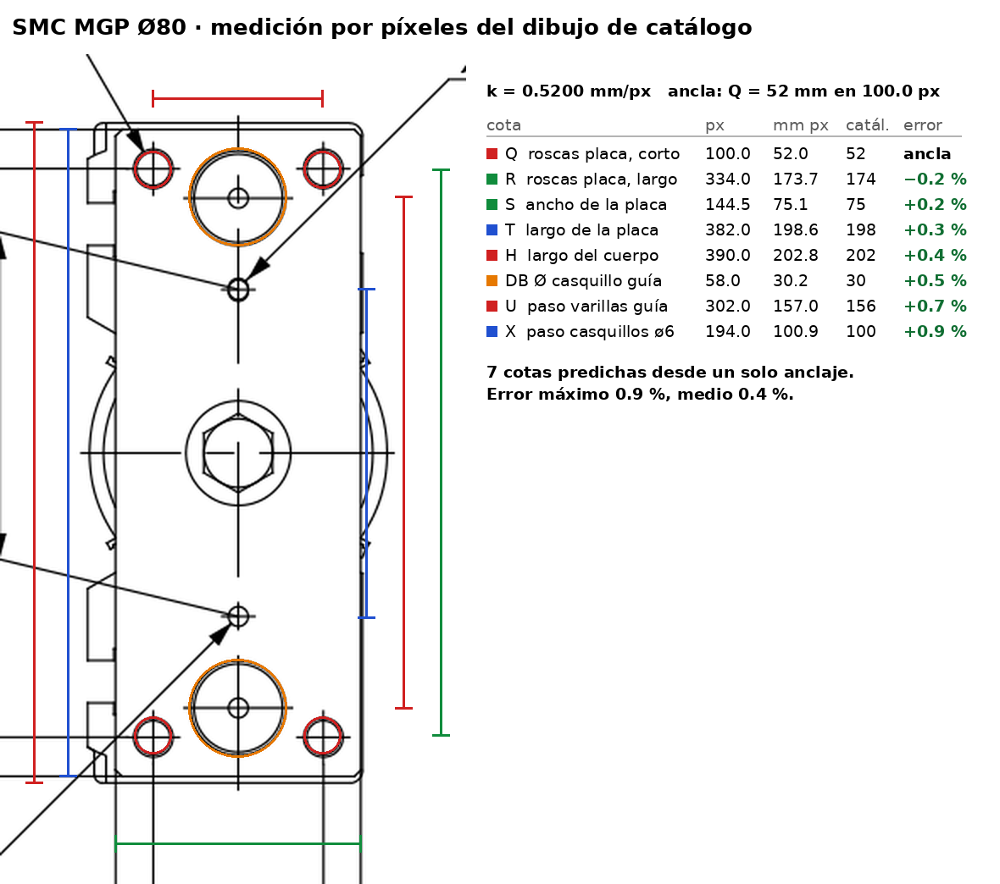
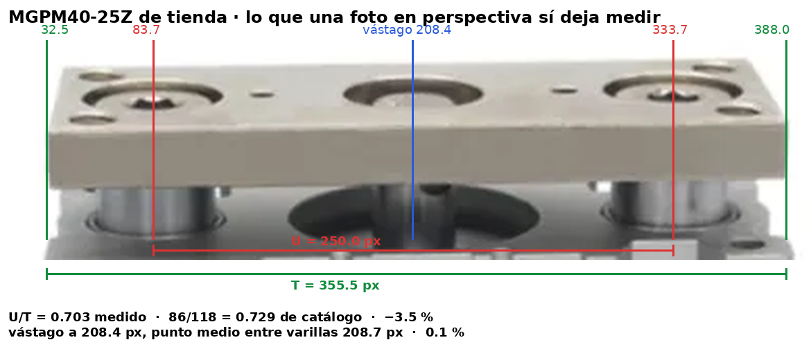

# Mesa guía neumática — de pieza inventada a pieza comprable

La transferencia levanta el conjunto de rodillos con un actuador. Hasta ahora ese
actuador era una **invención**: `elevacion.mjs` lo declaraba «923.01022 · tipo SMC
MGF100», con una huella de 170 × 200 mm, 106 mm de alto, dos columnas guía Ø30 y
dos tirantes de tope M12 caseros para recortar su carrera de 20 a los 10 mm que
pide el equipo. Las cotas salían de medir el dibujo del manual, no de un catálogo:
nadie podía comprar esa pieza.

Este documento sustituye esa invención por un actuador **real, con referencia,
precio y fotografía**, y deja escrito de dónde sale cada número.

---

## 1. Qué se buscó y qué se encontró

Búsqueda en AliExpress (28-07-2026) de cilindros compactos con guías, familia MGP
— que es exactamente la arquitectura que el manual dibuja: émbolo central y **dos**
varillas guía paralelas, placa móvil arriba, cuerpo fijo abajo.

| Ficha | Vendedor | Referencia | Desde |
|---|---|---|---|
| [3256808952498802](https://www.aliexpress.com/item/3256808952498802.html) | YIYUN | «MGPM40 MGPM50 MGPM63 MGPM80 MGPM100-10-20-25-30-40-50-75-100-125-150-150A YIYUN Cylinder with guide rod» | US$ 153.07 |
| [3256806658078453](https://www.aliexpress.com/item/3256806658078453.html) | — | «MGPM12 … MGPM80 Stroke 10 to 300mm Air Pneumatic Compact Guide» | US$ 19.49 (Ø pequeños) |
| [3256812410259200](https://www.aliexpress.com/item/3256812410259200.html) | — | «MGPM MGPM50 MGPM63 MGPM80*10/20/25/30/…-Z MGP Aluminum Alloy Pneumatic Cylinder» | US$ 46.48 |

Los tres listados declaran **Ø80 con carrera de 10 mm**, que no es carrera estándar
SMC (la tabla SMC para Ø80 empieza en 25) pero sí la fabrican los clones. Eso
importa: con carrera de catálogo igual a la carrera del equipo, **los dos tirantes
de tope caseros sobran** — el propio cilindro da los 10 mm y sus topes de goma de
serie absorben el impacto en ambos extremos.

Fotografías del producto real en `ref/mesa/`:

- `aliexpress_mgpm_foto.jpg` — dos unidades MGPM40-25Z etiquetadas «MAX.PRESS: 1.0MPa».
- `aliexpress_mgp_codigo.jpg` — la tabla «How to Order» del vendedor: `MGP` + `M/L/A`
  (tipo de casquillo) + calibre + carrera + `Z` + auto-switch. Confirma que el
  vendedor usa la nomenclatura SMC sin desviarse.
- `vpc_mgp_foto.jpg` — un MGP 50X75 de otro fabricante, útil para ver las varillas
  guía saliendo por la cara inferior del cuerpo.

Una foto de catálogo de tienda está en perspectiva y **no sirve para sacar cotas
absolutas**; sirve para comprobar la arquitectura (placa con dos avellanados de
varilla + agujero central de vástago + cuatro roscas de esquina, ranuras en T en
los costados, dos puertos en una cara). Las cotas salen del dibujo acotado, y ese
dibujo sí se mide por píxeles.

---

## 2. El método de píxeles, contra verdad conocida

`ref/mesa/smc_mgp80_100_cotas.png` es la página Ø80/Ø100 del catálogo SMC MGP
rasterizada a 220 dpi. Tiene dibujo **y** tabla de cotas: es el caso ideal para
medir el dibujo a ciegas y después comprobar contra los números impresos, que es
la única forma honesta de saber cuánto vale el método.

Procedimiento (`tools/med_px.py`, las mismas órdenes que en `ESCALA.md`):

1. `circulos` sobre la vista de la placa → centros de las cuatro roscas NN y de las
   dos varillas guía.
2. `perfil --fila/--col` → cada racha oscura es una línea del dibujo; los bordes de
   placa y cuerpo salen como pares simétricos respecto del eje.
3. **Un solo anclaje**: el paso corto de las roscas de la placa, `Q = 52 mm`,
   medido en 100.0 px → **k = 0.5200 mm/px**.
4. Todo lo demás se predice con esa k y se contrasta con la tabla impresa.

| Cota | px medidos | mm por píxeles | mm de catálogo | error |
|---|---:|---:|---:|---:|
| Q — paso corto roscas placa | 100.0 | 52.0 | 52 | *ancla* |
| R — paso largo roscas placa | 334.0 | 173.7 | 174 | −0.2 % |
| S — ancho de la placa | 144.5 | 75.1 | 75 | +0.2 % |
| T — largo de la placa | 382.0 | 198.6 | 198 | +0.3 % |
| H — largo del cuerpo | 390.0 | 202.8 | 202 | +0.4 % |
| DB — Ø casquillo de guía | 58.0 | 30.2 | 30 | +0.5 % |
| U — paso entre varillas guía | 302.0 | 157.0 | 156 | +0.7 % |
| X — paso casquillos ø6 H7 | 194.0 | 100.9 | 100 | +0.9 % |

Siete cotas independientes predichas desde un único anclaje, **error máximo 0.9 %
y medio 0.4 %**. Ese es el margen real del método sobre un dibujo de líneas a 220
dpi, y es el mismo margen que hay que suponerle a las cotas que en el resto del
ensamble sólo se pudieron medir (las de `ESCALA.md`).

Con el método validado, las cotas que entran al modelo se toman **de la tabla
impresa**, no de los píxeles: cuando existe el número exacto, usarlo es mejor que
volver a medirlo.

### Y sobre la foto de la tienda, ¿qué se puede medir?

Menos de lo que parece, y conviene decirlo. `aliexpress_mgpm_foto.jpg` es una foto
en perspectiva de dos MGPM40-25Z. Una foto así **no da cotas absolutas**: no hay
escala, y la placa se ve escorzada.

Lo que sí sobrevive a la perspectiva es la **razón entre distancias medidas sobre
una misma recta**, porque proyectar los puntos de una recta sobre el eje X de la
imagen es una transformación afín de esa recta. Sobre el eje largo de la placa hay
cuatro puntos alineados: los dos extremos y los dos centros de varilla. Detectados
por umbral sobre la cara superior (`x` = 32.5, 83.7, 333.7, 388.0 px):

- el agujero central del vástago sale en x = 208.4 px y el punto medio entre
  varillas en 208.7 px — **0.1 % de diferencia**: la foto confirma que el émbolo va
  exactamente centrado entre las guías;

- razón paso-de-varillas / largo-de-placa: **U/T = 0.703** medido, contra
  **86/118 = 0.729** de catálogo para el Ø40 → **−3.5 %**. La razón proyectiva
  (invariante exacto) da 0.7033, igual que la razón simple: la distorsión a lo
  largo de ese eje es despreciable, y el 3.5 % se lo llevan los extremos de la
  placa, achaflanados y a distinta profundidad que los centros de varilla.

Lo que **no** se puede medir así: el espesor de la placa. Aparente 28.0 px sobre
355.5 px de largo = 0.079, contra 12/118 = 0.102 de catálogo, un −22 % que no es
error de medida sino el coseno del ángulo de cámara. Cualquier cota que no esté
contenida en un plano paralelo al sensor está escorzada por un factor desconocido.

Conclusión práctica: **la foto sirve para identificar y para comprobar la
arquitectura** (dos varillas guía, émbolo centrado, placa con avellanados y cuatro
roscas de esquina, ranuras en T, dos puertos), y sirve como prueba de que la pieza
existe y se vende. Las cotas salen del dibujo acotado. Confundir las dos cosas es
como se cuelan errores del 20 % en un modelo.

---

## 3. Por qué Ø80 y no otro

Carga a levantar: 55 kg del conjunto móvil + 34 kg de bulto máximo = **873 N**.
Presión de trabajo del ProSort MRT según su manual: **60 psi = 4.14 bar**.

| | Ø63 | **Ø80** | Ø100 |
|---|---:|---:|---:|
| Área de empuje (mm²) | 3117 | **5027** | 7854 |
| Empuje teórico a 4.14 bar (N) | 1290 | **2081** | 3252 |
| Empuje útil, rendimiento 0.85 (N) | 1097 | **1769** | 2764 |
| Factor de seguridad | **1.26** ✗ | **2.03** ✓ | 3.17 ✓ |
| Aire por ciclo a 4.14 bar (L ANR) | 0.30 | **0.49** | 0.76 |
| Huella del cuerpo (mm) | 162 × 78 | **202 × 91.5** | 240 × 111.5 |
| Alto retraído A (mm) | 106.5 | **115** | 137 |

El factor de seguridad se calcula sobre el **empuje útil**, no el teórico: el
módulo aplica un rendimiento de 0.85 (`L.rendimiento`) por rozamiento de juntas y
de guías, como venía haciendo desde el primer dimensionado. El empuje teórico es
dato de catálogo; el 0.85 es una tolerancia de diseño de este repositorio.

- **Ø63 se cae por fuerza**: 1.26 no llega al 1.5 que exige la compuerta, y
  precisamente a la presión que declara el fabricante del equipo. Subir la presión
  de red para salvarlo sería cambiar el equipo, no dimensionar el actuador.
- **Ø100 se cae por geometría y por velocidad**: 22 mm más alto que el Ø80 sobre
  una cadena de alturas que ya va justa, y **57 % más de aire por ciclo**, que con
  la misma válvula y el mismo tubo es directamente 57 % más de tiempo de llenado.
- **Ø80 pasa las tres**: factor 2.03, cabe, y es el más rápido de los que pasan.

Margen de presión: con Ø80 el equipo sigue levantando con factor 1.5 hasta
**3.06 bar (44 psi)**. El retorno da 1878 N teóricos a 4.14 bar, y además baja a
favor de la gravedad.

---

## 4. La pieza: SMC MGPM80-10Z

Cotas de catálogo (`MGPM_2139.pdf` pág. 15; prestaciones pág. 6-7 y `MGP-old-e.pdf`
pág. 7). Capa `cat`.

**Geometría**

| | mm |
|---|---|
| Placa móvil `T × S × FA` | 198 × 75 × 22 |
| Hueco placa↔cuerpo `FB` (retraído / extendido) | 18 / 28 |
| Cuerpo, largo según el eje `C` | 56.5 |
| Cuerpo, sección `H × G` | 202 × 91.5 (repartido `J` 45.5 / `K` 46) |
| Varillas guía `ØDA`, paso `U` | Ø25, a 156 entre ejes |
| Salida de varillas `E` (retraído / extendido) | **18.5 / 8.5** — ver §5 |
| Largo total `A` retraído / envolvente barrida `A + carrera` | 115 / 125 |
| Vástago del émbolo | Ø25 |
| Roscas de la placa `4-NN` | M12 × 1.75, patrón 174 × 52 |
| Roscas de fijación del cuerpo `4-MM` | M12 × 1.75 prof. 25, patrón 180 × 52 |
| Puertos | 2 × Rc 3/8 |
| Ranura en T (a/b/c/d/e) | 13.3 / 20.3 / 12 / 8 / 22.5, para tornillo M12 |

**Prestaciones**

| | |
|---|---|
| Áreas empuje / retorno | 5027 / 4536 mm² |
| Presión máx. / mín. | 1.0 / 0.1 MPa |
| Velocidad de émbolo admisible | 50 … 400 mm/s |
| Amortiguación | tope de goma en ambos extremos |
| Energía cinética admisible | 2.71 J |
| Masa (carrera 25, la menor tabulada) | 6.49 kg, de ellos 4.27 kg móviles |
| Carga lateral admisible | 352 N |
| Par admisible sobre la placa | 21.9 N·m |
| Precisión de no-giro | ±0.04° |

---

## 5. Fuerza, velocidad, geometría, estabilidad

**Fuerza.** 2081 N teóricos a 4.14 bar → 1769 N útiles contra 873 N de carga,
**factor 2.03**. A 6 bar, 3016 N teóricos → 2564 útiles, factor 2.94.

**Velocidad.** El límite no lo pone el cilindro (admite 400 mm/s) sino la energía
cinética del bulto: con M + m = 89 + 4.27 = 93.27 kg y 2.71 J admisibles,

    u_máx = √(2 · 2.71 / 93.27) = 0.241 m/s

Con la relación del catálogo `u = 1.4 · u_media`, la velocidad media es 172 mm/s y
los 10 mm de carrera se hacen en **58 ms**. Estrangulando a 150 mm/s de pico son
93 ms. Cualquiera de los dos sobra para un clasificador. Consumo **0.49 L ANR por
ciclo**; a 20 ciclos/min, 9.7 L/min ANR.

Esto se traduce en una condición de montaje que hay que respetar: **los reguladores
de escape tienen que dejar la velocidad de impacto por debajo de 241 mm/s**. No es
un consejo, es el límite de catálogo del actuador.

**Geometría.** La huella pasa de los 170 × 200 inventados a **91.5 (X) × 202 (Y)**:
78 mm más estrecha en la dirección de los rodillos, prácticamente igual en la de
expulsión. Eso libera el conflicto que obligaba a descentrar la mesa. En altura el
conjunto real mide 115 mm retraído contra los 106 supuestos, así que la cadena de
alturas hay que rehacerla, no estirarla.

Y aparece un requisito que la pieza inventada no tenía: **las varillas guía salen
por debajo del cuerpo** —8.5 mm con el equipo arriba y **18.5 mm cuando baja**, que
es el caso que manda—, de modo que el alma del canal soporte necesita dos taladros
de paso Ø30 a ±78 mm en Y del eje.

**Estabilidad.** El guiado del conjunto móvil lo dan sus propios cuatro pasadores
en colisa; las varillas guía del cilindro trabajan en paralelo con ellos. Aun
suponiendo que el cilindro se coma **todo** el momento de excentricidad —hipótesis
conservadora, porque los pasadores toman la mayor parte—, con la mesa centrada la
excentricidad tiende a cero, y con la mesa en su posición antigua (X = 245, 13.5 mm
fuera del centro de gravedad del móvil) el par sería 11.8 N·m contra 21.9 N·m
admisibles. La carga lateral sólo viene de rozamiento y desalineación: aun
atribuyéndole el 5 % de la carga, 44 N contra 352 N admisibles.

---

## 6. Lo que cambia en el modelo

Ver `elevacion.mjs` y las métricas que emite (`meta.verificaciones` del JSON del
ensamble). Resumen de la integración, ya con la compuerta en verde:

### 6.1 Cadena de alturas

El conjunto real mide **106.5 mm por encima de su cara de fijación** (FA 22 +
FB 18 + carrera 10 + C 56.5) frente a los 116 de la mesa inventada, o sea 9.5 mm
menos. Pero esos 9.5 mm no se pueden cobrar subiendo el canal, porque el
motorreductor obliga en sentido contrario: su cárter baja hasta **Z = 123.9** y la
placa móvil de un MGPM **no se puede rebajar** —cortarla sería cortar justo por
donde van roscados el vástago y las dos varillas guía—, mientras que la mesa
inventada sí se rebajaba (`rebajeY`/`rebajeZ`, ya eliminados).

La cota que cierra la cadena es por tanto el espesor de la horquilla de empuje,
que pasa de **12 a 22 mm**. Resultado (estado ELEVADO):

| | Z (mm) |
|---|---:|
| cara inferior del notched brace channel (`P.rielInfZ`) | 143.5 |
| cara superior de la placa móvil | 121.5 |
| *cárter del reductor* | *123.9 → **2.4 mm** de holgura* |
| cara inferior de la placa móvil | 99.5 |
| cara superior del cuerpo | 71.5 |
| cara de fijación (alma del canal) | 15.0 |
| `canalZ0` | **12.34** (antes 12.84) |

Es decir: **el canal de montaje se queda donde estaba**, medio milímetro más
abajo. No hay que tocar el canal base, ni las ménsulas de jack bolt, ni el rebaje
de paso del ala del SIDE CHANNEL, que son cotas absolutas del bastidor.

### 6.2 Paso de las varillas guía

El alma del canal lleva **2 taladros Ø30** a X = 231.5, Y = ±78. Bajo ellos no hay
ninguna pieza: el canal base ocupa X 26…102.2 y la neumática se mudó al pasillo
+X. Los 4 pasantes Ø13.5 de fijación quedan a √(26² + 12²) = 28.6 mm de esos
taladros, con 6.9 mm de alma entre bordes.

**Sobre la cota E hay una corrección que dejar escrita**, porque el encargo de
este cambio la llevaba al revés. Se dio por hecho que las varillas salían
18.5 mm retraído y **28.5 extendido**, y no puede ser: las varillas van
**solidarias a la placa** (el catálogo mismo dibuja sus dos alojamientos en la
placa), así que cuando la placa sube 10 mm las varillas suben con ella y **asoman
10 mm menos**, no 10 más. Se comprueba con la propia tabla: `A − E = B = 96.5` es
constante en las tres gamas de carrera, y `A + carrera` cuadra exactamente con la
**envolvente barrida** (placa arriba, punta de varilla abajo). Por tanto:

| | mm |
|---|---:|
| salida real, equipo ELEVADO (estado modelado) | 8.5 |
| salida real, equipo RETRAÍDO (máximo, cat E) | 18.5 |
| **despeje a reservar bajo la cara de fijación** | **18.5** |

El despeje es 18.5, no `carrera + E`. Los 125 mm de `A + carrera` son la
envolvente **barrida de la unidad entera** —de la cara superior de la placa
extendida hasta la punta de varilla retraída—, no un alargamiento hacia abajo: la
punta de varilla nunca baja de los 18.5 mm que da `E`.

El modelo dibuja las varillas en su posición real (puntas en Z = 6.5 elevado) y
la métrica `salidaVarillasMm` vale 18.5, igual que el despeje declarado en
`componentes/catalogo.json`. Con la cara de fijación en Z = 15.0 hay **15 mm**
libres hasta el plano inferior del bastidor: sobra para el estado modelado, y en
el estado retraído las puntas quedan 3.5 mm por debajo de ese plano, en aire
libre bajo el centro de la máquina (que cuelga de los canales del anfitrión). Es
la única cota que se cede, y se cede porque las dos alternativas eran peores:
subir el actuador mete la placa dentro del reductor, y rebajar la placa destruye
el cilindro comprado.

### 6.3 Implantación y horquilla

- **Mesa centrada** en X = `P.largo`/2 = 231.5: el cuerpo ocupa X 185.5…277.0 y
  deja 66 mm a la placa soporte de transmisión y 68 mm al ala +X del canal. La
  excentricidad respecto del CG del conjunto móvil baja de 13.5 mm a 1.4 mm
  (sólo descentra el motorreductor).
- **Fijación**: 4 pernos M12 × 25 desde abajo, patrón MM 180 (Y) × 52 (X), agarre
  20.3 mm = 1.7 d en la rosca de 25 de profundidad. Cabeza hexagonal y no SHCS:
  bajo el alma sólo hay 12.34 mm y una cabeza cilíndrica M12 (Ø18 × 12) llegaría
  a Z = −1.7.
- **Horquilla**: dos brazos de 75 × 42 × 22 en Y = ±58…100, atornillados a las
  **4 roscas NN reales** de la placa (M12, X = ±26, Y = ±87) con SHCS M12 × 30
  alojados en cajas Ø19 × 13, de modo que la cabeza queda 1 mm bajo la cara de
  empuje. La línea de pernos (Y = 87) cae a 3 mm del centroide del contacto
  (Y = 90): el brazo trabaja prácticamente sin voladizo.
- **Neumática** al pasillo +X (X 296…342), que es el lado J por el que salen los
  dos Rc 3/8: la tubería queda en dos tramos rectos de 96 mm.
- **Eliminados**: los 2 tirantes de tope M12 × 115, sus 2 contratuercas, sus
  taladros Ø14 con caja Ø25 × 9 en el cuerpo, sus roscas M12 en la placa y los
  2 pasos Ø30 de cabeza en el alma del canal.

### 6.4 Verificaciones que emite el módulo

| | valor | límite |
|---|---:|---:|
| empuje a 6.0 bar (teórico / útil ×0.85) | 3016.2 / 2563.8 N | |
| empuje a 4.14 bar (teórico / útil) | 2081.2 / 1769.0 N | |
| carga (89 kg) | 872.8 N | |
| **factor de seguridad** a 6 bar / a 4.14 bar | **2.94 / 2.03** | ≥ 1.5 |
| presión a la que el factor cae a 1.0 | 2.04 bar | ≥ 0.1 MPa (cat) |
| velocidad de impacto máxima (por Ek adm.) | 241.1 mm/s | 50…400 mm/s |
| energía cinética de impacto | 2.71 J | 2.71 J |
| velocidad media (u = 1.4·ua) / tiempo de subida | 172.2 mm/s / **58.1 ms** | |
| aire por ciclo a 4.14 bar | **0.486 L ANR** | (9.7 L/min a 20 c/min) |
| par sobre la placa | 16.19 N·m | 21.9 N·m |
| carga lateral sobre la placa | 174.6 N | 352 N |
| holgura placa móvil ↔ motorreductor | 2.4 mm | ≥ 2 mm |

Par y carga lateral se calculan como **cota superior por rozamiento**: los dos
apoyos de la horquilla empujan contra el larguero móvil, no van atornillados a
él, así que no pueden transmitir a la placa más que μ·N (μ = 0.20, radio polar
medio 92.75 mm). Por encima de eso deslizan y la reacción se la llevan los 4
pasadores guía en colisa, que es exactamente su función. Los dos valores no se
alcanzan a la vez: los limita el mismo rozamiento. El par por excentricidad del
CG, aparte, es de 1.2 N·m.

Los cuatro límites de catálogo (velocidad, energía cinética, par y carga lateral)
son ahora **chequeos de la compuerta** en `gen_nbt90.mjs`: si alguno se supera, no
se emite el ensamble.

### 6.5 Lo que queda abierto

1. ~~**Choque en estado RETRAÍDO, ajeno a este cambio.**~~ **CORREGIDO.** Bajando
   10 mm todas las piezas MÓVIL y volviendo a intersecar con B-rep aparecía
   **1.00 cm³** entre la *placa soporte de transmisión* (`transmision.mjs`, borde
   inferior `L.zPlaca[0]` = 124 → 114 retraída) y el labio superior del *canal de
   montaje del cilindro* (techo en Z = 115.34). **Ya existía antes** de cambiar el
   actuador —con el canal medio milímetro más alto eran 1.53 cm³— y no lo delataba
   ninguna compuerta porque el modelo sólo representaba el estado elevado.
   Se arregló donde tocaba, en `transmision.mjs`: `zPlaca[0]` sube de 124 a **128**
   y quedan **2.66 mm** de holgura retraída. Los 4 mm recortados no le hacen falta
   a nada — por debajo de Z = 138.9 (borde de la brida Ø120 del motorreductor, que
   apoya contra la placa) la placa no lleva ni un taladro ni un asiento: el más
   bajo es el M8 de la brida (borde 159.04) y el paso del eje de la polea de
   retorno (borde 171.04, eje en 176.6). No se tocó este módulo: bajar el canal
   habría obligado a engordar la horquilla a 26 mm y las varillas guía habrían
   bajado otros 4 mm.
   Y sobre todo, **ya no puede volver a pasar sin que se vea**: `gen_nbt90.mjs`
   baja las piezas MÓVIL la carrera y comprueba que ninguna gane solape con una
   FIJA (§8 de `verify`, con la lista de perfiles huecos tolerados en
   `RETRAIDO_CAJA_ABIERTA`), y además emite `out/nbt90_retraido.json`, que
   `regenerar.sh` pasa por `interferencias_brep.py` — la misma verificación exacta
   que el estado elevado. Los dos estados dan hoy las mismas 4 interferencias de
   convención declarada y ninguna más.
2. **Carrera de 10 mm en Ø80 no es estándar SMC.** La tabla del Ø80 empieza en
   25; los clones sí la fabrican y los tres listados consultados la ofrecen. Si
   se compra SMC original hay que pedirla como carrera especial: aceptar 25 y
   recortarla reintroduciría el tope postizo que este cambio elimina.
3. **Confirmar E con el vendedor.** Como la carrera 10 no está tabulada, conviene
   verificar que el clon mantiene la salida de varillas de 18.5 mm de la gama
   `carrera ≤ 50`. Si las acortara, sobraría holgura; si las alargara, habría que
   revisar el hueco bajo el alma.
