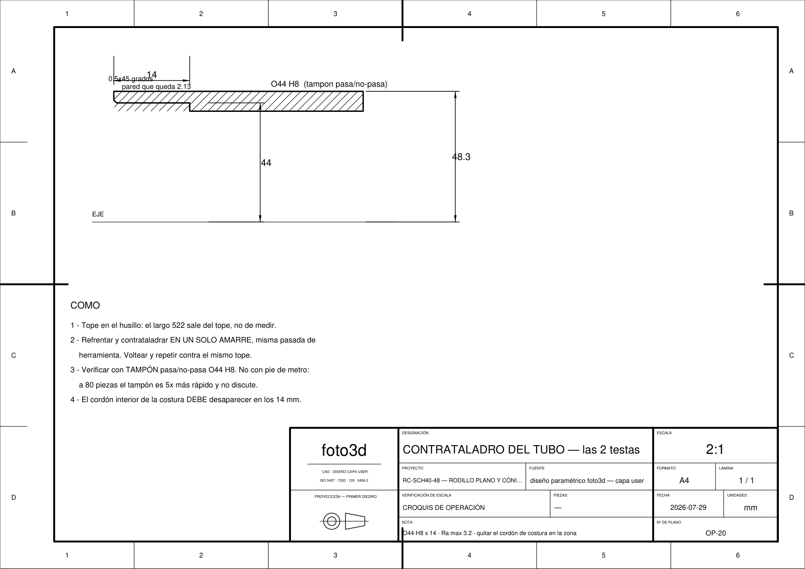
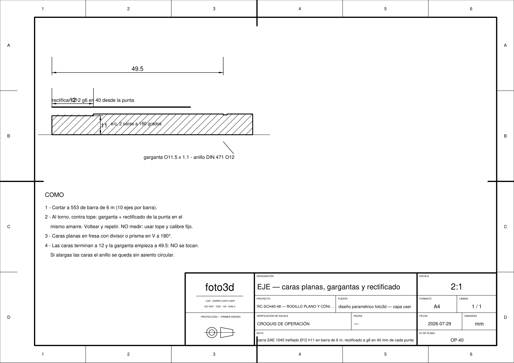
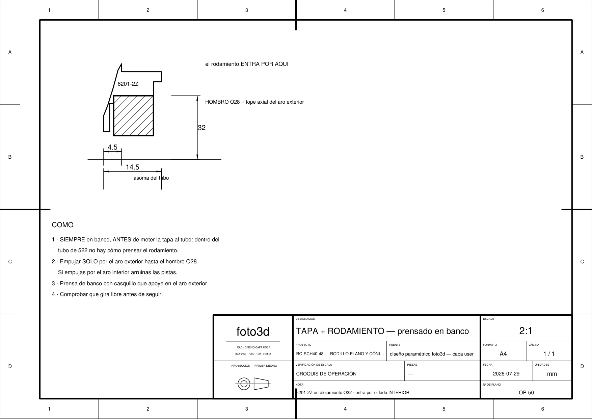
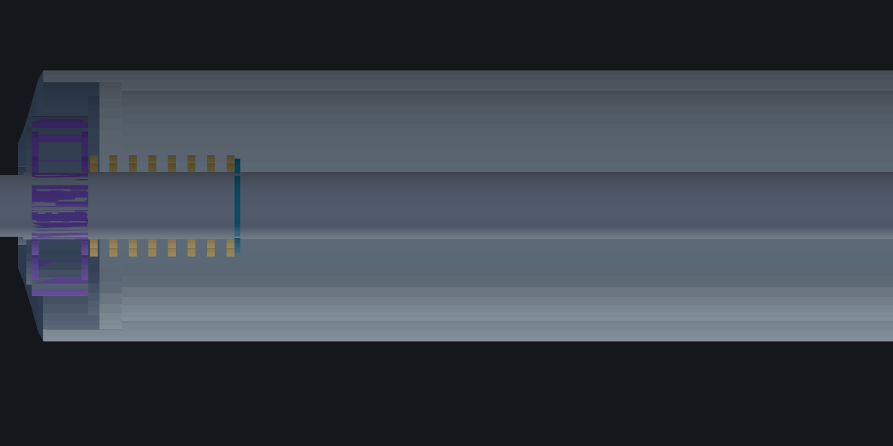

# MANUAL DE TALLER — RC-SCH40-48

Cómo se fabrican los 80 rodillos. Es la hoja de ruta del taller, no el plano de
pieza: los planos acotados están en `planos/planos_fabricacion_rc48.pdf` y los
croquis de operación —los que se pegan al lado de la máquina— en
`manual/croquis_operaciones_rc48.pdf`.

Regenerar los croquis: `node cad/ensambles/rodillos_sch40/manual_taller.mjs`

---

## Lo primero: esto son 4 días de torno, no 8 semanas

| Operación | Piezas | Tiempo unitario | Total |
|---|---|---|---|
| OP-10 corte de tubo | 80 | 0.5 min | 40 min |
| **OP-20 refrentar + contrataladrar** | 80 (×2 testas) | **5 min** | **7 h** |
| OP-30 corte de eje | 80 | 0.5 min | 40 min |
| **OP-40 eje: gargantas, rectificado y caras** | 80 | **6.5 min** | **9 h** |
| OP-50 prensar rodamiento en tapa | 160 | 0.5 min | 1.5 h |
| OP-60 armado del rodillo | 80 | 3 min | 4 h |
| OP-70 control | 80 | 1 min | 1.5 h |
| | | | **≈ 24 h + puestas a punto** |

El cuello de botella del programa **no es el taller** — es conseguir las tapas
(ver `ABASTECIMIENTO.md`). El torno puede empezar la semana 2 y termina antes de
que llegue nada importado.

## La idea que hace que esto sea rápido

**A 80 piezas no se mide: se topea y se calibra.**

Todo el proceso está diseñado para que el operario **no use pie de metro en
producción**. Cada cota crítica sale de un tope mecánico o se acepta/rechaza con
un calibre fijo. Medir 80 piezas × 2 testas con pie de metro son horas perdidas y
además introduce el criterio de quien mide.

| Cota | Cómo se garantiza | Cómo se verifica |
|---|---|---|
| Tubo 522 | tope en el husillo | ninguno (lo da el tope) |
| Contrataladro Ø44 H8 | herramienta a medida | **tampón pasa / no-pasa** |
| Profundidad 14 | tope de la torreta | visual contra galga |
| Eje 553 | tope de corte | ninguno |
| Garganta a 49.5 | tope del carro | **galga de perfil** |
| Caras planas 11 e/c | prisma en V + fresa a altura fija | **calibre de herradura 11** |

Prepara esos cuatro elementos **antes** de la primera pieza. Es la diferencia
entre 24 h y 60 h.

---

## OP-20 · Contrataladro del tubo

Es **la operación crítica del rodillo**. Sin ella no entra ninguna tapa: el
interior de la cañería en bruto anda entre 39.4 y 42.2 mm y el cuerpo de prensa
de la tapa es Ø44.

1. **Tope en el husillo.** El largo de 522 sale del tope, no de medir.
2. **Refrentar y contrataladrar en un solo amarre**, con la misma pasada de
   herramienta. Voltear y repetir contra el mismo tope.
3. **Verificar con tampón pasa/no-pasa Ø44 H8.**
4. El **cordón interior de la costura** tiene que desaparecer por completo en esos
   14 mm. Si queda cordón, la tapa entra torcida y el rodillo cabecea.

> **No hace falta luneta.** Se amarra la cañería cerca de la testa que se
> mecaniza y el resto queda al aire: la operación es corta y el voladizo no
> trabaja. Esto abarata bastante la cotización — dilo al cotizar.

Deja **2.13 mm de pared** (1.73 en el peor caso de laminación). Es normal y es del
mismo orden que el tubo Ø50×1.5 del catálogo original, donde el mismo prensado
funciona hace décadas.

---

## OP-40 · Eje

1. Cortar a **553** de barra de 6 m — salen **10 ejes por barra**.
2. Al torno, contra tope: **garganta + rectificado de la punta en el mismo
   amarre**. Voltear y repetir.
3. **Caras planas en fresa**, con divisor o prisma en V, a 180°.

**El rectificado a g6 es sólo en los 40 mm de cada punta.** La barra se compra
trefilada h11 (que es como viene de catálogo y es 20 veces más barata que el acero
plata) y sólo se afina el tramo por donde corre el aro interior del rodamiento.

⚠️ **Las caras planas terminan a 12 mm de la punta y la garganta empieza a 49.5.**
No se tocan, y así tiene que quedar: si alargas las caras, el anillo DIN 471 se
queda sin asiento circular completo y se sale con la vibración.

---

## OP-50 · Prensar el rodamiento en la tapa

1. **Siempre en banco, y ANTES de meter la tapa al tubo.** Dentro de un tubo de
   522 mm no hay forma de prensar el rodamiento: no llega nada.
2. El rodamiento **entra por el lado interior** de la tapa y se empuja hasta el
   **hombro Ø28**, que es su tope axial.
3. **Empujar SOLO por el aro exterior**, con un casquillo que apoye en él. Si
   empujas por el aro interior, la carga pasa por las bolas y arruinas las pistas —
   el rodamiento va a sonar desde el primer día.
4. Comprobar que gira libre antes de seguir.

---

## OP-60 · Armado

En el corte: tapa oscura, **rodamiento morado**, **espiras del resorte doradas**,
**anillo DIN 471 turquesa**. Se ve el mecanismo completo — el resorte apoya en la
cara interior del aro interior y empuja contra el anillo, o sea que **empuja el
eje hacia el extremo contrario**.

Orden, y el orden importa:

1. Prensar la **tapa izquierda** (ya con su rodamiento) en el tubo, hasta que la
   brida tope contra la testa. Esa brida es la que fija los 531 sobre tapas.
2. Enfilar en el eje, en este orden: **anillo izq → resorte izq**.
3. Entrar el eje por la tapa izquierda, desde adentro del tubo.
4. Montar **resorte der → anillo der** en el otro extremo del eje.
5. Comprimir el resorte derecho, entrar el eje en el rodamiento de la tapa derecha
   y **prensar la segunda tapa** hasta que la brida tope.

> Los dos anillos van **por dentro** de sus rodamientos. Cada resorte queda
> atrapado entre la cara interior del aro interior y su anillo.

---

## OP-70 · Control (1 min por rodillo)

Cuatro cosas, en este orden. Si falla una, no sigue:

1. **Gira libre a mano**, sin puntos duros ni ruido.
2. **El eje se retrae ≥ 12.5 mm** por cualquiera de los dos extremos y **vuelve
   solo** al soltarlo.
3. **Sobre ejes = 553 ±1** con el eje centrado. Es la cota que define si entra en
   el bastidor.
4. **Sin juego radial perceptible** entre tubo y eje.

Anota el número de rodillos rechazados y por qué. Con 80 piezas, tres rechazos por
la misma causa significan que hay que corregir el proceso, no la pieza.

---

## Utillaje a preparar antes de la primera pieza

| Elemento | Para qué | Sin esto… |
|---|---|---|
| Tope de husillo para 522 | largo del tubo | mides 160 veces |
| **Tampón pasa/no-pasa Ø44 H8** | contrataladro | discutes cada pieza con el operario |
| Galga de profundidad 14 | contrataladro | tapas que topan en el fondo |
| Prisma en V + tope de fresa | caras planas del eje | caras desiguales entre extremos |
| Calibre de herradura 11 mm | caras planas | ejes que no entran en el larguero |
| **Casquillo de prensado** (apoya en el aro exterior Ø32) | OP-50 | rodamientos ruidosos |
| Casquillo de prensado Ø48 para la tapa | OP-60 | bridas abolladas |

---

## Los cinco errores que arruinan la pieza

1. **Prensar el rodamiento empujando por el aro interior.** Marca las pistas. El
   rodillo suena y dura poco. Usa el casquillo.
2. **Dejar cordón de costura en el contrataladro.** La tapa entra torcida y el
   rodillo cabecea.
3. **Apretar el eje en el rodamiento.** Va al revés de lo habitual: el aro
   interior está quieto y **debe deslizar** (g6). Si lo aprietas, el resorte no
   puede mover el eje y el rodillo no se puede montar.
4. **Alargar las caras planas** hasta la garganta del anillo.
5. **Mecanizar la cañería sin desengrasar.** El zincado posterior no agarra sobre
   aceite de corte y el tubo se oxida en semanas.

---

## Si el lote crece de 80 a varios cientos

Dos cambios cambian el juego, en este orden:

1. **Un tubo de pared delgada Ø50×2.0** en vez de la cañería **elimina el
   contrataladro completo** — la tapa `SKPB5012-2.0` calza en el interior Ø46 sin
   mecanizar nada. Se van las 7 h de OP-20, que es el 30 % del taller.
2. Herramienta combinada de refrentar+contrataladrar en una sola pasada.

Para 80 unidades ninguno de los dos se paga. Para 500, el primero se paga solo.
