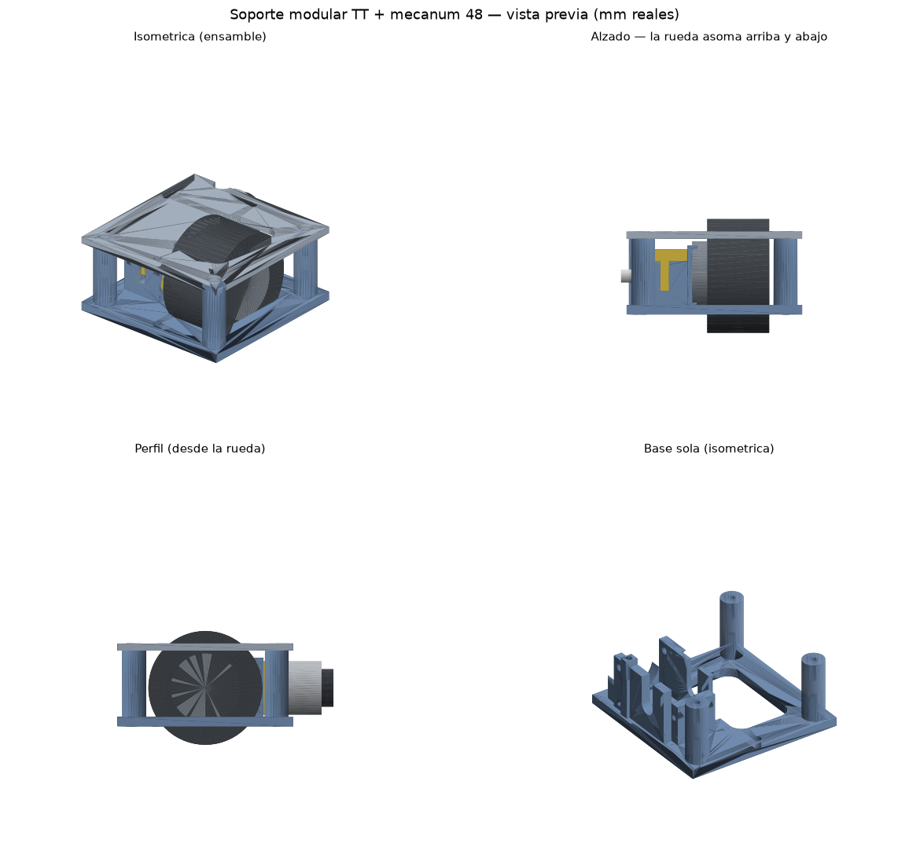
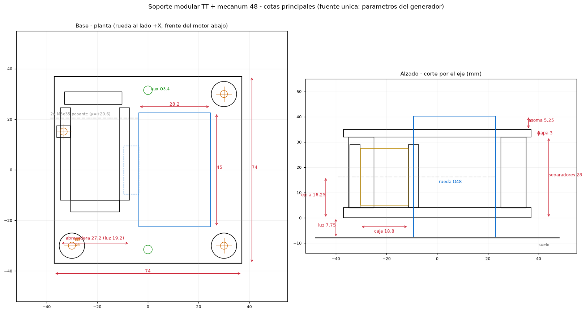

# Soporte modular: motor TT doble eje + rueda mecanum 48 (FIT0662)

Bloque modular imprimible en 3D que abraza un motorreductor TT de doble eje por
ambos costados sobre una base cuadrada, con separadores roscados para una tapa
superior con recorte por donde asoma la rueda mecanum, y perforaciones para
apernar el bloque al chasis. Un robot mecanum usa **4 bloques idénticos**: dos
con rueda izquierda (A) y dos con rueda derecha (B); para el lado opuesto el
mismo bloque se gira 180°.




## Procedencia (capa `user`, confianza `cad`)

Las dimensiones del motor y la rueda **no son inventadas ni de memoria**: se
midieron del B-rep de los STEP aportados por el usuario
(`TT Motor Dual Shaft.step` de Fusion y `Mecanum Left v5.step`, DFRobot
FIT0662). Igual que todo componente de la biblioteca: **verificar con calibre
la unidad física real antes de imprimir en serie** (los clones de motor TT
varían ±0.3 mm).

| Dato medido del STEP | Valor |
|---|---|
| Caja reductora (ancho entre caras × alto × largo) | 18.8 × 22.5 × 37.65 mm |
| Eje de salida (doble-D, saliente por lado / anillo) | Ø5.4 × 9.0 — anillo Ø7.2 × 1.1 |
| Taladros M3 pasantes (detrás del eje / separación) | 20.6 mm / 17.5 mm (Ø3.0) |
| Lengüeta frontal (centro Ø2.8 / espesor / punta) | 13.8 / 3.0 / 15.2 mm delante del eje |
| Lata del motor (Ø / tramo detrás del eje / desfase) | Ø22.5 / 25.65→49.0 / 0.65 mm |
| Rueda mecanum (Ø / ancho total / cubo) | Ø48.0 / 32.5 / Ø29.1 mm |
| Rodillos: retiro axial desde la cara del cubo | 6.4 mm |

## Arquitectura del bloque (2 piezas impresas)

Coordenadas del módulo: origen en el centro de la placa, Z=0 su plano
inferior, rueda al lado +X, frente del motor (lengüeta) hacia −Y.

### Base (`soporte_tt_mecanum_base`, 74 × 74 × 32 mm, ~30.2 cm³)

- **Placa** 74 × 74 × 4 con **ranura pasante 28.2 × 45** (esquinas R6) por donde
  la rueda asoma hacia abajo, y **bolsillo del cubo** 6 × 19 × 2.5 de
  profundidad (el cubo Ø29.1 baja 2.3 mm bajo la cara superior de la placa).
- **Abrazadera**: dos paredes de 4 mm que toman la caja del motor por ambos
  costados (luz 19.2 = 18.8 + 0.2 por lado), con:
  - **ranura vertical de inserción** de 8 mm (el motor entra desde arriba; los
    anillos Ø7.2 del eje bajan por la ranura hasta el semicírculo R4 a la
    altura del eje);
  - **2 pernos M3×35 pasantes** por los taladros propios del motor
    (y = +20.6; z = 7.5 y 25.0), cabeza al lado −X y **tuerca alojada en
    hexágono** (entrecaras 5.8 × 2 de profundidad) en la cara externa de la
    pared del lado rueda, fuera del barrido de los rodillos;
  - **rebaje circular Ø33 × 2** en esa misma cara para que el cubo de la rueda
    acerque y el eje enganche 6.9 mm.
- **Asiento** de 1 mm bajo el motor (define la altura y despeja la cabeza del
  perno inferior). Eje a **16.25 mm** de la placa.
- **Horquilla frontal**: puente entre ambas paredes con ranura de 3.6 que
  captura la lengüeta del motor (anti-rotación) y taladro Ø2.8 pasante para un
  M3 autorroscante opcional a través del agujero de la lengüeta.
- **Cuna de la lata**: costilla con arco R11.5 que recibe la lata Ø22.5 (la
  lata y la tapa trasera sobresalen del borde: los terminales quedan
  accesibles para soldar).
- **Separadores integrados con hilo**: 3 postes Ø10 + 1 torre adosada a la
  pared (la lata invade la esquina −X,+Y y los pernos del motor cruzan en
  y = 20.6, por eso la torre vive en y = 12.9…17.4). Altura 28 mm. Cada uno
  con **piloto Ø2.8 × 10 arriba** (hilo M3 autoformado, tornillos de la tapa)
  y **piloto Ø2.8 pasante por la placa abajo** (apernado del bloque al chasis
  desde abajo). Anclajes en (−30,−30), (30,−30), (30,30), (−33.25,15.15).
- **2 perforaciones auxiliares Ø3.4** en (0,±31.5) para apernado alternativo,
  amarras o unión entre módulos.

### Tapa (`soporte_tt_mecanum_tapa`, 74 × 74 × 3 mm, ~12.8 cm³)

- **Recorte 28.2 × 40** (esquinas R6): la rueda asoma **5.25 mm** sobre la
  tapa. El cubo (Ø29.1, techo a z=30.8) pasa por debajo de la tapa (z=32).
- 4 agujeros Ø3.4 **avellanados 90° Ø6.4** (M3×8 cabeza plana) sobre los
  separadores.
- 2 perforaciones auxiliares Ø3.4 alineadas con las de la base (columna libre:
  permite apernar módulos a una estructura superior).
- **Muesca pasacables Ø8** en el borde trasero, sobre la lata.

### Alturas resultantes (rueda en el suelo)

| Cota | mm |
|---|---|
| Luz de la placa al suelo | **7.75** |
| Eje de la rueda sobre el suelo | 24.0 |
| Cara superior de la tapa | 42.75 |
| La rueda asoma sobre la tapa | **5.25** |

## Tornillería (por bloque)

| Uso | Tornillo | Cant. |
|---|---|---|
| Abrazadera del motor | M3×35 + tuerca M3 (alojada) | 2 |
| Lengüeta frontal (opcional) | M3×12 autorroscante | 1 |
| Tapa | M3×8 cabeza plana avellanada | 4 |
| Anclaje al chasis (desde abajo, rosca en los separadores) | M3×10–12 | 4 |
| Retención de la rueda | tornillo axial incluido con la FIT0662 (agujero Ø1.9 del eje) | 1 |

## Montaje

1. Deja caer el motor entre las paredes: los anillos del eje bajan por las
   ranuras y la lengüeta entra en la horquilla; la caja apoya en el asiento.
2. Coloca las 2 tuercas M3 en sus alojamientos hexagonales (lado rueda) y
   aprieta los 2 pernos M3×35 desde el lado opuesto.
3. (Opcional) M3 autorroscante a través de la horquilla y la lengüeta.
4. Suelda/conecta los cables del motor (terminales accesibles atrás) y rutéalos
   por la muesca de la tapa.
5. Monta la rueda en el eje doble-D hasta que el cubo entre en el rebaje
   (holgura axial ~0.5 mm) y asegúrala con su tornillo axial.
6. Atornilla la tapa (4× M3×8 avellanado).
7. Aperna el bloque al chasis: 4× M3 desde abajo roscando en los separadores.
   El chasis necesita la abertura de la rueda: plantilla a escala real en
   `cad/componentes/models/soporte_tt_mecanum_plantilla_chasis.dxf`
   (capa ESPEJO = módulo girado 180° para el lado opuesto). También puede
   colgarse de una estructura superior con las perforaciones auxiliares.

## Impresión 3D

- **Orientación**: ambas piezas tal como salen del STL (base sobre la cama,
  tapa plana con los avellanados hacia arriba). **Sin soportes**: las ranuras
  abren hacia arriba, el arco de la cuna es autoportante y los alojamientos
  hexagonales van con vértice arriba.
- **Material**: PETG (recomendado) o PLA. Boquilla 0.4, capa 0.2.
- **Resistencia**: 4 perímetros, 40 % de relleno. Las paredes de la abrazadera
  cargan el par del motor: no bajar de 3 perímetros.
- **Holguras ya incluidas** (no escalar): caja +0.2/lado, ranura del eje
  Ø7.2→8.0, lengüeta 3.0→3.6, tuerca 5.5→5.8, rueda +0.75/lado en la ranura.
  Los pilotos Ø2.8 se roscan con el propio M3 (o macho M3 si se prefiere).

## Regenerar / modificar

```
python pipeline/soporte_tt_mecanum.py            # GLB+STL+DXF → cad/componentes/models/
python pipeline/soporte_tt_mecanum.py --png      # + previews y lámina de cotas → docs/img/
python pipeline/soporte_tt_mecanum.py --proyecto <X>   # → projects/<X>/out/componentes/ + audit
```

Todo el diseño vive en los diccionarios `MOTOR`, `RUEDA` y `P` al inicio del
script (una sola fuente de verdad); el generador **verifica la malla contra sí
mismo** (estanqueidad, sondas de material/vacío y holguras clave) y se niega a
exportar si algo falla. En el catálogo: `motor_tt_doble_eje`,
`rueda_mecanum_48_izq` (primitivas), `soporte_tt_mecanum_base`,
`soporte_tt_mecanum_tapa` (mallas imprimibles) y `ens_soporte_tt_mecanum`
(conjunto de referencia), insertables desde el CAD del navegador (botón
🔌 Comp.).
