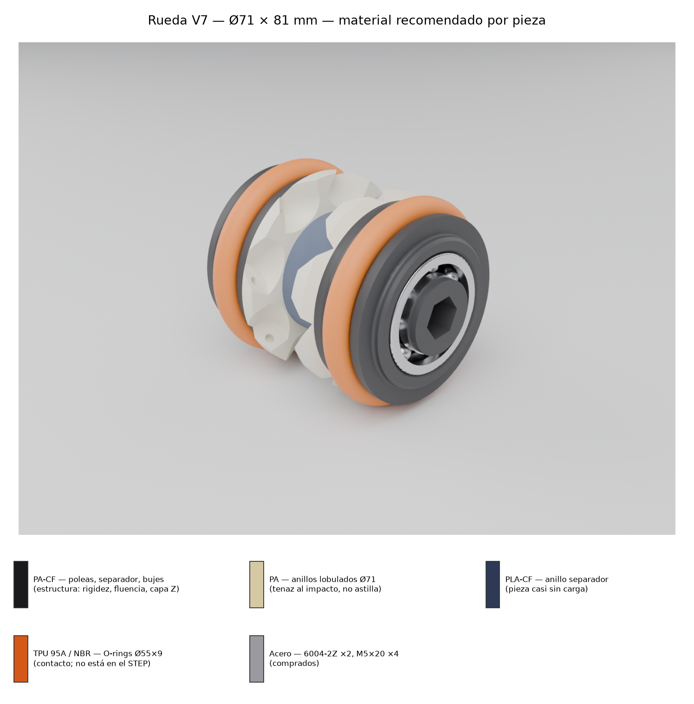
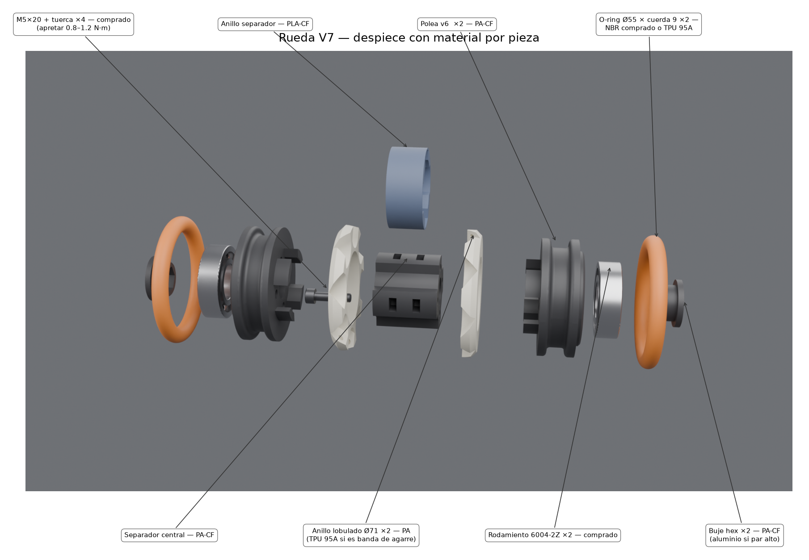
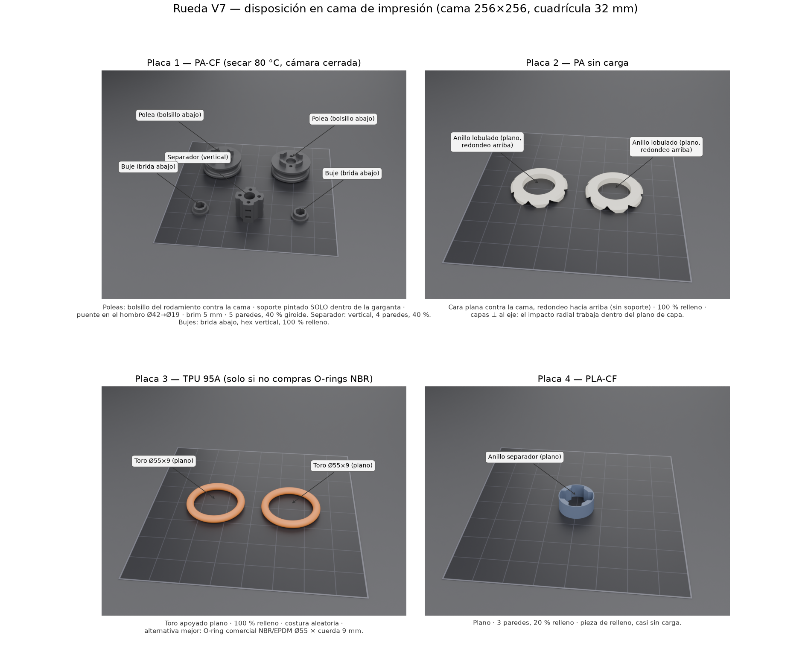

# Rueda V7 (omniwheel Ø71) — Análisis de esfuerzos y plan de impresión FFF

**Fuente:** `Rueda_V7.stp` (Autodesk Inventor 2027, exportado 2026-08-31, autor scont).
**Capa de datos:** `user` — dimensiones medidas directamente del STEP (CAD nominal), no de fotos.
**Materiales considerados (los que tiene Sergio):** PA-CF, PA, PLA-CF, TPU.

---

## 1. Arquitectura del ensamble (medida del STEP)

Rueda de Ø71 mm × ~81 mm de ancho, simétrica respecto al plano medio, montada sobre
rodamientos SKF 6004-2Z (Ø20×Ø42×12).

| Pieza | Cant. | Dimensiones clave (mm) | Vol. (cm³) | Función estructural |
|---|---|---|---|---|
| **Polea v6** | 2 | Ø65 pestañas; garganta fondo Ø55 × ~10 ancho × 5 prof (flancos trompeta 25°); bolsillo rodamiento Ø42.2 × 12; taladro pasante Ø19; espiga Ø41.2 × 8 | 36.2 | **Pieza crítica.** Cubo estructural: aloja el 6004, forma la garganta del elastómero, pilota el anillo lobulado y transmite el par al separador por lengüetas + M5 |
| **Rueda derecha V6** (anillo lobulado) | 2 | Ø71 × 8; ID Ø41.6; 16 lóbulos con valles festoneados a Ø60.8; borde exterior redondeado a Ø67 | 13.5 | Banda de contacto / tope de rodadura y guía lateral. Recibe impactos de borde |
| **Separador V6** | 1 | Ø41.4 × 35; taladro Ø16.4; 4 resaltes con taladro M5 en círculo Ø28; 4 ventanas porta-tuercas | 25.5 | Une las dos mitades: compresión del apriete + torsión entre poleas |
| **Anillo separador V6** | 1 | Ø43.8 × 19, 4 chavetas internas | 7.3 | Relleno/tapa de la zona central entre anillos lobulados. Carga mínima |
| **Buje V6** | 2* | Brida Ø26, cuerpo Ø20 (encaja en ID del 6004), cavidad hexagonal ~15 entre caras × 10 | 2.3 | Adaptador de par eje hexagonal → aro interior del rodamiento |
| SKF 6004-2Z | 2* | 20×42×12 | — | comprado |
| Tornillo M5×20 (AS 1420) + tuerca M5 (BS 3692) | 4* | — | — | comprado; tuercas cautivas en las ventanas del separador |

\* el STEP instancia 1; la geometría (bolsillo de rodamiento en **ambas** poleas, 4 resaltes
roscables) implica 2 rodamientos, 2 bujes y 4 tornillos por rueda.

**No incluido en el STEP:** el elemento elastómero de las dos gargantas (O-ring / toro TPU /
correa redonda). Ver §7 — es la única ambigüedad funcional del modelo.

Masa impresa por rueda (PA-CF, ~70 % efectivo con paredes+relleno recomendados): **~95–110 g**.

Láminas render (Cycles, materiales según §5) en `img_rueda_v7/`:

- `RUEDA_V7_materiales.png` — ensamble con código de color por material.
- `RUEDA_V7_explosion.png` — despiece etiquetado con material y cantidad por pieza.
- `RUEDA_V7_placas.png` — las 4 placas de impresión con cada pieza en su orientación.

Vistas técnicas: `assembly.png`, `section.png`, `part_*.png`.





---

## 2. Trayectoria de cargas

```
suelo → elastómero/lóbulos → pestañas de garganta (polea) → cubo polea
      → rodamiento 6004 → buje hex → eje
par:   eje → buje hex → rodamiento → polea → lengüetas + fricción M5 → separador → otra polea
axial: choque lateral → lóbulos del anillo → espiga de la polea → tornillos M5
```

## 3. Estimación de esfuerzos (hipótesis declaradas)

Hipótesis de trabajo (ajustar si el robot difiere): masa del vehículo 16 kg sobre 4 ruedas
→ **N ≈ 40 N estático / 160 N con choque ×4**; par limitado por tracción
T ≈ μ·N·r = 0.8 × 55 N × 0.0355 m ≈ **1.6 N·m** por rueda.

| Zona | Esfuerzo estimado | Capacidad PA-CF | Factor seg. | Comentario |
|---|---|---|---|---|
| Presión en bolsillo del rodamiento (Ø42×12, 160 N) | ~0.3 MPa | ~80 MPa compresión | >100 | Irrelevante estáticamente; el riesgo real es **fluencia/holgura** del ajuste, no rotura |
| Pared bajo la garganta (tubo de 6.4 mm entre Ø55 y Ø42.2) | <2 MPa aro | 60–100 MPa | >30 | Sobrada |
| Flexión de pestaña de garganta (160 N en arco de contacto) | ~10 MPa | 60–100 MPa | 6–10 | OK incluso en PLA-CF, pero la fatiga favorece PA-CF |
| Raíz de lengüetas/espiga a par (1.6 N·m repartido en 4 apoyos a r≈14) | ~30–60 N por lengüeta, pocos MPa **en plano de capa** | adhesión Z PA-CF 40–60 MPa | >8 | Es la zona interlaminar más solicitada → ver §4 |
| Hexágono del buje (1.6 N·m, 2–3 caras en contacto) | ~5 MPa aplastamiento | 80 MPa | ~15 | OK, pero par sostenido + vibración + calor = fluencia → PA-CF o metal |
| Apriete M5 | ver §6 | — | — | **El par de apriete de un M5 8.8 a norma (5–6 N·m ≈ 7 kN) APLASTA el plástico.** Limitar a ~1 N·m |

Conclusión: con los espesores del CAD ninguna zona está cerca del límite estático en
PA-CF ni PLA-CF. Los modos de fallo reales son otros (§4).

## 4. Modos de fallo dominantes (en orden de probabilidad)

1. **Delaminación (dirección Z)** en la raíz de lengüetas y espiga de la polea ante impacto
   lateral o bache: con eje de impresión vertical, esas raíces coinciden con un plano de capa.
   Mitigación: PA-CF (mejor adhesión Z de los rígidos disponibles), capa 0.2 con ancho ≥0.5,
   cámara cerrada y caliente, y dejar que los M5 tomen el par por fricción.
2. **Fluencia (creep)**: asiento del rodamiento, unión atornillada y hexágono del buje bajo
   carga sostenida. PLA y PLA-CF fluyen de forma notoria por encima de ~45 °C (motor cerca,
   sol, coche cerrado). PA/PA-CF aguantan hasta ~100 °C.
3. **Astillado de lóbulos** del anillo Ø71 en impactos de borde si se imprime en PLA-CF (rígido
   pero frágil). PA sin carga o TPU duro no astillan.
4. **Humedad del nylon**: PA neta absorbe ~2–3 % de agua → hincha ~0.5 % (el bolsillo Ø42
   cambia ~0.2 mm). PA-CF hincha 2–3× menos → otra razón para preferirlo en piezas con ajustes.

## 5. Recomendación por pieza: material, orientación, parámetros

### 5.1 Polea v6 (×2) — la pieza que manda

- **Material: PA-CF** (primera opción, sin dudas). Alternativa solo para prototipo de ajuste:
  PLA-CF. Evitar PA neta (warping y rigidez baja para el bolsillo) y TPU.
- **Orientación: eje vertical, cara del bolsillo del rodamiento contra la cama.**
  - Paredes del bolsillo Ø42.2 quedan verticales y precisas, sin soporte.
  - Espiga y lengüetas terminan arriba, limpias, sin soporte (su raíz queda en plano de capa:
    inevitable en cualquier orientación razonable; se compensa con material y apriete).
  - El hombro interno Ø42→Ø19 a 12 mm de altura se resuelve con **puente concéntrico**
    (o un aro fino de soporte fácil de sacar).
  - El flanco superior de la garganta queda a ~25° de la horizontal → **soporte pintado solo
    dentro de la garganta** (asiento de elastómero: tolera la marca) o aceptar leve descuelgue.
- **Parámetros:** capa 0.2 (boquilla 0.4 endurecida); **5 paredes** (≥2.4 mm); 6 tapas;
  relleno 40 % giroide; costura en vértice trasero fijo dentro de la garganta; brim 5 mm.
- PA-CF: secar 8–12 h a 80 °C antes de imprimir; cámara cerrada; sin ventilador (0–30 %).

### 5.2 Rueda derecha V6 — anillo lobulado (×2)

- **Material: PA (sin carga)** si es tope/guía (tenaz, no astilla, buen desgaste).
  **TPU 95A** si además debe dar agarre como banda de rodadura. **Evitar PLA-CF** (lóbulos
  astillables). PA-CF aceptable si se busca máxima rigidez de guía y el impacto es bajo.
- **Orientación: plana**, cara plana (lado del plano medio de la rueda) contra la cama, borde
  redondeado hacia arriba (el redondeo Ø71→Ø67 imprime sin soporte en esa cara).
  Capas ⊥ al eje de la rueda → los impactos radiales trabajan **dentro** del plano de capa.
- **Parámetros:** capa 0.2; **relleno 100 %** (solo 13.5 cm³; es la pieza de sacrificio y
  conviene maciza) o mínimo 6 paredes + 60 %; 5 tapas.

### 5.3 Separador V6 (central)

- **Material: el mismo que la polea (PA-CF)** — misma familia evita que la unión atornillada
  se afloje por fluencia dispar. PLA-CF solo si toda la rueda vive en interior templado.
- **Orientación: eje vertical** (cualquier extremo abajo). Las ventanas porta-tuercas se
  imprimen como puentes cortos: sin soporte. Capas ⊥ al eje → la torsión entre poleas
  trabaja en el plano de capa (dirección fuerte) y la compresión del apriete es benigna.
- **Parámetros:** capa 0.2; 4 paredes; relleno 40 % giroide; 5 tapas.

### 5.4 Buje V6 (×2)

- **Material: PA-CF, macizo.** Es pequeño (2.3 cm³), transmite todo el par y vive apretado
  contra el aro interior del rodamiento → nada de PLA-CF (fluye) ni TPU.
  Si el ciclo de trabajo es duro (par alto continuo), considerar mecanizarlo en aluminio.
- **Orientación: brida contra la cama, hexágono vertical** → caras del hex limpias y precisas.
- **Parámetros:** 100 % relleno (o 6+ paredes que lo macicen); capa 0.16–0.2.
- Holgura del hex: imprimir con compensación de agujero +0.1/+0.15 mm por cara y ajustar.

### 5.5 Anillo separador V6

- **Material: lo que haya en la impresora** (PLA-CF o PA); carga casi nula.
- **Orientación: plano.** 3 paredes, relleno 20 %, capa 0.2.

### 5.6 Elastómero de las gargantas (no está en el STEP)

Garganta: fondo Ø55, ancho ~10, profundidad 5, pestañas Ø65.

- **Si actúa de rodillo pasivo omni (gira sobre su propio tubo):** O-ring comercial
  **NBR/EPDM Ø55 × cuerda 8–9 mm** (con cuerda 8 el contacto queda exactamente en Ø71,
  a ras de los lóbulos; con 9 sobresale ~1 mm y trabaja él primero — recomendado para que
  la función omni no la frene el contacto de los lóbulos). Un O-ring comprado es más redondo
  y resistente a abrasión que uno impreso.
- **Si se imprime: TPU 95A**, toro macizo (100 %), apoyado plano; asumir la costura y el
  acabado de los polos del toro, o rediseñar la sección a perfil en D (plano hacia el fondo
  de garganta) para imprimirlo limpio.
- **Si en realidad es polea de transmisión por correa redonda** (el nombre "Polea" y los
  flancos trompeta a ~65° incluidos apuntan a ello): correa redonda de PU Ø6 soldable;
  queda bajo las pestañas y no toca el suelo. → **Confirmar cuál de los dos usos es** antes
  de comprar/imprimir el elastómero.

## 6. Montaje — puntos que rompen ruedas impresas

1. **Par de apriete M5: 0.8–1.2 N·m** (¡no los 5–6 N·m de tabla!), con **arandela ancha**
   bajo cabeza (Ø15) para repartir; con arandelas puede subirse a ~2 N·m. La fricción de las
   caras + las lengüetas toman el par motriz; el tornillo solo debe dar el apriete axial.
2. Fijador de rosca suave (243) en la tuerca metálica, nunca cianocrilato sobre la pieza.
3. **Ajuste del rodamiento:** el CAD ya modela Ø42.2 (holgura +0.2) → entrada deslizante.
   Imprimir un anillo de prueba de 5 mm antes que la polea completa y ajustar escala XY /
   compensación de agujeros hasta que el 6004 entre a mano firme. Si queda flojo tras
   acondicionarse el nylon: retención con Loctite 638 en frío, no interferencia forzada.
4. Nylon: **secar antes de imprimir** (80 °C, 8–12 h) y verificar los ajustes de nuevo tras
   2–3 días de acondicionamiento ambiente (la humedad los cambia).
5. Recocido opcional PA-CF (90 °C, 4–6 h, sobre las piezas ya verificadas): +rigidez y
   estabilidad; medir el bolsillo después, encoge ~0.1–0.3 %.

## 7. Pregunta abierta para Sergio

El STEP no trae los elastómeros ni el segundo rodamiento/buje/tornillos (instancia única de
cada uno). Para cerrar la lista de compra e imprimir el elemento correcto:
**¿las gargantas de las poleas llevan (a) O-rings/toros que hacen de rodillos pasivos omni,
o (b) correas redondas de transmisión?** Las recomendaciones de §5.6 cubren ambos casos.

## 8. Resumen ejecutivo

| Pieza | Material | Orientación | Relleno / paredes |
|---|---|---|---|
| Polea ×2 | **PA-CF** | eje vertical, bolsillo abajo, soporte solo en garganta | 40 % giroide / 5 paredes |
| Anillo lobulado ×2 | **PA** (o TPU 95A si es banda de agarre) | plano, redondeo arriba | 100 % |
| Separador | **PA-CF** | eje vertical | 40 % / 4 paredes |
| Buje ×2 | **PA-CF** (o aluminio si par alto) | brida abajo, hex vertical | 100 % |
| Anillo separador | PLA-CF o PA | plano | 20 % / 3 paredes |
| Elastómero ×2 | O-ring NBR Ø55×8-9 comprado, o TPU 95A | plano, 100 % | — |

PLA-CF queda relegado a prototipos de ajuste y al anillo separador: en toda pieza con
ajuste, apriete o par sostenido, su fluencia >45 °C y su fragilidad lo descartan.
