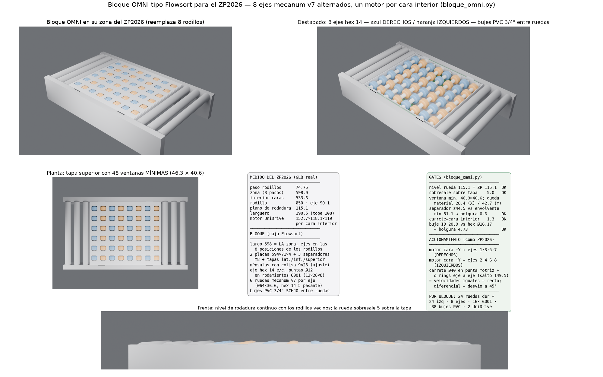

# Bloque OMNI tipo Flowsort para el ZP2026 — 8 ejes mecanum, caja de placas

Pedido de Sergio (02-09): un bloque con la **lógica de caja Flowsort** (placas
principales + separadores + tapas laterales, inferior y superior, mismo sistema
de ajuste) que **reemplaza 8 rodillos del patrón estructural** del
**ZP2026 — transportador de rodillos con acumulación 24V** del repo
(`cad/componentes/models/ZP2026.glb`), con ruedas mecanum **v7** en 8 ejes
**alternando derechos e izquierdos**: los derechos los mueve un motor y los
izquierdos otro — **un motor por cara interior**, como el ZP2026 real. Entre
ruedas, **bujes separadores de PVC**. La rueda **sobresale 5 mm sobre la tapa
superior** y la tapa solo se recorta **lo mínimo**.

## Patrón estructural MEDIDO del ZP2026 (capa `cad`, malla real)

Extraído de los nodos y accessors del GLB (meshopt + KHR_mesh_quantization,
min/max desnormalizados):

| Dato | Valor medido |
|---|---|
| Paso de rodillos | **74.75 mm** (8 pasos = zona de 598.0) |
| Zonas / motores | 5 zonas de 598, un UniDrive por zona |
| Caras interiores de largueros | z = ±266.8 → **interior 533.6 mm** |
| Rodillo | Ø50, eje a altura 90.1 → **plano de rodadura 115.1** |
| Larguero LT_G | 190.5 de alto, espesor plegado 38, tope a 108 |
| Motor UniDrive 24V | caja 152.7 × 118.1 × 119, colgado de la cara interior |
| Carrete speed-up | Ø68 × 56, entre motor y cara |
| Transmisión | o-rings entre rodillos (10 visibles por tramo) |

## El bloque (todas las cotas en mm)

- **Largo 598 = una zona completa**: los 8 ejes caen EXACTAMENTE en las 8
  posiciones de los rodillos que se retiran (paso 74.75).
- **Nivel replicado**: ejes de rueda a z 83.1 → tope de rueda **115.1 = plano
  de rodadura de los rodillos vecinos** (gate exacto).
- **Tapa superior** a 110.1 (espesor 3): la rueda **sobresale 5.0**. Recortes
  mínimos: **una ventana redondeada por rueda** (48 ventanas), dimensionada por
  el **envolvente barrido real** de la mecanum v7 (revolución de renv(z), que
  no depende del azimut) + 2 de holgura → ventana **46.5 × 40.6** aprox.;
  entre ventanas queda siempre material (≥28 en X, ≥42 en Y).
- **8 ejes hexagonales 14 e/c** (la rueda v7 tiene hex 14.5 pasante, holgura
  0.5) con **puntas torneadas Ø12** en **rodamientos 6001 (12×28×8)**
  asentados en las placas principales — la misma filosofía de los ejes
  cuadrados con muñones torneados del LBP530.
- **6 ruedas mecanum v7 por eje** (Ø64 × 36.6) a paso transversal 83.3;
  **ejes pares = DERECHOS, impares = IZQUIERDOS**. 24 ruedas der + 24 izq.
- **Bujes separadores de PVC 3/4" SCH40** (OD 26.7 / ID 20.9 — pasa sobre los
  vértices Ø16.17 del hex 14) entre ruedas y contra las placas: fijan el paso
  transversal y el nivel de todas las ruedas.
- **Caja Flowsort**: 2 placas principales (594 × 71 × 4) con los 8 asientos de
  rodamiento; 3 separadores tubulares Ø12 con varilla M8 a z 44.5 (el
  envolvente de rueda nunca baja de 51.1 → holgura 0.6+); tapas laterales en
  los extremos; **tapa inferior** con 2 ventanas mínimas para los motores;
  **ménsulas con colisa vertical 9×25** contra los largueros = el sistema de
  ajuste de altura de la caja.
- **Accionamiento como el ZP2026**: un **UniDrive por cara interior** — el de
  la cara -Y mueve los 4 ejes derechos, el de +Y los 4 izquierdos — con
  **carrete Ø40 en la punta motriz de cada eje** (entre placa y larguero,
  holgura 6.3 a la cara) y **o-rings eje a eje** (salto 149.5 entre ejes de la
  misma mano) + o-ring del motor al eje central del grupo.
- Con ambos motores a la misma velocidad el producto avanza recto; con
  velocidades distintas (o un motor detenido/invertido) la componente a 45°
  de cada mano deja de cancelarse y el bulto se desvía — es el principio del
  divert Flowsort con 2 motores.

## Verificación (gates del script)

```
nivel rodadura rueda=115.1 vs rodillos ZP=115.1 -> OK
sobresale sobre tapa = 5.0 (pedido 5.0)
envolvente min z=51.1; separador tope z=50.5 -> holgura 0.6
ventana tapa 46.5 x 40.6; material entre ventanas: x=28.3, y=42.7 -> OK
carrete hasta y=265.5 vs cara interior 266.8 -> holgura 1.3
bujes PVC: ID 20.9 vs vertices hex Ø16.17 -> holgura 4.73
```

## Qué es placeholder y qué es final

- Las **ruedas** del ensamble son el **sólido de revolución del envolvente
  barrido** (volumen exacto de barrido → las holguras y recortes de tapa valen
  para la rueda real en cualquier giro). La rueda imprimible es la
  **mecanum64 v7** (`docs/analisis/mecanum64v7/`).
- Motor = bbox medida del UniDrive; o-rings = tramos rectos indicativos.
- Pendiente si Sergio aprueba: DXF de corte de placas y tapas, despiece,
  y elección fina del carrete (2 gargantas Ø5).

## Reproducir

```bash
python docs/analisis/bloque_omni/bloque_omni.py   # gates + bloque_omni.step
```


