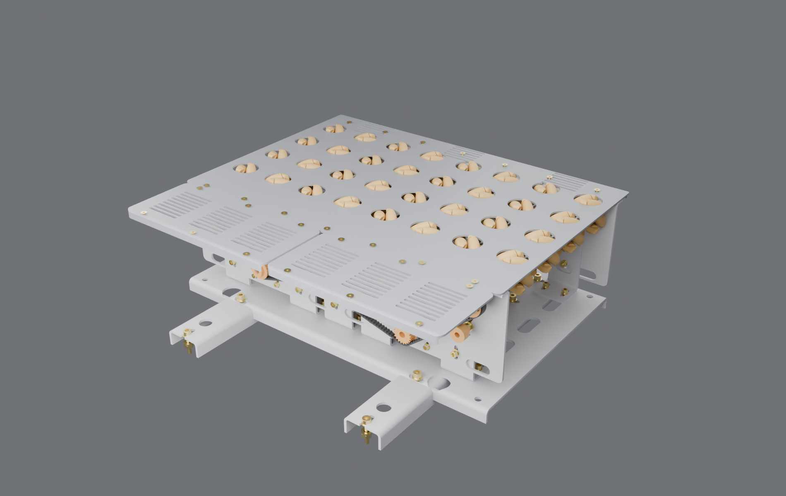
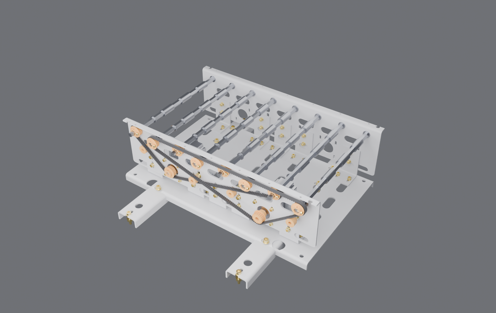
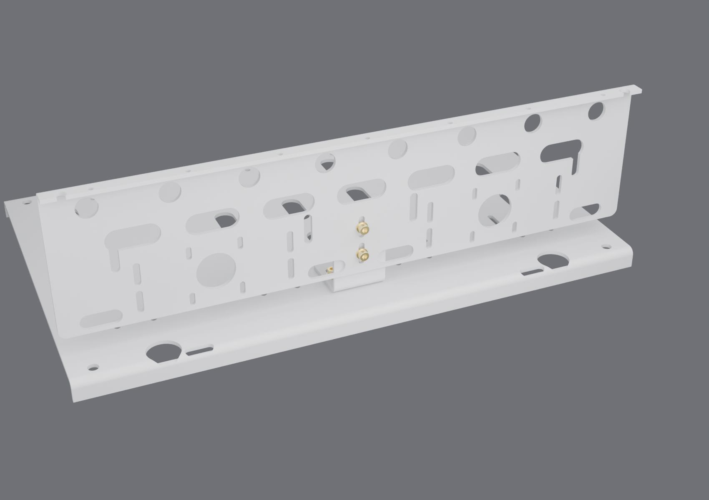
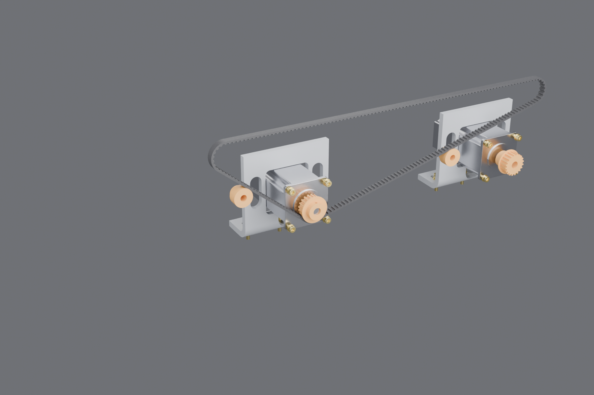

# Bloque OMNI v8 — un STEP por componente, y el ensamble los instancia

> Sergio (05-09): *"Why are you not using the real step for each wheel? You
> must use each step file for the belts, for the plate, for each component like
> wheels... bolts, nuts, washers, motors, belts. With details. For example,
> blended metal parts with all details. I want to build that."*

Tenía razón en las tres cosas. La v7 **re-modelaba** la rueda en vez de usar su
STEP, **no tenía tornillería**, y sus alas plegadas eran **cajas pegadas a tope
con arista viva** — o sea, una chapa que ninguna plegadora puede hacer.

La v8 cambia el método:

**Paso 1 — `componentes_step/`: un archivo STEP por componente**, generado una
sola vez, con el detalle completo.
**Paso 2 — el ensamble no modela nada**: importa cada `.step` y lo instancia en
su sitio. Lo que se ve en el ensamble es exactamente el archivo de la pieza.

Eso funciona porque el exportador STEP guarda **un producto por pieza única y N
instancias**: 454 piezas salen de 33 referencias, en 60.1 MB.

## Las 33 referencias

| Componente | Cant. | De dónde sale | Detalle que lleva |
|---|---|---|---|
| `RUEDA_MECANUM64_v9_der` / `_izq` | 16 + 16 | **el STEP de la rueda que ya validamos**, copiado tal cual | 2 placas + 6 rodillos + 6 pasadores cada una |
| `MOTOR_NEMA24_stepperOnline` | 2 | **el STEP oficial del fabricante**, copiado tal cual | cuerpo, encoder, conector, eje Ø10×22.6 |
| `CORREA_HTD5M_09_der` / `_izq` | 1 + 1 | generada sobre el trazado real | **208 dientes reales** (paso 5, radio de valle 1.49, prof. 2.06) |
| `EJE_HEX_1_2_pulgada` | 8 | | hex 12.7 con muñones Ø12 y chaflanes |
| `POLEA_HTD5M_20T_hex` | 8 | | dientes HTD reales, pestaña, cubo, prisionero M4 |
| `POLEA_HTD5M_20T_motor` | 1 | | ídem, barreno Ø10 h7, cubo hacia fuera |
| `POLEA_HTD5M_20T_motor_cubo_largo` | 1 | | ídem con cubo de 13 hacia el motor (plano lejano) |
| `RODAMIENTO_F6801ZZ` | 16 | | aros, tapas ZZ y chaflanes a cota |
| `SEPARADORES_HEX_eje` | 8 | | barreno hexagonal 12.9 |
| `TENSOR_rodillo` | 4 | | rodillo + casquillo del perno |
| `CHAPA_*` (7 piezas) | 18 | plegado real | ver abajo |
| `TORNILLO_DIN912_*` (7 medidas) | 80 | | **rosca métrica helicoidal real** (perfil ISO 68-1 truncado barrido sobre hélice), hexágono interior, chaflán de entrada |
| `TORNILLO_ISO10642_M5x10` | 26 | | avellanado 90°, el que pide el manual para la tapa |
| `TUERCA_DIN934_M6` / `M8` | 40 + 18 | | **rosca interior helicoidal real**, chaflanes de norma |
| `ARANDELA_DIN125_M5/M6/M8` | 130 | | plana a cota |
| `ARANDELA_GROWER_DIN127_M6/M8` | 58 | | anillo abierto con su rampa |

Tornillería según el manual del Flowsort: **M5×16 socket head + grower** en los
grupos motrices, **M5×10 avellanado** en la tapa superior.

## Chapa PLEGADA de verdad

Cada ala se construye ahora como **línea media con arco de plegado** y se
engorda al espesor: radio interior **R4 en chapa de 4** y **R8 en la de 8**,
exterior R+t. Nada de cajas a tope. Y cada pieza sale con su **desarrollo**,
que es lo que se manda a cortar en plano:

| Pieza | Espesor | Pliegues | Desarrollo |
|---|---|---|---|
| Riel | 4 | 1 | **165.8 mm** |
| Escuadra | 4 | 1 | **139.3 mm** |
| Placa base | 4 | 2 | **411.3 mm** |
| Cuña de motor | 8 | 1 | **148.9 mm** |
| Travesaño (U) | 4 | 2 | **105.3 mm** |
| Tapa superior | 3 | 1 | **415.1 mm** |
| Tapa ciega | 3 | 1 | **135.1 mm** |

(Desarrollo con factor K = 0.38, el habitual para acero al carbono.)

## Un resultado que sirve para comprar

El trazado de la correa da **208 dientes × paso 5 = 1040 mm**, o sea una
**HTD 5M-1040-09 de catálogo**, no una medida especial. Dos iguales, una por
familia.

## Tres cotas que corregí al medir el ensamble

| Qué | Estaba | Va |
|---|---|---|
| Agujeros M5 de la tapa en el ala del riel | y = −135, **fuera del ala** (que va de −128 a −134) | y = −130, centro del tramo plano |
| Cubo de la polea del motor derecho | hacia dentro → **atravesaba el riel** hasta y = −105 | hacia fuera; solo la del plano lejano lleva cubo largo |
| Tornillos de la brida del motor | M5×10 → 5 mm de rosca contra **4 mm útiles** del motor | **M5×8** |

## Reproducir

```bash
python docs/analisis/bloque_omni/bloque_omni_v8.py --componentes
#   paso 1: escribe componentes_step/ (33 STEP)
#   paso 2: bloque_omni_v8.step, 454 piezas instanciadas
python docs/analisis/bloque_omni/v8_render.py
```

## Láminas

| | |
|---|---|
|  |  |
| Módulo cerrado: ruedas reales asomando, avellanados de la tapa, chapa plegada | Bastidor con toda la tornillería y las dos correas dentadas |

| | |
|---|---|
|  |  |
| Detalle de una unión: riel plegado (radio real), escuadra, M6 con arandela | Estación de motor, polea, correa HTD con dientes y tensores |

## Entregables

- `COMPONENTES_STEP_v8.zip` — **las 33 referencias, un STEP por componente**.
- `BLOQUE_OMNI_v8_ENSAMBLE.zip` — `bloque_omni_v8.step`, 454 piezas instanciadas.
