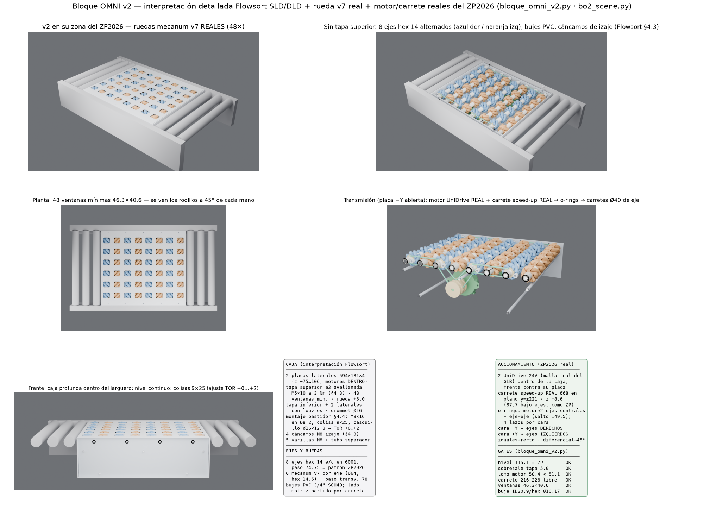

# Interpretación detallada de la caja Flowsort SLD/DLD → bloque OMNI v2/v3

> **v3.2 (02-09, "ocupa tal cual el transportador cero presión")**: la escena
> `bo3z_scene.py` decodifica el **ZP2026 completo** (todos los nodos del GLB,
> meshopt + quantization) y el bloque ocupa la **zona central** en su lugar:
> se retiran solo los 38 nodos de accionamiento de esa zona (8 rodillos
> `pos`, casetes `=>`, correas, o-rings, UniDrive + carrete y tornillería);
> quedan 199 (largueros, travesaños, guardas, patas, riostras, sensores de
> zonas vecinas, 32 rodillos — verificados 0 torcidos). La **escalerilla se
> corta en |x|<310** (reencaminar por fuera de la caja), el **controlador
> `c` se corre a x+330** y la **fuente 24V a x−450** sobre el mismo
> larguero. El bloque se adapta al bastidor real: **rebaje de placas
> |x|>274 bajo z18** para librar los travesaños TR_S (x 280.2, tope z 14.1
> → holguras 6.2 / 3.9), laterales desde z18 (pasan sobre el travesaño),
> escuadras a z35, placa base y tapa inferior a ±272. Entregables:
> `bloque_omni_zp.glb` (máquina completa) + lámina `BO3Z_lamina.png`.

> **v3 (02-09, correcciones de Sergio)**: transmisión por **correas Poly-V
> PJ en serpentín** (lo que usa el Flowsort real: PJ 4 nervios) en lugar de
> o-rings; los separadores **solo desaparecen donde pasa la correa**
> (aclaración de Sergio): quedan **6 varillas M8** en puntos verificados
> fuera del serpentín y de los motores — el central de z44.5 se reparte en
> x=±150 porque en x=0 cruzaba el cuerpo de los motores (que llegan a
> z 50.4), y los cruces de la correa por z44.5 caen en x ±211.6 y ±26 —
> además de la **PLACA BASE** con arreglos de ranuras (la baseplate del
> despiece p.23 del manual); **laterales de extremo con
> columnas de ranuras verticales 9×20 + escuadras = ajuste en profundidad**
> del módulo; ranuras estilo Flowsort también en las placas principales;
> **solo 4 ruedas por eje, equidistantes (paso 78), grupo cargado a la
> IZQUIERDA** (mirando el flujo +X, izquierda = +Y: y = −39/39/117/195);
> los **2 UniDrive** (uno por cara) visibles. Cada cara lleva su serpentín:
> correa bajo las 4 poleas Ø40 de sus ejes, sobre 3 tensores Ø24 entre ejes
> (fondo de polea 63.1 / tope de tensor 64.0 → la correa abraza), motor
> real abajo. Gates: polea 214–228 vs borde de rueda 213.3 (0.7), placa
> base −73/−69 vs fondo de motor −67.7 (1.3), resto sin cambios.
> Archivos: `bloque_omni_v3.py`, `bo3_scene.py`, `bloque_omni_v3.glb`,
> `bloque_omni_v3_fab.step`, lámina `BO3_lamina.png`.

Pedido de Sergio (02-09): dejar de iterar impresión y rehacer el bloque BIEN:
con la **rueda mecanum v7 real**, las **mallas GLB reales del transportador**
(motor UniDrive y soportes del ZP2026) y una **interpretación detallada del
bloque Flowsort**. Este documento es esa interpretación, elemento por
elemento, con su traducción a nuestro bloque.

## Fuentes (capa `web`, accedidas 02-09-2026)

1. **Instruction Manual SLD/DLD 24V, V5 REV1.2** — Flowsort BV, Geldrop NL,
   14-12-2022. Copia pública:
   `https://robotunits.com/wp-content/uploads/2023/02/Instruction-Manual-SLD-DLD-24V-V5-REV1.2-v5.2_e.pdf`
   (40 páginas; §3.1 part names, §4.2–4.5 instalación, §6 mantenimiento,
   §8.1 repuestos). Citas textuales abajo.
2. **flow-sort.com** — páginas de producto ("DIVERTER", "Tools & Downloads"):
   "The diverter has an adjustable width … each standard width has a 50mm
   adjustment. The size in between the side profiles are 400-450mm,
   600-650mm, 800-850mm, 1000-1050mm."
3. **ZP2026** (capa `cad`, malla real del repo:
   `cad/componentes/models/ZP2026.glb`): paso de rodillos 74.75, interior
   533.6, plano de rodadura 115.1, motor UniDrive por cara interior con
   carrete speed-up Ø68×56 (centro del carrete a 48.4 de la cara y 87.7 bajo
   el plano de ejes; frente del motor a ~20 del larguero), o-rings
   rodillo-rodillo.

## La caja Flowsort, elemento por elemento

| # | Elemento Flowsort (manual) | Qué hace | Traducción al bloque OMNI v2 |
|---|---|---|---|
| 1 | **Side plates** (2 placas laterales de la caja; "Always pick the diverters up by the two side plates or by the eye-bolts", §4.3) | Espina estructural; portan la interfaz al bastidor | **2 placas principales 594×181×4** (z −75…106): portan los 8 rodamientos 6001, los motores y la interfaz al bastidor |
| 2 | **Base plate** interior (los wheel drives se atornillan a ella con 4× M5x14 + grower, §6.6.4; cáncamos sobre ella, §4.3) | Recibe los módulos y el mecanismo; correas HTD por arriba y Poly-V por abajo | En nuestro bloque el "plano mecánico" es el **plano de ejes z 83.1**: los 8 ejes son los módulos; la función estructural de la base la toman las placas + 5 varillas separadoras M8 con tubo Ø12 (3 arriba en z 44.5, 2 abajo en z −60) |
| 3 | **Top cover** con una abertura por módulo, tornillos avellanados **M5x10 negros a 3 Nm** (§4.3) | Cierre superior; mantenimiento POR ARRIBA quitándola | **Tapa superior e3** en z 107.1 con **48 ventanas mínimas 46.3×40.6** (una por rueda, del envolvente barrido real + 2 de holgura); 10 avellanados M5x10 al borde de placas. La rueda **sobresale 5.0** (pedido); se desarma todo por arriba |
| 4 | **Bottom cover plate** (§3.1) | Cierra la caja por abajo | **Tapa inferior e3** en z −78…−75 con louvres de ventilación; la caja v2 es PROFUNDA y los motores van DENTRO, como el diverter real |
| 5 | **Covers laterales con louvres** + **cable grommet** (§3.1) | Cierre de extremos, ventilación, pasacables | **2 tapas laterales** con louvres 50×5; la de +X lleva **grommet Ø16** hacia el controlador/fuente del ZP2026 |
| 6 | **Montaje al bastidor**: "Make sure that the framework has **Ø8.2 holes** … Mount the **M8x16 hexagon bolt**" (§4.4); pernos premontados en el side frame | Interfaz estándar y repetible al transportador anfitrión | **4 puntos M8 por placa** (x ±225/±75) con **colisa vertical 9×25** y **casquillo separador Ø16×12.8** placa→cara interior del larguero; el larguero se taladra **Ø8.2** como manda Flowsort |
| 7 | **Ajuste de altura / TOR**: "We recommend you to use a **+2mm height** of the diverter wheels relative to the [conveyor]" (§4.4); ancho +50 ajustable | La rueda debe quedar apenas sobre el plano de rodadura | La colisa 9×25 da **+0…+2 (hasta +8)** sobre el nivel nominal. El bloque nace **a nivel exacto 115.1** = rodillos ZP (pedido de Sergio) y la colisa permite aplicar el +2 Flowsort en sitio |
| 8 | **Wheel drive assembly** (rueda omni Ø180, rodillos Ø58 PU, 608-2RS; swivel por HTD 5M) | El módulo que empuja el producto | **8 ejes hexagonales 14 e/c** con **6 mecanum v7 reales** cada uno (Ø64×36.6, hex 14.5 pasante, rodillos moldeados de Sergio), alternando **derechos (pares) / izquierdos (impares)**; sin swivel: el desvío sale del diferencial entre manos |
| 9 | **Motores PGD024** + **Poly-V / HTD** + **4 tensores en colisa** (§8.1) | Giro de rueda y giro de torreta | **2 UniDrive 24V REALES del ZP2026** (malla GLB), uno por cara interior, DENTRO de la caja con el frente contra su placa (ventana de servicio 60×24 en cada placa para el cableado); **carrete speed-up real Ø68** + **o-rings** al **carrete Ø40 de 2 gargantas** de cada eje (plano y ±221, dentro de la caja) y **o-rings eje a eje** (salto 149.5). Sin tensor: pretensión elástica ~15 % como los o-rings del propio ZP2026 |
| 10 | **Eye-bolts** en la base plate (§4.3: transporte SOLO por cáncamos o placas) | Izaje seguro del módulo | **4 cáncamos M8** en el borde superior de las placas |
| 11 | **Controller Conveylinx-Ai2** al costado (§3.1, §8.1) | Control 24V de los 2 motores | Se usa la electrónica 24V del propio ZP2026 (fuente + controlador existentes); los 2 UniDrive del bloque se cablean como una zona más |
| 12 | **Espaciadores / bujes** | Posicionar módulos en el ancho | **Bujes de PVC 3/4" SCH40** (OD 26.7 / ID 20.9, sobre vértices hex Ø16.17) cortados a medida: 5×40.4 entre ruedas + extremos; en el lado motriz el buje de extremo se parte en **rueda→carrete (2.2)** y **carrete→placa (23.5)** |

## Geometría clave del v2 (todo verificado por gates en `bloque_omni_v2.py`)

- Ruedas a **paso transversal 78** (y = ±39/±117/±195); borde de última rueda
  213.3; carrete del eje 216–226; placa 250.
- Motor real DENTRO de la caja: frente en y=249 contra la placa, carrete del
  motor en el **plano de o-rings y=±221**, centro a **z −8.6** (87.7 bajo el
  plano de ejes como en el ZP2026, −4 para librar el envolvente de rueda:
  lomo del motor z 50.4 < envolvente mínimo 51.1).
- O-rings: carrete motor → 2 ejes centrales del grupo; ejes extremos
  encadenados eje a eje. 4 lazos por cara.
- La caja completa vive dentro del hueco del larguero (z −82.6…101) y el
  producto solo ve la tapa (110.1) y las ruedas (115.1).

## Entregables

- `bloque_omni_v2.py` → gates + `bloque_omni_v2_fab.step` (las ~100 piezas a
  fabricar: placas, tapas, ejes, carretes, bujes, varillas, casquillos,
  cáncamos) + STL por pieza.
- `bo2_scene.py` → `bloque_omni_v2.glb`: escena completa con la **rueda v7
  real instanciada 48×** (2 mallas compartidas), el **motor UniDrive y el
  carrete speed-up reales** del ZP2026 y el contexto del transportador.
- `bo2_render.py` → BO2_hero / planta / destapado / transmision / frente;
  lámina `BO2_lamina.png`.

