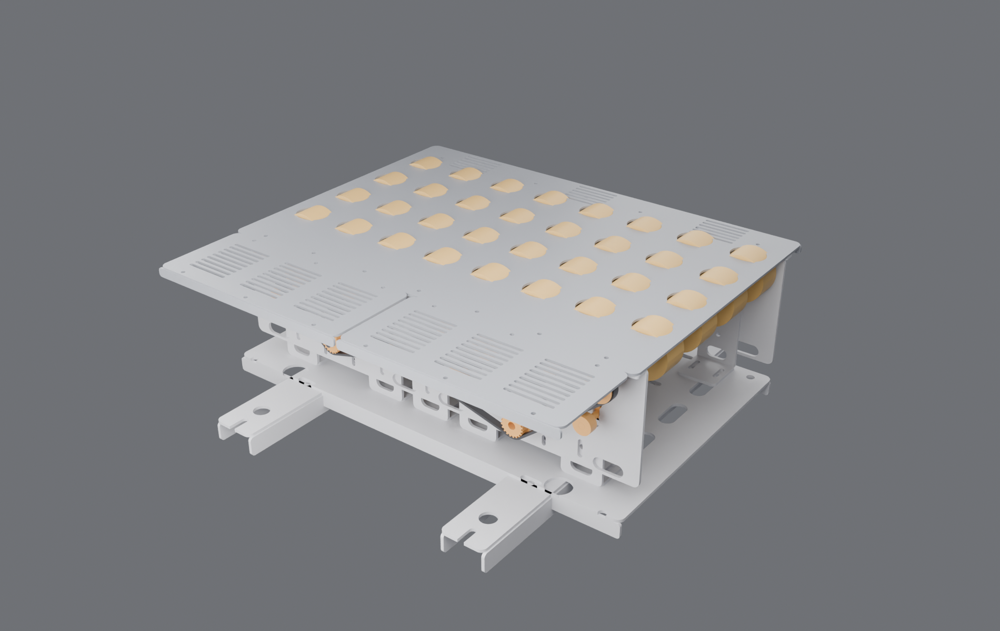
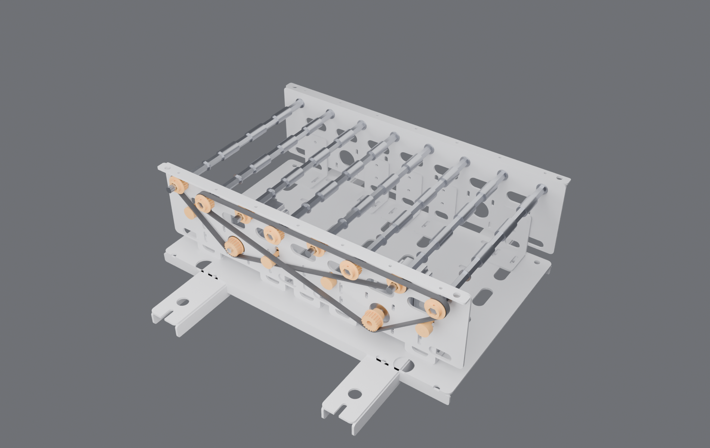
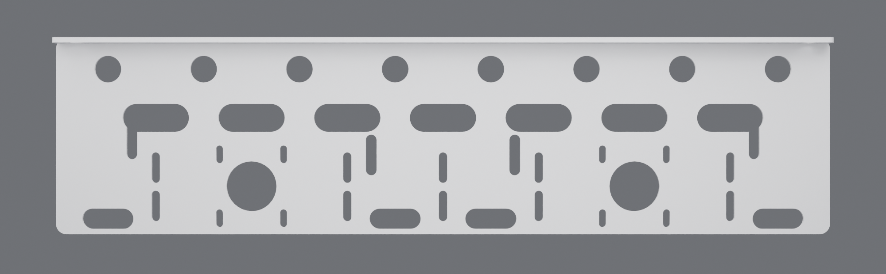
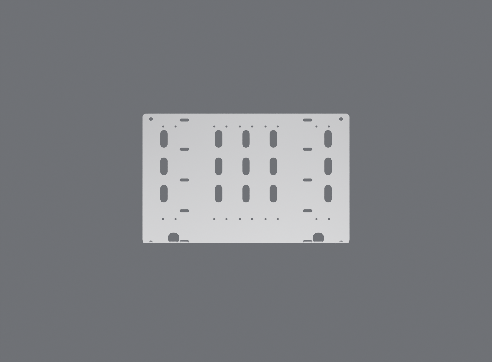
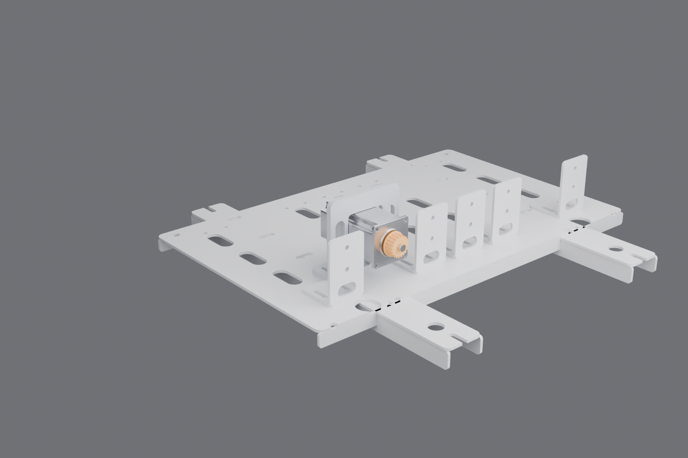
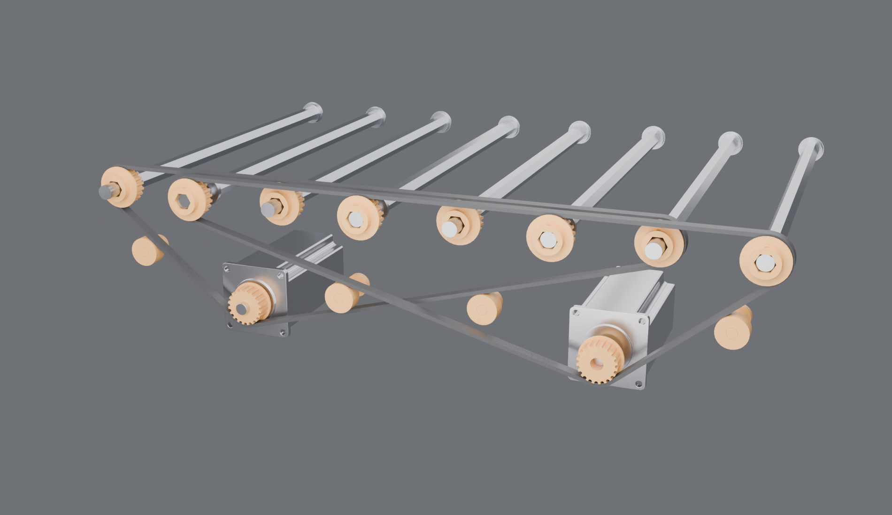

# Placas de soporte en ESTILO FLOWSORT — bloque OMNI v7

> Sergio (04-09): *"placas de soporte quiero con estilo, revisa modelo pdf que
> te pasé de flowsort ¿por qué no lo entiendes?"*

Tenía razón. Hasta la v6 mis placas eran **rectángulos pelados con ranuras
rectangulares sueltas**. Fui a las láminas de despiece del manual **SLD/DLD
24V** (págs. 22, 23 y 24 — §6.6.3 / §6.6.4 / §6.6.5) y de ahí saqué el
lenguaje de chapa que el Flowsort repite en TODAS sus piezas. Estas son las
nueve reglas que ahora se aplican, y dónde se ven en el manual:

| # | Regla leída de las láminas | Dónde se ve | Cómo se aplica aquí |
|---|---|---|---|
| M1 | **Ninguna ranura es rectangular**: toda es colisa de extremos redondos (r = ancho/2) | pág. 23, placa base y lateral | `colisa()` — no queda ni un corte recto en las placas |
| M2 | Las colisas van en **columnas/hileras de paso constante**, nunca sueltas | pág. 23, lateral izquierdo | columnas cada paso intermedio (74.75) |
| M3 | **Dos colisas por punto de fijación**: verticales donde se ajusta altura, en Y donde se ajusta profundidad | pág. 24, lateral derecho | riel: 2 colisas verticales por escuadra; escuadra y cuñas: colisas en Y |
| M4 | **Alas plegadas a 90°** en los cantos libres | pág. 23 y 24 | riel (ala superior 18), base (2 alas de 20), tapas (ala de canto 12) |
| M5 | Contornos con **radio de esquina** (R8/R10) | todas | `rrect()` en todas las placas |
| M6 | **Ventanas de aligeramiento** obround en las bandas sin función | pág. 23, base | riel 22×52, escuadra 16×30, cuña 16×44 |
| M7 | **Cáncamos de izaje** en los extremos | pág. 23 y 24 (los dos anillos) | 2 en el ala del riel, 4 en la base |
| M8 | **Lamas de ventilación** (hileras de colisas finas) | pág. 11, cubierta lateral | tapa superior y tapa ciega: 4.5×62 a paso 9 |
| M9 | **Pasacables redondos** en la placa base | pág. 24, paso 7: *"put all cables through the holes in the bottom plate"* | 2× Ø34 bajo la zona de motores |

Tornillería del manual, respetada: **M5×16** socket head + arandela grower en
los grupos motrices, **M5×12** hexagonal en la tapa inferior, **M5×10**
avellanado en la tapa superior.

## Las piezas que salieron de aplicarlo

| Pieza | Espesor | Qué lleva |
|---|---|---|
| **Riel principal** ×2 (LA MISMA PIEZA) | 4 | 8 alojamientos Ø21 del F6801, 2 estaciones de motor (piloto Ø39.2 + patrón 50×50 en colisas verticales), 5 columnas de 2 colisas M6, 4 colisas de tensor, 7 ventanas 22×52 + 6 de 16×40, ala superior de 18 con 7 M5 + 2 cáncamos |
| **Escuadra riel↔base** ×10 (la misma) | 4 | ala vertical con 2 pasos M6 (ajuste de ALTURA por las colisas del riel) + ala horizontal con 2 colisas en Y (ajuste de PROFUNDIDAD) |
| **Placa base** | 4 | colisas 9×28 sobre los 2 travesaños (ajuste longitudinal), 21 ventanas 22×52, 2 pasacables Ø34, 4 cáncamos, 2 alas plegadas de 20 |
| **Cuña de motor** ×2 (la misma) | 8 | silla cuadrada 61×61 R6 que abraza el cuerpo del NEMA 24 a media altura (y = −64, por delante del conector del encoder, que sale por abajo entre y = −38 y −6 según el STEP oficial), paso del conector, 2 ventanas 16×44 y pie plegado con 3 colisas de ajuste |
| **Travesaño** ×2 (la misma) | 4 | perfil en U (alma 60 + 2 alas de 26), colisas 9×30 en los apoyos sobre las pestañas del ZP2026, aligeramiento Ø22 |
| **Tapa superior** | 3 | 32 ventanas obround 46.3×40.6 (corte mínimo), 14 M5×10 avellanados, 18 lamas |
| **Tapa ciega modular** ×2 | 3 | 27 lamas, ala de canto, 6 M5 — cubre la **zona muerta del lado ancho** (y −266 … −140, de la cara interior del ZP2026 al módulo) sin tocar la tapa de ruedas |

**5 números de pieza de chapa** para todo el bastidor (riel, escuadra, base,
cuña, travesaño) + 2 de tapa. Los dos rieles son la misma pieza girada 180°
sobre Z: por eso **las dos estaciones de motor existen en ambos rieles** aunque
solo se usen las del riel cercano (en el lejano quedan como acceso).

## El montaje del motor, ya fijado

La brida del NEMA 24 apoya en la **cara interior del riel (y = −114)**, el
cuerpo entra al módulo por debajo de las ruedas y solo el eje sale por el
piloto Ø39.2. El motor de la familia del plano lejano lleva **polea de cubo
largo (13 mm) hacia el motor** en vez de pedestal:

```
eje del motor: de -114 a -136.6 (22.6 reales del STEP oficial)
der: polea -131.5..-119.5 -> 12.0 mm de dentado tomado          OK
izq: polea -146.5..-134.5 -> 2.1 de dentado + 13 de cubo = 15.1 OK
     el cubo termina en -120.0; cara exterior del riel -118 -> luz 2.0
```

Así **las dos estaciones de motor son idénticas** y no hace falta el pedestal
de 9.1 mm de la v6. La pestaña guía y el cubo de cada polea van **los dos del
mismo lado**, de modo que la cara que mira al riel queda lisa y la polea puede
acercarse a 1.5 mm de la chapa.

### Tensado, como en el manual (§6.7)

Dos tensores por familia, calculados sobre el trazado real de la correa:
**siempre en los ramales inclinados, nunca en el ramal de arrastre**. Cada uno
lleva su **colisa vertical en el riel** para dar y quitar tensión — que es
justo la operación que describe el manual antes de sacar una correa.

| Familia | Tensor 1 (x, z) | Tensor 2 (x, z) | Hueco al resto del patrón |
|---|---|---|---|
| der | (56.1, 15.9) | (−242.9, 28.5) | 18.7 mm |
| izq | (−56.1, 15.9) | (242.9, 28.5) | 18.7 mm |

## Lo que hay que decidir: F6801 vs 6001-2RS

Con las poleas **en voladizo** (como pidió Sergio) el rodamiento próximo se
lleva casi el doble de carga que cuando la polea iba entre rodamientos:

| Familia | Voladizo | Carga en el rodamiento próximo | F6801ZZ | 6001-2RS |
|---|---|---|---|---|
| der | 10.0 mm | 194 N | **18 000 h** | 1 013 000 h |
| izq | 25.0 mm | 203 N | **15 800 h** | 890 000 h |

El objetivo eran 40 000 h. **El F6801 ya no llega** en el lado motriz. Cambiar
a 6001-2RS solo cuesta agrandar el alojamiento del riel de Ø21 a Ø28 — el riel
sigue siendo una sola pieza. **Falta que Sergio decida.**

## Los DOS errores del STEP anterior (los dos míos)

Sergio abrió `tren_motriz_v6.step` y vio **un motor y un eje flotando lejos**.
Eso no era su visor: eran dos bugs reales.

**Bug 1 — era un catálogo, no un ensamble.** Las 7 piezas estaban las 7 en
x = 0, unas dentro de otras: los dos motores superpuestos, las dos poleas
coincidentes y el rodamiento embutido dentro del cuerpo del motor. Solo
"asomaba" el motor.

**Bug 2 — extrusiones al revés.** En el plano `XZ` de CadQuery, `extrude(+L)`
avanza hacia **−Y**, no hacia +Y. Yo venía escribiendo `extrude(-(y1-y0))
.translate((0, y1, 0))`, que coloca el sólido en `[y1, y1+L]` en vez de
`[y0, y1]`. Consecuencias medidas sobre la malla:

| Pieza | Dónde quedaba | Dónde va |
|---|---|---|
| eje hexagonal | y −114 … **+545.8** (660 mm de largo) | y −152.5 … +225.8 |
| polea de eje | y −119.5 … −101.5 (**atravesando el riel**) | y −137.5 … −119.5 |
| separadores | corridos un tramo completo | entre rueda y rueda |

Ese eje de 660 mm que salía disparado del motor **es exactamente lo que se ve
en la captura de Sergio**. Ahora hay un helper `tubo(ro, ri, ya, yb)` con el
signo resuelto de una vez, y todas las piezas se verificaron por *bounding box*
contra su posición teórica.

Con los dos bugs corregidos hay dos ensambles de verdad:

- `bloque_omni_v7.step` — **103 piezas** en su posición real.
- `tren_motriz_ENSAMBLADO.step` — **45 piezas**: 2 motores, 8 ejes, 10 poleas,
  16 rodamientos, 6 tensores y las 2 correas.

Las 32 ruedas van como **envolvente barrida** en el ensamble (32 mecanum
completas hacen un STEP que no abre ningún visor); la rueda real, con sus 6
rodillos, es `docs/analisis/mecanum64v9/`.

## Reproducir

```bash
python docs/analisis/bloque_omni/bloque_omni_v7.py   # gates + STEP/STL
python docs/analisis/bloque_omni/v7_render.py        # 6 láminas
```

## Láminas

| | |
|---|---|
|  |  |
| Módulo cerrado: tapa con 32 ventanas obround, lamas y las dos tapas ciegas modulares | Bastidor: rieles, escuadras, base, travesaños y las dos correas con sus tensores |


*El riel, en alzado: hilera de F6801, dos estaciones de motor, columnas de colisas de ajuste y dos hileras de ventanas.*


*Placa base en planta.*

| | |
|---|---|
|  |  |
| Estación del motor con su cuña de 8 mm | Tren motriz completo, cada pieza en su sitio |

## Entregable

`BLOQUE_OMNI_v7_flowsort.zip` — STEP + STL de cada pieza suelta, más
`bloque_omni_v7.step` (módulo completo, 103 piezas) y
`tren_motriz_ENSAMBLADO.step` (45 piezas).
