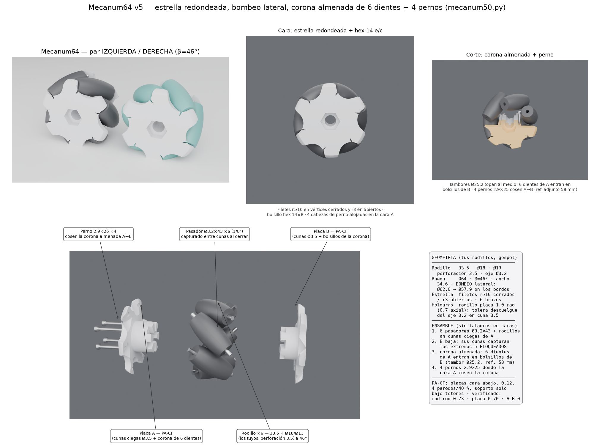

# Mecanum64 v5 — estrella redondeada, bombeo lateral, corona almenada + 4 pernos

Iterada sobre el boceto de Sergio y sus correcciones. Rodillos **existentes**
(moldeados, 33.5 × Ø18 × Ø13, perforación 3.5, eje Ø3.2 = 1/8"): las placas
impresas los alojan tal cual. El barril medido es el perfil mecanum exacto
ρ(s)=√(R²−s²cos²β)−d0; el diámetro se llevó a **Ø64** (β=46°, d0=23): es el
punto donde los barriles se DESTRENZAN — holgura real entre rodillos 0.73 mm
(a Ø50–56 se tocaban a ~0.05). Ancho 34.6. Envolvente Ø63.8–64.0.

Estrella de **6 brazos armónicos** con la receta del boceto (mini arco
exterior sobre cada tetón, flanco largo tangente a la circunferencia invisible
r13.5, lado corto en recta al brazo siguiente), ahora **redondeada**:
filetes **r ≥ 10 en los vértices cerrados** (cóncavos) y **r 3 en los
abiertos** (convexos), por morfología (cierre/apertura del contorno).

## Las 4 correcciones de v5

1. **Filetes de la estrella**: r ≥ 10 cóncavos / r 3 convexos (pedido de
   Sergio); ningún vértice vivo queda en la cara.
2. **Bombeo lateral**: de costado la rueda cierra levemente arriba y abajo —
   las placas van de Ø62.0 en el cuerpo a Ø57.9 en los bordes exteriores
   (caída cuadrática de 3.2 mm en los últimos 6 mm hacia cada cara).
3. **Más tolerancia de rodillo**: holgura placa-rodillo **1.0 mm radial**
   (0.7 axial). Con perforación de rodillo 3.5, cuna 3.5 y eje Ø3.2, el
   descuelgue por gravedad puede desplazar el barril hasta ~0.3 mm; queda
   ≥0.7 mm de margen real en el peor caso.
4. **Acople almenado + 4 pernos** (evaluado del adjunto Printables 58 mm, que
   enclava la posición con corona dentada): los tambores centrales Ø25.2 se
   topan en el plano medio; **6 dientes de 30° de la placa A cruzan el plano y
   entran en bolsillos de B** (altura 3.3 en bolsillo 3.5, holgura de flanco
   0.8° ≈ 0.18 mm) → bloqueo rotacional positivo. **4 pernos rosca-plástico
   2.9×25 en el círculo r10.8 (45/135/225/315°)** entran desde la cara A
   (cabezas alojadas), cruzan la corona dentro de un diente de B y roscan en
   B (piloto Ø2.5×13) → cosen el ensamble axialmente.

Sin cambios: cada eje Ø3.2×43 va en cuna ciega de A y al cerrar la cuna de B
captura el otro extremo (tetones enfrentados y alineados = P1/P2, z=±14.3);
**ni un taladro en las caras** salvo las 4 cabezas avellanadas de los pernos.
Hexágono 14 e/c en bolsillo de 6 mm en ambas caras + taladro pasante Ø9.5.

## Secuencia de montaje

1. Pasador dentro de cada rodillo; los 6 conjuntos a las cunas ciegas de A.
2. Placa B baja axialmente: sus cunas capturan los extremos +s y sus
   bolsillos reciben los 6 dientes de la corona de A → giro bloqueado.
3. 4 pernos 2.9×25 desde la cara A → roscan en B → axial bloqueado.
   (Desmontable sacando los pernos.)

## Verificación numérica (mallas STL)

holgura rodillo-placa 1.0 radial / 0.70 axial · interferencia rodillo-placa
0.00 · interferencia A↔B 0.00 (holgura de corona ~0.2) · cruce entre
rodillos 0.73 (destrenzado) · envolvente Ø63.8–64.0 · bombeo Ø62.0→Ø57.9 ·
placas 12.9 / 12.1 cm³.

## Impresión PA-CF

Placas cara exterior abajo, capa 0.12, 4 paredes / 40 % giroide, soporte
pintado solo bajo los tetones (49°→46°); repasar cunas con broca Ø3.5.
Un robot: 2 izquierdas + 2 derechas (`mec50_ensamble_izq/der.step`).

Comprar: varilla Ø3.2 (1/8") ×6 tramos de 43 por rueda; 4 tornillos
rosca-plástico 2.9×25 por rueda.

