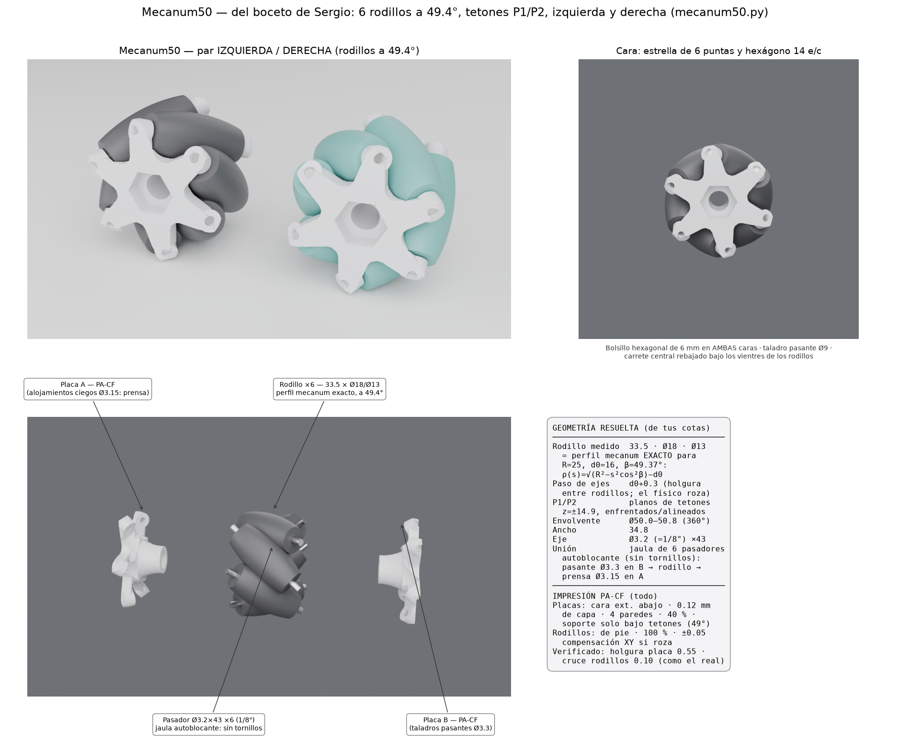

# Mecanum50 — rueda de rodillos a 49.4° (del boceto y cotas de Sergio)

Interpretación del boceto (P1/P2, orientaciones de rodillos, "hubs enfrentados
y alineados") + cotas medidas: rodillo **33.5 × Ø18 centro × Ø13 extremos**,
eje **Ø3.2** (=1/8"), rueda Ø50 nominal, hexágono **14 e/c**.

## El hallazgo central

El barril medido no es un barril cualquiera: **es el perfil mecanum exacto**
para R=25, d0=16, β=49.37° — ρ(s)=√(R²−s²cos²β)−d0 reproduce Ø18 al centro y
Ø13.0 en los extremos con L=33.5. El "45°" del boceto es ese β=49.4°. Con ese
rodillo el ancho real de la rueda es **34.8 mm** (el 28 del plano de catálogo
corresponde a rodillos más cortos; aquí manda el rodillo físico medido).

## Interpretación del boceto

- **6 rodillos a paso 60°**, ejes a 49.37° del plano transversal.
- **P1/P2 desfasados en profundidad** = los dos planos de tetones (z ≈ ±14.9):
  el extremo −s de cada eje vive en la placa A y el +s en la placa B,
  **enfrentados y alineados** sobre el mismo eje inclinado.
- **Versiones izquierda y derecha** (espejo), como el par naranja/turquesa.

## Decisiones de ingeniería (verificadas numéricamente)

| Tema | Decisión | Verificación |
|---|---|---|
| Paso de ejes | d0 + 0.30 = 16.30 | en la rueda física los rodillos vecinos se tocan en el cruce de barriles; +0.3 da 0.10 mm nominal de holgura sin deformar el rodillo medido |
| Envolvente | Ø50.0–50.8 en los 360° | cobertura completa; ondulación 0.4 por los hombros a 49° (idéntico al producto) |
| Unión de placas | **jaula de pasadores autoblocante, sin tornillos**: 6 ejes inclinados a 60° no comparten ninguna dirección de traslación/rotación → insertados bloquean todo | pasador entra por el taladro pasante Ø3.3 de B, cruza el rodillo y se prensa en el ciego Ø3.15 de A |
| Ejes-tornillo (descartado) | la cabeza de un M3×40 sobresaldría de la cara a r24.4 y tocaría el suelo | — |
| Hexágono 14 | bolsillo de 6 mm en ambas caras + pasante Ø9 (los vientres de los rodillos llegan a r≈7.3: no cabe hex pasante) | perfil libre del carrete calculado punto a punto bajo los 6 rodillos |
| Holgura placa-rodillo | 0.7 nominal | 0.55 medida en malla |

## Impresión (todo en PA-CF)

- **Placas**: cara exterior contra la cama, capa 0.12, 4 paredes, 40 % giroide.
  Los tetones inclinados 49° necesitan un toque de soporte (pintado, solo bajo
  los tetones). Taladros de eje a 49°: repasar con broca Ø3.2 (pasantes de B)
  y Ø3.0 (ciegos de A) antes de montar.
- **Rodillos ×6 (por rueda)**: de pie, 100 %, costura aleatoria. Si el cruce
  entre rodillos roza al girar: compensación XY −0.05 en el rodillo.
- **Pasadores**: varilla Ø3.2 (1/8") cortada a 43; entrada por B, prensa en A.
- Un robot usa 2 izquierdas + 2 derechas (`mec50_ensamble_izq/der.step`).

Archivos: `mecanum50.py` (generador paramétrico), ensambles STEP izq/der,
placas A/B izq/der (STEP+STL), rodillo (STEP+STL), lámina `MECANUM50_lamina.png`.

