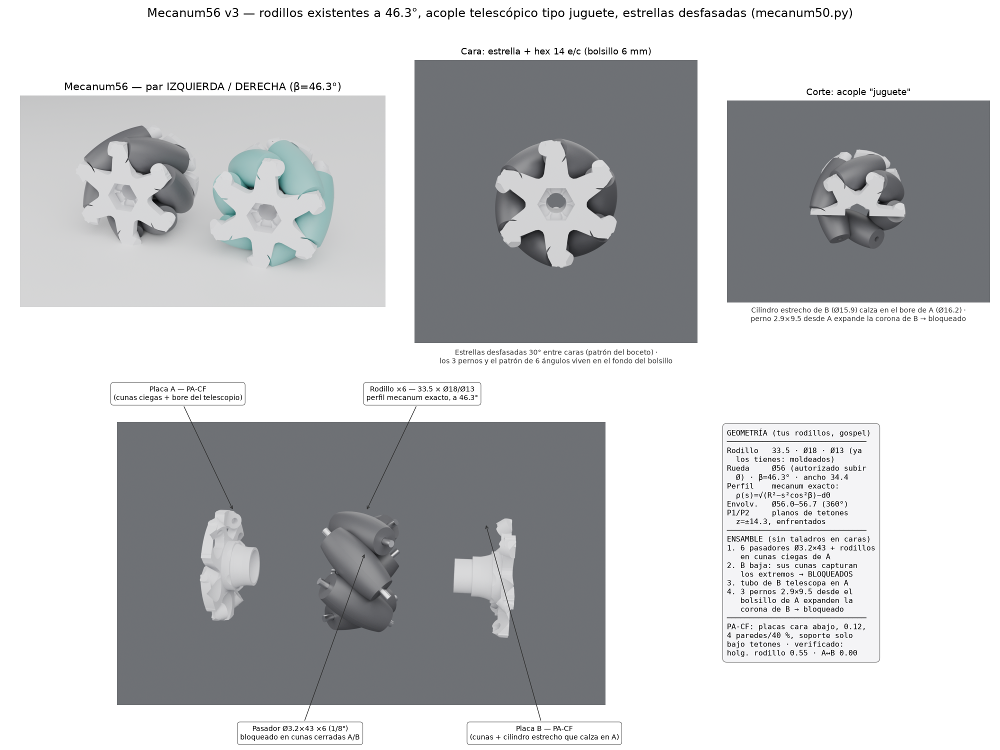

# Mecanum56 v3 — rueda para los rodillos existentes, con acople tipo juguete

Iterada sobre el boceto de Sergio y sus correcciones. Rodillos **existentes**
(moldeados, 33.5 × Ø18 × Ø13, eje Ø3.2 = 1/8"): las placas impresas los alojan
tal cual. El barril medido es el perfil mecanum exacto ρ(s)=√(R²−s²cos²β)−d0;
con el diámetro aumentado (autorizado) a **Ø56**, β=46.3° y el hexágono y el
acople caben con holgura. Ancho 34.4. Envolvente verificada Ø56.0–56.7 en los
360° (cobertura completa).

## Mecanismo (las 3 correcciones)

1. **Estrellas desfasadas** según el patrón de vértices del boceto: puntas de
   la placa A sobre las líneas de referencia (ángulos de rodillo), puntas de B
   a +30°.
2. **Pasador bloqueado, caras cerradas**: cada eje Ø3.2×43 se apoya en una cuna
   ciega de A y, al cerrar, la cuna de B captura el otro extremo (tetones
   enfrentados y alineados = P1/P2 del boceto, z=±14.3). Ninguna dirección de
   escape queda libre y **no hay ni un taladro en las caras**.
3. **Acople telescópico tipo juguete**: el cilindro estrecho de B (Ø15.9) calza
   en el bore de A (Ø16.2) hasta z=−8.2; **3 pernos rosca-plástico 2.9×9.5**
   entran desde el fondo del bolsillo hex de A (círculo r6.3, a 30/150/270) en
   la corona del tubo de B y **la expanden contra A → ensamble bloqueado**.
   Patrón de 6 ángulos (3 pernos + 3 rebajes) en el fondo del bolsillo, como la
   rueda de referencia.

Hexágono 14 e/c en bolsillo de 6 mm en ambas caras (inserción del cubo motriz
≤5.5 por los pernos) + taladro pasante Ø9.

## Secuencia de montaje

1. Pasador dentro de cada rodillo; los 6 conjuntos a las cunas ciegas de A.
2. Placa B baja axialmente: sus cunas capturan los extremos +s y su cilindro
   telescopa en A.
3. 3 pernos 2.9×9.5 desde el bolsillo de A → expanden la corona de B →
   bloqueado. (Desmontable sacando los pernos.)

## Verificación numérica

holgura rodillo-placa 0.55 · interferencia A↔B 0.00 (ajuste 0.15 radial) ·
cruce entre rodillos ~0.05 = el de la rueda física (rodillos moldeados) ·
envolvente Ø56.0–56.7 · placas 8.5 cm³ c/u.

## Impresión PA-CF

Placas cara exterior abajo, capa 0.12, 4 paredes / 40 % giroide, soporte
pintado solo bajo los tetones (49°→46°); repasar cunas con broca Ø3.2.
Un robot: 2 izquierdas + 2 derechas (`mec50_ensamble_izq/der.step`).

Comprar: varilla Ø3.2 (1/8") ×6 tramos de 43 por rueda; 3 tornillos
rosca-plástico 2.9×9.5 por rueda.

