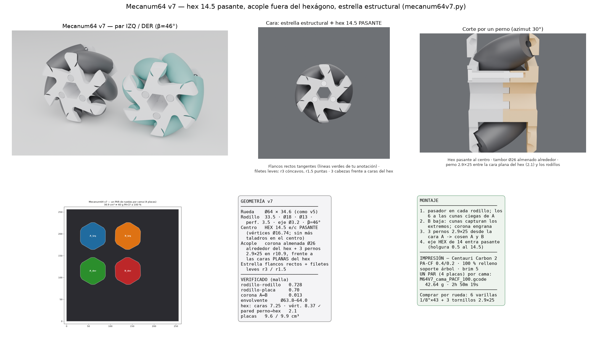

# Mecanum64 v7 — hex 14.5 pasante al centro, acople fuera del hexágono

Vuelta a la arquitectura anterior (v5: Ø64 × 34.6, sin polea ni rodamientos),
según la corrección de Sergio del 01-09. Los rodillos son los suyos
(33.5 · Ø18 · Ø13, perforación 3.5, pasador Ø3.2 = 1/8") a β=46°, destrenzados
a Ø64 (envolvente verificada Ø63.8–64.0).

## Lo que define la v7

1. **Perforación hexagonal 14.5 e/c PASANTE** al centro (vértices Ø16.74) —
   único taladro central; el eje hex de 14 entra con 0.5 de holgura. La rueda
   se acciona por el hexágono, no por correa. Verificado con sondas sobre la
   malla: caras planas a r7.25, vértices a r8.37 exactos.
2. **Encajes y pernos FUERA del hexágono, sin tocar rodillos**: el tambor
   almenado pasa a ser un anillo Ø26 alrededor del hex (a z=0 el radio libre
   bajo los rodillos es 14.0 → 1.0 de holgura); los **3 pernos 2.9×25 van en
   r10.9 frente a las CARAS PLANAS del hex** (azimuts 30/150/270): pared de
   2.1 mm al hex, 0.55 al exterior del tambor, y el carrete se engrosó a 13.2
   para envolver el canal completo. La corona se desfasó −15° para que cada
   perno cruce el plano medio por el **centro de un diente de B** (piloto
   verificado: totalmente rodeado de material).
3. **Estrella estructural** (de la anotación): mini-arco exterior por brazo y
   flancos rectos tangentes — las líneas verdes — con filetes leves r3.0 en
   cóncavos y r1.5 en puntas (las zonas rojas). Cabezas de perno en la cara A
   (bolsillo Ø5.9 × 2.2), a 0.7 de la cara plana del hex.

Sin cambios de la v5: cunas de pasador Ø3.5 (ciegas en A, captura en B),
holgura placa-rodillo 1.0 radial / 0.7 axial, bombeo lateral, dientes de
corona con 0.8° de holgura total por flanco.

## Verificación (mallas)

rodillo-placa 0.700 · interferencia 0.00 · rodillo-rodillo 0.728 ·
corona A↔B 0.013 · envolvente Ø63.8–64.0 · hex 14.5/Ø16.74 exacto ·
placas 9.56 / 9.91 cm³.

## Montaje

1. Pasador Ø3.2×43 dentro de cada rodillo; los 6 conjuntos a las cunas ciegas de A.
2. Placa B baja: sus cunas capturan los extremos y sus bolsillos reciben los
   6 dientes de la corona → giro bloqueado.
3. 3 pernos 2.9×25 desde la cara A → cosen el ensamble.
4. Eje hexagonal pasante por el 14.5.

## Impresión — Centauri Carbon 2

Mismo perfil reconstruido del gcode de Sergio (PA-CF, 0.4/0.2, 280/100) con
relleno 100 %, soporte árbol y brim 5. `M64V7_cama_PACF_100.gcode` trae **un
par de ruedas por cama** (4 placas: izq A/B + der A/B): 42.6 g, 2 h 50 min.
Comprar por rueda: 6 varillas 1/8" × 43 y 3 tornillos 2.9×25.

## Estado de las otras líneas

- `docs/analisis/mecanum50/` — v5 (hex 14 en bolsillos): superada por esta v7.
- `docs/analisis/mecanum72/` — variante con rodamientos 6804 + polea GT2:
  **aparcada** a pedido de Sergio (01-09); queda en el repo por si vuelve.

## Reproducir

```bash
python docs/analisis/mecanum64v7/mecanum64v7.py   # STEP+STL izq y der
python docs/analisis/mecanum64v7/m64v7_cama.py    # cama del par + 3MF
prusa-slicer --load cc2_pacf_100.ini --dont-arrange --merge \
  --export-gcode -o M64V7_cama_PACF_100.gcode bed7_*.stl
```


