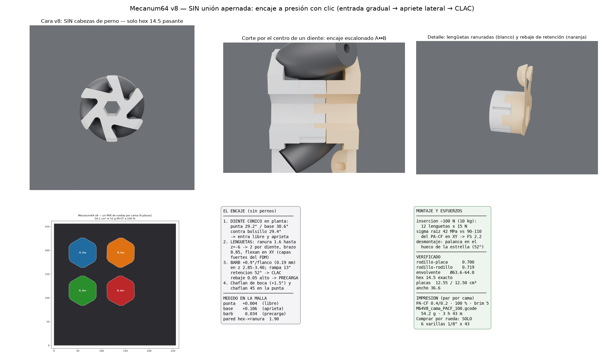

# Mecanum64 v8 — SIN unión apernada: encaje a presión con clic

Pedido de Sergio (02-09): una versión de la v7.6 **sin los 3 pernos**, con un
encaje mejor: **entrada gradual** que termine en **ajuste que suene (clac)** y
que quede **apretada por los laterales**.

Los rodillos siguen siendo los suyos (33.5 · Ø18 · Ø13, perforación 3.5,
pasador Ø3.2 = 1/8") a β=46°, envolvente Ø63.6–64.0, hex 14.5 pasante.

## Cómo funciona el encaje (las 4 cosas que lo hacen)

1. **Diente cónico en planta → entrada gradual y apriete lateral.** El hueco
   entre dientes de A ya no es una cuña recta: se corta con sección variable,
   así que el diente nace **29.2°** en la punta y termina **30.6°** en la base,
   contra un bolsillo constante de **29.4°** en B. Resultado medido sobre la
   malla: en la punta **+0.004 mm** (entra libre), en la base **+0.106 mm de
   interferencia** — entra suelto y aprieta progresivamente hasta quedar sin
   juego rotacional.
2. **Lengüetas elásticas.** Cada diente se hiende con una ranura radial de
   1.6 mm que baja hasta z=−6: quedan **dos lengüetas de 8.85 mm de brazo**
   que flexan **en el plano XY**, la dirección fuerte del FDM (no despegan
   capas). Pared entre la ranura y el hexágono: **1.90 mm** (medida).
3. **Barb + rebaje = el CLAC.** En la banda z 2.85–3.40 el diente ensancha
   +0.9° por flanco (**0.19 mm**), con **rampa de entrada larga (≈13°)** y
   **cara de retención a ≈52°**. En B hay un rebaje que lo recibe **0.05 mm
   más alto de lo nominal**: al caer el barb suena y queda con **precarga
   axial** contra la cara (verificado: en posición final la interferencia en
   esa banda baja a 0.034 mm = contacto de precarga, el barb ya está alojado).
4. **Guías antes del apriete.** Chaflán de boca en el bolsillo de B (+1.5° en
   los primeros 0.9 mm) y chaflán 45° en la punta del tambor de A.

**Esfuerzo de montaje calculado**: 12 lengüetas × 15 N ≈ **100 N** de empuje
(≈10 kg, se hace con las dos manos o un golpe seco de palma), con **σ ≈ 42
MPa** en la raíz de la lengüeta contra 90–110 MPa del PA-CF en XY → FS ≈ 2.2.

**Desmontaje**: haciendo palanca en el hueco de la estrella; la cara de 52°
suelta con esfuerzo pero no es permanente.

## Verificación (mallas)

```
rodillo-placa 0.700 · rodillo-rodillo 0.719 · envolvente Ø63.6–64.0
hex 14.5 exacto (cara r7.25 signed 0.00) · ancho 36.6
encaje: punta +0.004 (libre) · base +0.106 (aprieta) · barb 0.034 (precarga)
pared hex→ranura 1.90 · placas 12.55 / 12.50 cm³
```

## Montaje

1. Pasador Ø3.2×43 dentro de cada rodillo; los 6 conjuntos a las cunas ciegas de A.
2. Placa B baja guiada por los chaflanes: los 6 dientes entran libres…
3. …aprietan progresivamente y al final **CLAC**: los 12 barbs caen en su
   rebaje. Sin tornillos, sin herramientas.
4. Eje hexagonal pasante por el 14.5.

**Comprar por rueda**: 6 varillas 1/8" × 43. Nada más (la v7 pedía además
3 tornillos 2.9×25).

## Reproducir

```bash
python docs/analisis/mecanum64v8/mecanum64v8.py   # STEP+STL izq y der
python docs/analisis/mecanum64v8/verif_v8.py      # gates del encaje
python docs/analisis/mecanum64v8/m64v8_cama.py    # cama del par + 3MF
```


