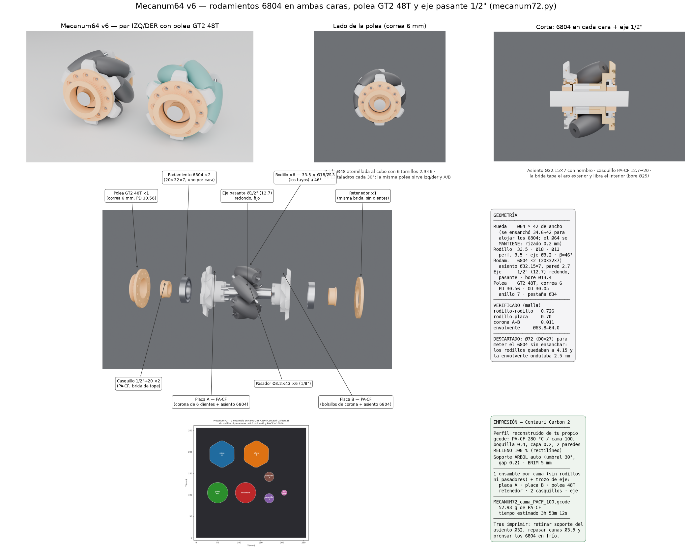

# Mecanum64 v6 — rodamientos 6804 en ambas caras, polea GT2 48T y eje pasante 1/2"

Evolución de la v5 (`docs/analisis/mecanum50/`) para montar sobre **eje pasante
redondo de 1/2" (12.7 mm)**, girando sobre **dos rodamientos 6804 (20×32×7)**,
uno insertado en cada cara, y accionada por **polea GT2 de 48 dientes para
correa de 6 mm** atornillada sobre el costado.

Todo lo aprobado en la v5 se conserva: rodillos existentes (33.5 · Ø18 · Ø13,
perforación 3.5, pasador Ø3.2 = 1/8") a β=46°, estrella de 6 brazos con filetes
r≥10 cóncavos / r3 convexos, bombeo lateral, corona almenada de 6 dientes y los
4 pernos que la cosen.

## La decisión de fondo: ancho en vez de diámetro

El 6804 pide un asiento Ø32 × 7 en cada cara, y ese asiento necesita un cubo de
Ø42 con pared. Hay dos formas de conseguir ese espacio:

| Camino | Resultado | Veredicto |
|---|---|---|
| Subir el diámetro a Ø72 (d0 = 27) | los rodillos quedan a **4.15 mm** entre sí y la envolvente ondula **Ø69.5–72.0 (2.5 mm)** | **descartado**: se pierde la rodadura suave |
| Mantener Ø64 y ensanchar 34.6 → **42 mm** | rodillos a **0.73 mm**, envolvente **Ø63.8–64.0 (0.2 mm)** | **elegido** |

A z = −14 (fondo del asiento con semiancho 21) el radio libre bajo los rodillos
es 18.78, que deja **2.7 mm de pared** sobre el asiento Ø32.15. Los rodillos
terminan en |z| = 16.56, así que el resto del cubo queda completamente libre.

## Tren de rodadura

- **Asiento**: Ø32.15 × 7 abierto a la cara, con hombro anular de 2 mm contra el
  aro exterior y alivio Ø28 × 0.7 para que el aro interior no roce.
- **Bore pasante Ø13.4** por los tambores centrales: el eje de 12.7 no toca la
  rueda en ningún punto, solo los rodamientos.
- **Casquillos PA-CF 12.7 → 20** (Ø19.9 × 7 + brida Ø22 × 1.2), uno por cara:
  adaptan el eje de 1/2" al bore de 20 del 6804 y fijan la posición axial contra
  el aro interior.
- **Polea y retenedor** hacen de tapa: su bore Ø25 cubre el aro exterior
  (lo retiene axialmente) y libra el interior.

## Polea GT2 48T (correa 6 mm)

Disco-brida Ø48 × 3 + anillo dentado de 7 mm (Ø primitivo 30.56, Ø exterior
30.05, perfil GT2 con holgura) + pestaña Ø34 × 1.2 con chaflán a 45° para que
imprima sin soporte con la brida apoyada en la cama. La correa queda contenida
entre el disco Ø48 y la pestaña Ø34.

El **retenedor** de la otra cara es la misma brida sin dientes: cierra el
rodamiento y equilibra el conjunto.

Ambas piezas llevan **12 taladros cada 30° en r = 19**, de modo que la misma
polea sirve para placa A o B y para rueda izquierda o derecha; se fijan con
**6 tornillos 2.9×6** en pilotos Ø2.5 × 4.4 del cubo. El par de la correa a
r = 19 con 6 tornillos es despreciable frente a su resistencia al corte.

## Secuencia de montaje

1. Pasador Ø3.2×43 dentro de cada rodillo; los 6 conjuntos a las cunas ciegas de A.
2. Placa B baja: sus cunas capturan los extremos y sus bolsillos reciben los
   6 dientes de la corona de A → giro bloqueado.
3. 4 pernos 2.9×20 desde el fondo del asiento de A (accesibles por el hueco
   Ø32 antes de poner el rodamiento) → axial bloqueado.
4. Prensar un 6804 en cada cara hasta el hombro.
5. Atornillar la polea en una cara y el retenedor en la otra (6 tornillos 2.9×6
   cada una).
6. Meter un casquillo por cada lado y pasar el eje de 1/2"; fijar la posición
   con collarines contra las bridas de los casquillos.

## Verificación numérica (mallas)

rodillo-rodillo 0.726 · rodillo-placa 0.70 · interferencia rodillo-placa 0.00 ·
corona A↔B 0.011 (topan, no interfieren) · envolvente Ø63.8–64.0 ·
placas 13.7 / 12.9 cm³ · polea 5.4 · retenedor 3.4 · casquillo 1.6.

## Impresión — Elegoo Centauri Carbon 2

Perfil reconstruido del propio gcode de Sergio (`ElegooSlicer` →
"0.20mm Standard @Elegoo CC2 0.4 nozzle" + "Generic PA-CF @System"):
boquilla 0.4, capa 0.2, 2 paredes, 280 °C / cama 100 °C, PEI texturizado,
retracción 0.8 @ 30, caudal máx. 8 mm³/s. Sobre esa base se cambió a
**relleno 100 % rectilíneo**, **soporte árbol automático** (umbral 30°,
separación 0.2) y **brim de 5 mm**.

`MECANUM72_cama_PACF_100.gcode` trae **un ensamble completo en una cama**
(sin rodillos ni pasadores) más un trozo de eje de prueba:
placa A, placa B, polea 48T, retenedor, 2 casquillos y eje Ø12.7 × 60.

- Material: **52.9 g** de PA-CF · tiempo estimado **3 h 53 min**.
- Las placas van con la cara exterior sobre la cama; el soporte solo entra en
  el hueco del rodamiento y bajo los tetones.
- Tras imprimir: retirar el soporte del asiento Ø32, repasar las cunas con
  broca Ø3.5 y prensar los rodamientos en frío.

> Nota: si "boquilla 0.2" se refiere literalmente a una tobera de 0.2 mm, el
> PA-CF no puede imprimirse con ella — las fibras de carbono (50–150 µm) la
> obstruyen; el fabricante especifica 0.4 mm endurecida como mínimo. El gcode
> entregado usa tu boquilla 0.4 con capa de 0.2, igual que el archivo que
> enviaste, y con el relleno al 100 % que pediste.

## Comprar por rueda

| Pieza | Cantidad |
|---|---|
| Rodamiento 6804 (20×32×7) | 2 |
| Varilla Ø3.2 (1/8") × 43 | 6 |
| Tornillo rosca-plástico 2.9×20 | 4 |
| Tornillo rosca-plástico 2.9×6 | 12 |
| Eje redondo 1/2" (acero) | según robot |
| Correa GT2 6 mm | según robot |

## Reproducir

```bash
python docs/analisis/mecanum72/mecanum72.py               # piezas STEP + STL (izq y der)
python docs/analisis/mecanum72/mec72_cama.py              # cama: STL posicionados + 3MF
python docs/analisis/mecanum72/mec72_perfil_cc2.py        # perfil de corte cc2_pacf_100.ini
prusa-slicer --load cc2_pacf_100.ini --dont-arrange --merge \
  --export-gcode -o MECANUM72_cama_PACF_100.gcode bed_*.stl
```

En el repositorio se guarda solo el ensamble izquierdo; el derecho y los STL de
cama se regeneran con los dos primeros comandos.


