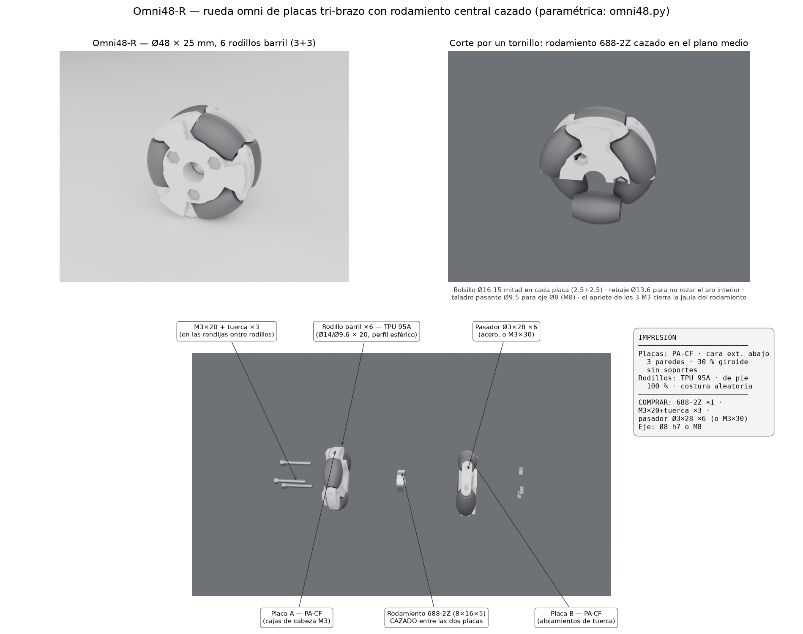

# Omni48-R — rueda omni compacta con rodamiento central cazado

Réplica paramétrica de la rueda omni comercial de Ø48 (dos placas tri-brazo,
3 rodillos barril por fila, 6 en total) con la mejora pedida: **un rodamiento
688-2Z (8×16×5) cazado en el plano medio, atrapado entre las dos placas** al
atornillarlas (la comercial solo tiene un taladro hexagonal liso).

Generador: `omni48.py` (CadQuery). Ensamble completo posicionado en
`omni48_ensamble.step`; piezas sueltas en `omni48_placa_A/B` y `omni48_rodillo`
(.step + .stl). Lámina: `OMNI48R_lamina.png`.

## Dimensiones y arquitectura (paramétricas)

| Elemento | Valor |
|---|---|
| Rueda | Ø48 × 25 mm |
| Rodillos | 6 (3+3 a 60°), barril Ø14 centro / Ø9.6 extremos × 20, taladro Ø3.3 |
| Perfil de barril | **esférico**: ρ(t)=√(R²−t²)−d con d=17 → la silueta queda exactamente en R=24 y las coronas de extremo también → rodadura sin ondulación |
| Ejes de rodillo | pasador Ø3×28 (o M3×30), pórtico entre tetones de los brazos |
| Rodamiento | 688-2Z en bolsillo Ø16.15, 2.5 mm en cada placa (cazado), rebaje Ø13.6×0.45 para no rozar aro interior/escudo; taladro pasante Ø9.5 (eje Ø8/M8) |
| Unión | 3× M3×20 + tuerca en r10.5, ángulos 30/150/270 (las 6 rendijas entre rodillos son los únicos pasos libres); caja de cabeza en placa A, tuerca cautiva en placa B |
| Holgura rodillo-placa | 0.8 nominal (0.70 verificada en malla) |

## Verificación geométrica realizada

- Envolvente de rodadura: 24.00 mm exactos sobre los arcos de rodillo (±24.6°
  por rodillo); en las 6 rendijas el contacto pivota sobre los puntos de corona
  de los extremos, que también están a 24.00 → altura de centro constante.
- Sin penetraciones placa-rodillo (holgura mínima 0.70 mm muestreada).
- Tornillería alineada A↔B (30/150/270 en ambas placas).

## Impresión

| Pieza | Material | Orientación | Parámetros |
|---|---|---|---|
| Placa A y B | PA-CF | cara exterior contra la cama (bolsillo del rodamiento hacia arriba) | 3 paredes, 30 % giroide, sin soportes |
| Rodillo ×6 | TPU 95A | de pie (eje vertical) | 100 %, costura aleatoria |

Comprados: 688-2Z ×1, M3×20 + tuerca ×3, pasador Ø3×28 ×6 (varilla de acero;
alternativa M3×30 con autoblocante), eje Ø8 h7 o tornillo M8.

Notas: los taladros Ø3.2 de los pasadores son horizontales en impresión (Ø
pequeño, imprimen bien); repasar con broca Ø3 si el pasador entra duro. El
apriete de los M3 a mano (≤0.6 N·m) — cierran la jaula del rodamiento y no
necesitan más.

