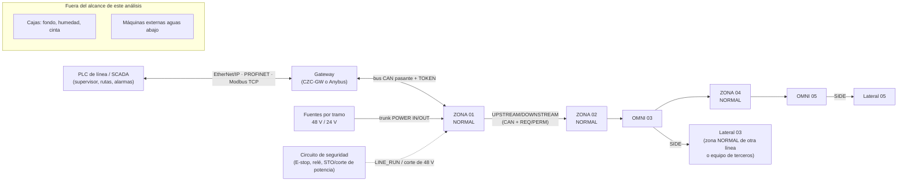
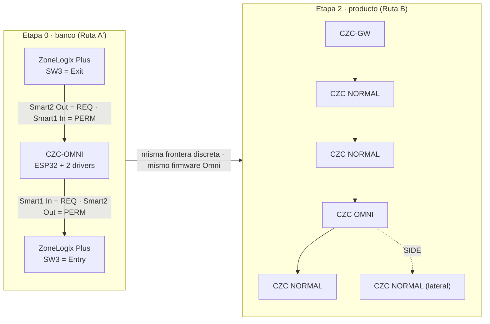
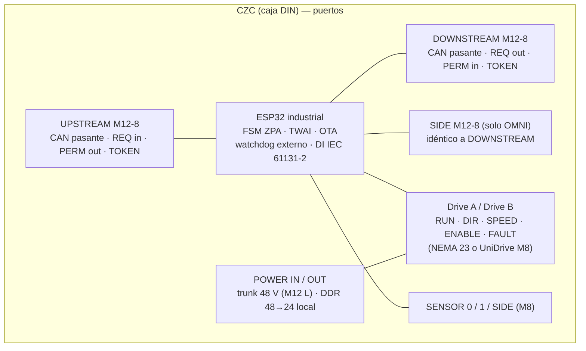
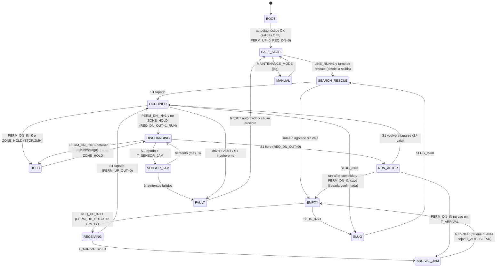
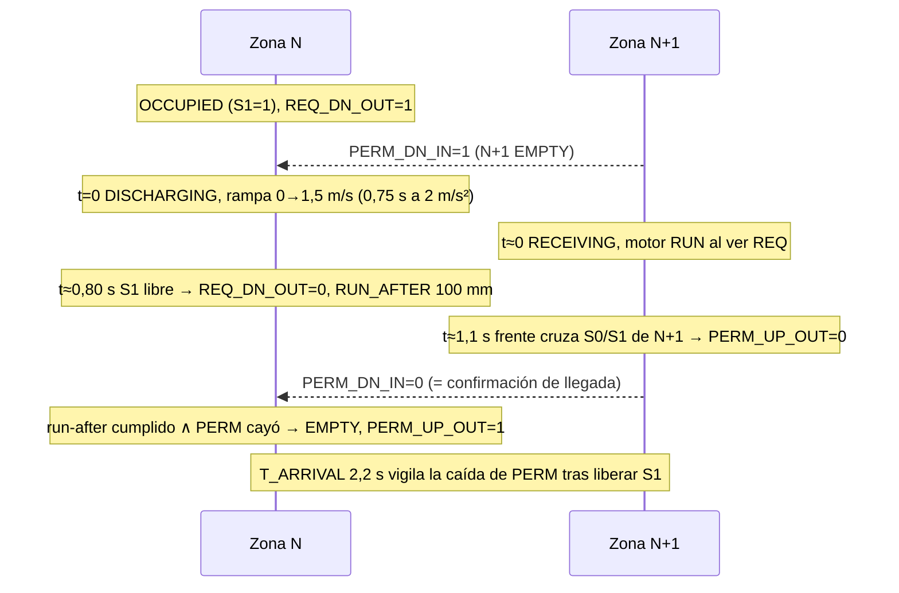

# CONVEYONE-OMNI-ZPA — Análisis conceptual (replanteamiento completo)

**Proyecto:** CONVEYONE-OMNI-ZPA · **Fecha:** 2026-09-03 · **Revisión:** 0 (análisis conceptual) · **Capa:** `user` (ingeniería conceptual, sin fotos ni geometría medida)

**Documento rector:** `input/HANDOFF_2026-09-03.md` (Sergio Contreras, Conveyone) · **Memoria mecánica:** `input/ref/Omniwheel_Memoria_Calculo_Transmision_REV_B.pdf` · **Hechos externos:** `input/web_facts.json` (522 hechos con URL, fecha de acceso y cita) · **Anexos:** `out/analisis/`

**Método.** Seis investigaciones web independientes (ecosistemas ZPA, diverters comerciales, motores y drivers, potencia y seguridad, controladores DIN, tribología y normas) alimentaron seis "lentes" de análisis (control, lógica ZPA, física, mecánica, accionamiento, potencia/seguridad), cada una con cálculos reproducibles en `out/analisis/calc/`. Este documento es la síntesis: replantea el problema desde los requisitos, audita las propuestas previas (ChatGPT, REV B, Bloque OMNI v4) como propuestas y no como decisiones, y separa en todo momento lo **medido/calculado**, lo **citado** (web) y lo **declarado** (usuario).

---

## 0. Resumen ejecutivo

Lo que cambia el rumbo, con números:

1. **La velocidad de diseño de la zona Omni debe ser 1,0 m/s, no 1,5 m/s.** Una caja de 500 mm en una zona de 598 mm deja 98 mm de ventana para detenerse. El lecho mecanum solo puede frenar con a_max = μ·g/√2 − μr·g = 1,8–3,2 m/s² (μ = 0,3–0,5): desde 1,5 m/s recorre 354–630 mm y **sale de la zona** salvo que la zona anterior frene sus rodillos coordinadamente y el frenado empiece con el frente a menos de 120 mm; desde 1,0 m/s se contiene con la zona anterior en rueda libre. Además los motores UniDrive One de las zonas normales topan en 0,92–1,25 m/s. 1,5 m/s queda como velocidad de **paso recto** (sin aterrizar) si el motor la valida. Esto satisface "por lo menos 1 m/s" (prompt 1) y explica por qué 1,5 m/s (REV B) no es compatible con desviar cajas de 500 mm en zonas de 24 in.
2. **El lecho ±45° de ejes fijos tiene dos propiedades físicas que ningún documento previo aplicó**: (a) la fricción también actúa a 45°, así que moviliza √2 veces más fricción que fuerza útil (tracción 29 % menor que un lecho de rodillos) y (b) **exige que las dos familias carguen**: una caja apoyada solo en la familia A (fondo pandeado, caja vacía) se va a 45° (modo "diagonal involuntario"), un fallo que no existe en rodillos. La guiñada, en cambio, no es libre: mientras ≥2 ruedas no deslizan la caja no puede girar; el precio de la asimetría A/B es limitar la aceleración de avance/frenado a ≤1,5 m/s² (μ = 0,4) hasta medir μ.
3. **REV B, tal como está, no es construible en el ZP2026**: mide 609,6 mm y la zona mide 598; con rueda Ø50 y polea 28T el dorso de la correa queda 0,5 mm **sobre** el plano de rodadura (no cabe tapa ni guarda); y los tres planos de correa por familia suman ≈168 mm frente a 133,6 mm de zona muerta. El Bloque OMNI v4 del repositorio (misma arquitectura, otros parámetros) ya resuelve los tres puntos. La recomendación es **una sola arquitectura mecánica**: caja tipo Flowsort v4, 8 ejes hex 1/2 in a paso 74,75 en 598 mm, rueda v7 Ø64 con barreno hex 12,85 (sin adaptador de pared 0,65 mm), 6001-2RS en el lado de transmisión, **una correa HTD 5M en serpentín por familia** (51 mm de apilado), motores en placa agnóstica (NEMA 23 hoy, UniDrive/BLDC mañana), tapa con ventanas + tapa ciega como guarda, colisa +0…+3 mm.
4. **Al motor lo dimensiona la inversión de una familia en el desvío, no la caja**: 0,23–0,64 N·m de pura inercia a 1,5 m/s (según masa de rueda y rampa 0,5/0,3 s) frente a 0,14–0,20 N·m de la caja. Envolvente en el eje: 0,45–0,84 N·m. Un NEMA 23 de 3 N·m y 4,2 A entrega 1,1–1,5 N·m de pull-out a 573 rpm **solo a 36–48 V** (a 24 V la inductancia recorta la corriente un 45 %) y ≈1,9 N·m a 382 rpm. **Prototipo**: 23HE45-4204S (con encoder) + DM556T V4.0 a 48 V, 2000 µpasos, rampas S ≥0,5 s, encoder leído por el ESP32 para contar pasos perdidos. **Producto**: P1, el mismo UniDrive One de las zonas normales mandado por su M8 (1,17 m/s a 1:1 con Ø64; 1,5 m/s con multiplicación 1,28–1,64), o P2, NEMA 23 de lazo cerrado a 48 V con chopper si se confirma bus de 48 V y 1,5 m/s.
5. **Control: Ruta C hacia B.** Ruta A (ZoneLogix Plus) solo sirve como banco: la única interfaz oficial es el Smart I/O y cada tarjeta es Entry **o** Exit, así que el patrón OMNI–ZONA–OMNI con una sola zona intermedia no es realizable; el RJ-25 no tiene pinout publicado y no se emula. Ruta D (tarjetas comerciales de 2 motores) no acciona NEMA 23 y necesita PLC para desviar. El CZC propio separa tres capas: **handshake discreto de 4 hilos** (REQ, PERM, TOKEN, LOOP + 0 V, PNP ≥18 V, compatible con Smart I/O), **bus CAN 2.0 a 500 kbit/s pasante** (un nodo apagado no corta la cadena; 15,8 % de carga con 20 zonas) y **potencia por trunk separado**. Direccionamiento por posición con TOKEN físico; puerto SIDE idéntico a DOWNSTREAM para la salida lateral; gateway fuera del lazo (CZC de cabecera → Anybus/módulo certificado).
6. **Lógica: la Omni necesita un sensor de entrada (S0) además del de zona (S1, de haz transversal) y odometría de rueda.** La latencia electrónica (3–5 ms = 3–8 mm) es irrelevante; lo que manda es la rampa (250–560 mm). Aterrizaje por perfil disparado por S0, POSITIONED obligatorio antes de DIVERT y HOLD (por contención, no por paridad), decisión temprana al entrar para no frenar el paso recto, Search & Rescue solo tras LINE_RUN cableado, nunca reversa automática. Ciclo de desvío ≈1,6–1,9 s (≈2000 desvíos/h, como un F-RAT); paso recto 6000/h a 1,0 m/s.
7. **Potencia: una Omni con dos NEMA 23 a 48 V toma 4,3 A continuos (207 W) y 6,3 A de pico (303 W)**; la fuente de 120 W propuesta antes no sirve. El eslabón limitante es el conector pasante M12 L-coded (16 A): **6 zonas normales + 1 Omni por segmento**; 20 zonas = 3 fuentes TDR-960-48 (2 si alimentan al centro). Cada Omni necesita **chopper de freno** (9,6 J por frenado suben el bus por encima de 60 V). El E-stop corta solo el 48 V (lógica viva), PL d Cat 3 con relé bicanal y dos contactores; un corte de categoría 0 **no detiene la caja** (rueda 1,7–3,8 m).
8. **El número que gobierna todo y nadie ha medido: μ rodillo–cartón corrugado.** Ninguna fuente primaria lo da (rango defendible 0,3–0,5). El primer ensayo del proyecto es un plano inclinado con los rodillos reales; el segundo, la caja vacía con fondo pandeado sobre tres ejes.
9. Quedan **12 decisiones que solo Sergio puede tomar** (§13): velocidad, rueda Ø50/Ø64, paso 74,75/76,2, lado de salida, ancho activo, motor de producto, bus 48/24 V, categoría de paro, trifásica, certificación, guías laterales, y si la salida lateral es siempre un CZC.

**Estado de verificación.** Este documento sintetiza seis análisis independientes (física, mecánica, accionamiento, control, lógica ZPA, potencia/seguridad) sobre seis investigaciones web con 522 hechos citados. Los cálculos de cada lente están en scripts Python reproducibles. La ronda de revisión adversarial planificada (tres refutadores por lente) **no llegó a ejecutarse** en esta sesión; los cruces entre lentes que se detectaron (p. ej. la lente lógica atribuía POSITIONED a la paridad y la lente física demostró que la razón es la contención; FISICA_PRIMEROS_PRINCIPIOS sobreestimaba a_max ×1,45) están corregidos aquí. Los números marcados **A VERIFICAR** son supuestos declarados, no datos.

---

## 1. Qué se replantea y con qué insumos

Este documento reinicia la ingeniería del sistema desde los requisitos, como pide el handoff §16: nada de lo propuesto antes (memorias de ChatGPT, arquitecturas de control v1/REV C, diseños del repositorio) se toma como decisión, salvo las condiciones fijadas por el usuario y los datos mecánicos de REV B que él declaró congelados. Cada afirmación lleva su capa de información:

| Capa | Qué es | Dónde vive |
|---|---|---|
| `user` | lo que Sergio fijó: handoff (con sus 6 prompts en bruto), memoria REV B, descripción del proyecto | `input/HANDOFF_2026-09-03.md`, `input/ref/`, `input/descripcion.md` |
| `web` | hechos de catálogos, manuales, normas y patentes, con URL, fecha de acceso (2026-09-03) y cita textual | `input/web_facts.json` (522 hechos) y los seis informes de investigación resumidos en §14 |
| `calculo` | lo derivado aquí con fórmula y números de entrada explícitos, verificado con Python | secciones 3, 5, 7, 8, 9 |

### 1.1 Insumos leídos

1. **Handoff técnico del 2026-09-03** (capa `user`, documento rector).
2. **Memoria de cálculo REV B** (transmisión Omniwheel, ChatGPT): 8 ejes a 76,2 mm, 4 ruedas Ø50 por eje, 400 mm activos, 1,5 m/s, HTD 5M 28T 1:1, hex 1/2 in con puntas Ø12 en 6001-2RS, polea fuera del rodamiento, ≥0,6–0,8 N·m a 573 rpm.
3. **Conversaciones previas con ChatGPT** ("Dimensionar transmisiones Omniwheel" y "Diseñar lógica Omniwheel ZPA"): digeridas íntegramente; se tratan como propuestas a auditar. El PDF "REV C" de control nunca fue capturado.
4. **Diseños existentes en este repositorio**: Bloque OMNI v4 tipo Flowsort sobre el ZP2026 (PR #110: 2 motores UniDrive, Poly-V en serpentín, rodamientos F6801, ruedas mecanum v7 Ø64 impresas, paso 74,75 mm), módulo CV-OMW de ejes perpendiculares (PR #97), TRANSFER-BF21 (PR #100), CELDA3 (PR #103) y ruedas omni v5/v7 (PR #111, #110). El transportador anfitrión ZP2026 está medido en su malla real: paso de rodillos 74,75 mm, zona de 598 mm, interior 533,6 mm, plano de rodadura z = 115,1.
5. **Seis investigaciones web** hechas para este análisis: ecosistemas de control ZPA, desviadores comerciales y literatura, motores y drivers, potencia/comunicación/seguridad, controladores DIN, tribología y reglas de transportadores (≈540 hechos con fuente; los que se usan aquí están en `web_facts.json`).

### 1.2 Contradicciones detectadas entre insumos

| # | Tema | Fuente A | Fuente B | Cómo se resuelve aquí |
|---|---|---|---|---|
| C1 | Velocidad de línea | Prompt 1: "por lo menos un metro por segundo" | REV B y handoff §2: 1,5 m/s tangenciales | La física (§3) muestra que 1,5 m/s es incompatible con contener una caja de 500 mm en una zona de ≈600 mm con margen razonable; se recomienda v_línea = 1,0 m/s de diseño y 1,5 m/s como objetivo de ensayo. Además las zonas normales con UniDrive One llegan como máximo a ≈0,92–1,25 m/s (§5). **Decisión de Sergio.** |
| C2 | Largo del módulo | REV B: 8 ejes a 76,2 mm = 609,6 mm (24 in) | ZP2026 real: zona de 598 mm (8 rodillos a 74,75 mm); Bloque OMNI v4 usa 74,75 | El módulo reemplaza exactamente una zona del ZP2026; el paso debe ser el del anfitrión (74,75) salvo que se rediseñe el bastidor. **Se propone congelar 74,75 × 8 = 598 mm.** |
| C3 | Motor y transmisión de la Omni | REV B: NEMA 23 + HTD 5M 28T/28T 1:1, poleas fuera del rodamiento, 6001-2RS | Bloque OMNI v4 del repo: 2 UniDrive One 24 V, Poly-V PJ en serpentín, F6801 embutidos | Son dos embodiments del mismo concepto. Se recomienda una sola arquitectura mecánica con el accionamiento como parámetro (§4, §5): prototipo con NEMA 23 (condición del usuario), producto con motor del ecosistema del anfitrión si cumple par/velocidad. |
| C4 | Rueda | REV B: rueda china Ø50, cubo hex 14 mm, 4 por eje | Repo: mecanum v7 Ø64 impresa (hex 14,5), omni v5 Ø50 impresa; investigación: no existe mecanum industrial Ø50–65 con hex 14 o 1/2 in | La rueda es el componente menos verificado de todo el sistema (masa, ancho, capacidad, dureza, sentido L/R). **Datos de proveedor obligatorios antes de cotar ejes** (§4). |
| C5 | Ancho activo | REV B: 400 mm activos + 133,4 mm de relleno pasivo hasta 21 in | Prompt 1 y control v1: 21 in útiles; Bloque OMNI v4: 4 filas cargadas a un lado, zona muerta libre 106,8 mm | Se mantiene 400 mm activos cargados a un lado; la franja pasiva condiciona el desvío hacia ese lado (§3.6, §8). |
| C6 | Potencia | Prompt 1: transformadores por caja, distribución trifásica o "PowerLink" | Handoff §10 (hipótesis): 48 VDC motores + 24 VDC control | Se dimensiona en §9 para las dos opciones de accionamiento; 48 V solo se justifica con NEMA 23/servo; con motores 24 V del ecosistema no. |
| C7 | Topología de red | Control v1 (PDF): estrella por switch Ethernet | Prompt 3 y handoff §6: cadena física UPSTREAM/DOWNSTREAM | Condición de producto: cadena. Se resuelve con CAN pasante + handshake discreto (§7); Ethernet solo en el gateway. |
| C8 | Requisito de par del motor | REV B: ≥0,6 N·m continuos a 573 rpm, ideal ≥0,8 | Derivación propia (§3, §5): par de contacto 0,20 N·m + inercia 0,08–0,15 N·m + pérdidas ⇒ 0,35–0,45 N·m a 2 m/s²; el 0,6–0,8 es margen de juicio, no cálculo | Se mantiene 0,6–0,8 como criterio de selección (margen 1,5–2×) pero se explicita su origen. |
| C9 | "NEMA 32" | Prompt 1: "NEMA 23, 32 o 42" | Tamaños estándar: 23, 34, 42 | Se lee NEMA 34. |
| C10 | Reinicio | Handoff §13: "reinicio sin movimiento espontáneo" | Toda la industria ZPA (ZoneLogix, ConveyLinx, Interroll) mueve las zonas al energizar para rescatar cajas ("Search and Rescue") | Se resuelve con habilitación explícita de línea (LINE_RUN) antes de cualquier rescate (§8.6). |

## 2. Requisitos y límites del sistema

### 2.1 Requisitos con su origen

| ID | Requisito | Tipo | Origen |
|---|---|---|---|
| R1 | Línea ZPA modular; zonas normales de rodillos 24 V y zonas Omni que avanzan y desvían a 90° | funcional | handoff §1 |
| R2 | Control distribuido zona a zona; la acumulación y la anticolisión no dependen del PLC ni del gateway | funcional / confiabilidad | handoff §8-A, §9, §13; prompt 1 ("la acumulación no puede fallar") |
| R3 | Instalación física en cadena: cada caja tiene UPSTREAM y DOWNSTREAM; sin estrella a un switch central | producto | handoff §6; prompt 3 |
| R4 | Gateway hacia PLC (EtherNet/IP o PROFINET según cliente); PLC = supervisor y ruteador | integración | handoff §9 |
| R5 | Prototipo rápido: ESP32 industrial DIN + 2 × NEMA 23 con driver básico | prototipo | handoff §1.7; prompt 1 |
| R6 | Zona Omni: 2 familias A/B, 1 motor por familia; modos HOLD/FORWARD/DIVERT L/R/REVERSE; signos parametrizables; inversión solo con paso por cero | funcional | handoff §3 |
| R7 | Sensores mínimos S1 (zona) y S2 (salida lateral disponible); evaluar confirmación real de transferencia | funcional | handoff §4 |
| R8 | Cajas 500×300/5 kg, 300×250/2,5 kg y vacías de 0,5 kg; caja crítica 5 kg | carga | REV B §1; prompt (transmisiones) U3 |
| R9 | Velocidad ≥1,0 m/s (prompt 1) / 1,5 m/s tangenciales (REV B) | rendimiento | ver C1 |
| R10 | Base mecánica REV B: 8 ejes, 4 ruedas Ø50/eje, 400 mm activos, 21 in total, hex 1/2 in, 6001-2RS, HTD 5M 1:1 | mecánica | handoff §2 (declarada "congelada") |
| R11 | Potencia: hipótesis 48 VDC motores / 24 VDC control; nada de PoE para motores; calcular corrientes, caídas, protecciones, regeneración | eléctrico | handoff §10 |
| R12 | Caja eléctrica DIN por Omni, modular, con identificación UPSTREAM/DOWNSTREAM y conectores POWER IN/OUT, SENSOR ZONE/SIDE, MOTOR A/B, PE | producto | handoff §11 |
| R13 | Controlador separado del drive de potencia por interfaz RUN/DIR/SPEED/ENABLE/FAULT | arquitectura | handoff §12 |
| R14 | Watchdog, brownout seguro, salidas OFF en boot, vecino perdido = sin permiso, driver fault = parar ambos, E-stop independiente del ESP32, evaluación de seguridad formal | seguridad | handoff §13 |
| R15 | Compatibilidad con el transportador anfitrión ZP2026 (UniDrive One + ZoneLogix Plus, 21 in, zona 598 mm, plano 115,1) | integración | repositorio (malla medida) |

### 2.2 Límites del sistema



Dentro del alcance: la zona Omni (mecánica, accionamiento, control), el controlador de zona (NORMAL y OMNI), el protocolo UPSTREAM/DOWNSTREAM/SIDE, la distribución de potencia por tramo, el gateway y la seguridad funcional. Fuera del alcance (se toman como condiciones de borde): el transportador ZP2026 salvo su interfaz mecánica y eléctrica; las máquinas externas; el PLC.

---

## 3. Física del lecho Omni

### 3.1 Cinemática y fuerzas

Una rueda mecanum con eje paralelo a y (transversal), periferia a velocidad u en x (avance) y rodillos a ±45°: el rodillo rueda libre perpendicular a su eje ê y **no puede rodar a lo largo de ê**, así que la velocidad relativa caja/periferia proyectada sobre ê es nula. Con ê_A = (1,1)/√2 y ê_B = (1,−1)/√2 y caja sin girar:

```
A:  v_x + v_y = u_A          B:  v_x − v_y = u_B
⇒   v_x = (u_A + u_B)/2 ,    v_y = (u_A − u_B)/2
Fuerza: cada familia empuja SOLO a lo largo de ê  →  F_x = (F_A + F_B)/√2 ,  F_y = (F_A − F_B)/√2
FORWARD (F_y = 0): F_A = F_B = F_req/√2        (= REV B §3)
DIVERT  (F_x = 0): F_A = −F_B = F_req/√2 ; F_y = F_req
```

| Modo | u_A | u_B | v_caja | Rodillos giran a | Observación |
|---|---|---|---|---|---|
| HOLD | 0 | 0 | 0 | 0 | la caja solo puede deslizar a lo largo de ê |
| FORWARD | +u | +u | (u, 0) | 0 (ideal) | componentes y se cancelan |
| REVERSE | −u | −u | (−u, 0) | 0 | servicio |
| DIVERT | +u | −u | (0, u) | **√2·u** | v_lat = u (no 0,5·u); Ø18 → 1500 rpm a 1,0 m/s, 2250 a 1,5 |
| DIAGONAL_A | +u | 0 | (u/2, u/2) | 0,71·u | la familia parada no frena |

### 3.2 Tracción: el factor 1/√2 y el modo de fallo propio del lecho

Por rueda |F_i| ≤ μ·N_i con F_i ∥ ê. Con N_A = N_B = mg/2: F_req,max = μ·mg/√2, luego

**a_max = μ·g/√2 − μr·g** (también al frenar con ruedas bloqueadas: el deslizamiento solo ocurre a lo largo de ê).

| μ rodillo–cartón | a_max lecho mecanum | a_max rodillos planos | parada rodante desde 1,0 / 1,5 m/s |
|---|---|---|---|
| 0,3 | **1,79 m/s²** | 2,65 | 280 / 630 mm |
| 0,4 | **2,48** | 3,63 | 202 / 454 mm |
| 0,5 | **3,17** | 4,61 | 158 / 354 mm |

μ: ninguna fuente primaria da PU/TPU–cartón corrugado; las tablas de trincaje dan 0,3 (papel/cartón–superficie dura) y 0,6–0,8 (papel–goma); Gallagher da PU 0,2–2,5 con "más duro = menor μ". Rulmeca da rodadura cartón–rodillo Ø50 de 0,06 (rígido) a 0,08 (blando), el doble del μr = 0,03 de REV B. La fuerza normal por rueda es ínfima (5 kg/12 contactos = 4,1 N; caja vacía 0,2–0,4 N) frente a 25 kg/rueda de catálogo: **el eje y los rodamientos no son el problema; el contacto sí.**

**Familias desbalanceadas** (número impar de ejes bajo la caja) saturan primero la familia menos cargada: a_max = √2·μ·(N_min/m) − μr·g ⇒ 2,08 m/s² (4A+3B) y **1,56 m/s² (2A+1B, caja de 300 sobre 3 ejes)** con μ = 0,4.

**Fondo no plano — el fallo característico**: si la familia B lleva solo el 15 % del peso, a_max cae a 0,54 m/s²; con 5 %, ≈0; con 0 % la caja obedece solo a A y **se desplaza a 45°** en cuanto se le aplica fuerza. Mitigaciones físicas: paso de eje menor o 5 ruedas por eje (más probabilidad de ≥2 contactos por familia), rodillos blandos (TPU 95A: mayor μ y huella), guías laterales como seguro pasivo. En DIVERT los rodillos Ø18 ruedan a 1500–2250 rpm sobre pasadores Ø3,2: la resistencia lateral μr_lat se estima en 0,1–0,2 (A MEDIR) y puede bajar a_max lateral de 2,5 a 0,8 m/s².

### 3.3 Guiñada y deriva: rígida mientras no desliza; qué cuesta sujetarla

En FORWARD las componentes y de A y B son opuestas y se aplican en centroides distintos: M_yaw = F_req·Δx/2 = 0,437 N·m (5 kg, 2 m/s², Δx = 76,2 mm) → giro **libre** de 22° en 0,5 s. Pero el lecho es rígido en guiñada: para dos ruedas de la misma familia la condición (ω×(r₁−r₂))·ê = 0 fuerza ω = 0 salvo Δx = Δy, que nunca ocurre; **cualquier caja apoyada en ≥2 ruedas sin deslizar no puede girar**. Los 22–50° de los cálculos previos son la cota superior con todos los contactos saturados. En DIVERT el par de paridad es **cero** para patrones simétricos: la paridad afecta al avance y al frenado, no al desvío.

El costo real de sujetar la caja (distribución de fuerzas de mínima energía, primer contacto que desliza, μ = 0,4):

| Caso | Modo | a_max 1er deslizamiento con ω = 0 | a_max ideal |
|---|---|---|---|
| 500×300, 6 ejes (3A+3B) | FORWARD | **1,65 m/s²** | 2,48 |
| ídem | DIVERT | 2,48 | 2,48 |
| 500×300, 7 ejes (4A+3B) | ambos | 2,08 | 2,48 |
| 300×250, 4 ejes (2A+2B) | FORWARD | **1,46** | 2,48 |
| 300×250, 3 ejes (2A+1B) | ambos | 1,56 | 2,48 |

Con μ = 0,3 los valores bajan a 1,0–1,5 (FORWARD) / 1,1–1,8 (DIVERT); el número de ruedas por eje no cambia a_max, solo la robustez. **Hasta medir μ: a ≤ 1,5 m/s² en avance/frenado y ≤ 2,0 m/s² en desvío.** Entre el primer deslizamiento y la saturación total la caja gira progresivamente. Deriva lateral en FORWARD: nula a primer orden; con 4A+3B saturando ≤2 N ⇒ ≈50 mm en 0,5 s → guías laterales. El transitorio de entrada con una sola familia (76/51 ms) es benigno si las velocidades de las zonas están igualadas.

### 3.4 Contención: ¿puede la Omni detener la caja que entra?

Ventana = zona − caja: **98 mm** (598 − 500; 65 ms a 1,5 m/s) / 110 (609,6) / 298 (caja 300). Latencia electrónica 3–5 ms = 3–8 mm, <2 % de la rampa. Tres situaciones físicas:

| Situación | Caja 500 a 1,0 m/s | Caja 500 a 1,5 m/s | Caja 300 |
|---|---|---|---|
| (i) La Omni frena solo cuando la caja está entera dentro (upstream ZoneLogix empujando con run-after) | v_adm = 0,59 / 0,69 / 0,78 m/s (μ 0,3/0,4/0,5): **no** | **no** | v_adm 1,03–1,37: sí |
| (ii) Upstream en rueda libre mientras la caja entra | frente para en 478–546 mm (**dentro**) desde cualquier x₀ | frente para en 626–798 mm (**fuera**, +28…+200) | sí |
| (iii) Aterrizaje coordinado: el upstream frena sus rodillos a la orden (CZC) | sí, iniciando antes de x = 320 mm | solo iniciando antes de x = 120 mm con μ ≥ 0,4 (margen 28 mm = 5 % de dispersión); con μ = 0,3 solo desde x = 0 | sí |

Conclusión: **1,5 m/s de entrada solo es compatible con aterrizaje coordinado (Ruta B/C con CZC en la zona anterior) y μ ≥ 0,4, o con una Omni de dos zonas (1196 mm, ventana 696 mm ⇒ v_adm ≈ 1,8 m/s)**; 1,0 m/s es compatible con upstream en rueda libre o coordinado; ≤0,7 m/s con cualquier upstream. Una alternativa dentro de la Ruta A es que la Omni ordene al ZoneLogix anterior bajar la velocidad (entrada 0–10 V) cuando la caja va a aterrizar.

**POSITIONED es necesario antes de DIVERT y HOLD, por contención**: cualquier parte de la caja apoyada en rodillos planos de la zona vecina tiene fricción lateral completa y actúa como freno excéntrico (20 % del peso fuera ⇒ 3,9 N contra 11,5 N disponibles, par ≈1 N·m: la caja gira sobre el borde). Para paso recto no hace falta ni parar ni centrar. Posición objetivo: frente en 549 ± 49 mm (zona 598).

### 3.5 Tiempos de desvío y ritmo

Recorrido lateral hasta que la caja abandona el cuerpo activo de 400 mm: (400 + W)/2 = 350 (W = 300) / 325 (W = 250); si la salida está por el lado de la franja pasiva de 133 mm, +133 mm que la caja recorre **deslizando sobre rodillos que no ruedan en y** y en los que puede quedar detenida (recorrido por inercia 62–127 mm a 0,7–1,0 m/s). Con a ≤ 2,5 m/s² el perfil es triangular (pico ≤1,1 m/s): pedir 1,5 m/s lateral no acorta nada.

| W caja | Recorrido | v_lat 1,0 · a 2,0 | v_lat 1,0 · a 2,5 |
|---|---|---|---|
| 300 | 350 mm (lado activo) | 0,84 s | 0,75 s |
| 300 | 483 mm (cruza franja) | 0,98 s | 0,88 s |
| 250 | 325 / 458 mm | 0,81 / 0,96 s | 0,72 / 0,86 s |

Ritmo: recepción + aterrizaje 0,7–0,8 s + desvío 0,75–1,0 s + liberación ≈ **1,6–1,9 s ⇒ 1900–2250 cajas/h** desviando todas (F-RAT-NX75: 2250 c/h al 50 %); paso recto 6000/h a 1,0 m/s y 9000/h a 1,5 (caja 500 + hueco 100). Referencias industriales: Interroll HPD 1,4 m/s y 0,3 s por giro de 90°; Flowsort 0,1–1,5 m/s y 0,3 s/180°; ninguno publica aceleración lateral.

### 3.6 Comparación física con las alternativas

| Arquitectura | Ruedas activas | k (a_max = μ·g·k − μr·g) avance / lateral | Fricción movilizada / útil | Guiñada | Motores | Riesgo propio |
|---|---|---|---|---|---|---|
| **Lecho ±45° ejes fijos (REV B / v4)** | todas siempre | **0,71 / 0,71** (0,60 con 4A+3B; 0,47 con 2A+1B) | √2 | rígida si no desliza; par parásito en FORWARD | 2 | **diagonal involuntario**; desgaste de rodillos a 1500–2250 rpm |
| CV-OMW ejes perpendiculares (omnis clásicas, repo PR #97) | media flota por sentido | 0,64 / **0,36** | 1,0 | sin par parásito | 7 en el diseño del repo | tracción de eyección baja |
| TRANSFER-BF21 (omnis giradas, o-rings) | ídem | 0,61 / 0,39 | 1,0 | ídem | 2 | o-rings en serie |
| Rueda pivotante (Flowsort, Interroll HPD, Hytrol SC) | todas, en la dirección de giro | **1,0 / 1,0** | 1,0 | rígida | 2 | torreta, homing cada 50–100 desvíos |
| F-RAT (Itoh) | superficie conmutada | 1,0 / 1,0 | 1,0 | rígida | 3 MDR | mecanismo de elevación |

El lecho ±45° empata o supera en tracción a los de ejes perpendiculares porque usa todas las ruedas siempre, pero paga con √2 de fricción movilizada (desgaste, polvo de cartón; Keek 2021: "the omniwheel experiences slippage more easily") y con la dependencia de ambas familias. La ventaja documentable del lecho fijo: sin posición angular, sin homing, sin juego de torreta. **No hay evidencia externa de un lecho mecanum fijo de 2 motores operando a 1,0–1,5 m/s con cartón**: solo patentes chinas sin datos (Tungray CN111747090A, FDT CN213863900U, Huzhou Xinsheng CN222922403U) y un prototipo académico limitado a 0,2 m/s por deslizamiento.

### 3.7 Ensayos físicos mínimos (capa `measured` del proyecto)

| # | Ensayo | Mide | Criterio |
|---|---|---|---|
| T1 | Plano inclinado (TAPPI T815) rodillo real (PA-CF, TPU 95A, PU comercial) vs cartón seco / 85 % HR / con cinta / con polvo | μ estático y cinético | fija a_max; objetivo μ ≥ 0,4 en seco |
| T2 | Una rueda cargada con 0,3/3/6 N arrastrada a lo largo y a través de ê a 0,3–1,4 m/s | fuerza tangencial máx.; μr_lat del rodillo Ø18 a 1500–2250 rpm | μr_lat ≤ 0,1 |
| T3 | Mini-lecho de 3 ejes (A-B-A), 2 ruedas/eje, célula de carga; cajas 2,5 y 0,5 kg; rampas 0,5–3 m/s² | a de primer deslizamiento; giro (vídeo cenital) | compara con 1,5/1,56 m/s²; giro <2° |
| T4 | Caja vacía con fondo pandeado (calza 2–5 mm bajo una esquina) | aparición del diagonal involuntario | define paso/ruedas/guías |
| T5 | Módulo entre dos zonas: entrada a 0,7/1,0/1,2/1,5 m/s con upstream (a) accionando, (b) libre, (c) frenando | posición de parada del frente | decide velocidad de producto y ruta |
| T6 | Desvío a ambos lados, cajas 300/250, incluido cruce de franja | tiempo, alineación al llegar, cajas detenidas en franja | ≤1,0 s; giro <5°; ninguna en franja |
| T7 | Desajuste de velocidad Omni/vecina ±10/±20 % | fuerza lateral, marcas, giro | tolerancia de velocidad entre zonas |
| T8 | 10⁵ desvíos con caja de 5 kg | desgaste de rodillos/pasadores, polvo, pérdida de μ | μ dentro de ±20 % |

## 4. Arquitectura mecánica

### 4.1 REV B y el Bloque OMNI v4 son la misma arquitectura con seis parámetros en conflicto

| Parámetro | REV B | Bloque OMNI v4 (repo, 02-09) | Veredicto |
|---|---|---|---|
| Paso / largo | 76,2 mm / 609,6 (24 in) | 74,75 / 598 (posiciones exactas de los rodillos retirados) | **598 obligatorio** (una zona); 74,75 recomendado (transición uniforme, familia a 149,5 → correa 440-5M, C = 150,0) |
| Rueda | Ø50 "china", hex 14, 4/eje a paso 100 | v7 Ø64×36,6 impresa PA-CF, hex 14,5, 4/eje a paso 78 | **v7 Ø64** con barreno hex 12,85: única rueda documentada; libera 7 mm bajo el plano; elimina 32 adaptadores |
| Rodamiento | 6001-2RS 12×28×8 en placa | F6801ZZ 12×21×5 embutido en riel de 4 mm | 6001-2RS en el lado de transmisión (L10 >200 000 h con 250 N); F6801 (≈13 000 h con 250 N, C A VERIFICAR) solo en el lado libre |
| Transmisión | HTD 5M 28T/28T, 355 + 445-5M-09, 3 planos, poleas fuera del rodamiento | Poly-V PJ doble Ø40×20 en serpentín | **HTD serpentín de una correa por familia**, poleas de eje ≤24T, tensores en el dorso |
| Motor | 2 × NEMA 23, 48 V | 2 × UniDrive One 24 V reales del ZP2026 | placa de motor **agnóstica** (patrón NEMA 23 y patrón UniDrive/BLDC) |
| Ancho | 400 activos + 133,4 de relleno pasivo | 4 filas + transmisión en y = −160…+220; zona muerta libre 106,8 | 400 activos cargados al lado de **salida** (≤15 mm al larguero) |

### 4.2 Tres incompatibilidades geométricas de REV B (verificadas en `calc_lente_mecanica_v2.py`)

1. **No cabe en la zona**: 609,6 − 598 = +11,6 mm. Con paso 74,75 el eje 1 queda a 37,4 mm del borde y a 74,75 del rodillo vecino (luz Ø64/Ø50 17,8 mm; Ø50/Ø50 24,8).
2. **Dorso de correa sobre el plano de rodadura**: con rueda Ø50 el eje va a z = 90,1; una polea 28T (Dp 44,56) pone el dorso de la correa a z ≈ 115,6, **0,5 mm sobre el plano 115,1**. Ni tapa ni guarda posibles bajo el plano; el "relleno pasivo a nivel" de REV B es incompatible con su propia transmisión. Con Ø50 harían falta poleas ≤20T (Dp 31,8, tensión ×1,4). Con Ø64 (eje a 83,1) sobran 6,5–12,9 mm y la tapa v4 (107,1–110,1) cierra el tren con 3,1 mm de holgura.
3. **Apilado axial**: 3 planos HTD por familia con poleas de catálogo (L 22,5) = 6 planos ≈168 mm > 133,6 mm de zona muerta. Un serpentín de una correa por familia ocupa 51 mm; el Poly-V de v4, 67; un lazo de 3 poleas + correas a extremos, 87.

### 4.3 Otros hallazgos de la auditoría

- **Par de contacto**: REV B usa T = F_fam·r; por balance de potencia T = F_fam·r·cos45 = F_req·r/2 ⇒ REV B sobreestima ×√2 (0,203 vs 0,143 N·m a 2 m/s²; conservador). La inercia de REV B (0,04–0,06 N·m) es coherente (0,056–0,077).
- **Adaptador hex 14 → 1/2 in**: pared de 0,65–0,83 mm; inviable en metal, frágil impreso. Barreno hex 12,85 directo en la v7.
- **Separadores PVC 3/4 SCH40** sobre el hexágono: excéntricos hasta 3,1 mm, sin cota axial precisa (±0,5 × 5 tramos). Sustituir por separadores con barreno hexagonal y collar sobre el Ø12 referido al rodamiento.
- **Hombro Ø12**: 100 N a 15 mm → 8,8 MPa (REV B, verificado); peor caso 200 N a 25 mm con Kt 2,1 → 62 MPa; SF de fatiga ≈3,0 (Su 440 MPa A VERIFICAR con certificado de la barra); radio ≥0,5 mm; puntas torneadas concéntricas al hexágono. Velocidad crítica 3600–3950 rpm (ratio 0,15).
- **Carga radial en el eje del NEMA 23**: con dos correas de REV B ≈102 N a ~25 mm; el rating no consta en las fichas descargadas → serpentín (una polea, 70–90 N a 15 mm) o eje intermedio.
- **Inversiones frecuentes** (cada desvío = 2 inversiones de una familia): HTD no desliza, no exige retensado, pero engrana a 209–267 Hz; Poly-V puede patinar en el pico si la pretensión es baja; o-rings quedan descartados para un tren de 4 ejes en serie con inversión.
- **Integración en el ZP2026**: apoyo en 2 travesaños (pletina 50×6) sobre las pestañas inferiores del larguero (z −82,6) con colisas 9×25 (nivel 115,1 +0…+3; Flowsort recomienda +2 mm sobre TOR); los motores caen en x = ∓37,3, lejos de los travesaños TR_S (±280,2); escalerilla, controlador y fuente del ZP2026 se mueven (v3.2). Masa ≈30 kg; izaje por 4 cáncamos M8.
- **Ruedas comerciales**: no existe mecanum industrial Ø50–65 con cubo hex 14 ni 1/2 in en las fuentes; el salto industrial (AndyMark Ø100, 200 lb/rueda) es incompatible con el paso 74,75. La única rueda documentada es la v7 del usuario; su riesgo real es desgaste/fluencia de rodillos y ruido, no carga (3 N estática).

### 4.4 Decisiones mecánicas recomendadas

| # | Decisión | Justificación | Alternativa |
|---|---|---|---|
| D1 | Largo 598 = una zona; 8 ejes a 74,75 centrados | cabe; transición uniforme; 440-5M | 76,2 dentro de 598 (luz 19,7) para conservar 445-5M |
| D2 | Rueda v7 Ø64 con barreno hex 12,85 | única documentada; libera 7 mm; sin adaptador | Ø50 solo con polea ≤20T y sin tapa a nivel |
| D3 | Eje hex 1/2 in, puntas Ø12×10 torneadas concéntricas, r ≥ 0,5 | REV B = v4; SF ≥ 3 | Ø12 en casquillo (dos ajustes) |
| D4 | 6001-2RS lado transmisión; F6801-2RS o 6001 lado libre; sellado 2RS por polvo | L10 ×10; correa + peso | F6801 ambos lados si Fr ≤ 100 N |
| D5 | Separadores con barreno hexagonal + collar en Ø12 | concentricidad, cota axial, ruido | PVC solo para mesa de pruebas |
| D6 | 4 ruedas/eje; paso transversal 78–100 parámetro; grupo cargado al lado de salida | REV B y v4 coinciden en 4; salida sin cruzar zona muerta | 5 ruedas a 78 si T4 muestra pandeo |
| D7 | Una correa HTD 5M por familia en serpentín, poleas de eje ≤24T, tensores lisos, motor abajo | sin deslizamiento en inversión, sin retensado, 51 mm, cabe bajo tapa con Ø64 | Poly-V PJ serpentín v4 (silencio, stock local) con pretensión calculada |
| D8 | NEMA 23 en placa de 8 mm con colisas 6,5×18 (v4), interfaz de placa agnóstica | condición del usuario; v4 ya la tiene | eje intermedio si la carga radial excede la ficha |
| D9 | Caja tipo Flowsort v4: placas 594×4, travesaños 50×6, colisas 9×25, cáncamos | resuelve nivel, izaje, ajuste, fijación Ø8,2/M8 | placas 6–8 mm con 6001 embutidos |
| D10 | Tapa 3 mm a 107,1–110,1 con ventana por rueda (+2 mm) + tapa ciega desmontable = guarda | v4.1 verificada; ISO 13857 en huecos ≤4 | guarda lateral sobre el larguero (queda sobre el plano) |
| D11 | Sobreelevación nominal +0, colisa 0…+3 | transición rodillo→rueda | fija +2 sin ajuste |
| D12 | Zona muerta: tapa ciega a −5 del plano + guía lateral opcional | evita pisar el tren; contiene la deriva | rodillos pasivos a nivel (imposible con tren debajo en Ø50) |
| D13 | v_diseño 1,0 m/s; 1,5 m/s solo con μ ≥ 0,35 medido y sensor adelantado | parada en 598 con μ = 0,3; par de inversión −45 % | 1,5 con G-M11 aprobado por ensayo |
| D14 | Rampa de inversión t_inv ≥ 0,3 s, parametrizable | 0,28–0,57 N·m de inercia a 1,5 m/s | más corta si el motor medido lo permite |

### 4.5 Compuertas para el CAD paramétrico (el generador aborta si falla)

| Gate | Condición | Verificación |
|---|---|---|
| G-M1 | n = 60·v/(π·D) dentro de la curva del motor con T ≥ T_inversión | curva medida en banco |
| G-M2 | largo 598, 8 ejes; luz rueda–rodillo vecino ≥ 15 mm; luz a TR_S ≥ 5 | CAD |
| G-M3 | tope de rueda = 115,1 + (0…+3) ajustable | colisas; regla en sitio |
| G-M4 | dorso de correa/polea ≤ tapa − 2 mm; tapa ≤ 115,1 − 5 | CAD |
| G-M5 | Σ planos + placa + guarda ≤ zona muerta disponible | CAD |
| G-M6 | Fr en eje de motor ≤ rating de ficha a la distancia real | ficha o eje intermedio |
| G-M7 | L10 ≥ 20 000 h con la tensión real | cálculo con C de catálogo |
| G-M8 | hombro Ø12: SF fatiga ≥ 3 con Kf ≥ 2; r ≥ 0,5 | cálculo + plano |
| G-M9 | coplanaridad de poleas ≤ 0,5 mm; abrazo ≥ 6 dientes | CAD + montaje |
| G-M10 | ruedas: TIR ≤ 0,5 mm; cota axial ±0,5 | separadores hex + collar |
| G-M11 | v²/(2·a_max) + v·t_lat ≤ 598 − margen, con μ **medido** | T1 + FAT |
| G-M12 | T_caja + T_inercia(t_inv) ≤ T_motor(n)/1,5 | masa de rueda medida |
| G-M13 | hueco rueda–ventana ≤ 4 mm ó ≥ 25 mm; material entre ventanas ≥ 10 mm | CAD |
| G-M14 | aberturas de tapa ciega/guarda según ISO 13857 | plano |

### 4.6 Datos de proveedor o del usuario que faltan

Masa real de la rueda v7 completa y material/dureza de sus rodillos; μ rodillo–cartón medido; carga radial admisible del NEMA 23 elegido; C y C0 del F6801 y del 6001 comprado; certificado de la barra hex 1/2 in; espesor real de la correa HTD 5M y dimensiones de poleas 20–28T disponibles en Chile; posición del sensor de zona del ZP2026; y, si se mantiene la rueda china Ø50, su modelo, ancho, cubo, carga y sentido L/R (ninguna fuente la identifica).

## 5. Accionamiento

### 5.1 Puntos de operación y par requerido

| Rueda | v | n eje | kpps (2000 µpasos) |
|---|---|---|---|
| Ø50 | 1,0 / 1,5 m/s | 382 / 573 rpm | 12,7 / 19,1 |
| Ø64 (v7) | 1,0 / 1,5 m/s | 298 / 448 rpm | 9,9 / 14,9 |

**Lo que dimensiona el motor es la inversión de una familia en DIVERT** (de +v a −v mientras la caja desliza), no la caja:

| Componente de par en el eje (1:1) | Valor |
|---|---|
| Caja 5 kg a 2 m/s² (REV B 0,203; físico 0,143 Ø50 / 0,184 Ø64) | 0,14–0,20 N·m |
| Inercia de 16 ruedas + 4 ejes + poleas + rotor: J_fam = 0,89–1,8·10⁻³ kg·m² | 0,056–0,128 N·m a 2 m/s² |
| **Inversión ±1,5 m/s en 0,5 / 0,3 s** | **0,23–0,39 / 0,39–0,64 N·m** (±1,0 m/s: 0,15–0,26 / 0,26–0,43) |
| Perturbación máxima de una caja deslizando (limitada por fricción, μ 0,3–0,8) | 0,13–0,35 N·m |
| **Envolvente en el eje** | **0,45 N·m** (Ø50, rueda 100 g, rampa 0,5 s) **a 0,84 N·m** (Ø64, 150 g, 0,3 s) |

Con pérdidas de correa (η ≈ 0,9, supuesto) y margen ×1,5–2 para stepper: pull-out requerido 0,7–1,0 N·m (rueda ligera, rampa 0,5 s) a 1,3–1,9 N·m (rueda pesada, 0,3 s). El criterio REV B "≥0,6, ideal ≥0,8 N·m a 573 rpm" es el primer caso sin margen ×2: se mantiene como envolvente.

### 5.2 Por qué la tensión de bus decide el par del stepper

Modelo del 23HS45-4204S (R 0,88 Ω, L 3,4 mH): a 573 rpm la frecuencia eléctrica es 478 Hz y X = ω·L = 10,2 Ω ⇒ I_max ≈ **2,3 A a 24 V, 3,5 A a 36 V, 4,7 A a 48 V** (limitada a 4,2 por el driver); L/R = 3,9 ms ≫ 0,52 ms por paso. Confirmado por curva oficial: 23HS30-2804S a 600 rpm pasa de 0,88 N·m (36 V) a 1,12 (48 V). **A 24 V un NEMA 23 a 573 rpm pierde ~45 % de par; a 382 rpm cumple justo.** Pull-out a 573 rpm de la clase 2–3 N·m/4,2 A: 1,1–1,5 N·m (23HE45 36 V ≈1,4; 57CM23 48 V ≈1,45; CS-M22323 48 V ≈1,7; NEMA 34 34HE46 + CL86T 48 V 1,85–2,0); a 382 rpm ≈1,9–2,0. El 23HS45-4204S **no tiene curva oficial a 48 V ni sobre 420 rpm**. Elegir la versión de baja inductancia (4,2 A, ≤3,5 mH), no la de 3 A/2,9 N·m que se vende en Chile.

Relación 1:1 es correcta para stepper: entre 300 y 600 rpm el producto T·n ≈ 720–830 N·m·rpm (≈80 W de pull-out), el par en el eje no cambia con la relación; una reducción solo baja la inercia reflejada a costa de extrapolar la curva a 900 rpm y 30 kpps. Para servos de 3000 rpm sí conviene 2,3–5:1.

### 5.3 Matriz de decisión (resumen; la tabla completa de 12 opciones está en `lente_accionamiento.md`)

| Opción | Bus | T en eje @573 rpm | Diagnóstico | Chile | Veredicto |
|---|---|---|---|---|---|
| NEMA 23 open-loop 3 N·m 4,2 A + DM556T | 36–48 V | 1,3–1,4 pull-out (36 V); sin curva 48 V | ALM solo sobrecorriente/tensión; no detecta pasos perdidos | sí (AFEL: DM556 $16.000, NEMA 23 4 A $49.990) | **prototipo** (margen 1,5–1,8× sobre 0,8); no certificable |
| NEMA 23 closed-loop 23HE45 + CL57T/CL57RS | 24–48 V | ≈1,3–1,7 | following error, ALM, RS485 (RS) | parcial | **producto P2** con bus 48 V |
| NEMA 34 closed-loop 34HE46 + CL86T | 48–60 V | 1,85–2,0 (curva oficial) | ídem | no | reserva (rueda pesada + rampa 0,3 s) |
| Servo integrado 48 V 400 W | 30–60 V | 1,27 nominal (1:1) | encoder 17 bit, ALM, bus | no | sobredimensionado en rpm, 2× costo |
| **UniDrive One 24 V 60 W por M8** (el mismo de las zonas) | 24 V | 1,42 nominal / 2,5 arranque a 1:1 → 0,92 (Ø50) / **1,17 m/s (Ø64)**; ×1,64 → 0,87 N·m y 1,5 m/s | FAULT open-collector | ya en inventario | **producto P1** si se acepta 1,0–1,2 m/s o rueda Ø64; 25 arranques/min y rampa 0,6–1 s A VERIFICAR con ACG |
| UD100 + ZoneLogix Plus en Basic Motor Control | 24 V | 1,53; 1,47 m/s a 1:1 (Ø50) | pin "motor running" | canal ACG | dirección dinámica en BMC **no documentada** → depende de ACG |
| UniDrive CORE 48 V 120 W (sin electrónica) | 48 V | 1,53 (700 rpm) | ninguno a bordo | no | solo con driver BLDC propio |
| Interroll EC5000 48 V 50 W 9:1 + DriveControl 2048 | 48 V | 0,57 nominal / 1,42 aceleración | pin error; **chopper integrado** | Brasil | producto industrial 48 V (P3) |
| Pulseroller PGD-Ai-48 + ConveyLinx-Ai2-48 | 48 V | 0,68 nominal / 1,67 holding | red completa | "Sudamérica" | precedente Flowsort; exige maestro Modbus |

### 5.4 Especificación del prototipo (respeta NEMA 23 + driver básico + ESP32)

| Elemento | Especificación |
|---|---|
| Motor | NEMA 23 3 N·m, 4,2 A/fase, ≤3,5 mH, cuerpo 113 mm; preferible **23HE45-4204S** con encoder 1000 ppr (€20,95) o equivalente local de 4,2 A |
| Driver | **DM556T V4.0** (ALM, 20–50 V, 4,2 A pico, idle 50 %, 2000 µpasos → 19,1 kpps a 573 rpm); verificar que el DM556 de AFEL sea la versión con ALM |
| Tensión | **48 V** ajustada a 48,0 V (SDR-480-48 o fuente 48 V ≥240 W por Omni); e-fuse 6 A por driver (ESX10-TC DC48V) |
| Rampas | perfil S en el ESP32 (RMT/MCPWM, capacidad A VERIFICAR en la placa DIN): 0→573 rpm en ≥0,5 s; inversión decel ≥0,5 s → 50 ms a cero → accel ≥0,5 s |
| Regeneración | osciloscopio en el bus durante inversiones; si V_bus > 56 V, chopper 52–54 V (§9.4) |
| Encoder | leído por el ESP32 desde el primer día: |pos_encoder − pos_comandada| > umbral ⇒ FAULT ("lazo abierto supervisado") |
| Ensayo de curva par-rpm (capa `measured`) | freno de cuerda sobre tambor Ø50 con dos dinamómetros a 24/36/48 V y 200–700 rpm hasta pérdida de sincronismo, en frío y a 70 °C de carcasa; 100 inversiones ±573 rpm con t_inv 1,0/0,5/0,3 s contando pasos perdidos (criterio: 0 en 100 ciclos a 0,5 s); caja de 5 kg entrando a 1,5 m/s sobre familia detenida y sobre familia a −573 rpm (pasos perdidos, corriente de bus, V_bus pico); 1 h continua a 573 rpm con 0,4 N·m |

Si el ensayo da <1,0 N·m a 573 rpm/48 V o pierde pasos con 0,5 s: pasar a CL57T (mismo motor) o reducir la Omni a 1,0–1,2 m/s.

### 5.5 Producto

- **P1 — un solo ecosistema 24 V (Rutas A/C/B)**: UniDrive One en la Omni mandado por el CZC por M8 (SPEED 2,3–10 V, DIR <4/>7 V, FAULT; +24 V por relé de seguridad = ENABLE). 1:1 con Ø64 → 1,17 m/s y 1,42 N·m continuos (2,82 de arranque); multiplicación 1,28–1,64 para 1,5 m/s (0,87–1,11 N·m; el Bloque v4 ya usa 1,7). Exige confirmar con ACG: arranques/min (la especificación dice 25/min al límite de corriente; un desvío son 4 eventos por familia → 10 cajas/min al 50 % = 30/min), rampa interna con mando directo, freno/regeneración a 24 V, precio. Ventaja decisiva: mismo repuesto, misma fuente, mismo cable, sin driver stepper, sin EMC de chopper.
- **P2 — bus 48 V y 1,5 m/s**: 23HE45-4204S + CL57RS (Modbus para diagnóstico) o CL57T-V41, 48 V, chopper por caja, following-error → FAULT; ≈€55–105 por eje; escalable a NEMA 34 + CL86T sin cambiar lógica ni protocolo.
- **P3 — MDR industrial 48 V**: EC5000 48 V 50 W 9:1 + DriveControl 2048 (chopper, DIR + velocidades discretas) o MultiControl; par nominal justo (0,57–0,76 N·m) con 2,5× en aceleración; sin canal en Chile.

Regeneración (todas las opciones a 48 V): cada desvío devuelve 4–10 J; 2 J bastan para pasar de 48 a 60 V con 3 mF; los drivers stepper/servo consultados disparan sobretensión a 60 V (DM556T, iSV) u 80 V (JMC) y ninguno trae resistencia de freno; Interroll exige chopper (MultiControl 52 V; DriveControl 2048 integrado). Corriente pico de bus: stepper ninguna (corriente controlada) — es su ventaja para el balance; MDR 2,2–2,5× nominal en arranque.

---

## 6. Arquitectura de control: comparación formal de rutas

### 6.1 Hechos que gobiernan la decisión (capa `web`)

| # | Hecho | Fuente |
|---|---|---|
| H1 | "UniDrive" y "ZoneLogix" son de Automation Controls Group (ACG, Milwaukee Electronics). **ZoneLogix Plus/UL/301216: 1 motor por tarjeta, 24 V (22–28 V), sin red**; puertos UPSTREAM/DOWNSTREAM RJ-25 de 6 hilos que "pass request and permission signals between adjacent zones"; **pinout eléctrico no publicado**. | manual UL 301622 (ACG); ManualsLib 2998685 |
| H2 | Interfaz oficial hacia equipos ajenos: **Smart I/O** PNP 24 V (activo ≥18 V, salidas 500 mA). Zona Entry: Smart 1 In = *request*, Smart 2 Out = *permission* ("the zone is empty and ready to receive a parcel"); zona Exit: Smart 1 In = *permission*, Smart 2 Out = *request*; "when permission is removed the zone will attempt to stop any discharge". El rol lo fija el DIP SW3: **una tarjeta es Entry o Exit, no ambas**; en zona intermedia "do not connect anything to the Smart I/O". | ídem |
| H3 | Modo **Basic Motor Control**: SW3 ON + sensor puenteado + Slug In = marcha/paro ⇒ la tarjeta se degrada a driver básico. **Zone Hold** y **Search and Rescue** (al energizar cada zona corre 2,5 s) documentados. | ídem |
| H4 | **UniDrive One**: BLDC 24 V, 60 W, 70–350 rpm, 14 in·lbf (1,58 N·m) continuos, 2 A nominal / 4 A stall, conector **M8 de 5 pines analógico** (+24 V, DIR <4 V/>7 V, GND, FALLA colector abierto, VELOCIDAD 2,3–10 V; 0–2,2 V = freno ZMH). ACG declara que lo manejan Interroll DriveControl/ZPA Control/MultiControl, P+F G20 y B+W BWU-4246 ("courtesy"). Mismo pinout que el RollerDrive AI de Interroll y el conector MOT del P+F G20. | ficha S-UD23062200R01 |
| H5 | **ZoneLogix PRO 2.0**: único con red (RJ-45 propio "To EOB/To Master", no Ethernet estándar; Branch Monitor EtherNet/IP o PROFINET, P/N 301123); 1 motor por controlador; motores UD100 115–570 rpm; descubrimiento de rama desde el maestro; firmware y configuración replicados en todas las zonas; Breakout Module 300332 expone el handshake a equipos externos. | guía PRO Rev 1.0; ficha PRO 2.0 |
| H6 | **Pulseroller ConveyLinx-Ai2 / Ai2-48**: 2 motores Senergy-Ai (solo ese motor), switch Ethernet de 3 puertos RJ-45, EtherNet/IP · PROFINET · Modbus TCP · CC-Link IE FB, **auto-configuración desde el módulo más aguas arriba** (hasta 221), ZPA autónoma con confirmación de llegada por red; modo **"PLC I/O" suspende toda la lógica ZPA local** y permite marcha/dirección/velocidad por motor; interfaz con equipos ajenos por pin 2 de los M8 ("Wake Up", "Product on Zone", "Lane Full"). US$604 (Radwell). Flowsort SLD/DLD lo usa con sus 2 motores PGD024. | pulseroller.com; manual ConveyLinx v2.1; manual Flowsort |
| H7 | **Interroll MultiControl AI/BI**: hasta 4 RollerDrive, 24 o 48 V con lógica 24 V separada, switch de 2 puertos M12-D, PROFINET/EtherNet/IP/EtherCAT, **Teach-in** (direccionamiento automático), programas ZPA sin PLC, handshake externo por AUX I/O ("Out Up / In Up / Out Down / In Down"); en modo "I/O device" **no puede arrancar ni parar motores por sí solo**. US$315 (4 zonas). Interroll HPD usa 2 motores en un MultiControl. | manual MultiControl v3.2; suplemento 2018 |
| H8 | **Itoh Denki IB-E03/E04**: 2 motores Power Moller 24 V, EtherNet/IP + DLR, switch 2 puertos, modo Master "stand alone" con lógica ladder propia; F-RAT-NX lo usa. ≈US$658. | manual IB-E |
| H9 | **P+F G20 ZPA**: 2 motores M8, ZPA autónoma, acople de zonas X1/X2 "compatible with the standard 24 V IOs of a PLC"; en "Direct Control" **ambos motores comparten la orden de dirección** (no sirve para A+ B−). | manual tdoct5942c |
| H10 | Ningún ecosistema comercial hallado acciona un NEMA 23. Ninguna placa ESP32 DIN comercial trae dos RJ-45; Espressif mantiene el driver del switch KSZ8863; ESP32-C6 tiene 2 TWAI (CAN) y ESP32-P4 tres; esclavos EtherCAT/PROFINET sobre ESP32 no maduros; módulos certificados Anybus CompactCom 40 / Hilscher netRAPID 90 (precio no público); Anybus Communicator CAN→EtherNet/IP AB7318 US$1.216. | research_controladores_din |
| H11 | CANopen: 127 nodos, 100 m a 500 kbit/s; heartbeat y boot-up definidos; un nodo sin alimentación queda pasivo y el bus sigue. Ethernet en cadena con switch embebido se corta al apagar un nodo salvo relé de bypass o anillo (MRP ≤200 ms para ≤50 nodos). RS-485: 32 UL (256 con 1/8 UL). | CiA 301; TI SLLA272; IEC 62439-2 |
| H12 | Precios de ZoneLogix Plus/PRO y UniDrive One: no publicados. Distribuidores en Chile de ACG, Pulseroller, Interroll e Itoh Denki: no encontrados (Interroll: Brasil/México; Itoh: México; Pulseroller: "North and South America"). | research_ecosistemas_zpa |

### 6.2 Definiciones

- **Ruta A**: ZoneLogix Plus en las zonas normales; zona Omni = controlador propio (CZC-OMNI, ESP32 + 2 drivers) insertada por Smart I/O.
- **Ruta B**: Conveyone Zone Controller (CZC) en todas las zonas, `ZONE_TYPE = NORMAL | OMNI`, protocolo propio UPSTREAM/DOWNSTREAM.
- **Ruta C**: A como banco/transición, B como producto, misma frontera discreta.
- **Ruta D** (no nombrada en el handoff): ecosistema comercial documentado con tarjetas de 2 motores y cadena Ethernet (ConveyLinx-Ai2, MultiControl, IB-E) en todas las zonas, incluida la Omni.

### 6.3 Comparación

| Criterio | A | B | C | D |
|---|---|---|---|---|
| Interfaz oficial disponible | Sí: Smart I/O (H2). Limitación dura: una tarjeta es Entry **o** Exit (SW3) ⇒ el patrón OMNI–ZONA–OMNI con **una sola** zona ZoneLogix entre dos Omnis no es realizable con interfaz documentada (haría falta ≥2 tarjetas entre Omnis o degradarla a BMC) | Propia, definida en §7 hacia el UniDrive One por su M8 (H4) | A + B | Sí (H6–H8), pero ninguna acciona NEMA 23 (H10) y las de 2 motores independientes exigen PLC para desviar (H6, H7): viola R2 en la Omni |
| Documentación del puerto peer-to-peer | RJ-25: no (H1) | se documenta el propio | RJ-25 no se toca | Ethernet estándar documentado |
| Determinismo del handshake | discreto PNP <5 ms del lado CZC; reacción interna de ZoneLogix a retirar permiso: **no publicada** | discreto cableado, <5 ms medible | igual | por Ethernet entre vecinos (ConveyLinx "positive confirmation of carton arrival"); latencia no publicada |
| Direccionamiento por posición | no (DIP) | sí (TOKEN físico, §7.4) | — | ConveyLinx Auto-Config, Interroll Teach-in (H6, H7) |
| Nodo apagado / vecino perdido | Smart 2 Out cae ⇒ sin permiso (seguro); RJ-25 con vecino apagado: no documentado | PERM cae ⇒ seguro; CAN pasa por el nodo apagado (H11) | — | Ethernet en línea se corta tras el nodo apagado salvo lógica alimentada aparte o anillo |
| Firmware sin parar la línea | Plus: no aplica; PRO 2.0 sí | OTA por CAN, slot A/B con rollback, zona a zona (§7.6) | — | EasyRoll / ICE / Interroll |
| Integración PLC | solo vía gateway del CZC; Plus no tiene red | gateway de cabecera | ídem | nativa en cada tarjeta |
| Costo de control por zona | ZoneLogix: no publicado (ya adquirido); CZC-OMNI: placa ≈US$45 + E/S + caja | prototipo ≈US$45 de placa + E/S; producto PCB propia (a cotizar) | A + B | ConveyLinx US$604 (1–2 zonas); MultiControl US$315/4 zonas; IB-E ≈US$329/zona |
| Tiempo de desarrollo | semanas (frontera + firmware Omni) | meses (ZPA completa, recuperación, diagnóstico, HW industrial, certificación) | semanas al banco, meses al producto | semanas para NORMAL; la Omni exige CZC de todos modos |
| Riesgo de confiabilidad industrial | bajo en NORMAL; medio en la frontera (timing no publicado) | alto hasta cumplir la "vara" ConveyLinx/MultiControl (DI IEC 61131-2, watchdog externo, −20…+55 °C, UL/ETL, IP54) | medio | bajo (UL/ETL) |
| Dependencia de proveedor | ACG sin canal en Chile (H12) | ninguna crítica | ACG en transición | Pulseroller/Interroll/Itoh sin canal en Chile (H12) |
| Coherencia con R3 (cadena) | parcial: RJ-25 + Smart I/O | total | parcial → total | total en NORMAL; Omni como isla |
| Cumple R2 en la Omni (ZPA sin PLC) | sí (CZC) | sí | sí | **no** (salvo IB-E 24 V con ladder propio) |

**Veredicto.** A y D fallan cada una en una condición dura: A en el patrón de instalación y en el timing no documentado; D en NEMA 23 y en "sin PLC" para desviar. B es la única que satisface todas las condiciones, al precio del riesgo de confiabilidad. **C lo administra: banco A' con el hardware que ya existe → producto B, con D-parcial como contingencia** (MultiControl 48 V con UniDrive One, que ACG lista como compatible, en zonas normales si un cliente exige tarjetas certificadas antes de que el CZC lo esté; la frontera discreta hacia el CZC-OMNI es la misma).

### 6.4 Recomendación por etapas

| Etapa | Alcance | Hardware | Criterio de salida |
|---|---|---|---|
| 0 — Banco de 3 zonas (Ruta A') | ZoneLogix Plus (SW3 Exit) → CZC-OMNI → ZoneLogix Plus (SW3 Entry) por Smart I/O; RJ-25 sin conectar hacia la Omni; 0 V comunes | placa ESP32 DIN con entradas opto (M5Stack StamPLC o Waveshare ESP32-S3-ETH-8DI-8RO-C), E/S 24 V PNP, 2 × NEMA 23 + driver (§5), handshake discreto solo en la Omni | medir la latencia de ZoneLogix a la retirada de permiso, el Run-On de 2,5 s al arrancar, atascos de llegada y 100 ciclos sin colisión a la velocidad real de los UniDrive (≈0,9–1,25 m/s) |
| 1 — CZC-NORMAL | mismo firmware con `ZONE_TYPE = NORMAL` mandando el UniDrive One por M8 (DIR, SPEED 0–10 V, FALLA); reemplaza un ZoneLogix del banco | misma placa + salida analógica 0–10 V (o PWM filtrado; verificar con la entrada 2,3–10 V del motor) | banco CZC-NORMAL → CZC-OMNI → CZC-NORMAL con CAN y TOKEN; pruebas de fallas de §8.7 |
| 2 — Producto (Ruta B) | PCB propia CZC (ESP32-C6/P4 industrial o MCU equivalente): DI IEC 61131-2 aisladas, watchdog externo, salidas OFF en boot, CAN aislado pasante, 3 puertos M12-8, DDR 48→24, −20…+55 °C; CZC-GW con módulo certificado | requisitos = tabla de "vara" de research_controladores_din §2(f) | FAT NORMAL–OMNI–NORMAL a velocidad objetivo; UL 61010-2-201 / EN 61131-2 según mercado |
| Contingencia (D-parcial) | zonas NORMAL con MultiControl 48 V + UniDrive One o ConveyLinx-Ai2 + Senergy-Ai; CZC solo en Omni, unido por handshake AUX ("In Up/Out Up/In Down/Out Down") o pin 2 M8 | compra | solo si un cliente exige tarjetas certificadas |



## 7. Comunicaciones UPSTREAM/DOWNSTREAM y protocolo de zona

### 7.1 Las tres capas (handoff §8), separadas

| Capa | Medio | Qué transporta | Qué NO transporta |
|---|---|---|---|
| **A — handshake ZPA crítico** | 4 hilos discretos + 0 V común por enlace (PNP 24 V, activo ≥18 V para ser compatible con Smart I/O, P+F X1/X2 y MultiControl AUX) | REQ, PERM, TOKEN, LOOP | nada más; es lo único que decide movimiento |
| **B — datos/supervisión** | bus CAN 2.0B a 500 kbit/s, pasante por cada caja (dos conectores) | estado, eventos, contadores, comandos del gateway, parámetros, firmware, descubrimiento | permisos (los replica solo como información) |
| **C — potencia** | trunk 48 V (o 24 V) IN/OUT en conector separado (M12 L-coded 16 A/63 V DC o bornes push-in) + 24 V local | alimentación de motores y lógica | comunicación |

Respuesta al §11 del handoff: UPSTREAM/DOWNSTREAM llevan **comunicación + handshake (opción 2)**, sin potencia. Los optoacopladores del handshake se alimentan del lado emisor: así "vecino sin energía" ⇒ señal en 0 por física, no por software.

### 7.2 Handshake discreto "CZ-HS v1"

| Señal | Dirección | Significado | Estado seguro (cable roto / vecino apagado) |
|---|---|---|---|
| REQ | N → N+1 | "tengo caja lista para descargar / estoy descargando" | 0 = nada que recibir |
| PERM | N+1 → N | "puedo recibir; mantén la descarga" | 0 = **no descargar** (igual que ZoneLogix "attempt to stop any discharge" y P+F "the motor is stopped") |
| TOKEN | bidireccional (open-drain) | descubrimiento de posición (§7.4); en régimen, presencia de vecino | sin pull ajeno = sin vecino |
| LOOP | puente en el conector macho | "cable conectado", aunque el vecino esté apagado; fin de línea si abierto | abierto = sin cable |
| 0 V | común | referencia; obligatorio unir 0 V de fuentes adyacentes (ZoneLogix: "connect their 0VDC grounds together") | — |

Reglas de semántica, tomadas de los tres ecosistemas documentados para que la Omni sea "otra zona" para cualquiera de ellos: (1) PERM se mantiene hasta que la caja **llega** al sensor del receptor; su flanco de bajada es la confirmación de llegada (P+F/Interroll/ConveyLinx); (2) PERM retirado ⇒ parada inmediata sin run-on; (3) REQ se mantiene hasta que S1 del emisor se libera + run-after propio; (4) **S1 manda sobre el handshake**: una caja que aparece sin REQ (arrastre en el arranque de un ZoneLogix vecino) pasa la zona a OCCUPIED, no a FAULT; (5) timeouts en §8.5.

¿Discreto y además por bus? **Sí, con roles distintos**: el discreto decide, el bus informa. Un permiso transportado por bus exige nodos intermedios vivos y sin errores (y en Ethernet, energizados); el discreto es <5 ms y no tiene modos de fallo de software. Es la misma separación que ZoneLogix PRO hace en su cable ("Branch Serial Communications" + "Handshaking") y ConveyLinx al alimentar la lógica aparte.

### 7.3 Por qué CAN y no RS-485 ni Ethernet en cadena

| Alternativa | Veredicto |
|---|---|
| **CAN 2.0B, 500 kbit/s (elegido)** | multi-maestro, arbitraje por prioridad, errores detectados en hardware, heartbeat/boot-up definidos (CiA 301); nodo apagado = pasivo (transceptor sin alimentación en alta impedancia: verificar en el modelo elegido); 100 m a 500 kbit/s cubre 50 zonas ZP2026 (29,9 m); TWAI nativo en ESP32; gateway CAN→EtherNet/IP/PROFINET de catálogo |
| RS-485 / Modbus RTU | tolera nodo apagado y 256 nodos, pero maestro único ⇒ todo dato vecino-a-vecino transita por el gateway; sin detección de errores en hardware; 1,5 ms por trama a 115 200 bd. Respaldo aceptable |
| Ethernet con switch de 2 puertos por nodo | ninguna placa ESP32 comercial lo trae; un nodo apagado corta la cadena salvo relé de bypass; latencia por salto irrelevante (134 µs en 20 saltos) pero la **disponibilidad** no. Reservado para producto v2 si un cliente exige Ethernet por zona |
| EtherCAT / PROFINET / EtherNet/IP nativos en el nodo | pilas no maduras o con licencia en ESP32; sin conformance. Se resuelve en el gateway |
| CAN-FD | no lo tiene el ESP32; innecesario: carga 15,8 % con 20 zonas (30 tramas/s por zona) |

Números (capa `calculo`): trama CAN de 8 bytes = 132 bits = 0,264 ms a 500 kbit/s; carga con N zonas × (10 heartbeat/s + 20 estados/s) = 7,9 % (10 zonas), 15,8 % (20), 39,6 % (50); 20 zonas ZP2026 = 12,0 m; OTA de 1 MB ≈ 29 s por nodo con 55 % de eficiencia. Recorrido de la caja por latencia a 1,5 m/s: 5 ms = 7,5 mm (handshake discreto), 20 ms = 30 mm (ciclo PLC + red: no puede estar en el lazo), 100 ms = 150 mm (pérdida de gateway tolerable solo si la ZPA es local), 200 ms = 300 mm (reconvergencia MRP = media zona).

Conjunto mínimo de mensajes (ID de 11 bits, prioridad = valor bajo): 0x0xx emergencia (driver fault, 48 V ausente, E-stop informado); 0x1xx heartbeat 100 ms con estado FSM + S0/S1/S2 + REQ/PERM leídos; 0x2xx eventos con contador (llegada, salida, desvío, jam); 0x3xx comandos del gateway (ENABLE_ZONE, ROUTE_MODE, DIVERT_ENABLE, SPEED_PROFILE, RESET_FAULT, MAINTENANCE) con número de secuencia y vigencia; 0x4xx descubrimiento/TOKEN; 0x5xx–0x6xx parámetros y OTA por bloques. Un nodo que deja de recibir heartbeat del gateway más de 1 s conserva la ZPA y bloquea los desvíos que requieran ruta nueva.

### 7.4 Descubrimiento de la secuencia física y direccionamiento por posición

1. Al energizar: salidas OFF, PERM = REQ = 0, CAN sin dirección (ID temporal derivado del número de serie).
2. El gateway (o el nodo cuyo UPSTREAM no tiene cable = cabecera) publica `DISCOVER k=1` y activa TOKEN en su DOWNSTREAM.
3. El nodo que ve TOKEN en su UPSTREAM responde `CLAIM(serie, k, tipo NORMAL/OMNI)`; el gateway le asigna ID = k y su configuración; el nodo propaga TOKEN por su DOWNSTREAM con `DISCOVER k+1`. Un OMNI hace lo mismo por su SIDE con marca de rama (`k.1`): el gateway construye el **grafo**, no solo la lista.
4. El nodo cuyo DOWNSTREAM tiene LOOP abierto se declara fin de línea y activa la terminación CAN; no descarga salvo que se configure como salida a equipo externo (permiso cableado desde la máquina externa, como ZoneLogix Exit).
5. Reemplazo en caliente: el vecino aguas arriba detecta un número de serie nuevo en la misma posición; el gateway repone configuración y firmware (lo mismo que ZoneLogix PRO y ConveyLinx "Module Replacement"). Para que funcione sin gateway, cada nodo guarda la configuración de sus dos vecinos.

La diferencia con Auto-Configuration (ConveyLinx) y Teach-in (Interroll) es que aquí el orden lo prueba una **línea física**: es imposible una numeración incoherente con el cableado.

### 7.5 Pinout propuesto (UPSTREAM / DOWNSTREAM / SIDE, idéntico; cable recto)

M12 de 8 polos A-coded: 1 CAN_H · 2 CAN_L · 3 REQ (sale por DOWNSTREAM, entra por UPSTREAM) · 4 PERM (entra por DOWNSTREAM, sale por UPSTREAM) · 5 TOKEN · 6 0 V · 7–8 LOOP (puente dentro del macho) · blindaje a FE. Terminación CAN de 120 Ω conmutada por el nodo cuando LOOP indica "sin cable" en DOWNSTREAM. **A verificar**: EMC y capacidad del M12-A con CAN + señales de 24 V en el mismo cable (alternativa: M12-A para handshake + M12-A/CiA 303-1 separado para CAN).



### 7.6 Salida lateral como segundo downstream lógico; gateway

- El CZC-OMNI tiene tres puertos de zona: UPSTREAM, DOWNSTREAM y **SIDE**, con el mismo pinout. El transportador lateral empieza con un CZC-NORMAL cuyo UPSTREAM se enchufa en SIDE; para ese CZC la Omni es simplemente su upstream.
- `dest ∈ {DOWN, SIDE}`, cada uno con su par REQ/PERM y su timeout; `RouteMode = STRAIGHT | LEFT | RIGHT | ANY_AVAILABLE | BY_COMMAND`, `DivertPriority = THROUGH_FIRST | SIDE_FIRST`. Sin gateway vale la última ruta cacheada o el `RouteFallback`.
- **S2 "Side Available" deja de ser un sensor y pasa a ser PERM del puerto SIDE** cuando la salida es un CZC. Si la salida es pasiva (mesa, rampa, equipo de terceros), un "adaptador SIDE" lleva S2 (sensor de espacio) y un permiso externo a los mismos pines PERM.
- **Confirmación de transferencia lateral (pregunta 13): sí**, y se obtiene del handshake: flanco de bajada de PERM(SIDE) causado por el S1 del CZC lateral + liberación del S1 transversal de la Omni dentro de T_div. Con salida pasiva solo hay S1 Omni + timeout y el evento se publica como "transferencia no confirmada"; el gateway decide si permite el siguiente desvío.
- **Gateway = función fuera del lazo de colisión**: en prototipo vive en el CZC de cabecera (Ethernet + Modbus TCP); en producto, "CZC-GW" con CAN + Ethernet y módulo certificado (Anybus CompactCom 40 / Hilscher netRAPID 90) para EtherNet/IP o PROFINET; puente inmediato para un primer cliente: Anybus Communicator CAN→EtherNet/IP AB7318 (US$1.216 por línea ≈ US$61/zona en 20 zonas) o un PLC compacto de dos puertos (S7-1215C US$650). Descartados: IPC (sobredimensionado) y PoE.

### 7.7 Comportamiento ante fallas (preguntas 7, 8, 9 del handoff)

| Evento | Capa A (discreto) | Capa B (CAN) | Resultado |
|---|---|---|---|
| Nodo N pierde 48 V (motores) y conserva 24 V | sigue el handshake; N no concede PERM (drive fault) | reporta FAULT_POWER | upstream acumula; downstream vacía; ZPA intacta |
| Nodo N pierde toda energía | PERM(N→N−1) = 0 y REQ(N→N+1) = 0 por física | bus sigue (nodo pasivo); heartbeat de N desaparece ⇒ alarma | N−1 y anteriores acumulan; N+1… siguen; **la comunicación sí pasa por el nodo apagado** (por eso CAN y no Ethernet) |
| Cable UPSTREAM/DOWNSTREAM desconectado | LOOP abierto ⇒ ambos lados "sin vecino": el de arriba no descarga; el de abajo no acepta ni descarga hasta reconfigurar | bus partido: el tramo sin gateway sigue con ZPA local | sin colisiones |
| Reinicio / brownout | salidas OFF por hardware en boot; PERM = 0 hasta autodiagnóstico; S1 activo al arrancar ⇒ OCCUPIED | boot-up message | nada se mueve hasta que el nodo concede/recibe permiso y LINE_RUN está activo (§8.6) |
| Actualización de firmware del nodo N | N retira PERM y no emite REQ durante la escritura; la caja en N permanece | OTA por bloques (≈29 s/MB), slot A/B con rollback; el gateway actualiza de a un nodo y verifica el heartbeat con versión nueva | la línea sigue: solo N queda "ocupada" ≈1 min |
| Pérdida de gateway | ninguno | los nodos mantienen la última configuración; desvíos con ruta nueva bloqueados | ZPA local íntegra |
| Driver A o B en FAULT (Omni) | STOP A y B; PERM upstream = 0; REQ down/side = 0 | EMERGENCY con código | "driver fault = detener ambos grupos" |
| E-stop | el circuito de seguridad corta la potencia de motores (STO o contactor) independientemente del ESP32; lógica 24 V viva | nodos reportan "48 V ausente" | patrón ConveyLinx; PL por evaluación de riesgo (§10) |

## 8. Lógica ZPA normal y Omni

### 8.1 Presupuesto temporal: la electrónica no es el cuello de botella

| Elemento | Valor | Recorrido a 1,0 / 1,5 m/s |
|---|---|---|
| fotocélula (Keyence PZ-G: 500 µs) + filtro hardware + ciclo FSM 1 kHz + comando STEP/DIR | ≈3–5 ms | 3–5 / 5–8 mm |
| driver tipo MDR con arranque por señal (Itoh: "15 msec or less") | +15 ms | 18 / 27 mm |
| **rampa de frenado a 2 m/s²** | 0,50 / 0,75 s | **250 / 562 mm** |
| rampa a 3 m/s² | 0,33 / 0,50 s | 167 / 375 mm |
| límite físico por deslizamiento a_max = (μ − μr)·g, μ = 0,3–0,5 | 2,65–4,61 m/s² | 189–108 mm (1,0) · 425–244 mm (1,5) |

El término electrónico es <2 % del recorrido de parada; el 98 % es la rampa, limitada por tracción y par. El objetivo "reacción lógica <10 ms" de la arquitectura v1 es correcto pero irrelevante frente a la ventana de contención (§8.2): hay que diseñar la **trayectoria** de la caja, no solo la latencia.

### 8.2 Contención en la Omni: por qué hace falta un sensor de entrada (S0) y un aterrizaje por perfil

Ventana de contención = L_zona − L_caja: **98 mm** para la caja de 500 en una zona de 598 (65 ms a 1,5 m/s; 98 ms a 1,0), 298 mm para la de 300. Con el esquema ZPA clásico ("correr hasta tapar S1 y frenar") el frente sobrepasa S1 en 250–570 mm ≫ 98 mm. En una zona de rodillos eso es benigno; en la Omni **no**: para desviar, la caja no puede solapar rodillos vecinos que no ruedan lateralmente, y una caja del vecino upstream que sobrepase entra en el lecho y choca con la contenida.

Solución: **aterrizaje en ventana disparado por S0** (sensor de haz transversal en el borde upstream). Al tapar S0 se conoce la posición del frente; se corre a velocidad de línea hasta x_inicio y se frena a a_diseño para que el frente aterrice en el centro de la ventana:

| Caja | v (m/s) | a (m/s²) | inicio de frenado tras S0 | frente aterriza en | margen | tiempo hasta parar |
|---|---|---|---|---|---|---|
| 500 | 1,0 | 2,0 | 294 mm | 549 mm | ±49 mm | 0,80 s |
| 500 | 1,5 | 2,0 | inmediato (falta 21 mm) | 570 mm | **+28 / −70 mm** | 0,76 s |
| 500 | 1,5 | 2,5 | 92 mm | 549 mm | ±49 mm | 0,67 s |
| 300 | 1,0 | 2,0 | 194 mm | 449 mm | ±149 mm | 0,70 s |

Lectura: a 1,5 m/s con a = 2 m/s² la caja de 500 aterriza con solo +28 mm de margen (un 5 % de dispersión en la distancia de frenado lo consume); exige a ≥ 2,5 m/s², es decir μ ≥ 0,29 sin margen alguno. **A 1,0 m/s el problema desaparece** (±49 mm con a = 2). Esta es la inconsistencia física entre "1,5 m/s" y "caja de 500 en zona de ≈600 mm"; no es un problema de electrónica ni de protocolo.

**CONTAINED ⇔ S0 libre ∧ S1 tapado ∧ odometría dentro de la ventana ∧ v = 0.** S0 libre garantiza cola dentro; S1 tapado (x ≈ 540) garantiza frente ≥ 540 para cualquier caja ≥ 300; la odometría desde el flanco de bajada de S0 da la posición del frente y la longitud de la caja (pasos durante S0 tapado × 0,0785 mm/paso a 2000 µpasos/rev). Si S0 sigue tapado al detenerse ⇒ NUDGE a creep +20 mm; si S1 se destapa ⇒ FAULT (caja perdida o <60 mm).

### 8.3 ¿Es necesario CENTERED? Paridad de ejes y guiñada

Con un motor por familia el lecho tiene 2 grados de libertad de mando; la rotación de la caja **no es controlable** (Keek 2021: "incapable of realizing the yaw or orientation control"; BIBA EP2874923B1: rotación requiere ≥3 unidades independientes). La guiñada parásita depende del desfase entre los centroides de contacto de A y B bajo la caja:

| Caja | centro en | ejes bajo la caja | A / B | desfase de centroides | M_yaw (2 m/s²) | giro en 0,5 s |
|---|---|---|---|---|---|---|
| 500 | 304,8 (centro del módulo) | 2–7 | 3 / 3 | **76,2 mm** | 0,437 N·m (5 kg) | 22° |
| 500 | 266,7 (eje 4) | 1–7 | 4 / 3 | 0 | 0 | 0 |
| 300 | 304,8 | 3–6 | 2 / 2 | 76,2 mm | 0,219 N·m (2,5 kg) | 49° |
| 300 | 266,7 (eje 4) | 3–5 | 2 / 1 | 0 | 0 | 0 |

Consecuencias: (i) con 8 ejes, el centro del módulo cae entre los ejes 4 y 5 y da siempre un número par de ejes bajo una caja centrada ⇒ desfase de un paso ⇒ guiñada; el objetivo de posicionamiento debe ser **"centro de la caja sobre un eje"** (número impar de ejes, familias simétricas), no el centro geométrico; (ii) el modelo de fuerza es cota superior (con rodadura pura las restricciones cinemáticas tienden a anular la guiñada), pero con μ bajo y cajas vacías (0,41 N por rueda) el deslizamiento es el caso normal; (iii) una guía lateral en la salida absorbe la guiñada residual; (iv) observación derivada: un lecho de **7 o 9 ejes** tendría un eje central y haría coincidir "centro del módulo" con "posición sin guiñada" (REV B fija 8; se consigna, no se decide).

Respuesta: **POSITIONED (mejor nombre que CENTERED) es necesario para DIVERT y para HOLD; no para paso recto.** La decisión de ruta se toma al tapar S0 (DECIDE_EARLY): si `RouteMode = STRAIGHT` y PERM_DN = 1 ⇒ paso a velocidad de línea sin frenar (cadencia máxima); en cualquier otro caso ⇒ perfil de aterrizaje.

### 8.4 Sensores: número, posición, tipo

| Sensor / señal | Posición | Tipo | NORMAL | OMNI | Función |
|---|---|---|---|---|---|
| S1 (zona) | extremo downstream, x ≈ L_zona − 60 (posición real del ZP2026 a verificar) | PNP 24 V; en la Omni **haz transversal (retro-reflectivo) a todo el ancho** | obligatorio | obligatorio | ocupación; fin de descarga (run-after); fin de desvío (se libera cuando la caja sale del ancho) |
| S0 (entrada) | borde upstream, x = 0…30 | PNP, haz transversal | opcional (look-ahead) | **obligatorio** | posición del frente al entrar (dispara el perfil), cola al salir, longitud de caja, caja a caballo |
| SIDE_PERM_IN (S2 del usuario) | entrada del receptor lateral | señal 24 V del receptor (clear-to-send) o fotocélula de carril libre si el receptor es pasivo | — | obligatorio | destino lateral disponible; fail-safe = 0 |
| S3 (confirmación lateral) | entrada del receptor lateral | fotocélula del receptor (= su S1 si es zona ZPA) | — | obligatorio si el receptor no es zona ZPA; opcional si lo es (la caída de PERM confirma) | caja efectivamente transferida |
| Odometría | motores A y B | contador de pasos (open-loop) o encoder (closed-loop) | opcional | **obligatorio** | posición estimada, longitud de caja, deslizamiento (6875 pasos esperados S0→S1; 2 % = 138 pasos, detectable) |

Por qué haz transversal en la Omni: un sensor difuso puntual pierde la caja cuando se desplaza lateralmente o gira; el haz transversal en x_S1 sigue tapado mientras cualquier parte de la caja cruce esa línea y se libera al salir del ancho de 533 mm ⇒ "caja fuera del lecho" sin hardware extra (verificar que el reflector cabe fuera del larguero). Una caja de 300 cabe oculta entre S0 (x=0) y S1 (x≈540): por eso el arranque exige Search & Rescue (§8.6).

**Respuesta a la pregunta 14**: zona normal, 1 sensor (S1) + handshake; zona Omni, 2 sensores (S0, S1) + odometría + SIDE_PERM + confirmación lateral (S3 o caída de PERM). Más fotocélulas no compensan la física de la ventana de 98 mm; la robustez a 1,5 m/s viene del perfil de aterrizaje y de la odometría.

### 8.5 Timeouts y detección de atasco

| Timeout | 1,5 / 1,0 m/s | Regla | Precedente |
|---|---|---|---|
| T_ARRIVAL (la caja salió de N y no apareció en N+1) | 2,2 / 3,3 s | 3 × (L_zona + L_caja)/v, mín 1 s | ConveyLinx Jam Timer 5 s; ZoneLogix PRO Sleep Timer 5 s |
| T_S0_S1 (entró y no llega a S1) | 1,1 / 1,6 s | 3 × 540 mm / v | ZoneLogix PRO "does not reach the downstream sensor within the defined timeout" |
| T_SENSOR_JAM (S1 tapado descargando) | 5 s | fijo | ConveyLinx 5 s; ZoneLogix PRO 6 s |
| T_AUTOCLEAR | 5 s; 3 reintentos (reversa ≤1 s + avance) | fijo | ConveyLinx Sensor Jam Auto Clear |
| T_DIVERT (S1 transversal no se libera desviando) | 3,2 / 2,9 s | 3 × (483 mm / v + v/a) | — |
| T_CONFIRM (sin confirmación lateral) | 1 s | tras liberar S1 | — |
| Run-On de rescate | 2,5 s a v_máx, escala 1/v | ZoneLogix ("2.5 seconds… doubled to 5.0 seconds" a media velocidad) |
| Run-After | 100 mm (Omni), por odometría | ConveyLinx "Run After Distance… default 1000 mm" |
| Watchdog externo | 100 ms | reset ⇒ salidas OFF |

Tres atascos, como en la industria: **de llegada** (caja atravesada entre sensores ⇒ N retiene nuevas cajas T_AUTOCLEAR y reanuda; N+1 hace rescate), **de sensor** (S1 tapado más de T_SENSOR_JAM con motor corriendo ⇒ auto-clear con reversa corta + reintento ×3 ⇒ FAULT) y, en la Omni, **de desvío** (S1 transversal no se libera en T_DIVERT ⇒ 1 reintento y FAULT con ambos motores detenidos).

### 8.6 Máquinas de estado

**Zona NORMAL** (`ZONE_TYPE = NORMAL`):



```text
PERM_UP_OUT = (estado == EMPTY) AND NOT ZONE_HOLD AND NOT FAULT AND LINE_RUN
REQ_DN_OUT  = (estado in {OCCUPIED, HOLD, DISCHARGING}) AND S1
MOTOR_RUN   = RECEIVING OR DISCHARGING OR RUN_AFTER OR SEARCH_RESCUE OR SLUG
MOTOR_STOP  = HOLD OR EMPTY OR FAULT OR SAFE_STOP        (freno ZMH en HOLD)
```

**Zona OMNI** (`ZONE_TYPE = OMNI`):

```mermaid
stateDiagram-v2
    [*] --> BOOT
    BOOT --> SAFE_STOP : salidas OFF, A=B=0, PERM_UP=0, REQ_DN=0, SIDE_REQ=0
    SAFE_STOP --> RECOVER : LINE_RUN=1
    RECOVER --> SEARCH_RESCUE : S0=0 y S1=0 (posible caja oculta)
    RECOVER --> STRADDLE_IN : S0=1 (caja a caballo con upstream)
    RECOVER --> POSITIONED : S0=0, S1=1, odometría válida
    RECOVER --> STRADDLE_OUT : S0=0, S1=1, odometría inválida
    SEARCH_RESCUE --> EMPTY : Run-On agotado
    SEARCH_RESCUE --> LANDING : S0 tapado
    EMPTY --> RECEIVING : REQ_UP_IN=1 (PERM_UP_OUT=1 en EMPTY)
    RECEIVING --> DECIDE_EARLY : S0 tapado (PERM_UP_OUT=0, odometría=0)
    RECEIVING --> ARRIVAL_JAM : T_ARRIVAL sin S0
    DECIDE_EARLY --> PASS_THROUGH : Route=STRAIGHT y PERM_DN_IN=1 y THROUGH_FIRST
    DECIDE_EARLY --> LANDING : cualquier otro caso
    PASS_THROUGH --> LANDING : PERM_DN_IN cae antes de x_inicio_frenado
    PASS_THROUGH --> RUN_AFTER : S1 libre (caja saliendo)
    LANDING --> POSITIONED : v=0, S0=0, S1=1, frente en ventana
    LANDING --> NUDGE : v=0 y S0=1 (cola fuera)
    NUDGE --> POSITIONED : S0=0 (creep +20 mm)
    LANDING --> FAULT : v=0 y S1=0 (caja perdida) o T_S0_S1
    POSITIONED --> DECIDE
    DECIDE --> FORWARD_TRANSFER : destino=STRAIGHT y PERM_DN_IN=1
    DECIDE --> LATERAL_DIVERT : destino=SIDE y SIDE_PERM_IN=1 y DIVERT_ENABLE y lado calibrado
    DECIDE --> HOLD : sin destino disponible
    HOLD --> DECIDE : PERM_DN_IN o SIDE_PERM_IN sube, o nueva ruta
    FORWARD_TRANSFER --> RUN_AFTER : S1 libre
    FORWARD_TRANSFER --> HOLD : PERM_DN_IN cae (frenar; si ya cruzó S1, completar)
    RUN_AFTER --> EMPTY : run-after cumplido y PERM_DN_IN cayó
    RUN_AFTER --> ARRIVAL_JAM : PERM_DN_IN no cae en T_ARRIVAL
    LATERAL_DIVERT --> LATERAL_CLEARING : S1 transversal libre
    LATERAL_DIVERT --> DIVERT_JAM : S1 sigue tapado > T_DIVERT
    LATERAL_DIVERT --> FAULT : S0 se tapa (esquina en zona vecina)
    LATERAL_CLEARING --> EMPTY : SIDE_PERM_IN cae o S3 tapado en T_CONFIRM
    LATERAL_CLEARING --> EMPTY_UNCONFIRMED : T_CONFIRM sin confirmación (desvío deshabilitado, alarma)
    EMPTY_UNCONFIRMED --> EMPTY : confirmación tardía o reset
    DIVERT_JAM --> LATERAL_DIVERT : 1 reintento (reversa 100 mm + avance)
    DIVERT_JAM --> FAULT : reintento fallido
    STRADDLE_IN --> LANDING : PERM_UP_OUT=1, creep hasta S0=0 (upstream empuja)
    STRADDLE_OUT --> FORWARD_TRANSFER : PERM_DN_IN=1
    STRADDLE_OUT --> HOLD : PERM_DN_IN=0 (alarma, sin reversa automática)
    ARRIVAL_JAM --> SEARCH_RESCUE : auto-clear
    FAULT --> SAFE_STOP : RESET autorizado
    SAFE_STOP --> MANUAL : MAINTENANCE_MODE (jog A/B, REVERSE, calibración de signos)
    MANUAL --> SAFE_STOP
    EMPTY --> SLUG : SLUG_IN=1 (A=B=+v, desvío inhibido)
    SLUG --> SEARCH_RESCUE : SLUG_IN=0
```



| Estado | A | B | Handshake | Comentario |
|---|---|---|---|---|
| EMPTY | 0 | 0 | PERM_UP=1 | única situación en que se admite caja |
| RECEIVING | +v_línea | +v_línea | PERM_UP=1 hasta S0 | los motores ya giran cuando llega la caja |
| PASS_THROUGH | +v_línea | +v_línea | REQ_DN=1 | sin frenar; cadencia máxima |
| LANDING | perfil v_línea → 0 (a_diseño) | ídem | REQ_DN=1 si STRAIGHT | inicio de frenado en x_inicio |
| POSITIONED / DECIDE | 0 | 0 | según destino | evaluación <1 ms |
| HOLD | 0 (ZMH) | 0 | REQ según ruta | re-evalúa por flanco de PERM |
| FORWARD_TRANSFER | +v_línea | +v_línea | REQ_DN=1 | rampa desde 0 |
| LATERAL_DIVERT | s_A·v_div | s_B·v_div | SIDE_REQ=1, PERM_UP=0 | rampa desde 0: **no hay inversión a plena velocidad** |
| LATERAL_CLEARING | run-after lateral 50 mm y 0 | ídem | SIDE_REQ=1 hasta confirmar | |
| REVERSE | −v_creep | −v_creep | todas 0 | **solo en MANUAL** |
| SEARCH_RESCUE | +v_creep (≤0,5 m/s) | +v_creep | PERM_UP=0 | Run-On escalado |

La matriz de modos nunca pasa de FORWARD a DIVERT sin POSITIONED (v = 0) intermedio: la inversión de una familia siempre parte del reposo, lo que cumple el interlock del handoff §3 sin temporizador adicional.

### 8.7 Brownout, reinicio, rescate y caja sobre dos zonas

Contradicción C10 resuelta así: (1) boot con brownout del ESP32 a nivel alto, enable de drivers activo-bajo con pull-down por hardware y latch gobernado por el watchdog externo (los GPIO del ESP32 pulsan en reset); handshake en 0 ⇒ los vecinos retienen; (2) **SAFE_STOP hasta LINE_RUN = 1**, señal cableada del circuito de seguridad rearmado + orden de marcha (el rearme del E-stop no arranca nada); (3) RECOVER en la Omni lee S0/S1 y el estado persistido (posición, longitud de caja, ruta comprometida; escritura solo en transiciones); (4) SEARCH_RESCUE encadenado desde la salida a v_creep ≤ 0,5 m/s con arranque escalonado 100–200 ms entre zonas (inrush), la Omni nunca desvía en rescate; (5) brownout de 48 V con 24 V vivos ⇒ drivers en UVLO, permisos a 0, diagnóstico vivo.

Caja sobre dos zonas: Omni ⟷ upstream (S0 = 1) ⇒ PERM_UP = 1 y creep hacia adelante, ambas empujan en el mismo sentido hasta S0 = 0 ⇒ LANDING normal; Omni ⟷ downstream (frente sobre N+1) ⇒ REQ_DN = 1 y se completa hacia adelante si N+1 concede (se registra "desvío perdido"), si no HOLD + alarma; **nunca REVERSE automático** (no se sabe si la caja toca la de N+1). Durante DIVERT, si S0 se tapa (esquina girada invade la zona upstream) ⇒ STOP + FAULT_LATERAL.

Singulation/ZIP/Slug: la Omni exige singulation hacia su upstream (PERM_UP = 0 desde S0 hasta EMPTY) porque debe ser dueña exclusiva del lecho para desviar; ZIP (small gap) es compatible con las zonas normales e incompatible con la Omni en DIVERT; en SLUG la Omni hace FORWARD con desvío inhibido y al salir de SLUG vuelve a ser punto de singulación.

Calibración de signos en puesta en marcha (MANUAL): jog A+ con caja de prueba a v_creep ⇒ debe moverse en diagonal hacia +x (si no, SIGN_A = −1); ídem B; luego (A+, B−) a creep y observar a qué lado sale ⇒ SIDE_MAP. `DIVERT_ENABLE = false` hasta calibrar.

### 8.8 Diagramas de tiempo

Transferencia zona → zona (1,5 m/s, caja 500):



Desvío lateral (caja 300×250, v_div = 1,0 m/s, a = 2 m/s², receptor = zona ZPA):

```mermaid
sequenceDiagram
    participant Up as Zona N-1
    participant O as Omni N
    participant Dn as Zona N+1
    participant L as Receptor lateral
    Up-->>O: REQ_UP_IN=1
    Note over O: EMPTY→RECEIVING, A=B=+v, PERM_UP_OUT=1
    Note over O: t=0 S0 tapado → PERM_UP_OUT=0, DECIDE_EARLY
    Dn-->>O: PERM_DN_IN=0 (ocupada)
    Note over O: LANDING; t≈0,6–0,8 s v=0, S0=0, S1=1 → POSITIONED
    Note over O: DECIDE: STRAIGHT no disponible; RouteMode=ANY_AVAILABLE
    O->>L: SIDE_REQ_OUT=1
    L-->>O: SIDE_PERM_IN=1 (clear-to-send)
    Note over O: LATERAL_DIVERT: A=+s_A·v_div, B=+s_B·v_div, rampa 2 m/s² (0,5 s)
    Note over O: recorrido lateral ≈325 mm en ≈0,57 s; S1 transversal sigue tapado
    Note over O: t_div≈0,6–0,7 s S1 libre → LATERAL_CLEARING (run-after lateral 50 mm)
    L-->>O: SIDE_PERM_IN=0 (S1 del receptor tapado) → transferencia confirmada
    Note over O: EMPTY, PERM_UP_OUT=1, contador de desviadas++
    Note over O,L: T_DIVERT 3 s · T_CONFIRM 1 s
    Note over Up: durante todo el desvío PERM_UP_OUT=0: N-1 retiene su caja
```

Ciclo consolidado (capa `calculo`): recepción + aterrizaje 0,7–0,8 s; decisión <1 ms; desvío hasta salir del lecho 0,5–0,6 s (0,6–0,7 s si cruza la franja pasiva de 133 mm); confirmación ≤0,2 s ⇒ **ciclo de desvío completo ≈1,6–1,7 s (≈2100–2300 desvíos/h)**, comparable con el F-RAT-NX75 de Itoh (2250 c/h al 50 % de desvío, ciclo 1,10 s); paso recto 6000/h a 1,0 m/s y 9000/h a 1,5 m/s (caja 500 + gap 100). **Respuesta a la pregunta 18**: el desvío físico de una caja de 300 o de 500 mm de largo tarda 0,5–0,7 s (depende del ancho, no del largo); la velocidad lateral efectiva puede ser menor que v_rueda por deslizamiento de los rodillos a 45° y debe medirse.

### 8.9 Parámetros por zona

| Parámetro | Valores | Defecto |
|---|---|---|
| ZONE_TYPE | NORMAL / OMNI | — |
| RouteMode | STRAIGHT / LEFT / RIGHT / ANY_AVAILABLE / BY_COMMAND (token de ruta por caja con TTL) | STRAIGHT |
| DivertPriority | THROUGH_FIRST (acumulo y si me detengo miro al lado — prompt 1) / SIDE_FIRST (sorting) | THROUGH_FIRST |
| RouteFallback | HOLD / STRAIGHT | HOLD |
| SIGN_A, SIGN_B, SIDE_MAP_LEFT/RIGHT | ±1; (s_A, s_B) | calibrados en MANUAL |
| v_line, v_div, v_creep | m/s | 1,0 / 1,0 / 0,3 |
| a_design, a_creep | m/s² | 2,0 / 3,0 (a_design ≤ 0,75·(μ−μr)·g medido) |
| x_S0, x_S1, L_zone, x_target_offset | mm | 15 / 540 / 598 / sobre el eje más cercano al centro de la ventana |
| RunAfter_mm, RunAfterLat_mm | mm | 100 / 50 |
| T_ARRIVAL, T_S0_S1, T_SENSOR_JAM, T_AUTOCLEAR, T_DIVERT, T_CONFIRM | s | §8.5 |
| SLUG_SOURCE, RESUME_DIVERT_ON_BOOT, DIVERT_ENABLE | BUS/WIRE; bool; bool | BUS / false / true (false automático si se pierde S3 o SIDE_PERM) |

---

## 9. Potencia

### 9.1 Balance por zona (capa `calculo`; script `calc_lente_potencia.py`)

Stepper con driver chopper: pérdidas de cobre 2·I²·R = 31 W a 4,2 A (7,8 W con idle 50 %) independientes de la carga; hierro a 573 rpm A VERIFICAR (10 W de sensibilidad); puente 0,9. Por familia: 59 W (1,0 m/s, 0,30 N·m) a 104 W (inversión 0,87 N·m a 1,5 m/s) ⇒ **cota de diseño 2,0 A continuos / 3,0 A pico por driver a 48 V** (la corriente de bus de un driver stepper no está publicada: medir en banco con pinza DC).

| Zona | Continuo | Pico | Nota |
|---|---|---|---|
| NORMAL Ruta A: ZoneLogix + UniDrive One 24 V | 2,35 A @ 24 V (56 W) | 4,35 A stall (104 W) | tarjeta 0,3 A + motor 2 A + sensor |
| NORMAL Ruta B: CZC + MDR 48 V (EC5000/PGD 50 W) | 2,0 A @ 48 V (97 W) | 4,1 A arranque | control 13,4 W (0,31 A a 48 V vía DDR) incluido |
| **OMNI 2 × NEMA 23 + driver, 48 V** | **4,31 A (207 W)** | **6,31 A (303 W, ≤0,3 s)** | 2×2,0 + 0,31 / 2×3,0 + control |
| OMNI 2 × servo 48 V 400 W | 3,1 A (150 W) | ≤8,3 A si se limita a 4 A/motor | pico por parámetro |
| OMNI 2 × UniDrive One 24 V (Bloque v4) | 4,56 A @ 24 V (109 W) | 8,56 A stall | ≈0,92–1,17 m/s |

La NDR-120-48 (48 V, 2,5 A, 120 W) de la arquitectura v1 no alimenta ni una Omni continua (207 W) y su pico (303 W) la apagaría (familia NDR: 105–130 % ⇒ apagado a los 3 s, rearme por corte de red). La SDR-480-48 tolera 150 % (720 W) durante 3 s.

### 9.2 Línea de 20 zonas y zonas por segmento (pregunta 20)

Línea 17 NORMAL + 3 OMNI = 11,96 m (zonas de 598). En flujo todo en marcha: **47,1 A a 48 V (2,26 kW)** o **53,6 A a 24 V (1,29 kW)**; arranque simultáneo sin escalonar 89/100 A ⇒ arranques escalonados obligatorios (el rescate zona a zona ya lo hace).

| Eslabón limitante | Valor | Zonas a 48 V | Zonas a 24 V |
|---|---|---|---|
| SDR-480-48 / SDR-240-24: 10 A, pico 15 A 3 s, sin paralelo declarado | ficha | 3 NORMAL ó 1 OMNI (80 %) | 3 NORMAL ó 1 OMNI |
| TDR-960-48: 20 A trifásica, paralelo hasta 4× (×0,9) | ficha | 7 NORMAL ó 3 OMNI | — |
| Regla ZoneLogix: fuente PELV 24 V con breaker máx. 20 A; 0 V comunes, positivos no unidos | manual UL 301622 | — | 6 NORMAL ó 3 OMNI |
| **Conector pasante M12 L-coded 16 A / 63 V DC** | IEC 61076-2-111 | **6 NORMAL + 1 OMNI (16,4 A) ó 3 OMNI** | ≤6 NORMAL |

**Regla**: segmento de potencia = lo que pasa por el primer conector ≤ 16 A ⇒ 6 NORMAL + 1 OMNI por segmento a 48 V; 20 zonas = **3 segmentos / 3 TDR-960-48**, o 2 si cada fuente entra por el **centro** del segmento (corriente y caída divididas en dos ramas: 10 zonas por fuente con ≤12 A por rama). A 24 V (Ruta A): ≤6 zonas por fuente de 10 A ajustada a 26–27 V ⇒ 4 fuentes. Entre segmentos no se puentea el +48 V ni el +24 V (ZoneLogix: "connect their 0VDC grounds together. However, do not connect their positive voltage terminals together"); el POWER OUT del último nodo lleva tapón codificado.

### 9.3 Caída de tensión, contactos, inrush

R′ IEC 60228 a 20 °C: 2,5 mm² 7,41; 4 mm² 4,61; 6 mm² 3,08 Ω/km (×1,2 a 70 °C). Presupuestos: 48 V → 42 V mínimo de motor (ConveyLinx-Ai3-48) = 6 V; DDR 48→24 UVLO 33,6 V = 14,4 V; 24 V: ZoneLogix ≥22 V = 2 V con fuente a 24 V; **UniDrive One 23–28 V = 1 V**.

| Caso | 2,5 mm² | 4 mm² | 6 mm² |
|---|---|---|---|
| 48 V, 12 m, 47,1 A distribuidos desde un extremo | 4,17 V (5,0 a 70 °C) | 2,59 V (3,11) | 1,73 V |
| ídem alimentando al centro | 1,04 V | 0,65 V | 0,43 V |
| 24 V, 12 m, 53,6 A distribuidos | 4,75 V | 2,96 V | 1,98 V |
| L_máx para 6 V / 20 A a 48 V | 40,5 m | 65,1 m | 97,4 m |
| L_máx para 1 V / 10 A a 24 V | 13,5 m | 21,7 m | 32,5 m |

Con 4 mm² a 48 V el cable no limita; **los 20 pares de contactos pasantes sí pueden**: 2,0 / 4,9 / 9,9 V a 47 A para 2 / 5 / 10 mΩ por polo (resistencia de contacto del M12 L A VERIFICAR en ficha) ⇒ segmentar a ≤7 nodos pasantes y alimentar al centro. Inrush AC: SDR-480-48 80 A, TDR-960-48 60 A, NDR-480 35 A (tres TDR en el mismo circuito = 180 A ⇒ curva C/D y arranque escalonado de fuentes). Enchufe en caliente de un nodo sin limitación: 240–960 A durante 0,02–0,44 ms (C de entrada 470–2200 µF A VERIFICAR) ⇒ e-fuse con limitación activa 1,2×IN en cada nodo (E-T-A ESX10-TC DC48V, 18–60 V) actúa como precarga; procedimiento: conectar el trunk sin tensión.

### 9.4 Regeneración y chopper

Energía por frenado de caja de 5 kg desde 1,5 m/s: 5,6 J (2,5 J a 1,0 m/s); rotacional por familia 1,0–2,0 J; peor caso **9,6 J en 0,3 s = 32 W medios**. Sin otras cargas, V = √(48² + 2E/C): con 2200 µF el bus sube a 105 V; para no superar 60 V hacen falta 14,9 mF (26,7 mF para 55 V). Los drivers stepper/servo disparan a 60 V (DM556T, iSV-B23) u 80 V (JMC) y las fuentes no absorben ⇒ **chopper de freno por caja Omni: umbral 52–54 V, R ≈ 90 Ω/50 W, ≤10 J por evento, ≈2 W medios a 2000 desvíos/h**, con salida CHOPPER_ACTIVE al ESP32 (mismo criterio que Interroll: MultiControl 52 V, DriveControl 2048 chopper integrado). A 24 V ZoneLogix aplica freno dinámico sobre 28 V; con UniDrive One mandado directo por M8, quién absorbe la energía es A VERIFICAR.

### 9.5 Selectividad DC por limitación activa

Con fuentes que limitan a 105–130 % y se apagan, la selectividad no puede fiarse a curvas térmicas: cada escalón inferior limita por debajo del superior.

| Escalón | Dispositivo | IN | Cubre |
|---|---|---|---|
| Fuente de segmento | TDR-960-48 | 20 A (limita 21–26) | 6 N + 1 O = 16,4 A |
| Ramal | ESX10-TC DC48V 16 A (limita 19,2) | 16 A | < limitación de fuente |
| Nodo OMNI / NORMAL | ESX10-TC 8 A / 4 A | 9,6 / 4,8 A | pico Omni 6,3 A (0,3 s); arranque MDR 4,1 A |
| Driver A / B | ESX10-TC 3 A c/u | 3,6 A | pico 3,0 A; la falla de un driver no tumba al otro |
| Control 24 V | e-fuse 24 V 1–2 A (REX12-T / CBM E4, solo 18–30 V) | — | aguas abajo del 24 V |

Descartados a 48 V: Phoenix CBM E4 24DC (18–30 V), E-T-A REX12-T (sin versión 48 V), fusibles gG sin tensión DC asignada verificada. El contacto auxiliar del ESX10-TC (0,2 A) alimenta la entrada FAULT_POWER del CZC.

### 9.6 Conectores y contenido de UPSTREAM/DOWNSTREAM (handoff §11)

| Opción §11 | Evaluación | Veredicto |
|---|---|---|
| 1. Solo comunicación | un nodo apagado no puede "negar permiso" por física | no |
| **2. Comunicación + handshake** | CAN (par trenzado) + REQ/PERM PNP ≤10 mA alimentadas por el emisor en un M12-8 A: corrientes despreciables, EMC manejable con pantalla a FE (ensayar) | **sí** |
| 3. Comunicación + 24 V | el 24 V tendría que pasar la corriente de todos los nodos siguientes (≤11 A de lógica en 20 zonas); un M12-8 A no lo admite; un cortocircuito de datos apagaría la cadena | no |
| 4. Separados | = opción 2 + trunk propio | sí |

**Decisión**: UPSTREAM/DOWNSTREAM/SIDE = M12-8 A-coded (CAN + REQ/PERM + TOKEN + 0 V + LOOP); **POWER IN/OUT = M12 L-coded 4+FE (16 A/63 V DC) con dos circuitos, 48 V motores y 24 V lógica/sensores/handshake**, 0 V unidos y un solo PE por segmento. Ventajas: el E-stop corta solo el 48 V y la lógica sigue viva (ConveyLinx: "keep the logic and communications powered and active and disconnect the MDR Power … in an E-Stop situation"; MultiControl separa L1/L2); las zonas ZoneLogix de la Ruta A/C usan el mismo 24 V; el DDR 48→24 por caja pasa a ser opcional (con DDR el UVLO a 33 V apaga la lógica antes que los drivers ⇒ drivers OFF por hardware al reiniciar).

### 9.7 Fuentes por ruta (20 zonas)

| Ruta | Motores | Fuentes | Justificación |
|---|---|---|---|
| A (ZoneLogix + UniDrive One) | 24 V | 4 × 24 V/10 A ajustadas a 26–27 V | regla 20 A; ΔV 1 V del UniDrive One |
| B (CZC + MDR 48 V; Omni stepper 48 V) | 48 V + 24 V lógica | 3 × TDR-960-48 (o 2 al centro) + 1–2 × 24 V/10 A | 16 A por conector; 47 A totales |
| C (ZoneLogix 24 V + Omni 48 V) | ambos | 4 × 24 V + 1 × SDR-480-48 por cada 1–2 Omni | Omni 4,3/6,3 A; SDR tolera el pico, NDR no |

Para más de 2 Omni por segmento hace falta la TDR-960 trifásica (340–550 VAC), coherente con la "distribución trifásica" del prompt 1; los transformadores por caja del prompt 1 se descartan (más fuentes, más inrush, más PE).

### 9.8 Caja DIN por módulo Omni (handoff §11)

Riel: 4 × ESX10-TC (50 mm) + DDR-120C opcional (32) + e-fuse 24 V (12,5) + placa ESP32 (≈145, A VERIFICAR) + relé/contactores 48 V (35) + bornes (100) + chopper (45) + reserva ≈ **440 mm = 2 rieles de 250**; 2 drivers fuera de riel sobre la placa. Gabinete metálico **≈400×300×150 mm**, IP54, ≈32 W (ΔT ≈ 20 K sin ventilación, coeficiente A VERIFICAR; sin ventilador si T_amb ≤ 35 °C). El 300×250×150 de la arquitectura v1 queda corto. Conectores: POWER IN/OUT (M12 L), UPSTREAM/DOWNSTREAM/SIDE (M12-8 A), SENSOR ZONE/SIDE (M12-4 A o M8-3), MOTOR A/B por prensaestopas EMC con contacto de pantalla, SAFETY IN/OUT (M12-4 A, lazo de E-stop pasante por bornes, no por la electrónica). LEDs de UPSTREAM a DOWNSTREAM: 48 V OK, 24 V OK, RUN/FAULT, ALM A/B, CAN, REQ/PERM up/down/side, CHOPPER. USB-C tras la tapa + OTA por CAN.

## 10. Seguridad funcional, confiabilidad, EMC y FMEA preliminar

### 10.1 PLr preliminar y arquitectura de paro

| Función | S / F / P | PLr estimado |
|---|---|---|
| Paro de emergencia | S1 (S2 con guarda retirada: correas/poleas) / F2 (despeje de atascos frecuente) / P1 | **c–d** |
| Enclavamiento de tapa/guarda de correas | S2 / F1–F2 / P1 | **d** |
| Prevención de arranque inesperado tras rearme | S1 / F2 / P1 | **c** |

Estimación por gráfico de riesgo ISO 13849-1; EN 619:2022 fija PLr por función para transportadores de rodillos pero su texto no fue accesible (norma de pago): la evaluación formal (ISO 12100 + EN 619 + IEC 60204-1) la firma el integrador, exactamente lo que Flowsort e Itoh exigen a quien integra sus desviadores.

**E-stop recomendado, PL d Cat 3, independiente del ESP32**: pulsadores de 2 NC → relé de seguridad bicanal en cabecera de segmento (PNOZ s3 PL e/Cat 4 PFHd 2,31·10⁻⁹, XPSUAF13AP, 3SK1111) → **dos contactores en serie en el 48 V del segmento** con realimentación de contactos guiados (o contactor + STO del driver: CL57T/DM556T no declaran STO; drivers stepper con STO SIL 3 existen, p. ej. Oriental Motor AZ); salida informativa a la DI ESTOP_OK de cada CZC; **START separado del RESET** ("reset shall not initiate a restart", IEC 60204-1). Un corte de categoría 0 **no detiene la caja**: con las ruedas sin par rueda libre 1,7 m (1,0 m/s) / 3,8 m (1,5 m/s) con μr = 0,03 ⇒ si la evaluación de riesgo exige detenerla (salida lateral hacia personas), función de **categoría 1** (DI STOP_SAFE ordena rampa 0,3–0,5 s y el corte llega con retardo). En la Ruta A/C las zonas ZoneLogix frenan por ZMH mientras tienen 24 V; ZoneLogix Plus no separa alimentación de lógica y motor: al rearmar el 24 V ejecuta Run-On-Time (comportamiento al cortar solo el +24 V del motor: A VERIFICAR en banco).

### 10.2 Boot, brownout, watchdog, guardas, EMC

- **Salidas OFF en boot**: los GPIO del ESP32 pulsan en reset; ENA de cada driver **activo-bajo con pull-down** y latch que solo cierra el watchdog externo (MAX6369/TPS3823, 100 ms) tras recibir pulsos válidos; REQ/PERM en 0 por defecto. Brownout: 48 V vigilado por ADC (drivers OFF a <40 V, antes del UVLO del DDR a 33,6 V); 24 V <19 V ⇒ SAFE_STOP; brownout del ESP32 a nivel alto.
- **Guardas (ISO 13857 T4)**: e ≤4 mm → 2 mm; 6–8 → 20; 10–12 → 100; 20–30 → 850 (200 si ranura ≤65). Luz entre ruedas Ø64 vecinas 10,75 mm ⇒ ≥100 mm al punto peligroso (correas bajo la tapa cumplen); **con Ø50 (luz 24,75 mm) la tabla pide 850 mm** ⇒ solo admisible con tapa perforada entre ruedas. Tapa ciega sobre poleas con aberturas ≤4 mm o enclavamiento; "guarda desmontable" ⇒ herramienta + enclavamiento si se abre en marcha.
- **EMC (ABB, Parker)**: segregación motor/control ≥200–300 mm y cruces a 90°; pantallas de motor 360° en el cuerpo del motor y en abrazadera sobre la placa **junto al driver**, no en la entrada del gabinete; un filtro por fuente a ≤50 mm; CAN apantallado con pantalla en ambos extremos (o 3,3 nF/630 V en el remoto) y transceptor aislado; terminación 120 Ω conmutada; 0 V y PE en un solo punto por segmento; chopper con lazo corto; aceptación: contador de error frames CAN con ambos steppers invirtiendo a 4,2 A.

### 10.3 FMEA preliminar de la zona Omni (top 12; G/O/D 1–5, para priorizar)

| # | Modo de falla | Causa | Efecto | Detección | Mitigación | G/O/D |
|---|---|---|---|---|---|---|
| 1 | Pérdida de sincronismo / stall de un stepper (lazo abierto) | par de inversión 0,57–0,87 N·m cerca del pull-out; μ bajo; correa floja | una familia se detiene ⇒ la caja se va a 45° y puede cruzar a la zona vecina | sin encoder: ninguna; CL57T: following error | lazo cerrado, t_inv ≥0,3 s, 1,0 m/s, "driver fault ⇒ STOP ambos" | 4/3/1–5 |
| 2 | Sobretensión por regeneración | inversión/frenado sin cargas vecinas | ALM, STOP en medio del desvío; caja sobre dos zonas | ALM + ADC | chopper 52–54 V; CHOPPER_ACTIVE | 4/4/2 |
| 3 | Caída del 48 V del segmento | arranques simultáneos (89 A), cortocircuito, E-stop | motores sin rampa; caja rueda 1,7–3,8 m | DI 48 V OK + ADC | arranques escalonados, selectividad, cat. 1 si el riesgo lo exige | 3/3/1 |
| 4 | Pérdida del 24 V de lógica | e-fuse, conector, UVLO del DDR | CZC reinicia; REQ/PERM caen a 0 ⇒ vecinos retienen; drivers OFF por latch | heartbeat ausente + PERM = 0 | trunk 24 V separado; ENA con pull-down | 2/2/1 |
| 5 | ESP32 colgado | firmware, EMC | sin watchdog: motores siguen con la última orden | watchdog externo | reset + apertura del latch ENA | 5/2/1 |
| 6 | Movimiento espontáneo en boot/rearme | pulso de GPIO; ENA activo-alto; rescate sin LINE_RUN | arranque con personas despejando un atasco | — | ENA activo-bajo + latch; SAFE_STOP hasta LINE_RUN; START ≠ RESET | 5/2/2 |
| 7 | Sensor S0/S1 pegado | suciedad, desalineación, cable | "tapado": nunca concede PERM (línea parada); "libre": deja pasar ⇒ colisión | timeout 5 s; plausibilidad con odometría/vecinos | retro-reflectivos apantallados, DI tipo 3, plausibilidad S0/S1/PERM | 4/3/2 |
| 8 | Falsa "salida lateral disponible" | S2 por reflejo, PERM_SIDE puenteado, receptor no ZPA | desvío hacia carril lleno | timeout de confirmación 1 s | PERM del receptor en vez de S2; nunca puentear; confirmación S3/caída de PERM | 4/3/3 |
| 9 | Handshake abierto o en corto | conector, cable | abierto: parada segura; **corto a 24 V: permiso permanente ⇒ colisión** | LOOP + plausibilidad con CAN | eco por CAN; e-fuse de salidas PNP; alarma "PERM fijo >30 s sin tráfico" | 4/2/3 |
| 10 | Bus CAN caído | terminación, bus-off, EMC | se pierde diagnóstico/gateway; **la ZPA discreta sigue** | contadores de error, heartbeat | terminación por LOOP, transceptor aislado, ferritas | 2/3/2 |
| 11 | Rotura/patinaje de correa de una familia | tensado, fatiga (209–267 Hz de engrane) | familia parada con motor girando ⇒ caja a 45°; lazo cerrado no lo ve | odometría vs tiempo S0→S1; sensor de velocidad en último eje (A VERIFICAR) | HTD con tensor, tapa con enclavamiento, T_DIVERT ⇒ STOP ambos | 4/2/4 |
| 12 | Contactor de E-stop pegado / relé monocanal | soldadura de contactos; cableado monocanal | el E-stop no corta el 48 V | realimentación NC de K1/K2 | 2 contactores con contactos guiados; prueba en FAT y mensual | 5/1/2 |

Otros modos: sobretemperatura de la caja (32 W) → sensor y derating; enchufe en caliente del POWER OUT; polaridad invertida del trunk (ESX10-TC protege a 63 V); rotura del conector SIDE con la Omni activa; pérdida de gateway (sin efecto sobre la ZPA local por diseño).

## 11. Respuestas a las 22 preguntas del handoff §14

| # | Pregunta | Respuesta / recomendación | Evidencia | Estado |
|---|---|---|---|---|
| 1 | ¿Conservar ZoneLogix? | Solo como banco y en líneas con ≥2 zonas ZoneLogix entre Omnis (una Entry, una Exit). Comercialmente: sin precio ni canal en Chile; producto 24 V/1 motor/sin red. Para el producto, no. | §6.3; manual UL 301622 | recomendación |
| 2 | ¿Interfaz oficial para insertar una zona no-ZoneLogix? | Smart I/O: Entry (Smart 1 In = request, Smart 2 Out = permission), Exit (roles invertidos), PNP ≥18 V, 0 V comunes; con ZoneLogix PRO además el Breakout Module 300332; Basic Motor Control como vía para usar la tarjeta como driver. | §6.1 H2–H3 | verificado (manual) |
| 3 | ¿Documentación del puerto peer-to-peer? | No: solo "RJ-25 de 6 hilos, request y permission" y una figura de orientación; el RJ-45 de PRO tampoco es Ethernet estándar. No se emula. | §6.1 H1, H5 | verificado |
| 4 | ¿Protocolo Conveyone propio? | Sí: handshake discreto CZ-HS v1 (§7.2) + perfil CAN propio (§7.3), ambos documentados para que un tercero (o MultiControl/ConveyLinx) se integre como hoy se integra ZoneLogix. | §7 | recomendación |
| 5 | ¿CAN, CAN-FD, RS-485, Ethernet daisy-chain, EtherCAT? | CAN 2.0B 500 kbit/s pasante; RS-485 respaldo; Ethernet solo en el gateway (KSZ8863 en v2 si un cliente lo exige); EtherCAT/PROFINET/EIP nativos descartados en el nodo (pilas no maduras en ESP32). | §7.3; H10–H11 | recomendación |
| 6 | ¿Handshake discreto además del bus? | Sí: el discreto decide (<5 ms), el bus informa (20–200 ms de cualquier red). | §7.2 | recomendación |
| 7 | ¿Nodo sin energía? | Sus salidas caen ⇒ el de arriba no descarga, el de abajo no recibe REQ; el gateway pierde el heartbeat. | §7.7 | diseño |
| 8 | ¿La comunicación pasa por un nodo apagado? | Con CAN pasante sí (nodo pasivo; verificar transceptor sin alimentación); con Ethernet embebido no, salvo relé de bypass (patentes) o anillo. Motivo principal de elegir CAN. | H11 | verificado (CiA) |
| 9 | ¿Firmware sin detener la línea? | OTA por CAN nodo a nodo (≈29 s/MB), slot A/B con rollback; la zona en actualización retira PERM ≈1 min; el resto sigue. | §7.7 | diseño |
| 10 | ¿Direccionamiento automático por posición? | TOKEN físico en el conector + CLAIM por CAN, con rama SIDE marcada (equivalente a Auto-Configuration y Teach-in, pero probado por cable). | §7.4 | diseño |
| 11 | ¿Cómo sabe el gateway la secuencia? | Del descubrimiento: cada CLAIM lleva posición, tipo y rama; el gateway guarda el grafo y cada nodo la configuración de sus vecinos. | §7.4 | diseño |
| 12 | ¿Salida lateral como segundo downstream? | Puerto SIDE idéntico a DOWNSTREAM; el CZC lateral es una zona más; dest ∈ {DOWN, SIDE} con RouteMode/DivertPriority. | §7.6 | diseño |
| 13 | ¿Confirmación de caja lateral? | Sí, nativa por caída de PERM(SIDE) del CZC lateral + S1 Omni libre dentro de T_div; con salida pasiva, S1 + timeout y evento "no confirmada" que bloquea el siguiente desvío. | §7.6, §8 | recomendación |
| 14 | ¿Sensores mínimos a 1,5 m/s? | NORMAL: S1 + handshake. OMNI: S0 (entrada) + S1 (haz transversal) + odometría + SIDE_PERM + confirmación lateral. Más fotocélulas no compensan la ventana de 98 mm. | §8.4 | recomendación |
| 15 | ¿Qué NEMA 23 da ≥0,6–0,8 N·m a 573 rpm? | La clase 3 N·m/4,2 A/≤3,5 mH (23HS45/23HE45; 57CM23) da 1,1–1,5 N·m de pull-out a 573 rpm **solo a 36–48 V** (curva oficial del 23HS45 no cubre 48 V ni >420 rpm). A 382 rpm ≈1,9. | §5.2 | verificado (curvas) + medir |
| 16 | ¿Stepper closed-loop o BLDC/servo? | Prototipo: open-loop supervisado por encoder. Producto: P1 UniDrive One por M8 (si 1,0–1,2 m/s o Ø64) o P2 closed-loop 48 V con chopper; servo 48 V solo como reserva (sobredimensionado en rpm, 2× costo). | §5.3–5.5 | recomendación |
| 17 | ¿Aceleración admisible sin deslizamiento? | a_max = μ·g/√2 − μr·g = 1,8–3,2 m/s² (μ 0,3–0,5); primer deslizamiento con asimetría A/B 1,5–1,65 m/s² (μ 0,4). Diseño: ≤1,5 m/s² avance/frenado, ≤2,0 desvío, hasta medir μ (T1, T3). | §3.2–3.3 | calculado; μ A MEDIR |
| 18 | ¿Tiempo real de desvío 300/500 mm? | 0,75–1,0 s el desvío físico (depende del ancho, 250–300 mm, no del largo); ciclo completo con aterrizaje 1,6–1,9 s. Velocidad lateral efectiva A MEDIR (μr_lat de rodillos). | §3.5, §8.8 | calculado |
| 19 | ¿Corriente pico de dos accionamientos en inversión? | Steppers 48 V: 2×2,2 A calculados ⇒ diseño 6,3 A por Omni (303 W, ≤0,3 s); a 1,0 m/s 2×1,6 A. UniDrive One: 2×4 A stall a 24 V. Más 0,6 A regenerados que exigen chopper. | §9.1, §9.4 | calculado; medir |
| 20 | ¿Zonas por tramo de 48 V? | Conector 16 A: 6 NORMAL + 1 OMNI ó 3 OMNI; fuente TDR-960 20 A: 7 N ó 3 O; cable 4 mm² no limita en 12 m. 20 zonas = 3 fuentes (2 al centro). | §9.2 | calculado |
| 21 | ¿EMC en la misma caja? | Segregación 200–300 mm, pantallas 360° devueltas al driver, filtro por fuente, CAN apantallado y aislado, un PE por segmento, chopper con lazo corto; aceptación por error frames CAN. | §10.2 | práctica documentada |
| 22 | ¿Nivel de seguridad funcional? | PLr preliminar c–d; diseñar E-stop PL d Cat 3 (relé bicanal + 2 contactores o contactor + STO), lógica 24 V viva, START ≠ RESET; evaluación formal ISO 12100 / EN 619:2022 antes de la FAT. Cat. 1 si la caja debe detenerse. | §10.1 | recomendación; norma a comprar |

Las 7 preguntas del §5 se responden en §8: POSITIONED sí antes de DIVERT/HOLD (por contención), no para paso recto; contención = S0 libre ∧ S1 tapado ∧ odometría ∧ v = 0; segundo sensor longitudinal S0 sí; caja entre sensores → rescate tras LINE_RUN; jam = llegada (3×tránsito), sensor (5 s), desvío (3 s); brownout/reinicio → SAFE_STOP hasta LINE_RUN, RECOVER por S0/S1/odometría persistida; caja sobre dos zonas → siempre hacia adelante, nunca reversa automática.

## 12. Plan de entregables y de prototipo

### 12.1 Mapa a los 20 entregables del handoff §15

| # §15 | Entregable | Estado en este documento | Siguiente paso |
|---|---|---|---|
| 1 | Diagrama de requisitos y límites | §2 | congelar tras las decisiones de §13 |
| 2 | Comparación formal A/B/C | §6 (+D) | — |
| 3 | Arquitectura de comunicaciones UPSTREAM/DOWNSTREAM | §7 (3 capas, pinout propuesto) | ensayo EMC del M12-8 con CAN + 24 V |
| 4 | Especificación de protocolo de zona | §7.2–7.4 (esquema); falta el documento formal | redactar CZ-HS v1 y perfil CAN (IDs, payloads, temporizaciones) |
| 5 | Máquina de estados ZPA normal | §8.6 | implementar y probar en banco |
| 6 | Máquina de estados Omni | §8.6 | ídem |
| 7 | Timing transferencia zona–zona | §8.8 | medir en banco |
| 8 | Timing desvío lateral | §8.8 | medir |
| 9 | FMEA preliminar | §10.3 (12 modos) | completar tras el banco |
| 10 | Selección motor/driver por curva | §5 (prototipo especificado; curva a medir) | ensayo de freno de cuerda |
| 11 | Balance 48/24 V | §9 | medir corrientes de bus |
| 12 | Unifilar | §9.2 (esquema de segmentos) | dibujar con e-fuses, contactores, fuentes |
| 13 | Multifilar de caja Omni | §9.8 (concepto) | esquema |
| 14 | Pinout UPSTREAM/DOWNSTREAM | §7.5 (propuesto) | validar conector |
| 15 | BOM con códigos | parcial (fabricantes y P/N en §5, §9, `web_facts.json`) | cotizar en Chile |
| 16 | Layout de caja DIN | §9.8 (riel 440 mm, 400×300×150) | dibujar |
| 17 | Plan de pruebas unitarias | §3.7 (T1–T8), §5.4 | redactar protocolos |
| 18 | Prueba NORMAL–OMNI–NORMAL | §6.4 etapa 0 | ejecutar |
| 19 | Pruebas de falla | §7.7, §10.3 | protocolo |
| 20 | FAT a velocidad objetivo | pendiente de decisión de velocidad | — |

### 12.2 Plan de prototipo (orden recomendado)

1. **Semana 0 — medir lo que nadie midió**: T1 (μ plano inclinado con rodillos v7/TPU/PU), masa de la rueda v7 completa, curva par-rpm del NEMA 23 comprado a 24/36/48 V. Estos tres números fijan rampas, velocidad y motor.
2. **Mini-lecho de 3 ejes** (T3, T4): guiñada, primer deslizamiento, diagonal involuntario con fondo pandeado. Decide paso transversal, guías y si 1,5 m/s es siquiera candidato.
3. **Módulo completo v5 en CAD paramétrico** con las 14 compuertas (§4.5), a partir del generador del Bloque v4; fabricación de placas y ejes; montaje sobre el ZP2026.
4. **Banco de 3 zonas Ruta A'** (ZoneLogix Exit → CZC-OMNI → ZoneLogix Entry): CZC en placa DIN existente, handshake por Smart I/O, medición de latencia de ZoneLogix, T5 (aterrizaje con upstream accionando/libre), T6 (desvío a ambos lados), 100 ciclos sin colisión.
5. **CZC-NORMAL** mandando un UniDrive One por M8; banco CZC–CZC–CZC con CAN, TOKEN y OTA; pruebas de falla de §7.7 (nodo apagado, cable suelto, brownout, driver fault, gateway perdido).
6. **T7, T8 y FAT** a la velocidad decidida (1,0 m/s; 1,5 m/s en paso recto si el motor lo valida), con el E-stop PL d cableado y el chopper montado.

## 13. Decisiones que solo Sergio puede tomar

| # | Decisión | Opción recomendada | Por qué importa |
|---|---|---|---|
| 1 | Velocidad de diseño de la Omni | **1,0 m/s** para acumular/desviar; 1,5 m/s solo paso recto validado | contención (98 mm), par de inversión, potencia, E-stop; si el producto debe desviar cajas de 500 a 1,5 m/s la respuesta es una Omni de dos zonas, no un motor mayor |
| 2 | Rueda | **v7 Ø64 con barreno hex 12,85** | única rueda documentada; libera 7 mm bajo el plano; elimina adaptadores; cambia el punto de operación (448 vs 573 rpm) |
| 3 | Paso y largo | **74,75 / 598** (una zona del ZP2026) | REV B (609,6) no cabe |
| 4 | Ancho activo y lado de salida | 400 mm cargados al lado de **salida** (≤15 mm al larguero); o 350 si prefiere apilado más holgado | cruzar la franja pasiva de 133 mm deja cajas detenidas |
| 5 | ¿Salida a un solo lado por módulo (LH/RH) o a ambos? | un solo lado por módulo (espejo) | define transmisión, tapa ciega y guías |
| 6 | Motor de producto | **P1 UniDrive One por M8** si acepta 1,0–1,2 m/s; **P2 closed-loop 48 V** si 1,5 m/s y bus 48 V | ecosistema único vs bus 48 V; tres preguntas a ACG pendientes |
| 7 | ¿El bus de 48 V es requisito o hipótesis? | hipótesis: solo se justifica con stepper/servo; con UniDrive desaparece | fuentes, chopper, e-fuses, PELV |
| 8 | Categoría de paro | cat. 1 si hay salidas laterales hacia personas; cat. 0 si no | la caja rueda 1,7–3,8 m tras un corte |
| 9 | ¿Trifásica junto a la línea? | sí para TDR-960-48 (20 A); si no, SDR-480-48 (10 A ⇒ 3 zonas o 1 Omni por fuente) | segmentación |
| 10 | Certificación exigida (UL/CE) | decidir antes de la PCB propia | ningún ESP32 DIN tiene UL; D-parcial como contingencia |
| 11 | Guías laterales fijas en la Omni | sí, sobre la tapa ciega del lado muerto | seguro pasivo contra guiñada/deriva y diagonal involuntario |
| 12 | ¿La salida lateral es siempre un CZC Conveyone? | sí en v1; adaptador SIDE para terceros en v2 | confirmación de transferencia sin S3 |

Datos que Sergio puede aportar en minutos: velocidad real de línea del ZP2026 y relación de o-ring/carrete; P/N del motor y del control instalados (UD048/060/080/100); posición del sensor de zona; cómo está segmentado hoy el 24 V; si dispone de un ZoneLogix Plus y un UniDrive One de repuesto para el banco; qué DM556 vende AFEL (V4.0 con ALM o anterior); altura y estado real de los fondos de las cajas; qué protocolo exige el primer PLC (EtherNet/IP, PROFINET, Modbus TCP).

## 14. Referencias y trazabilidad

- **Capa `user`**: `input/HANDOFF_2026-09-03.md`; `input/ref/Omniwheel_Memoria_Calculo_Transmision_REV_B.pdf` (+ `.txt`); `input/descripcion.md`. Conversaciones ChatGPT previas digeridas en `out/analisis/digest_transmisiones.md` y `out/analisis/digest_logica_zpa.md`. Diseños del repositorio citados por rama/PR en §1.1.
- **Capa `web`**: `input/web_facts.json` — 522 hechos con URL, fecha de acceso 2026-09-03 y cita textual, agrupados por informe: ecosistemas ZPA (75), desviadores comerciales y literatura (113), motores y drivers (88), potencia/comunicación/seguridad (67), controladores DIN (80), tribología y reglas de transportadores (99). Los seis informes completos están en `out/analisis/research_*.md`.
- **Capa `calculo`**: scripts en `out/analisis/calc/` (física, mecánica, accionamiento, potencia, control, lógica) con su salida `.out`; las seis lentes completas (con afirmaciones numeradas, alternativas descartadas, preguntas y riesgos) en `out/analisis/lente_*.md`.
- **Fuentes primarias clave**: ACG UniDrive One S-UD23062200R01; ZoneLogix UL 301622 / Plus 301208 / PRO 2.0 S-UD23041400R01; Pulseroller ConveyLinx-Ai2 v2.1; Interroll MultiControl v3.2, suplemento 2018, DriveControl 2048, HPD RM8711, EC5000; Itoh Denki IB-E, HB-510, F-RAT-NX75; P+F G20 ZPA tdoct5942c; Flowsort SLD/DLD V5 REV1.2; StepperOnline 23HS45/23HE45/23HS30/34HE46 y curvas; Leadshine CM/CS-M; Mean Well NDR/SDR/TDR/DDR; E-T-A ESX10-TC; binder M12 L-coded; CiA 301; TI SLLA272; ISO 13857 (tabla), ISO 13849-1 (gráfico de riesgo), IEC 60204-1; Pilz PNOZ s3, Schneider XPSUAF13AP, Siemens 3SK1111; ABB y Parker (EMC); Rulmeca BL3 (rodadura); Container Handbook y Gallagher (fricción); patentes CN111747090A, CN213863900U, CN222922403U, US 5,396,977, EP2874923B1; Keek et al. 2021 (Machines 9(2):43).
- **Lo que no se encontró** (se marca A VERIFICAR en el texto): μ PU/TPU–cartón corrugado en fuente primaria; pinout del RJ-25 de ZoneLogix; precios de ZoneLogix/UniDrive; distribuidores en Chile de ACG, Pulseroller, Interroll, Itoh; curva del 23HS45 a 48 V; carga radial admisible del NEMA 23; corriente de bus real de drivers stepper; resistencia de contacto del M12 L; texto de EN 619:2022.
