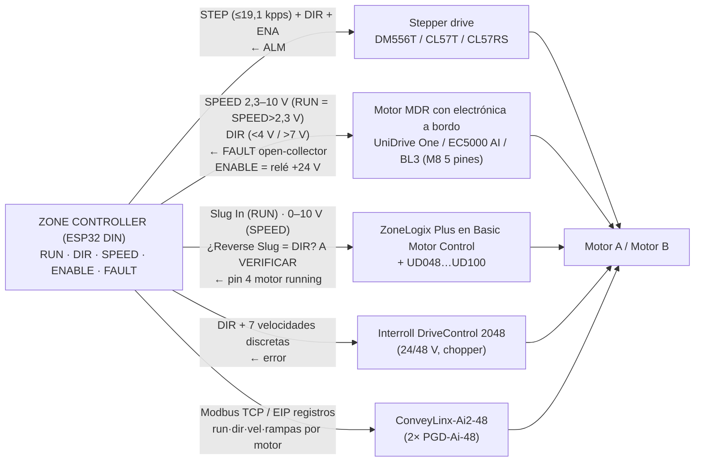

# Lente: tecnología de accionamiento y punto de operación (motor + driver) — zona Omni Conveyone

Fecha: 2026-09-03. Capas: `user` (handoff, REV B, prompts, repo), `web` (research_*.md con URL/fecha 2026-09-03), `calculo` (script `wf/calc_lente_accionamiento.py`, salida `wf/calc_lente_accionamiento.out`). Lo no encontrado se marca **A VERIFICAR**.

---

## 1. Conclusiones en 10 líneas

1. El motor no lo dimensiona la caja (0,14–0,20 N·m a 2 m/s²) sino la **inversión de una familia en DIVERT** (0,23–0,57 N·m de pura inercia a 1,5 m/s según masa de rueda y rampa) más la carga friccional máxima que una caja deslizando puede imponer (≤0,22 N·m con μ=0,5). Envolvente de diseño en el eje: **0,45 N·m (Ø50, rueda 100 g, rampa 0,5 s) a 0,84 N·m (Ø64, rueda 150 g, rampa 0,3 s)**; el criterio REV B "≥0,6–0,8 N·m a 573 rpm" queda confirmado como envolvente, no como caso típico.
2. Un NEMA 23 de 2–3 N·m/4,2 A entrega **1,1–1,5 N·m de pull-out a 573 rpm sólo a 36–48 V**; a 24 V la reactancia de fase (10 Ω a 478 Hz eléctricos) limita la corriente a ~55 % → **el bus de 48 V es condición para el stepper**, no una opción. A 382 rpm (1,0 m/s) el margen sube a 1,6–2,0 N·m (×3–4 sobre la envolvente).
3. **Lazo abierto es defendible sólo para el prototipo**: margen 1,5–1,8× a 573 rpm sobre 0,8 N·m (2,6–3,3× sobre 0,45), sin curva oficial del 23HS45 a 48 V ni sobre 420 rpm, y sin detección de pérdida de sincronismo. Con rampa de inversión ≥0,5 s y rueda ligera el riesgo de pérdida de pasos por impacto de caja es bajo porque la perturbación está limitada por fricción.
4. **Prototipo recomendado**: 23HE45-4204S (3 N·m, 4,2 A, 3,4 mH, con encoder, €20,95) + DM556T V4.0 (ALM, 4,2 A pico, idle 50 %, 2000 µpasos) a **48 V**, rampas S en el ESP32 (19,1 kpps a 573 rpm), t_inv ≥0,5 s a 1,5 m/s; el encoder se usa desde el día 1 para **contar pasos perdidos** aunque el driver sea abierto. Ensayo: curva par-rpm con freno de cuerda a 24/36/48 V, inversiones con caja, térmico 1 h.
5. **Producto**: dos vías coherentes. (P1) el mismo motor de las zonas normales, **UniDrive One 24 V** mandado directamente por el CZC por su M8 analógico (DIR/SPEED/FAULT = la abstracción §12 del handoff): 1,42 N·m continuos en el eje a 1:1, **1,17 m/s con rueda Ø64** (0,92 m/s con Ø50); para 1,5 m/s exige multiplicación 1,28–1,64 (el Bloque v4 del repo ya usa 1,7) con 0,84–1,1 N·m; límites: 350 rpm, 25 arranques/min de especificación, rampa 0,6–1 s, regeneración 24 V. (P2) si se confirma bus 48 V y 1,5 m/s: **closed-loop NEMA 23 (CL57T/CL57RS) a 48 V con clamp**, 1,3–1,7 N·m a 600 rpm y ALM/following-error; alternativa industrial EC5000 48 V 9:1 + DriveControl 2048 (chopper integrado).
6. La relación 1:1 es correcta para stepper (el par en el eje no cambia con la relación en la zona de potencia constante ≈80 W; una reducción sólo reduce inercia reflejada y sube kpps) y para UniDrive/MDR sólo si la rueda es Ø64; con Ø50 la Omni con UniDrive One necesita multiplicar.
7. **Regeneración**: cada DIVERT devuelve 4–10 J; sin chopper, 2 J bastarían para pasar de 48 a 60 V con 3 mF → los drivers stepper/servo (OV 60 V) necesitan clamp o que la fuente/otros consumidores absorban; DriveControl 2048/MultiControl traen chopper (52 V). A 24 V ZoneLogix aplica freno dinámico a 28 V.
8. Corriente de bus por Omni: stepper 2×(50–65) W ≈ 2–3 A a 48 V en régimen, 0,5 A en reposo con idle; UniDrive One 2×2 A nominal / 8 A stall a 24 V; servos 48 V 400 W: <3 A a 573 rpm pero 20 A a plena potencia. Una fuente de 120 W por Omni es insuficiente en cualquier variante con margen de arranque.
9. Inconsistencia a resolver por el usuario: **REV B fija rueda Ø50 (573 rpm)** pero el repo (Bloque OMNI v4, MECANUM64V7) usa **rueda v7 Ø64 (448 rpm a 1,5 m/s)**; el punto de operación, el margen del stepper y la viabilidad de UniDrive One dependen de esa decisión.
10. Nada del ecosistema MDR (UniDrive One, EC5000, PGD-Ai, Itoh) ni de servos 48 V tiene canal en Chile verificado; sólo stepper + DM556 (AFEL, Cimech 3D). Eso favorece el stepper para el prototipo y obliga a cotizar importación para el producto.

---

## 2. Análisis

### 2.1 Puntos de operación

`n = 60·v/(π·D)`; pulsos = n/60 · 2000 µpasos/rev; f_eléctrica = n/60 · 50 (200 pasos/rev, 4 pasos por ciclo eléctrico) [calculo §1].

| Rueda | v (m/s) | n eje (rpm) | ω (rad/s) | kpps (2000 µp) | f_e (Hz) | Fuente de D |
|---|---|---|---|---|---|---|
| Ø50 | 1,0 | **382** | 40,0 | 12,7 | 318 | REV B (user) |
| Ø50 | 1,5 | **573** | 60,0 | 19,1 | 478 | REV B (user) |
| Ø64 (v7) | 1,0 | 298 | 31,2 | 9,9 | 249 | MECANUM64V7.md / Bloque v4 (user, repo) |
| Ø64 (v7) | 1,5 | 448 | 46,9 | 14,9 | 373 | ídem |

Contradicción documental: REV B y el handoff §2 dicen Ø50 "OmniWheel comercial china (eje 14 mm)"; el Bloque OMNI v4 renderizado usa "ruedas mecanum v7 Ø64 impresas". Con Ø64 el motor gira 22 % más lento a la misma velocidad de caja, lo que mejora todos los márgenes de par de stepper y de UniDrive. Se calculan ambos.

### 2.2 Par requerido en el motor (verificación de REV B)

**Contacto** (REV B: `F_req = m·a + μr·m·g`, `F_fam = F_req/√2`, `T = F_fam·r`) [calculo §2]:

| a (m/s²) | F_req 5 kg (N) | F_fam (N) | T REV B Ø50 | T corregido Ø50 (·cos45) | T corregido Ø64 |
|---|---|---|---|---|---|
| 1,0 | 6,47 | 4,58 | 0,114 | 0,081 | 0,104 |
| 2,0 | 11,47 | 8,11 | **0,203** ✔ | **0,143** | 0,184 |
| 3,0 | 16,47 | 11,65 | 0,291 | 0,206 | 0,264 |

El valor REV B 0,203 N·m se reproduce exactamente. La lente mecánica (wf/lente_mecanica.md §2.4) señala que por balance de potencia `T·ω = F_fam·(v·u)` con `v·u = ω·r·cos45` el par real es `F_fam·r·cos45` = 0,143 N·m: REV B sobreestima ×√2, del lado seguro. Se usa 0,203 como envolvente y 0,143 como valor esperado.

**Inercia reflejada** (1:1) `J_fam = 16·m_w·k² + 4·½·m_eje·r_hex² + n_pol·½·m_pol·r_pol² + J_rotor` [calculo §3–4]; J_rotor del 23HS45 NO ENCONTRADO (research_motores_drivers.md §4), se usa 0,48 kg·cm² del Leadshine 57CM23 (web, ficha CM):

| Caso de rueda | J_fam (kg·m²) | T_in a 2 m/s² | T_in inversión ±1,5 m/s en 0,3 / 0,5 / 1,0 s | ídem ±1,0 m/s |
|---|---|---|---|---|
| Ø50, 100 g, k=20 mm (REV B) | 9,6e-4 | 0,077 | 0,385 / 0,231 / 0,116 | 0,257 / 0,154 / 0,077 |
| Ø64 v7, ~80 g, k=24 (A VERIFICAR con balanza) | 8,9e-4 | 0,056 | 0,278 / 0,167 / 0,084 | 0,186 / 0,111 / 0,056 |
| Ø64, 150 g, k=26 (peor caso) | 1,8e-3 | 0,113 | 0,565 / 0,339 / 0,170 | 0,377 / 0,226 / 0,113 |
| Ø50, 200 g (REV B "aun duplicando") | 1,6e-3 | 0,128 | 0,641 / 0,385 / 0,192 | 0,428 / 0,257 / 0,128 |

REV B "0,04–0,06 N·m de inercia a 2 m/s²" es coherente (0,056–0,077 con rueda de 100 g; REV B no incluye rotor ni poleas). Lo que REV B no calcula es la **inversión**: en DIVERT una familia pasa de +v a −v; la caja no acompaña (desliza) y toda la inercia de 16 ruedas + 4 ejes + poleas + rotor debe invertirse en t_inv.

**Perturbación máxima de la caja** (impacto, deslizamiento, entrada a una familia detenida): la rueda sólo puede transmitir `F ≤ μ·N`; con N_fam = m·g/2 y T = μ·N_fam·r·cos45 [calculo §5]: μ=0,3 → 0,13 N·m; **μ=0,5 → 0,22 N·m**; μ=0,8 → 0,35 N·m (Ø50). Con Ø64: 0,17 / 0,28 / 0,44. Es decir, **una caja de 5 kg no puede cargar a una familia con más de ~0,2–0,4 N·m** en ningún transitorio, y la fricción rodillo-cartón (μ A VERIFICAR, research_tribologia no da valor) protege al stepper.

**Envolvente de diseño en el eje** (pico de inversión + caja deslizando μ=0,5) [calculo §6]:

| Escenario | T pico (N·m) |
|---|---|
| Ø50, 100 g, 1,5 m/s, t_inv 0,5 s | **0,45** |
| Ø50, 100 g, 1,5 m/s, t_inv 0,3 s | 0,60 |
| Ø50, 100 g, 1,0 m/s, t_inv 0,3 s | 0,47 |
| Ø64, 80 g, 1,5 m/s, 0,5 s | 0,44 |
| Ø64, 150 g, 1,5 m/s, 0,5 s | 0,62 |
| Ø64, 150 g, 1,5 m/s, 0,3 s | **0,84** |

Más pérdidas de correa/rodamientos (η_mec supuesto 0,90, A VERIFICAR: Gates no publica rendimiento en las fuentes; REV B calcula capacidad de correa 267–301 W ≫ demanda) y margen de selección ×1,5–2 (regla de práctica para stepper, no dato de catálogo) → **par de pull-out requerido en el motor: 0,7–1,0 N·m (rueda ligera, rampa 0,5 s) hasta 1,3–1,9 N·m (rueda pesada, rampa 0,3 s)**. El criterio REV B "0,6 preferible 0,8" corresponde al primer caso sin margen ×2.

### 2.3 Por qué la tensión de bus decide el par del stepper a 573 rpm

Modelo de primer orden [calculo §7] con R=0,88 Ω y L=3,4 mH del 23HS45-4204S (web: stepperonline.es/download/23HS45-4204S.pdf): `X = 2π·f_e·L`, `I_max ≈ V/√(R²+X²)` (sin back-EMF, que empeora aún más el resultado; Ke NO ENCONTRADO):

| n eje (rpm) | f_e (Hz) | X (Ω) | I_max a 24 V | 36 V | 48 V |
|---|---|---|---|---|---|
| 382 | 318 | 6,8 | 3,5 A | 5,3 A | 7,0 A (limitada a 4,2 por driver) |
| 448 | 373 | 8,0 | 3,0 A | 4,5 A | 6,0 A |
| 573 | 478 | 10,2 | **2,3 A** | 3,5 A | 4,7 A |

L/R = 3,9 ms frente a 0,52 ms de periodo de paso completo a 573 rpm: la corriente nunca alcanza régimen en cada paso; sólo la tensión la empuja. Esto explica el +27 % de par a 600 rpm entre 36 y 48 V medido en la curva 23HS30-2804S (0,88 → 1,12 N·m, research_motores_drivers.md tabla 2a-1) y por qué a 382 rpm el motor aún da ~2 N·m (corriente plena). **Consecuencia:** a 24 V (bus ZoneLogix) un NEMA 23 a 573 rpm pierde ~45 % de corriente → no cumple; a 382 rpm cumple justo. Motores de 3 A/2,9 N·m ofrecidos en Chile (digest_transmisiones: Cimech 57HS112-3004) tienen más vueltas y más inductancia que la versión 4,2 A → peor a alta rpm; **elegir la versión de baja inductancia (4,2 A, ≤3,5 mH)**.

### 2.4 Matriz de decisión del motor por familia

Par en el eje de rueda = par de motor × relación × η (0,90 supuesto). Pull-out stepper leído de curvas (web, ±5 %). "Cumple" = par en eje ≥ envolvente 0,45–0,84 N·m con margen ≥1,5 para stepper abierto / ≥1,2 para lazo cerrado y BLDC (sus fabricantes dan par nominal continuo, no pull-out).

| # | Opción (motor + driver) | Bus | Relación para 573 rpm (Ø50) | T eje @573 rpm | T eje @382 rpm | Diagnóstico / realimentación | Inversión | Interfaz §12 | Costo unitario (web) | Chile | Veredicto |
|---|---|---|---|---|---|---|---|---|---|---|---|
| 1 | NEMA 23 open-loop 3 N·m 4,2 A (23HS45/23HE45) + DM556T | 36–48 V | 1:1 | 1,3–1,4 pull-out (36 V, 23HE45); 23HS45 **sin curva >420 rpm ni a 48 V** | ~1,9–2,0 | ALM sólo por sobrecorriente/tensión (DM556T V4.0); **no detecta pasos perdidos** | rampa por pulsos (ESP32); corriente fija, sin pico; sin chopper (OV 60 V) | STEP/DIR/ENA + ALM (opto 5/24 V) | motor €20,95–26,12 + driver €20,86; Chile: DM556 $16.000 (AFEL), NEMA 23 4 A $49.990 (AFEL, 1 ud.) | **sí** | **Prototipo** (margen 1,5–1,8× sobre 0,8; 2,6–3× sobre 0,45). No certificable como producto |
| 2 | NEMA 23 closed-loop 23HE45-4204S + CL57T-V41 (o CL57RS Modbus) | 24–48 V | 1:1 | ≈1,3–1,7 (CS-M22323 48 V ≈1,7 a 600 rpm) | ≈1,95 | ALM configurable (ALARM/IN-POS/BRAKE), **position following error**, "fail to lock shaft"; RS485 en CL57RS | ídem 1; el lazo corrige el retraso; sin chopper (OV A VERIFICAR CL57T) | STEP/DIR/ENA + ALM (+Modbus) | €20,95 + €33,11 (CL57RS €81,43); Chile: kit lazo cerrado 2 N·m $80.000 / integrado 3 N·m 36 V $199.990 (digest, no verificado) | parcial | **Producto vía P2** si bus 48 V y 1,5 m/s |
| 3 | NEMA 34 closed-loop 34HE46-6004D + CL86T | 48–60 V | 1:1 | **1,85–2,0 (48 V) / 2,4 (60 V)** curva oficial con puntos | ≈2,8 | como 2 | como 2; 6 A RMS | ídem | €32,82 + €42,14 | no | Reserva si rueda pesada + rampa 0,3 s (brida 86 mm: rehacer soporte REV B) |
| 4 | Servo integrado 48 V 400 W (IDS-C60AP-48V400W / JMC iHSV60-30-40-48) | 30–60 V | 1:1 (o reducción 2,3:1 con polea 12T) | 1,27 nominal (1:1) → 2,7 con 2,3:1; pico A VERIFICAR | ídem | encoder 17 bit, ALM, CANopen/RS485/pulsos | rampa en driver; sobrecarga 180–300 % 1–3 s → pico de bus; OV 80 V (JMC) | PUL/DIR/ENA + ALM/PED o bus | €148,87 | no | Sobredimensionado en rpm (19 % de 3000), correcto en par; 2× costo del lazo cerrado |
| 5 | Servo integrado NEMA 23 iSV57T-180 (36 V típ., 20–50 V) | 36 V | 1:1 → 0,54; **con reducción 2,33:1 (28T/12T) → 1,26 N·m nominal / 2,3 pico** | 0,6/1,1 nominal/pico | ídem | 16 bit, ALM | OV 60 V; 48 V nominal deja 12 V de margen (fabricante recomienda 24–36 V) | ídem | €71,80 | no | Sólo con reducción; bus 36 V (choca con hipótesis 48 V) |
| 6 | BLDC 48 V con reductor planetario | 48 V | reductor ≈5:1 | NO ENCONTRADO en StepperOnline (sólo 24 V con planetario); Pulseroller PGD-Ai-48 es exactamente esto (ver 9) | — | según driver | — | según driver | NO ENCONTRADO | no | Descartada como genérica: la versión industrial es #9 |
| 7 | **UniDrive One 24 V 60 W** (el mismo del ZP2026 y del Bloque v4) mandado por el CZC vía M8 | 24 V | 350 rpm máx → **multiplicar 1,64 (Ø50)** o 1,28 (Ø64); 1:1 sólo da 0,92 (Ø50) / 1,17 m/s (Ø64) | 0,87 nominal / 1,55 arranque (i=1,64); **1,42 / 2,5 a 1:1** | 1,30 (i=1,09) / 1,42 (1:1 Ø64) | FAULT open-collector; sin encoder externo | rampa interna (0,6–1 s típ. según ZoneLogix spec); 4 A stall; freno dinámico >28 V lo hace el control ZoneLogix — **con mando directo A VERIFICAR** | **+24 V, DIR (<4 V/>7 V), GND, FAULT, SPEED 2,3–10 V = RUN/DIR/SPEED/FAULT del §12**; sin ENABLE (cortar +24 V) | NO ENCONTRADO (ya en inventario del usuario) | ya lo tiene | **Producto P1** para ≤1,2 m/s (Ø64, 1:1) o 1,5 m/s con multiplicación; un solo ecosistema 24 V |
| 8 | UniDrive Signature UD100 (100 W, 560 rpm, 1,7 N·m) + ZoneLogix Plus (SW7/8 ON ON) en Basic Motor Control | 24 V | 1:1 → 1,47 m/s (Ø50) / 1,88 (Ø64) | **1,53** nominal, 5,6 A @15 in·lbf | 2,2 (reducción 1,47) | ZoneLogix: pin 4 "motor running" en BMC; falla de motor hacia fuera NO DOCUMENTADA | ramp 1 s típ.; **dirección dinámica en BMC A VERIFICAR** (SW1 fija CW/CCW; Reverse Slug pin 3 sólo documentado en ZPA) | Slug In (RUN), analog 0–10 V (SPEED), ¿Reverse Slug (DIR)? | ZoneLogix y UD100: NO ENCONTRADO | canal ACG del usuario | Ruta A pura para la Omni: 2 tarjetas ZoneLogix Plus en BMC; depende de una pregunta a ACG |
| 9 | UniDrive CORE 48 V 120 W (pancake U/V/W sin electrónica) | 48 V | 700 rpm máx → 1:1 (1,83 m/s) o reducción 1,22 | 1,53 (1:1) / 1,86 | 2,8 | ninguno a bordo (sin sensores) | depende del driver BLDC a desarrollar | driver propio o de terceros (NO ENCONTRADO controlador ACG 48 V) | NO ENCONTRADO | no | Sólo si Conveyone desarrolla driver BLDC: fuera del alcance de "driver básico" |
| 10 | Interroll EC5000 48 V 50 W 9:1 (motor externo por cabezal) + DriveControl 2048 | 48 V (38–55) | 1:1 (767 rpm máx, 2,01 m/s) o reducción 1,34 | 0,57 nominal / 1,42 aceleración / 2,3 arranque (1:1) | 1,14 (reducción 2) | pin 4 error; DriveControl 2048 sin lógica, **chopper de freno integrado** | accel torque 2,5× nominal; arranque 3,8 A; chopper | DIR + 7 velocidades discretas (DriveControl) o M8 analógico | EC5000 24 V 35 W US$239,80; DriveControl 2048 US$112,90; 48 V NO ENCONTRADO | Brasil (fábrica), Chile no | Producto industrial 48 V; carga máx. con cabezal 350 N; par nominal justo (0,57–0,76) pero 2,5× en aceleración |
| 11 | Pulseroller PGD-Ai-48 11:1 (0,75 N·m, 637 rpm, eje 16 mm) + ConveyLinx-Ai2-48 | 48 V (42–48) | 1:1 (1,67 m/s) o reducción 1,11 | 0,68 nominal / 1,67 holding | 1,13 | red (EIP/Modbus TCP/PROFINET), diagnóstico completo | arranque 4,0 A vs 1,6 nominal; ciclo mín 0,5 s ON/OFF | registros PLC I/O (run/dir/vel por motor) — no discreto | Ai2 US$604 (2 motores); motor NO ENCONTRADO | "South America", Chile no | Precedente Flowsort SLD; obliga a un maestro Modbus (el CZC puede serlo) |
| 12 | Itoh Denki PM605FE/PM500XE (24 V) | 24 V | motorrodillo, no motor externo | 0,66–1,0 (cód. 90) | 1,1–1,7 (cód. 60) | error output | freno dinámico; 1800 arranques/h | Start/Stop, DIR, 0–10 V | NO ENCONTRADO | México | No hay motor externo Itoh: descartado |

Lectura: por par a 573 rpm, sólo #3, #4 (48 V 400 W), #9 y #8 superan 1,5 N·m continuos; #2 es la mejor relación par/costo con diagnóstico; #7 es la única que no añade ecosistema y cumple REV B (0,6–0,8) con multiplicación, o lo supera ampliamente a 1:1 si se acepta 1,17 m/s con rueda Ø64.

### 2.5 Corriente y potencia eléctrica

[calculo §8–9, §15]. η_mec 0,90 (supuesto), η eléctrico stepper 0,6 / BLDC-servo 0,8 (supuestos; el stepper a alta rpm tiene pérdidas de conmutación e hierro no documentadas → **A VERIFICAR midiendo corriente de bus en el banco**). Pérdidas de cobre del stepper son independientes de la carga: `P_cu = 2·(I_pk/√2)²·R` = **15,5 W a 4,2 A** (27,6 W a 5,6 A; 3,9 W con idle 50 %).

| Punto | P_mec (W) | Stepper: P_bus / I a 24 V / I a 48 V | BLDC-servo-MDR: P_bus / I 24 V / I 48 V |
|---|---|---|---|
| Régimen 5 kg a 2 m/s², 0,30 N·m @573 | 18 | 49 W / 2,0 A / 1,0 A | 25 W / 1,0 A / 0,5 A |
| Pico inversión 0,45 N·m @573 | 27 | 65 W / 2,7 A / 1,4 A | 37 W / 1,6 A / 0,8 A |
| Criterio REV B 0,8 N·m @573 | 48 | 104 W / 4,3 A / 2,2 A | 67 W / 2,8 A / 1,4 A |
| 0,8 N·m @382 | 32 | 75 W / 3,1 A / 1,6 A | 44 W / 1,9 A / 0,9 A |

Por módulo Omni (2 motores):
- 2× stepper + DM556T a 48 V: ≈98 W régimen, ≈131 W pico de inversión, ≈18 W en reposo (idle) → **fuente ≥240 W por Omni** o tramo compartido; la NDR-120-48 del digest queda descartada por cálculo (coincide con la advertencia del PDF v1 "dos NEMA 23 pueden superar 120 W").
- 2× UniDrive One 24 V: 4 A nominal (96 W), **8 A stall (192 W)** (web, ficha One: stall 4 A, nominal 2 A).
- 2× EC5000 48 V 50 W: 3,4 A nominal, 7,6 A arranque (web).
- 2× servo 48 V 400 W: 20 A a plena potencia (web) pero ≈2,4 A estimados a 0,8 N·m/573 rpm (calculo).
- Datos de fuentes (research_potencia_seguridad.md): SDR-480-48 (48 V/10 A, pico 150 % 3 s, DC-OK) preferible a NDR-480-48 (se apaga a los 3 s de sobrecarga y exige corte de red); protección por driver E-T-A ESX10-TC DC48V (18–60 V, 1,2×In).

Datos que faltan: Ke/back-EMF del 23HS45, corriente de bus real a 573 rpm (ninguna ficha stepper la da), consumo de servos a 19 % de velocidad. Todos → **medir en banco**.

### 2.6 Comportamiento en inversión: rampa, regeneración, pico de corriente

**Rampa.** Con ±1,5 m/s la inversión en t_inv = 0,3 s exige α = 400 rad/s² (Ø50) y 0,39–0,64 N·m de inercia; a 0,5 s, 0,23–0,39 N·m [calculo §4]. Tiempo total de desvío (lente física: 0,5–0,9 s con a = 2–3 m/s²) más 2 inversiones de 0,5 s → ciclo de DIVERT ≈1,5–2 s. Requisito del handoff §3 (desacelerar → cero → invertir) se implementa: stepper en el generador de pulsos del ESP32 (perfil S, 19,1 kpps máx; el ESP32 dispone de periféricos de pulsos por hardware — RMT/MCPWM —, capacidad exacta **A VERIFICAR en la placa DIN elegida**, research_controladores_din no lo cubre); servo/closed-loop: rampas en el driver o en pulsos; UniDrive One/EC5000: SPEED analógico con rampa interna (UniDrive 0,6–1 s a máx según ZoneLogix spec; EC5000 aceleración máx. por defecto 13 215 mm/s² con 9:1, research_tribologia #63).

**Regeneración** [calculo §10]: energía cinética por DIVERT (2 familias + caja 5 kg): 4,0 J a 1,0 m/s, **9–10 J a 1,5 m/s**. Para absorber sólo 2 J sin superar 60 V desde 48 V harían falta 3,1 mF; 8 J → 12,3 mF; a 24 V hasta 28 V, 19–77 mF. Los drivers tienen µF, no mF → la energía se disipa en pérdidas del motor/driver (stepper: alto, porque el driver sigue chopeando corriente en frenado) o sube el bus. Evidencia web: DM556T e iSV-B23 "over-voltage… greater than 60 VDC", JMC 80 V, CL57T "back EMF… leaving room"; Interroll exige chopper (MultiControl 52 V; HP5448 con chopper; DriveControl 2048 chopper integrado) o fuente que absorba hasta 60 V; ZoneLogix UL "Over Voltage on Input Over 28 VDC Applies Dynamic Braking". **Conclusión:** con bus 48 V y drivers stepper/servo hay que (a) fijar la fuente a 48,0 V (no 52–55), (b) medir con osciloscopio el bus en inversiones, (c) prever un clamp/chopper por caja o por tramo (producto A VERIFICAR: buscar módulo "regen clamp" 48 V; ninguna fuente lo cita) y (d) preferir ecosistemas con chopper (DriveControl 2048) si se va a MDR 48 V. Con stepper la disipación interna es alta y probablemente basta a 1,0 m/s; a 1,5 m/s se debe medir.

**Pico de corriente.** Stepper: ninguno (corriente controlada, fija) → es su ventaja para el balance de potencia. Servos: 180–300 % durante 1–3 s. MDR: arranque 2,2–2,5× nominal (EC5000 3,8 A; PGD 4,0 A; UniDrive One stall 4 A = 2× nominal). Handoff §14 pregunta 19 (corriente pico de dos accionamientos en inversión): stepper 2×1,4 A a 48 V; UniDrive One 2×4 A a 24 V; EC5000 2×3,8 A a 48 V.

### 2.7 Riesgo de pérdida de pasos en lazo abierto con impacto de caja

- Perturbación máxima por la caja: limitada por fricción a 0,13–0,35 N·m (μ 0,3–0,8, Ø50) [calculo §5]. Aun sumada al pico de inercia de la propia familia (0,23–0,39 N·m con rampa 0,5 s) queda en **0,45–0,60 N·m** frente a 1,1–1,5 N·m de pull-out a 573 rpm (36–48 V) → margen 2–3×; a 382 rpm, 3–4×. Con rueda de 150–200 g y rampa 0,3 s (0,84–0,99 N·m) el margen baja a 1,2–1,7× → **insuficiente para lazo abierto**.
- Riesgos no cuantificables con las fuentes: resonancia de banda media a 300–600 rpm (las fichas sólo dicen "anti-resonance"; research_motores §4 punto 12), caída térmica de par (curvas a 20 °C), tolerancia ±5 % de lectura de curvas, y ausencia de curva oficial del 23HS45 a 48 V/>420 rpm.
- Mitigaciones: 48 V, motor de baja inductancia, 2000 µpasos, idle current, rampas S, t_inv ≥0,5 s, y **encoder de la serie E leído por el ESP32** para detectar y contar pasos perdidos (convierte el "lazo abierto" en "lazo abierto supervisado": si |pos_encoder − pos_comandada| > umbral → FAULT). Leadshine confirma que el lazo cerrado "no necesita reserva de par" y "resuelve la pérdida de pasos del lazo abierto" (web, ficha CS).

### 2.8 Señales del driver y encaje en la abstracción "basic motor drive" del handoff §12

| Señal §12 | Stepper (DM556T/CL57T) | UniDrive One / EC5000 AI (M8) | ZoneLogix Plus BMC | DriveControl 2048 | ConveyLinx-Ai2-48 |
|---|---|---|---|---|---|
| RUN | tren de pulsos ≠ 0 | SPEED > 2,3 V (0–2,2 V = freno ZMH) | Slug Mode In (pin 2, PNP 24 V) | señal de marcha/velocidad | registro |
| DIR | DIR (setup ≥5 µs antes del pulso) | pin 2: <4 V CCW / >7 V CW | DIP SW1 (fijo); Reverse Slug **A VERIFICAR** | entrada dirección | registro (± por motor) |
| SPEED | frecuencia de pulsos | 2,3–10 V (EC5000: 300–6900 rpm motor) | analógico 0–10 V pines 5/6 (o DIP) | 7 escalones | registro |
| ENABLE | ENA (opto 5/24 V) | no existe → cortar +24 V (relé de seguridad/E-stop) | no documentado → cortar 24 V | — | — |
| FAULT | ALM (DM556T V4.0: 30 V/100 mA; CL57T 20 mA) | pin 4 open-collector, alto = falla (30 V/200 mA) | pin 4 = "motor running" (no falla) | pin error | registro/diagnóstico |
| Pasos perdidos / posición | sólo CL57T (following error) o encoder externo | no aplica (BLDC) | no | no | no |

La abstracción del handoff se cumple con todas las opciones excepto que **ZoneLogix Plus en BMC no expone DIR dinámico documentado** (bloqueante para DIVERT, que exige A+ B−) y que los motores M8 no tienen ENABLE (se resuelve con contactor/relé de seguridad en +24 V, coherente con "E-stop independiente del ESP32", handoff §13). Nota de EMC: el stepper conmuta 4,2 A a 20–30 kHz con cable a motor de hasta 1–2 m: blindaje y PE obligatorios (handoff §14 p. 21).

### 2.9 ¿Conviene una relación distinta de 1:1?

[calculo, corrección §13 con la curva 23HE45 36 V]. Entre 300 y 600 rpm el producto T·n es ≈ constante (720–830 N·m·rpm ⇒ **potencia de pull-out ≈ 75–87 W**). Por tanto, para el stepper:

| i = n_motor/n_eje | polea motor | motor (rpm) a eje 573 | T_motor | T_eje | J reflejada | kpps |
|---|---|---|---|---|---|---|
| 0,667 (multiplicación) | 42T (Dp 66,8 > 50 mm: no cabe) | 382 | 2,04 | 1,30 | ×2,25 | 12,7 |
| **1,0** | 28T | 573 | 1,40 | **1,33** | ×1 | 19,1 |
| 1,556 (reducción) | 18T | 892 | 0,87 (extrapolado) | 1,29 | ×0,41 | 29,7 |

El par en el eje no cambia; la reducción sólo baja la inercia reflejada (útil para rampas cortas) a costa de extrapolar la curva a 900 rpm (sin datos) y 30 kpps. **Mantener 1:1 para stepper** (confirma REV B). Para BLDC/servo de 3000 rpm sí conviene reducir (2,3:1 con polea 12T, Dp 19,1 mm existe en catálogo según digest; o 5:1 planetario): el iSV57T-180 pasa de 0,54 a 1,26 N·m nominales en el eje. Para UniDrive One la relación la fija su tope de 350 rpm: 1:1 sólo con Ø64 y ≤1,17 m/s; 1,28–1,7 de multiplicación para 1,5 m/s (el Bloque v4 ya tiene 68/40 = 1,7 → 595 rpm, 1,56 m/s Ø50 / 1,99 m/s Ø64, 0,84 N·m continuos en eje) [calculo §12].

### 2.10 Opción "mismo motor UniDrive que las zonas normales" — evaluación explícita

Datos (web, ficha S-UD23062200R01, research_ecosistemas_zpa.md §2.1): UniDrive One 24 V, 60 W, 70–350 rpm ("electronically-controlled maximum operating speed of just 350 rpm"), 14 in·lbf (1,58 N·m) continuo, arranque 25 lbf·in (2,82 N·m), 2 A nominal / 4 A stall, M8 5 pines: +24 V, DIR, GND, FAULT, SPEED. Compatible según ACG con Interroll DriveControl/ZPA Control/MultiControl, P+F G20 y B+W BWU-4246 (misma interfaz M8 analógica).

Ventajas: un solo ecosistema y una sola tensión (24 V) en toda la línea; el motor ya está en inventario y en el CAD (ZP2026, Bloque v4, BF21, CV-OMW); electrónica de conmutación a bordo → el CZC sólo necesita 2 salidas analógicas 0–10 V, 2 digitales DIR, 2 entradas FAULT y un relé de +24 V por motor; sin driver stepper, sin EMC de chopper, sin pulsos; FAULT nativo; 2,82 N·m de arranque cubre cualquier transitorio de la envolvente (0,45–0,84).

Límites cuantificados:
1. **Velocidad**: 350 rpm → 0,92 m/s (Ø50) / 1,17 m/s (Ø64) a 1:1. Cumple "por lo menos 1 m/s" (prompt 1) sólo con rueda Ø64; no cumple 1,5 m/s (REV B) sin multiplicar 1,28 (Ø64) o 1,64 (Ø50). Con multiplicación el par continuo cae a 1,11 / 0,87 N·m (η 0,9) — sigue ≥ criterio REV B 0,6–0,8 y ≥ envolvente ligera 0,45, pero no la pesada 0,84 con 1,64 (0,87 nominal, sin margen; arranque 1,55 sí).
2. **Ciclo de arranques**: ZoneLogix UL/PRO 2.0 especifican "25 starts/stops per minute (at max current limit)". Un DIVERT son 4 eventos por familia (parar, arrancar −, parar, arrancar +) [calculo §14]: 10 cajas/min con 50 % desviadas → 30 eventos/min → fuera de especificación; 20 cajas/min → 60. **A VERIFICAR con ACG** si el límite es del control (térmico de la tarjeta) o del motor y si aplica a arranques a baja corriente.
3. **Rampa**: 0,6–1 s a velocidad máxima (spec ZoneLogix, típico) → a = 1,5–2,5 m/s² equivalente; inversión completa ≈1,2–2 s por familia → desvío ≈2–2,5 s frente a ≈1,5 s con stepper. Rampa interna con mando directo M8: NO DOCUMENTADA.
4. **Regeneración a 24 V**: el freno dinámico sobre 28 V lo hace ZoneLogix; con mando directo M8, quién absorbe 4–10 J por DIVERT: A VERIFICAR (fuente 24 V con capacidad de absorción o resistencia de freno).
5. **Transmisión**: 350 rpm con o-rings (ZP2026/v4) — inversiones frecuentes y 1,7 de multiplicación exigen Poly-V PJ (v3/v4) o HTD (REV B); los o-rings patinan en inversión (lente mecánica §2.6).
6. **Disponibilidad/precio**: NO ENCONTRADO precio público; canal ACG del usuario. Sin encoder ni bus de datos: diagnóstico limitado a FAULT.

Variante con más par y velocidad en el mismo ecosistema: **UD100 (Signature 100 W: 560 rpm, 1,7 N·m, 6 A) con ZoneLogix Plus en BMC** (la Plus soporta UD048–UD100 por SW7/SW8; PRO 2.0 lista UD100 115–570 rpm): 1,47 m/s a 1:1 con Ø50 y 1,53 N·m en eje. Bloqueante: dirección dinámica en BMC no documentada; el UD100 no tiene M8 analógico documentado (conector Molex 10 pines en PRO 2.0; Signature "performance dependent on the control used") → sólo utilizable a través de una tarjeta ACG. Precio: NO ENCONTRADO.

Juicio: **la opción UniDrive One es la mejor relación riesgo/plazo para el producto si se acepta 1,0–1,2 m/s en la Omni (o si REV B pasa a Ø64)**; para 1,5 m/s en Ø50 es viable pero justa (i=1,64, 0,87 N·m, 25 arranques/min) y queda condicionada a tres respuestas de ACG (arranques/min, rampa interna, freno con mando directo). No aporta el bus 48 V ni el diagnóstico de posición que sí dan #2/#4.

### 2.11 Costo y disponibilidad en Chile (sólo datos hallados)

| Ítem | Precio | Fuente |
|---|---|---|
| DM556 driver | $16.000 CLP (115 en stock) | AFEL (research_motores_drivers.md §1.10, afel.cl) |
| NEMA 23 4 A 30 kg·cm (≈2,9 N·m) | $49.990 CLP (1 en stock) | AFEL (ídem) |
| Cimech 3D (Ñuñoa): 57HS112-3004 2,9 N·m 3 A; 57HS86-3004 2,45 N·m 3 A $22.500; DM556 $33.990; closed-loop integrado 3 N·m 4 A 36 V $199.990; kit closed-loop 2 N·m + driver $80.000 | (digest_transmisiones.md, búsquedas de ChatGPT; **no verificado en esta sesión**) | user/digest |
| 23HS45-4204S / 23HE45-4204S | €26,12 / €20,95 (stock 500/200) | stepperonline.es |
| DM556T V4.0 / DM542T | €20,86 / €17,88 | stepperonline.es |
| CL57T-V41 / CL57RS | €33,11 / €81,43 | stepperonline.es |
| 34HE46-6004D-E1000 + CL86T | €32,82 + €42,14 | stepperonline.es |
| iSV57T-180 / IDS-C60AP-48V400W | €71,80 / €148,87 | stepperonline.es |
| Fuentes 48 V StepperOnline 350/500/1000 W | €23,41 / €42,12 / €163,81 | stepperonline.es |
| EC5000 24 V 35 W / DriveControl 2048 | US$239,80 / US$112,90 | Ultimation (secundario) |
| ConveyLinx-Ai2 | US$604,10 | Radwell (secundario) |
| UniDrive One, UD100, ZoneLogix Plus, PGD-Ai-48, Leadshine, JMC | NO ENCONTRADO | — |

Envío stepperonline.es → Chile: NO VERIFICADO. Ningún distribuidor chileno de ACG, Interroll, Pulseroller, Itoh, Leadshine o JMC encontrado.

### 2.12 Recomendación PROTOTIPO (respeta NEMA 23 + driver básico + ESP32)

| Elemento | Especificación | Justificación |
|---|---|---|
| Motor | NEMA 23 **3 N·m, 4,2 A/fase, baja inductancia (≤3,5 mH), cuerpo 113 mm**, preferible **23HE45-4204S con encoder 1000 ppr** (€20,95) o equivalente local 4,2 A (AFEL). Evitar versiones 3 A/2,9 N·m (más inductancia). | §2.3: a 573 rpm la corriente la limita X = ω·L; el encoder permite contar pasos perdidos con driver abierto y migrar a CL57T sin cambiar motor. |
| Driver | **DM556T V4.0** (ALM, 20–50 V, 1,8–5,6 A pico, 200 kHz), ajuste **4,2 A pico**, idle current 50 %, **2000 µpasos/rev** (19,1 kpps a 573 rpm), entradas a 24 V PNP del ESP32 o 5 V con resistencia según manual. Chile: DM556 AFEL $16.000 (verificar que sea V4.0 con ALM). | Es el "driver básico" del usuario; ALM al CZC = FAULT §12. |
| Tensión | **48 V** (SDR-480-48 o fuente 48 V ≥240 W por Omni), ajustada a 48,0 V, protección por driver 6 A (ESX10-TC DC48V). No 24 V (par −45 %) ni 36 V si el producto será 48 V. | §2.3, §2.5. |
| Rampas | Perfil S en el ESP32: 0→573 rpm en ≥0,5 s (a_eje = 2,4 m/s²); inversión: decel ≥0,5 s → 50 ms a cero → accel ≥0,5 s. Parametrizable; probar 0,3 s sólo con rueda pesada medida. | §2.2 envolvente 0,45–0,62 N·m. |
| Regeneración | Osciloscopio en el bus durante inversiones; si V_bus > 56 V, añadir clamp/chopper 48 V (producto A VERIFICAR) o descargar en resistencia por relé. | §2.6. |
| Rueda | Decidir Ø50 (REV B) o Ø64 (v7 repo) antes del banco; pesar la rueda completa. | §2.1, §2.2. |

**Ensayo de curva par-rpm (capa `measured` del proyecto):**
1. Freno de cuerda (Prony) sobre tambor Ø50 en el eje de la familia con dos dinamómetros (T = (F1−F2)·r), a 24/36/48 V, a 200/300/382/448/573/700 rpm: subir carga hasta pérdida de sincronismo → **pull-out medido**; repetir con motor a 70 °C de carcasa (térmico).
2. Con el lecho completo y sin caja: 100 inversiones ±573 rpm con t_inv 1,0/0,5/0,3 s; contar pasos perdidos con el encoder (o marca de referencia + sensor). Criterio: 0 pasos perdidos en 100 ciclos con t_inv 0,5 s.
3. Con caja 5 kg entrando a 1,5 m/s sobre familia detenida (HOLD) y sobre familia a −573 rpm: pasos perdidos, corriente de bus (pinza DC), V_bus pico.
4. Térmico: 1 h continua a 573 rpm con 0,4 N·m de freno: T_carcasa < límite del fabricante (A VERIFICAR en ficha; no consta en las fuentes), corriente de bus media.
5. Registrar las curvas medidas en `provenance.json`/audit y compararlas con las lecturas ±5 % de las fichas.

Si el ensayo 1 da <1,0 N·m a 573 rpm/48 V o el 2 pierde pasos con 0,5 s: pasar a CL57T (mismo motor) o reducir la velocidad de la Omni a 1,0–1,2 m/s.

### 2.13 Recomendación PRODUCTO

Decisión rectora: depende de (i) velocidad de la Omni (1,0–1,2 vs 1,5 m/s), (ii) bus 48 V confirmado o no, (iii) resultado del prototipo.

- **P1 — Un solo ecosistema 24 V (Ruta A/C)**: UniDrive One en la Omni (2 uds.), mandado directamente por el CZC por M8 (SPEED 0–10 V, DIR, FAULT; +24 V por relé de seguridad). Rueda Ø64 a 1:1 → 1,17 m/s y 1,42 N·m continuos; o multiplicación 1,28–1,64 para 1,5 m/s (0,87–1,11 N·m). Requiere confirmar con ACG: arranques/min, rampa interna, freno/regeneración con mando directo, precio. Ventaja decisiva: mismo repuesto, misma fuente, mismo cable, sin driver stepper.
- **P2 — Bus 48 V y 1,5 m/s**: 23HE45-4204S + **CL57RS** (Modbus RS485 para diagnóstico y parametrización desde el CZC) o CL57T-V41 (discreto), 48 V, clamp de regeneración por caja, following-error → FAULT. 1,3–1,7 N·m a 600 rpm; ≈€55–105 por eje. Escalable a NEMA 34 + CL86T (2,0 N·m a 48 V, 2,4 a 60 V) sin cambiar lógica ni protocolo (§12).
- **P3 — Industrial MDR 48 V** (si el cliente exige componentes de catálogo con UL/CE de conveyor): EC5000 48 V 50 W 9:1 + DriveControl 2048 (chopper, DIR + velocidades discretas) o MultiControl (4 motores, PROFINET/EIP, 48 V); par nominal 0,57–0,76 N·m con 2,5× en aceleración; sin canal en Chile.
- Servos 48 V 400 W: reserva técnica (par sobrado, CANopen), doble costo, 20 A de potencia instalada por Omni.

---

## 3. Afirmaciones numeradas

- [A1] (calculo) Puntos de operación: Ø50 → 382 rpm (1,0 m/s) / 573 rpm (1,5 m/s); Ø64 → 298 / 448 rpm; 12,7–19,1 kpps a 2000 µpasos. — script §1; user REV B y MECANUM64V7.md.
- [A2] (calculo) Par de contacto 5 kg a 2 m/s²: 0,203 N·m con fórmula REV B (reproducido); 0,143 N·m con balance de potencia (·cos45); REV B es conservador ×√2. — script §2; lente_mecanica §2.4.
- [A3] (calculo) J_fam = 8,9e-4 (v7 80 g) – 1,8e-3 kg·m² (150 g); T_inercia a 2 m/s² = 0,056–0,128 N·m (REV B 0,04–0,06 coherente). — script §3–4.
- [A4] (calculo) Inversión ±1,5 m/s: 0,23–0,39 N·m (t_inv 0,5 s), 0,39–0,64 (0,3 s); ±1,0 m/s: 0,15–0,26 / 0,26–0,43. Dimensiona el motor, no la caja. — script §4.
- [A5] (calculo) Perturbación máxima de una caja de 5 kg sobre una familia limitada por fricción: 0,13/0,22/0,35 N·m para μ 0,3/0,5/0,8 (Ø50). — script §5; μ A VERIFICAR.
- [A6] (calculo) Envolvente de par en eje: 0,45 N·m (Ø50, 100 g, 0,5 s) a 0,84 N·m (Ø64, 150 g, 0,3 s); criterio REV B 0,6–0,8 confirmado como envolvente. — script §6.
- [A7] (web) Pull-out a 573 rpm: 23HE45 36 V ≈1,40; 23HS30 48 V 1,17 / 36 V 0,92; 57CM23 48 V ≈1,47; 57CM26 48 V ≈1,18; CS-M22323 48 V ≈1,70; NEMA34 34HE46 48 V ≈2,0 (60 V 2,55). 23HS45-4204S: sin curva >420 rpm ni a 48 V. — research_motores_drivers.md tabla 2a-1 y 2b (stepperonline.es/download/*.pdf; leadshine.com CM/CS-M datasheets).
- [A8] (calculo) Márgenes stepper abierto a 573 rpm: 1,5–1,8× sobre 0,8 N·m; 2,6–3,3× sobre 0,45; a 382 rpm 3–4×. — script §6.
- [A9] (calculo) Modelo eléctrico 23HS45 (R 0,88 Ω, L 3,4 mH): X = 10,2 Ω a 573 rpm → I_max ≈ 2,3 A a 24 V, 3,5 A a 36 V, 4,7 A a 48 V; L/R 3,9 ms ≫ 0,52 ms de paso. A 24 V el par cae ~45 %. — script §7; datos web stepperonline.es/download/23HS45-4204S.pdf.
- [A10] (web) Efecto tensión medido: 23HS30-2804S 600 rpm 0,88 N·m (36 V) → 1,12 (48 V), +27 %. — research_motores_drivers.md §2a (stepperonline.es/download/23HS30-2804S_Torque_Curve.pdf).
- [A11] (calculo) Pérdidas de cobre del stepper independientes de carga: 15,5 W a 4,2 A pico (3,9 W con idle 50 %); 27,6 W a 5,6 A. — script §8.
- [A12] (calculo) Potencia de bus estimada por motor (η supuestos): stepper 49 W régimen / 65 W pico / 104 W a 0,8 N·m@573 → 1,0–2,2 A a 48 V; BLDC/servo 25–67 W. Por Omni stepper ≈98–131 W; fuente ≥240 W. — script §9, §15.
- [A13] (web) UniDrive One: 24 V, 60 W, 70–350 rpm, 14 in·lbf continuo, 25 lbf·in arranque, 2 A nominal / 4 A stall, M8: +24 V, DIR (<4/>7 V), GND, FAULT OC, SPEED 2,3–10 V. — research_ecosistemas_zpa.md §2.1 (static1.squarespace.com/.../UniDrive+Unidrive+One+S-UD23062200R01.pdf).
- [A14] (calculo) UniDrive One a 1:1: 0,92 m/s (Ø50) / 1,17 m/s (Ø64), 1,42 N·m en eje; para 1,5 m/s multiplicar 1,64 (Ø50) → 0,87 N·m / 1,55 arranque, o 1,28 (Ø64) → 1,11 / 1,99. Bloque v4 (68/40 = 1,7): 595 rpm, 1,56 m/s (Ø50) / 1,99 (Ø64), 0,84 N·m. — script §11–12.
- [A15] (web) ZoneLogix UL/PRO 2.0: "25 starts/stops per minute (At Max Current Limit)"; aceleración a máx. 1 s (UD048) / 0,6 s (UD060); freno dinámico sobre 28 V; UD100 560–570 rpm, 15 in·lbf, 5,6–6 A. — research_tribologia_reglas.md #71/#73; research_ecosistemas_zpa.md §2.1 (ZoneLogix UL spec S-UD22011001R01; PRO 2.0 spec S-UD23041400R01; Signature UL spec).
- [A16] (calculo) Un DIVERT = 4 eventos arranque/paro por familia → 10 cajas/min con 50 % desvío = 30 eventos/min > 25 de especificación UniDrive. — script §14.
- [A17] (web) ZoneLogix Plus/UL Basic Motor Control: arranque/paro por Slug In (pin 2), pin 4 = motor en marcha, velocidad analógica 0–10 V; dirección por DIP SW1; Reverse Slug sólo documentado en ZPA. — research_ecosistemas_zpa.md §2.1 (manual ZoneLogix UL 301622 §4.1).
- [A18] (web) Regeneración: DM556T e iSV-B23 sobretensión >60 VDC; JMC iHSS 80 V; CL57T "back EMF… leaving room"; Interroll exige chopper (MultiControl 52 V, HP5448, DriveControl 2048 con chopper) o fuente que absorba hasta 60 V. — research_motores_drivers.md §2e; research_potencia_seguridad.md (manual EC5000; DriveControl2048_EN.pdf).
- [A19] (calculo) Energía por DIVERT: 4,0 J (1,0 m/s) / 9–10 J (1,5 m/s); absorber 2 J de 48→60 V exige 3,1 mF; 8 J → 12,3 mF; a 24→28 V 19–77 mF → imprescindible chopper/disipación. — script §10.
- [A20] (calculo) Relación de transmisión con stepper: T·n ≈ 720–830 N·m·rpm (≈80 W de pull-out) entre 300 y 600 rpm → el par en el eje no cambia con i (1,29–1,33 N·m); reducción 1,556 (polea 18T) reduce J reflejada ×0,41 pero exige 892 rpm/29,7 kpps sin curva. Mantener 1:1. — script corrección §13.
- [A21] (calculo) Servo iSV57T-180 a 1:1 sólo 0,54 N·m en eje; con reducción 2,33:1 (28T/12T) 1,26 nominal / 2,3 pico. IDS-C60AP 48 V 400 W: 1,14 N·m a 1:1. — script §11.
- [A22] (web) Interroll EC5000 48 V 50 W 9:1: 767 rpm máx (2,01 m/s), 0,63 nominal / 1,58 aceleración / 2,54 arranque N·m, 1,7 A nominal / 3,8 A arranque; carga máx. con cabezal 350 N; 24 V no puede operar a 48 V. — research_motores_drivers.md §2d (interroll.com User_Manual_EC5000_EN.pdf).
- [A23] (web) Pulseroller PGD-Ai-48 11:1: 52,8–637,5 rpm, 0,75 nominal / 1,86 holding N·m, 1,6 A / 4,0 A arranque, ciclo mín 0,5 s ON/OFF; requiere ConveyLinx-Ai2-48 (US$604, PLC I/O mode con run/dir/vel por motor). — research_motores_drivers.md §2d; research_ecosistemas_zpa.md §2.2 (Pulseroller Catalog 2025; robotunits.com User-Manual-ConveyLinx-Ai2-V2.1.pdf).
- [A24] (web) UniDrive CORE 48 V: 120 W, 700 rpm, 15 in·lbf continuos, 3,3 A, fases U/V/W sin electrónica; controlador ACG 48 V NO ENCONTRADO. — research_motores_drivers.md §2d (unidrive.solutions CORE spec sheet).
- [A25] (web) Closed-loop: CL57T-V41 €33,11 (24–48 V, 8 A pico, ALM configurable, position following error); CL57RS Modbus €81,43; Leadshine CS: lazo cerrado "do not need torque reservation", diseñado para resolver "loss of step problem in open loop". — research_motores_drivers.md §2b (stepperonline.es/download/CL57T.pdf; leadshine.com CS datasheet).
- [A26] (web) Chile: AFEL DM556 $16.000 (115 uds.), NEMA 23 4 A 30 kg·cm $49.990 (1 ud.); no hay stock local verificado de closed-loop, servos 48 V, Interroll, Pulseroller ni UniDrive; envío stepperonline.es no verificado. — research_motores_drivers.md §1.10, §4.7.
- [A27] (decision) Prototipo: 23HE45-4204S (o NEMA 23 4,2 A baja inductancia) + DM556T V4.0 a 48 V, 4,2 A pico, idle 50 %, 2000 µpasos, rampas S ≥0,5 s, encoder leído por el ESP32 para contar pasos perdidos; fuente ≥240 W por Omni; osciloscopio en bus. — §2.12.
- [A28] (decision) Producto: P1 UniDrive One por M8 directo (1,17 m/s Ø64 1:1, o multiplicación para 1,5 m/s) si se acepta 24 V y ≤25 arranques/min verificados con ACG; P2 closed-loop NEMA 23 CL57RS a 48 V con clamp para 1,5 m/s/48 V; P3 EC5000 48 V + DriveControl 2048 para catálogo industrial. — §2.13.
- [A29] (riesgo) ZoneLogix Plus en BMC no documenta cambio de dirección dinámico → no sirve como "basic motor drive" de la Omni (A+ B−) sin confirmación de ACG. — [A17].
- [A30] (riesgo) Inconsistencia Ø50 (REV B/handoff) vs Ø64 (repo v4/v7): cambia 22 % el punto de operación y decide la viabilidad de UniDrive One a 1:1. — §2.1.
- [A31] (dato) Sin datos: J_rotor y Ke del 23HS45, corriente de bus real a 573 rpm, temperatura máx. de carcasa, μ rodillo v7–cartón, masa real de la rueda v7 con rodillos, rampa interna y regeneración del UniDrive One con mando directo, curva par-rpm de servos integrados, precios ACG/Leadshine/JMC/Pulseroller. — research_motores_drivers.md §4; lente_mecanica §2.5.

---

## 4. Alternativas descartadas y por qué

| Alternativa | Motivo |
|---|---|
| Stepper a 24 V (compartir bus ZoneLogix) | A 573 rpm la reactancia limita la corriente a ~2,3 A (55 %) → par <0,8 N·m; sólo viable a ≤382 rpm [A9]. |
| Seleccionar por holding torque / motor 3 A "2,9 N·m" | REV B ya lo prohíbe; mayor inductancia → menos par a 573 rpm [A9]; sin curva. |
| Relación ≠ 1:1 para stepper | Par en eje invariante (potencia constante ≈80 W); reducción exige 900 rpm sin curva y 30 kpps; multiplicación necesita polea >50 mm [A20]. |
| Servo iSV57T-180 a 1:1 y 48 V | 0,54 N·m en eje < envolvente; 48 V al borde del rango (fabricante 24–36 V, OV 60 V) [A21]. |
| BLDC 48 V con reductor genérico | No hallado en catálogo; el equivalente industrial es PGD-Ai-48/EC5000 [A22][A23]. |
| UniDrive CORE 48 V | Exige desarrollar driver BLDC sensorless: contradice "driver básico" y no hay controlador ACG 48 V [A24]. |
| Itoh Denki | No existe motor externo; sólo motorrodillos 24 V; canal México. |
| ZoneLogix Plus en BMC como drive de la Omni | DIR dinámico no documentado; sin FAULT hacia fuera [A17][A29]. Queda como pregunta a ACG, no como diseño. |
| NEMA 34 closed-loop como base | Sobra par (2,0 N·m) pero brida 86 mm y 4,15 kg rompen el soporte REV B (motor centrado entre ejes a 75,83 mm); sólo si el banco lo exige. |
| Fuente NDR-120-48 por Omni | 2 steppers ≈98–131 W + control; sin margen; NDR se apaga a 3 s de sobrecarga [A12]. |

---

## 5. Preguntas que sólo el usuario puede responder

1. ¿La base mecánica es la rueda **Ø50 comercial** (REV B) o la **v7 Ø64 impresa** (repo v4)? ¿Masa real de una rueda completa con rodillos y pasadores (balanza)?
2. ¿Velocidad objetivo de la Omni: 1,5 m/s (REV B) o "por lo menos 1 m/s" (prompt 1)? ¿Acepta 1,17 m/s en la Omni si eso permite UniDrive One a 1:1?
3. ¿El bus 48 V para motores es un requisito de producto o una hipótesis a validar? Si la Omni usa UniDrive One, ¿desaparece el 48 V?
4. ¿Cadencia de diseño: cajas/min y fracción desviada? (decide si el límite 25 arranques/min de UniDrive es bloqueante).
5. ¿Tiempo máximo admisible de desvío (handoff §2 lo deja abierto)? Fija t_inv (0,3 vs 0,5 s) y por tanto el par de inversión.
6. ¿Puede preguntar a ACG (Sales@UniDrive.solutions): (a) rampa interna y freno/regeneración del UniDrive One con mando directo por M8; (b) si el límite 25 arranques/min es del motor o del control; (c) si ZoneLogix Plus en BMC admite inversión dinámica (Reverse Slug); (d) precio de UniDrive One, UD100 y ZoneLogix Plus; (e) existencia de controlador 48 V para CORE?
7. ¿Qué DM556 vende AFEL (versión V4.0 con ALM o anterior sin alarma)? ¿Puede importar de stepperonline.es (envío a Chile no verificado)?
8. ¿Dispone de freno de cuerda/dinamómetros, pinza DC y osciloscopio para el ensayo de §2.12?
9. ¿μ rodillo–cartón medido en plano inclinado con la rueda v7? (define la perturbación máxima [A5]).

---

## 6. Riesgos abiertos

1. **Curva no certificada**: el 23HS45-4204S no tiene curva oficial a 48 V ni sobre 420 rpm; todo margen del prototipo se apoya en motores "hermanos" (23HE45 36 V, 57CM23/26 48 V) con lectura ±5 % [A7].
2. **Sobretensión por regeneración a 48 V** (margen 12 V a 60 V; 9–10 J por DIVERT a 1,5 m/s) sin chopper en drivers stepper/servo [A18][A19].
3. **Pérdida de pasos no detectada** en lazo abierto si la rueda es pesada y la rampa corta (margen 1,2–1,7×) [A6][A8]; mitigado con encoder supervisado, no eliminado.
4. **Térmico**: 15–28 W de cobre continuos por stepper más pérdidas de alta velocidad no documentadas; sin dato de temperatura máxima [A11][A31].
5. **Resonancia de banda media** 300–600 rpm: no cuantificada por ningún fabricante; sólo ensayo [§2.7].
6. **Ciclo de arranques** de UniDrive (25/min) vs cadencia de desvío [A16].
7. **Disponibilidad**: nada del ecosistema MDR/servo en Chile; dependencia de importación y de precios no publicados [A26].
8. **Interfaz ZoneLogix BMC** insuficiente para dirección dinámica [A29].
9. **EMC** de dos drivers stepper de 4,2 A en la misma caja que ESP32, sensores y bus (handoff §14 p. 21): exige blindaje y PE; no evaluado aquí.
10. **Inconsistencia documental Ø50/Ø64** que puede invalidar los puntos de operación de REV B [A30].
