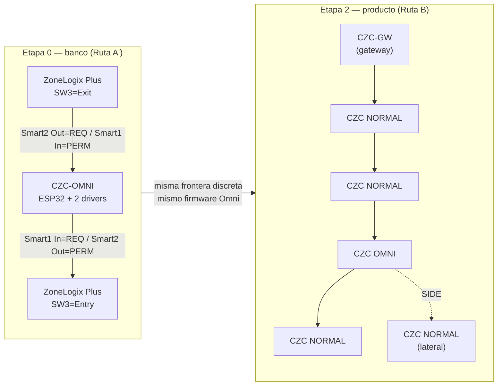
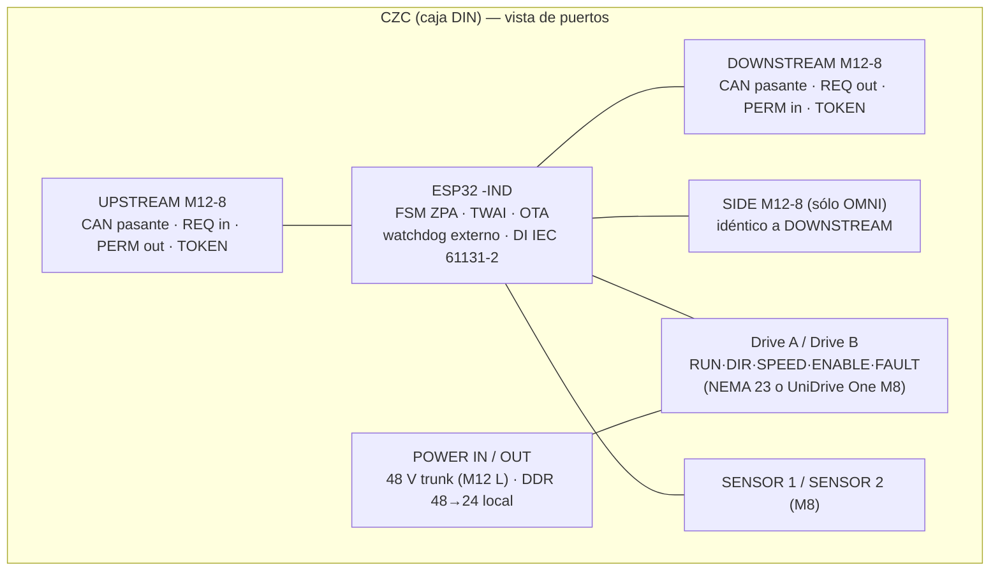

# Lente de control — Rutas A/B/C/D, cadena UPSTREAM/DOWNSTREAM, protocolo de zona y gateway

Proyecto: Conveyone (Chile) — línea ZPA ZP2026 (UniDrive One 24 V + ZoneLogix Plus) con zonas especiales Omni (8 ejes ±45°, 2 familias A/B, 1 motor por familia).
Fecha: 2026-09-03. Documento rector: `ref/HANDOFF_2026-09-03.md` (capa `user`). Base mecánica: `ref/MEMORIA_REV_B.txt` (capa `user`).
Fuentes web: `wf/research_ecosistemas_zpa.md`, `wf/research_controladores_din.md`, `wf/research_potencia_seguridad.md` (+ `.facts.json`), con apoyo puntual de `wf/research_motores_drivers.md` y `wf/research_diverters_comerciales.md`. Textos extraídos de manuales en `wf/pdftext/` y `wf/pdf/`.
Cálculos propios: `wf/calc_control.py` y `wf/calc_control2.py` (salidas en el Anexo). Capas: **user** / **web** (URL + fecha 2026-09-03 + cita en el informe citado) / **calculo**. Lo que no está en ninguna fuente se marca **A VERIFICAR**.

---

## 1. Conclusiones en 10 líneas

1. **Ruta A (conservar ZoneLogix Plus + insertar Omni) sólo es viable como banco de pruebas**: la única interfaz oficial es el Smart I/O (Request/Permission PNP 24 V, ≥18 V) y cada tarjeta ZoneLogix es *o* Entry *o* Exit (DIP SW3), de modo que el patrón del handoff "OMNI – ZONE – OMNI" con **una sola** zona ZoneLogix entre dos Omnis **no es realizable** con interfaz documentada; el RJ-25 no tiene pinout publicado y no se emula.
2. **Ruta D (ecosistema comercial completo: ConveyLinx-Ai2 / MultiControl / IB-E) no cumple las condiciones fijadas**: ninguna tarjeta acciona un NEMA 23, y las que aceptan 2 motores independientes (ConveyLinx "PLC I/O", MultiControl "I/O device") suspenden la lógica local y necesitan PLC para desviar, lo que viola "ZPA local sin PLC" en la Omni. Queda como **D-parcial** (tarjetas comerciales en zonas NORMAL, CZC sólo en Omni) por si un cliente exige tarjetas UL.
3. **Ruta recomendada: C como transición → B como producto.** Prototipo de 3 zonas ZoneLogix(Exit)–CZC-Omni–ZoneLogix(Entry) por Smart I/O en semanas; en paralelo, CZC-NORMAL que mande el UniDrive One directo por su M8 analógico (DIR / SPEED 0–10 V / FALLA), lo que hace innecesario ZoneLogix en el producto.
4. **Separación de 3 capas**: (A) handshake ZPA **discreto** de 4 hilos + 0 V común, cableado y a prueba de fallos (vecino apagado ⇒ sin permiso); (B) **bus CAN 2.0 a 500 kbit/s** pasante por cada caja (UPSTREAM/DOWNSTREAM en el mismo conector que el handshake, sin potencia); (C) potencia 48/24 V por trunk separado. Ethernet sólo en el gateway (opcional KSZ8863 en producto v2).
5. **CAN en vez de RS-485 o Ethernet en cadena**: un nodo sin energía deja el bus pasivo y la cadena sigue (CiA 301; en Ethernet con switch embebido la cadena se corta salvo relé de bypass); trama de 8 B = 0,264 ms a 500 kbit/s; carga estimada 16 % con 20 zonas; ESP32-C6 tiene 2 TWAI y ESP32-P4 3 TWAI (sin CAN-FD).
6. **Auto-direccionamiento por posición** con una línea TOKEN en el conector: el gateway pasa el testigo aguas abajo, cada nodo reclama su posición por CAN y lo propaga; es el mismo principio que el Teach-in de Interroll y el Auto-Configuration de ConveyLinx ("most upstream module = node 1").
7. **Salida lateral = puerto SIDE** con el mismo pinout que DOWNSTREAM; el primer CZC del transportador lateral se enchufa ahí y su PERMISSION sustituye a S2; la confirmación de transferencia lateral se obtiene gratis (llegada a su S1). Si la salida es pasiva, S2 + timeout y la transferencia se marca "no confirmada".
8. **Gateway** = función, no lazo de control: en prototipo vive en el CZC de cabecera (Modbus TCP); en producto, "CZC-GW" con CAN + Ethernet y módulo certificado (Anybus CompactCom / Hilscher netRAPID) o un Anybus Communicator CAN→EtherNet/IP (US$1.216,50/línea) como puente inmediato.
9. **Inconsistencia física a resolver antes del protocolo**: a 1,5 m/s una caja de 500 mm con deslizamiento μ=0,4 necesita 287 mm de frenado ⇒ 787 mm > 598 mm de zona ZP2026; la ZPA singulada con esa caja a esa velocidad exige velocidad de aproximación reducida o segundo sensor (entrada/salida) en la Omni. Además el UniDrive One (350 rpm máx.) da ≈0,92 m/s a 1:1 y ≈1,25 m/s con el carrete Ø68 medido del ZP2026 (A VERIFICAR), no 1,5 m/s.
10. **Latencia del handshake discreto < 5 ms (≈7,5 mm a 1,5 m/s) es alcanzable y determinista**; la latencia de reacción interna de ZoneLogix a la retirada de permiso **no está publicada** (NO ENCONTRADO) y debe medirse en el banco de 3 zonas.

---

## 2. Análisis

### 2.1 Qué fija el usuario y qué se replantea (capa `user`)

| Fijado (no se decide aquí) | Fuente | Se replantea (handoff §16) |
|---|---|---|
| Modularidad física en cadena UPSTREAM → DOWNSTREAM, "que se vea en serie" | Handoff §6, prompts 1 y 3 | ZoneLogix vs propio; bus/protocolo; handshake; topología de red |
| ZPA local que no dependa de PLC ni gateway | Handoff §8-A, §13 | Cantidad de sensores; distribución de potencia; motor/driver |
| Prototipo con ESP32 industrial/DIN y NEMA 23 + driver básico | Handoff §1.7, prompt 1 | Gateway: hardware dedicado, PLC compacto, IPC o función del primer nodo (§9) |
| Base mecánica REV B (8 ejes, 76,2 mm, 2 familias, 1 motor por familia, 1,5 m/s) | Handoff §2, REV B | Velocidad: "por lo menos 1 m/s" (prompt 1) vs 1,5 m/s (REV B) — el usuario debe fijar cuál manda |
| No emular el RJ-25 de ZoneLogix sin documentación | Handoff §1, tarea | Ruta A/B/C y la Ruta D que el handoff no nombra |

### 2.2 Hechos que condicionan la decisión (capa `web`)

| # | Hecho | Fuente (archivo → URL) |
|---|---|---|
| H1 | ZoneLogix Plus/UL/301216: **1 motor por tarjeta**; puertos UPSTREAM/DOWNSTREAM **RJ-25 de 6 hilos**, "pass request and permission signals between adjacent zones"; **pinout eléctrico no publicado** (sólo figura de orientación). | research_ecosistemas_zpa §2.1 y §4.1 → manual UL 301622 `https://static1.squarespace.com/static/6214ff3359371c47894906bf/t/633de65f85938d597b7cffcd/1665001070972/ZoneLogix+UL+Control_ACG+PN+301622_Installation+and+User+Manual.pdf`; Plus 301208 ManualsLib 2998685 |
| H2 | Interfaz oficial para equipos ajenos = **Smart I/O**: Entry: "Smart 1 Input (a PNP input called request)… Smart 2 Output (a PNP output called permission)"; Exit: roles invertidos; "Smart I/O is active above 18 Volts DC (PNP)"; salidas 24 V/500 mA; "when permission is removed the zone will attempt to stop any discharge". | ídem (pdftext/zonelogix_UL_manual_301622.txt líneas 587-623; spec S-UD22011001R01) |
| H3 | **El rol de Smart 1/Smart 2 lo fija el DIP SW3** ("Exit/Transport" OFF / "Entry/Transport" ON): "The function of Smart 1 Input and Smart 2 Output depends on the current switch 3 settings"; en zona intermedia "Do not connect anything to the Smart 1 Input or the Smart 2 Output". | manual UL 301622 líneas 276 y 606 |
| H4 | ZoneLogix Plus/UL **no tiene red**; sólo PRO 2.0 (RJ-45 propio "To EOB/To Master", Branch Monitor EtherNet/IP o Profinet, "Each motor is paired with one ZoneLogix PRO 2.0 controller"). PRO: Breakout Module 300332 expone el handshake y "breaks the Handshaking so that Zone #5 cannot make a Request to Zone #4"; firmware y configuración replicados en todas las zonas. | research_ecosistemas_zpa §2.1 → guía PRO Rev 1.0 `https://static1.squarespace.com/static/6214ff3359371c47894906bf/t/6373ab1c1d74c15de4427cd4/1668524831294/ZoneLogix+PRO+Zone+Controller+User+Guide+Rev+1.0.pdf`; spec PRO 2.0 S-UD23041400R01 |
| H5 | ZoneLogix "Search and Rescue": al energizar, cada zona corre 2,5 s (Run-On-Time a velocidad máxima) desde la salida hacia arriba; BMC (SW3 ON + sensor puenteado + Slug In = marcha/paro) convierte la tarjeta en driver básico. | manual UL 301622 líneas 755-821 |
| H6 | UniDrive One: BLDC 24 V, 60 W, **70–350 rpm**, M8 5 pines (+24 V, DIR <4 V/>7 V, GND, FALLA colector abierto, VELOCIDAD 2,3–10 V); ACG lo declara operable por Interroll DriveControl/ZPA Control/MultiControl, P+F G20 y B+W BWU-4246 ("Information is provided as a courtesy"). | research_ecosistemas_zpa §2.1 → `https://static1.squarespace.com/static/6214ff3359371c47894906bf/t/64d4fb226155ec081f1c20c5/1691679523485/UniDrive+Unidrive+One+S-UD23062200R01.pdf` |
| H7 | ConveyLinx-Ai2: 2 motores Senergy-Ai, switch 3 puertos RJ-45, EIP/PROFINET/Modbus TCP/CC-Link; Auto-Configuration: "The Module located at the most upstream or in-feed end of the conveyor is defined as the Auto-Configuration Node"; "PLC I/O mode… suspends all of its internal ZPA logic control"; interfaz con ajenos por pin 2 M8 "Wake Up" / "Product on Zone" / "Lane Full"; lógica y motores con alimentación separada: "keep the logic and communications powered and active and disconnect the MDR Power… in an E-Stop situation". Precio US$604,10 (Radwell). | research_ecosistemas_zpa §2.2 → `https://robotunits.com/wp-content/uploads/2023/02/User-Manual-ConveyLinx-Ai2-V2.1.pdf` (pdftext/conveylinx_ai2_v21.txt l.1195-1200, 2320-2323); `https://www.pulseroller.com/products/24-volt/senergy-ai-controllers/conveylinx-ai2-ai3` |
| H8 | Interroll MultiControl: 4 RollerDrive (24/48 V, lógica 24 V separada), switch 2 puertos M12-D, PROFINET/EIP/EtherCAT, Teach-in ("automatic addressing… started on the first MultiControl… independent of the physical structure of the bus line"), handshake externo "Out Up / In Up / Out Down / In Down"; en "I/O device… it cannot start or stop motors… independently". US$314,95 (Ultimation). | research_ecosistemas_zpa §2.2 → `https://www.interroll.com/fileadmin/Downloads/User_Manuals/Controls/MultiControl/User_Manual_MultiControl_EN.pdf`; suplemento 2018-08-01 (pdftext/interroll_multicontrol_supp.txt l.2272-2349, 4926-4948) |
| H9 | Itoh IB-E03/E04: 2 motores 24 V, EtherNet/IP + DLR, Master Mode "stand alone… able to operate independently… may be able to function even after disconnecting it from the network" (ladder ICE). ≈US$658. Sin 48 V (NO ENCONTRADO). | research_ecosistemas_zpa §2.2 → `https://www.ultimationinc.com/wp-content/uploads/2019/12/IB-E03-IB-E04-and-ICE-Manual.pdf` (pdftext/itoh_IBE03_IBE04_manual.txt l.1730-1736) |
| H10 | P+F G20 ZPA: acople de zonas X1/X2 con IN/OUT 24 V "compatible with the standard 24 V IOs of a PLC"; semántica: "release signal… expects the release signal to last until the conveyed product has left the zone sensor. If… withdrawn… the motor is stopped"; en Direct Control ambos motores comparten dirección. | research_ecosistemas_zpa §2.2 → `https://files.pepperl-fuchs.com/webcat/navi/productInfo/doct/tdoct5942c_eng.pdf` (pdftext/pf_g20_zpa_manual.txt l.455-471) |
| H11 | Comunicación en cadena: CANopen 127 nodos, 100 m @ 500 kbit/s, 25 m @ 1 Mbit/s; heartbeat: "If the heartbeat cycle fails… the heartbeat consumer will be informed"; boot-up inesperado = "erroneous power supply". RS-485: 32 UL (256 con 1/8 UL), L×bps < 10⁷. EtherCAT: puerto del vecino caído se cierra, "the rest of the network can continue" (los aguas abajo se pierden en línea). PROFINET MRP ≤200 ms para ≤50 nodos. Bypass Ethernet pasivo = patentes US12170518 / US9641245. | research_potencia_seguridad §2(c) → `https://forum.opencyphal.org/uploads/short-url/mNWuvY23DYckSFoSbfam0ji3YWn.pdf`; `https://www.can-cia.org/can-knowledge/error-control-protocols`; `https://www.ti.com/lit/pdf/slla272`; `https://www.ethercat.org/en/technology.html`; `https://infosys.beckhoff.com/content/1033/ethercatsystem/2474143371.html`; `https://patents.google.com/patent/US12170518B2/en` |
| H12 | ESP32: ninguna placa DIN comercial con 2 RJ-45; driver Espressif KSZ8863 (switch 3 puertos, ESP32/ESP32-P4); ESP32-C6 = 2 TWAI, ESP32-P4 = 3 TWAI, sin CAN-FD; OTA con dos particiones y rollback; brownout integrado; watchdog externo (MAX6369/TPS3823). Candidatos prototipo: M5Stack StamPLC (CAN+RS485+8 DI opto, US$42,90, sin Ethernet, 0–40 °C) y Waveshare ESP32-S3-ETH-8DI-8RO-C (Ethernet + RS485 + CAN aislado + 8 DI, ≈45–50 €). Esclavo EtherCAT/PROFINET nativo en ESP32: no maduro. | research_controladores_din §1, §2(a), §2(c) → `https://components.espressif.com/components/espressif/ksz8863`; `https://docs.espressif.com/projects/esp-idf/en/stable/esp32c6/api-reference/peripherals/twai.html`; `https://docs.espressif.com/projects/esp-idf/en/stable/esp32/api-reference/system/ota.html`; `https://docs.m5stack.com/en/core/StamPLC`; `https://www.waveshare.com/esp32-s3-eth-8di-8ro-c.htm` |
| H13 | Gateways: Anybus Communicator CAN→EtherNet/IP AB7318 US$1.216,50 (2 puertos con switch), AB7317 CAN→PROFINET; Anybus CompactCom 40 / Hilscher netRAPID 90 (módulos pre-certificados, precio no público); S7-1215C 2 puertos US$649,99. | research_controladores_din §2(e) → `https://www.industrialnetworking.com/Manufacturers/HMS-Anybus-Fieldbus-Gateways/HMS-Anybus-Communicator-CAN-EtherNet-IP-Gateway-AB7318` |
| H14 | Precedentes de zona especial: Flowsort SLD/DLD = ConveyLinx-Ai2 + 2 PGD024 + bloques de función en PLC ("Full PLC mode"); Interroll HPD = MultiControl con 2 motores (programa "ZPA HPD" autónomo o "I/O device"); Itoh F-RAT-NX = IB-E04F + HBM-201 o tarjetas CB/CBK. | research_ecosistemas_zpa §2.4; research_diverters_comerciales §2.1-2.3 → `https://flowsort.com/wp-content/uploads/2026/03/Integration-Manual-SLD-DLD-24V-V3-1-2.pdf`; `https://www.interroll.com/fileadmin/user_upload/A_FRANCE/French/MCP_techni_doc/MultiControl_HPD_PLC_rev04.pdf` |
| H15 | Precios ZoneLogix Plus/UL/PRO y UniDrive One: **NO ENCONTRADOS**. Distribuidores en Chile de ACG, Pulseroller, Interroll, Itoh: **NO ENCONTRADOS**. | research_ecosistemas_zpa §1.9-1.10, §4 |

### 2.3 Números que gobiernan el control (capa `calculo`, verificados en `calc_control.py` / `calc_control2.py`)

**Recorrido de la caja por latencia**: d = v·t.

| Latencia | 1,0 m/s | 1,5 m/s | Comentario |
|---|---|---|---|
| 2 ms (ciclo FSM) | 2 mm | 3 mm | objetivo de ciclo local |
| 5 ms (handshake discreto extremo a extremo) | 5 mm | 7,5 mm | opto + filtro tipo 3 + salida (A VERIFICAR con componentes) |
| 20 ms | 20 mm | 30 mm | ciclo PLC típico + red: **no** puede estar en el lazo de colisión |
| 100 ms | 100 mm | 150 mm | pérdida de gateway tolerable sólo si la ZPA es local |
| 200 ms (MRP ≤50 nodos) | 200 mm | 300 mm | un anillo Ethernet reconvergiendo = una zona entera recorrida |

**Trama de bus**: CAN 8 B = 132 bits máx. (8n+44+⌊(34+8n−1)/4⌋) → 0,264 ms @ 500 kbit/s, 0,132 ms @ 1 Mbit/s; RS-485 Modbus RTU 16 B a 115 200 bd → 1,53 ms + 0,33 ms de silencio; Ethernet store-and-forward 64 B = 6,7 µs/salto → 20 saltos = 134 µs sin colas. **Carga CAN** con N zonas × (10 heartbeat/s + 20 estados/s): 7,9 % (10), 15,8 % (20), 39,6 % (50) @ 500 kbit/s. **OTA por CAN**: 1 MB ≈ 29 s por nodo a 500 kbit/s con 55 % de eficiencia (A VERIFICAR).

**Distancia de frenado y contención en zona** (d = v²/(2·μ·g), rodillos frenan más rápido que μ·g; μ A VERIFICAR, FISICA usa 0,3–0,6):

| v | μ | d frenado | 500 mm + d vs zona 598 | 300 mm + d vs 598 |
|---|---|---|---|---|
| 1,0 | 0,4 | 127 mm | **627 > 598 (no cabe, +29)** | 427 (cabe) |
| 1,0 | 0,5 | 102 mm | 602 ≈ 598 (límite) | 402 (cabe) |
| 1,5 | 0,4 | 287 mm | **787 > 598 (+189)** | 587 (cabe justo) |
| 1,5 | 0,5 | 229 mm | **729 > 598 (+131)** | 529 (cabe) |

Consecuencia para el protocolo: con la caja de 500 mm la zona ZP2026 de 598 mm **no contiene** frente + frenado a 1,5 m/s (ni a 1,0 m/s con μ ≤ 0,4). Esto **contradice** la premisa implícita de REV B/handoff de ZPA singulada a 1,5 m/s con esas cajas y esas zonas, salvo (i) velocidad de aproximación reducida antes del sensor (dos velocidades, como el "Speed In 0–10 V" de ZoneLogix o las rampas de ConveyLinx), (ii) un segundo sensor longitudinal en la Omni (entrada/salida) o (iii) aceptar que la caja detenida ocupe dos zonas (respuesta a §5 "caja sobre dos zonas": debe ser un estado previsto, no una falla). Holgura temporal en zona: caja 500 → 98 mm = 65 ms a 1,5 m/s; caja 300 → 298 mm = 199 ms.

**Velocidad de las zonas NORMAL** (contradice REV B): UniDrive One 350 rpm → 0,916 m/s a 1:1 con Ø50; con el carrete Ø68 medido en el GLB del ZP2026 arrastrando rodillos Ø50 por o-ring, 350 × 68/50 = 476 rpm → **1,25 m/s** (A VERIFICAR: diámetros de garganta reales). Para 1,5 m/s harían falta 573 rpm (relación 1,64:1) o el UD100 (570 rpm, sólo ZoneLogix PRO 2.0, 24 V). La Omni a 1,5 m/s con vecinos a ≤1,25 m/s obliga a perfiles de velocidad distintos por zona → parámetro del protocolo, no un valor único de línea.

### 2.4 Comparación formal de rutas

Definiciones: **A** = ZoneLogix Plus en NORMAL + CZC-Omni (ESP32 + 2 drivers) insertado por Smart I/O. **B** = Conveyone Zone Controller (CZC) en todas las zonas, ZONE_TYPE NORMAL/OMNI, protocolo propio. **C** = A hoy + desarrollo de B en paralelo, misma interfaz discreta como puente. **D** = ecosistema comercial (ConveyLinx-Ai2 / MultiControl / IB-E) en todas las zonas, incluida la Omni.

| Criterio | A | B | C | D |
|---|---|---|---|---|
| Interfaz oficial disponible | Sí, Smart I/O (H2). Pero 1 tarjeta = 1 rol Entry **o** Exit (H3): entre dos Omnis se necesitan ≥2 ZoneLogix (una Entry, una Exit) o usar la tarjeta en BMC (H5), que la degrada a driver básico | Propia (a definir aquí) hacia el UniDrive One vía M8 (H6) | A + B | Sí (H7-H9), pero ninguna acciona NEMA 23 (research_controladores_din §2(d)); Omni con 2 motores independientes sólo en modos PLC (H7, H8) o ladder IB-E 24 V (H9) |
| Documentación del puerto peer-to-peer | RJ-25: NO (H1) | N/A — se documenta el propio | RJ-25 no se toca | ConveyLinx/MultiControl: Ethernet estándar documentado; ZoneLogix PRO: RJ-45 propietario |
| Determinismo/latencia del handshake | Discreto PNP: < 5 ms lado CZC; reacción interna ZoneLogix **NO ENCONTRADA** | Discreto cableado: < 5 ms medible y determinista | igual que A en la frontera, B en el resto | Por Ethernet entre vecinos (ConveyLinx "positive confirmation of carton arrival"); latencia no publicada; PROFINET RT 250 µs–512 ms |
| Auto-direccionamiento por posición | No existe (DIP) | Sí por diseño (TOKEN, §2.6) | — | ConveyLinx Auto-Config y MultiControl Teach-in (H7, H8); Itoh: IP por software |
| Nodo apagado / pérdida de vecino | Smart2 Out cae ⇒ sin permiso (seguro); RJ-25 entre ZoneLogix: comportamiento NO ENCONTRADO | PERM cae ⇒ seguro; CAN pasivo sigue (H11) | — | Ethernet en línea se corta tras el nodo apagado salvo lógica alimentada aparte (ConveyLinx) o anillo MRP/DLR (H7, H11) |
| Actualización de firmware | ZoneLogix Plus: no aplicable; PRO 2.0 sí (H4) | OTA dual-slot con rollback por CAN, zona por zona sin parar la línea (§2.10) | — | EasyRoll (ConveyLinx), ICE (Itoh), Interroll |
| Integración PLC (EIP/PROFINET) | Sólo a través del gateway del CZC-Omni; ZoneLogix Plus no tiene red | Gateway de cabecera (Anybus / módulo certificado) | ídem | Nativa en cada tarjeta (H7, H8, H9) |
| Costo de control por zona | ZoneLogix: NO ENCONTRADO (ya adquirido = costo hundido) | Prototipo ≈US$45 de placa DIN + E/S + caja (total A VERIFICAR); producto PCB propia A VERIFICAR | A + B | ConveyLinx US$604 (1–2 zonas); MultiControl US$315/4 zonas ≈ US$79; IB-E ≈US$329/zona; ZoneControl US$174 |
| Tiempo de desarrollo | Semanas (interfaz + firmware Omni) | Meses (ZPA completa, recuperación, diagnóstico, HW industrial) | Semanas al banco, meses al producto | Semanas para NORMAL (teach-in); Omni exige de todos modos CZC o cambiar motores |
| Riesgo de confiabilidad industrial | Bajo en NORMAL (producto maduro); medio en la frontera (timing no publicado) | Alto hasta cumplir lista de §2(f) de research_controladores_din (DI IEC 61131-2, watchdog externo, −20…+55 °C, UL) | Medio | Bajo (UL/ETL, IP54) |
| Dependencia de proveedor | ACG (sin canal en Chile, H15) | Ninguna crítica (ESP32 + drivers genéricos) | ACG durante la transición | Pulseroller/Interroll/Itoh (sin canal en Chile, H15) |
| Coherencia con modularidad UPSTREAM/DOWNSTREAM | Parcial: dos sistemas de cable (RJ-25 y Smart I/O) | Total: un conector por lado, idéntico en NORMAL y OMNI | Parcial → total | Total en NORMAL; la Omni queda como isla |
| Cumple "ZPA local sin PLC" en la Omni | Sí (CZC) | Sí | Sí | **No** en ConveyLinx/MultiControl (H7, H8); sí sólo IB-E ladder 24 V |

**Veredicto.** A y D fallan cada una en una condición dura del usuario (A: patrón OMNI–ZONE–OMNI con una sola zona y timing no documentado; D: NEMA 23 y "sin PLC" en la Omni). B es la única que satisface todas, al precio de asumir el riesgo de confiabilidad; C lo administra: banco A' con hardware existente, producto B, y D-parcial (MultiControl 48 V con UniDrive One, ACG lo lista como compatible, H6) como plan de contingencia para zonas NORMAL si un cliente exige tarjetas certificadas, manteniendo la misma frontera discreta hacia el CZC-Omni (MultiControl "Handshake In/Out Up/Down", H8).



### 2.5 Las tres capas del handoff §8, resueltas

**Capa A — handshake ZPA discreto "CZ-HS v1"** (4 señales + 0 V común, PNP 24 V, activo ≥ 18 V para ser compatible con Smart I/O, H2):

| Señal | Dirección | Significado | Estado seguro (cable roto / vecino apagado) |
|---|---|---|---|
| REQ | N → N+1 | "Tengo caja lista para descargar / estoy descargando" | 0 = nada que recibir |
| PERM | N+1 → N | "Puedo recibir; mantén la descarga" | 0 = **no descargar** (igual que ZoneLogix "attempt to stop any discharge" y P+F "motor is stopped", H2, H10) |
| TOKEN | bidireccional (open-drain) | Descubrimiento de posición (§2.6); en régimen, presencia de vecino | sin pull ajeno = sin vecino |
| 0 V | común | Referencia; obligatorio unir 0 V de fuentes adyacentes (ZoneLogix: "connect their 0VDC grounds together", manual UL l.1004) | — |

Reglas (tomadas de los tres ecosistemas documentados para que la Omni sea "otra zona" para cualquiera de ellos): (1) PERM se mantiene hasta que la caja ha **llegado** al sensor del receptor (confirmación de llegada = flanco de bajada de PERM), como P+F/Interroll ("must be active until the conveyed items no longer block the zone sensor", H8/H10) y ConveyLinx ("positive confirmation of carton arrival", H7); (2) PERM retirado ⇒ parada inmediata sin run-on (P+F, H10); (3) REQ se mantiene hasta que S1 del emisor se libera + Run-On propio (equivalente al Search & Rescue local de ZoneLogix, H5); (4) S1 manda sobre el handshake: una caja que aparece sin REQ (arrastre en power-up de un ZoneLogix vecino, H5) pasa la zona a OCCUPIED, no a FAULT; (5) timeouts: T_arrival = L_zona/v × 2 (≈0,8 s a 1,5 m/s) ⇒ "arrival jam"; S1 permanentemente activo > T_sensor ⇒ "sensor jam" (mismos conceptos que ConveyLinx §6.3).

**¿Discreto y/o por bus?** Discreto **y** bus, con roles distintos: el discreto es el único que decide movimiento; el bus lleva la misma información en estado (para diagnóstico y para tracking de caja/ruta) pero **nunca** la sustituye. Razón numérica: el discreto es < 5 ms y no tiene modos de fallo de software; un permiso por bus exige que un nodo intermedio esté vivo y libre de errores (y en Ethernet, energizado). Es exactamente la separación que ZoneLogix PRO hace en su cable ("Branch Serial Communications" + "Handshaking", H4) y ConveyLinx al alimentar la lógica aparte (H7).

**Capa B — bus de datos/supervisión: CAN 2.0B, 500 kbit/s, pasante.**

| Alternativa | Por qué no / por qué sí |
|---|---|
| **CAN (elegido)** | Multi-maestro, arbitraje por prioridad, detección de errores en hardware, heartbeat/boot-up definidos (H11); nodo apagado = pasivo (transceptor sin alimentación en alta impedancia: A VERIFICAR para el modelo elegido); 100 m @ 500 kbit/s cubre 50 zonas ZP2026 (29,9 m); TWAI nativo en ESP32 (H12); gateway CAN→EIP/PROFINET de catálogo (H13). |
| RS-485 / Modbus RTU | Tolera nodo apagado y hasta 256 nodos, pero maestro único (el gateway) ⇒ todo dato vecino-a-vecino transita por el gateway; sin detección de errores en hardware; 1,5 ms/trama a 115 200 bd. Aceptable como respaldo (StamPLC lo trae). |
| Ethernet con switch de 2 puertos en cada nodo | No hay placa ESP32 comercial (H12); un nodo apagado corta la cadena salvo relé de bypass (H11); riesgo de bucle con KSZ8863 en modo switch; latencia por salto irrelevante (134 µs/20 saltos) pero la **disponibilidad** no. Reservado para producto v2 sólo si un cliente exige Ethernet por zona. |
| EtherCAT / PROFINET / EIP nativo por nodo | Esclavo EtherCAT sobre ESP32 "NOT fully working"; p-net con licencia y tramas L2; OpENer sin port (research_controladores_din §2(c)). Se resuelve en el gateway. |
| CAN-FD | ESP32 no lo tiene (H12); no necesario (carga 16 % con 20 zonas). |

Conjunto mínimo de mensajes (identificadores 11 bits, prioridad = valor bajo): 0x0xx emergencia/FAULT (driver fault, E-stop informado); 0x1xx heartbeat 100 ms con estado FSM + S1/S2 + REQ/PERM leídos; 0x2xx eventos (llegada, salida, desvío, jam) con contador; 0x3xx comandos del gateway (ENABLE_ZONE, ROUTE_MODE, DIVERT_ENABLE, SPEED_PROFILE, RESET_FAULT, MAINTENANCE) con número de secuencia y vigencia; 0x4xx descubrimiento/TOKEN; 0x5xx-0x6xx SDO-like para parámetros y OTA por bloques. Un nodo que deja de recibir heartbeat del gateway > 1 s conserva la ZPA y bloquea desvíos que requieran ruta nueva (política del handoff A2 §17, capa user del digest).

**Capa C — potencia**: trunk 48 V IN/OUT y 24 V local (DDR 48→24) en conector separado (M12 L-coded 16 A/63 V DC según research_potencia_seguridad §2(b)); **no** se mezcla con UPSTREAM/DOWNSTREAM. Respuesta a §11: UPSTREAM/DOWNSTREAM = **comunicación + handshake** (opción 2), sin 24 V de potencia; los optos del handshake se alimentan del lado emisor (PNP), así "vecino sin energía" ⇒ señal en 0 por física.

**Pinout propuesto UPSTREAM / DOWNSTREAM / SIDE** (M12 8 polos A-coded, mismo pinout en los tres; el cable es recto): 1 CAN_H, 2 CAN_L, 3 REQ (sale por DOWNSTREAM, entra por UPSTREAM), 4 PERM (entra por DOWNSTREAM, sale por UPSTREAM), 5 TOKEN, 6 0 V, 7–8 LOOP (puente dentro del conector macho para detectar "cable conectado" aunque el vecino esté apagado), blindaje a FE. Terminación CAN 120 Ω conmutada por el nodo cuando LOOP indica "sin cable" en DOWNSTREAM (fin de línea). A VERIFICAR: capacidad de corriente y compatibilidad EMC del M12-A con CAN + señales 24 V en el mismo cable (alternativa: M12-A para handshake + M12-A/CiA 303-1 separado para CAN).



### 2.6 Cómo se descubre la secuencia física y se direcciona por posición

1. Al energizar: salidas OFF, PERM = 0, REQ = 0, CAN en modo "sin dirección" (ID temporal derivado del número de serie de 48 bits, resolución de colisión por el propio arbitraje CAN).
2. El gateway (o el nodo con UPSTREAM sin cable = cabecera) publica `DISCOVER k=1` y baja TOKEN en su DOWNSTREAM.
3. El nodo que ve TOKEN activo en su UPSTREAM responde `CLAIM(serial, k, tipo NORMAL/OMNI)`; el gateway le asigna ID = k y le entrega configuración (velocidades, rutas); el nodo suelta su TOKEN de DOWNSTREAM con `DISCOVER k+1`. Un OMNI hace lo mismo en su SIDE con marca de rama (`k.1`), de modo que el gateway construye el grafo, no sólo la lista.
4. Fin: el nodo cuyo DOWNSTREAM tiene LOOP abierto (sin cable) se declara "fin de línea" y activa terminación CAN; ese nodo **no** descarga salvo que se configure como salida a equipo externo (permiso por su DOWNSTREAM cableado a la máquina externa o al PLC, igual que ZoneLogix Exit, H2).
5. Reemplazo en caliente: el vecino aguas arriba detecta cambio de serie en la misma posición (TOKEN a demanda) y el gateway repone configuración y firmware al nodo nuevo — mismo comportamiento que ZoneLogix PRO ("the complete configuration of the entire branch is stored in every Zone Controller… automatically update… the firmware in the new controller", guía PRO l.1020-1046) y ConveyLinx (Module Replacement). Para que funcione sin gateway, cada nodo guarda la configuración de sus dos vecinos (redundancia local).

Equivalentes documentados: ConveyLinx ("most upstream module… node 1", H7) e Interroll Teach-in ("always started on the first MultiControl… addresses incremented by 1", H8). La diferencia es que aquí el orden lo prueba una **línea física** (TOKEN), no el orden lógico del bus, lo que hace imposible una numeración incoherente con el cableado.

### 2.7 Salida lateral como segundo downstream lógico

- El CZC-OMNI tiene tres puertos de zona: UPSTREAM, DOWNSTREAM y **SIDE**, los tres con el pinout de §2.5. El transportador lateral empieza con un CZC-NORMAL cuyo UPSTREAM se enchufa en SIDE. Para ese CZC la Omni es simplemente "su upstream".
- La tabla de decisión del handoff §4 se reescribe con dos downstream lógicos: `dest = {DOWN, SIDE}`, cada uno con su par REQ/PERM y su timeout; `RouteMode = STRAIGHT | SIDE | ANY` y `DivertPriority = THROUGH_FIRST | SIDE_FIRST` (capa user, digest A2 §5). Una caja "que debe desviarse" (ruta del PLC) se atiende con SIDE_FIRST; sin gateway, vale la última ruta cacheada o STRAIGHT.
- **S2 "Side Available" deja de ser un sensor y pasa a ser PERM del puerto SIDE** cuando la salida es un CZC; si la salida es pasiva (mesa, rampa, equipo de terceros), un "adaptador SIDE" lleva S2 (sensor de espacio) y opcionalmente un permiso externo a los mismos pines PERM, y REQ queda como salida disponible para el tercero. Esto responde a §4: "espacio disponible" ≠ "caja transferida".
- **Confirmación de transferencia lateral (pregunta 13): sí**, y se obtiene del handshake: flanco de bajada de PERM(SIDE) causado por S1 del CZC lateral + liberación de S1 de la Omni dentro de T_div. Con salida pasiva sólo hay S1 de la Omni + timeout ⇒ el evento se publica como "transferencia no confirmada" y el gateway decide si permite el siguiente desvío.
- Precedente del "romper el handshake" hacia un destino que no corresponde: ZoneLogix PRO Breakout Module (H4). Aquí el equivalente es que la Omni sólo activa REQ en el puerto elegido.

### 2.8 Qué es el gateway

Funciones (handoff §9): topología (§2.6), configuración y parámetros, rutas y recetas, conteos, alarmas, firmware, traducción al protocolo del PLC. **Nunca** cierra el lazo de colisión (100 ms de pérdida = 150 mm a 1,5 m/s, §2.3).

| Opción | Cuándo | Evidencia |
|---|---|---|
| Función del primer CZC (cabecera) con Ethernet + Modbus TCP | Prototipo y líneas sin PLC | Waveshare 8DI-8RO-C trae Ethernet + CAN + RS485 (H12) |
| CZC-GW dedicado (DIN): CAN + Ethernet + módulo Anybus CompactCom 40 / netRAPID 90 para EIP o PROFINET certificados | Producto | research_controladores_din §2(c) (precio módulo NO ENCONTRADO) |
| Anybus Communicator CAN→EtherNet/IP AB7318 (US$1.216,50) o CAN→PROFINET AB7317 | Primer cliente con PLC antes de tener CZC-GW | H13 |
| PLC compacto 2 puertos (S7-1215C US$649,99) como cabecera | Cliente Siemens que además quiera lógica de ruteo en el PLC | H13 |

Descartado: IPC (sobredimensionado para 20–50 zonas) y "PoE para el gateway" (irrelevante: el gateway se alimenta del trunk 24 V).

### 2.9 Diagramas de tiempo

**Transferencia entre dos zonas (N → N+1), CZ-HS v1**

```mermaid
sequenceDiagram
  participant SN as S1 zona N
  participant ZN as CZC N
  participant ZN1 as CZC N+1
  participant SN1 as S1 zona N+1
  Note over ZN1: vacía ⇒ PERM=1 (permiso permanente, como ZoneLogix Entry / P+F release)
  SN->>ZN: caja detectada (S1=1)
  ZN->>ZN1: REQ=1 (t0)
  ZN->>ZN: motor RUN (PERM ya =1)
  ZN1->>ZN1: motor RUN "receiving" al ver REQ=1 (t0 + <5 ms)
  SN->>ZN: S1=0 (cola de caja sale)
  ZN->>ZN: Run-On T_ro, luego STOP; REQ=0
  SN1->>ZN1: S1=1 llegada (t0 + L/v ≈ 400 ms a 1,5 m/s)
  ZN1->>ZN: PERM=0 (= confirmación de llegada)
  Note over ZN: si PERM no cae antes de T_arrival = 2·L/v ⇒ ARRIVAL_JAM
  ZN1->>ZN1: DECIDE (downstream / side / hold)
  ZN1->>ZN: PERM=1 cuando N+1 vuelva a estar vacía
```

**Desvío lateral en la Omni**

```mermaid
sequenceDiagram
  participant O as CZC OMNI
  participant D as CZC downstream
  participant L as CZC lateral (SIDE)
  Note over O: OCCUPIED: S1=1, caja íntegra en la Omni (REQ upstream=0, t_settle cumplido)
  D-->>O: PERM(DOWN)=0 (bloqueado)
  L-->>O: PERM(SIDE)=1 (lateral vacío) y DIVERT_ENABLE
  O->>O: A: RUN(+) rampa; B: RUN(−) rampa (nunca inversión a plena velocidad)
  O->>L: REQ(SIDE)=1
  L->>L: motor RUN "receiving"
  Note over O,L: t_div ≈ 0,5–0,9 s (FISICA: recorrido (400+W)/2 + margen, a=1–3 m/s²)
  L-->>O: PERM(SIDE)=0 (S1 lateral = llegada confirmada)
  O->>O: S1=0 ⇒ Run-On, STOP A y B, REQ(SIDE)=0, EMPTY
  O-->>D: (sin cambios)
  Note over O: si PERM(SIDE) no cae en T_div_max (≈2 s) ⇒ DIVERT_JAM: STOP ambos, retirar PERM upstream
```

Sobre "CENTERED" (handoff §5): desde el control, la condición necesaria para ordenar A+/B− es que la caja ya no apoye en la zona anterior (REQ upstream = 0 y S1 estable ≥ t_settle); si la caja apoya en dos zonas, la familia que retrocede la empuja contra rodillos parados (guiñada/atasco). Si además "centrado lateral" es necesario es pregunta de la lente mecánica. Con un solo S1 la Omni no sabe dónde está la cola de la caja: por §2.3 (frenado 229–382 mm a 1,5 m/s) conviene **S1a en la entrada y S1b en la salida** de la Omni; S1a–S1b da además la longitud de la caja (t × v) y detecta "caja entre sensores".

### 2.10 Comportamiento ante fallas (preguntas 7, 8, 9 del handoff)

| Evento | Capa A (discreto) | Capa B (CAN) | Resultado |
|---|---|---|---|
| Nodo N pierde 48 V (motores) pero conserva 24 V | Sigue el handshake; N no concede PERM si no puede recibir (drive fault) | Reporta FAULT_POWER | Upstream acumula; downstream vacía; ZPA intacta |
| Nodo N pierde toda energía | PERM(N→N−1) = 0 físico; REQ(N→N+1) = 0 | Bus sigue (nodo pasivo; A VERIFICAR transceptor); heartbeat de N desaparece ⇒ alarma en gateway | N−1 y anteriores acumulan; N+1… siguen operando; comunicación **sí** pasa por el nodo apagado (pregunta 8: sí, por eso CAN y no Ethernet) |
| Cable UPSTREAM/DOWNSTREAM desconectado | LOOP abierto ⇒ ambos lados a "sin vecino": el de arriba no descarga; el de abajo se declara cabecera parcial y **no** acepta ni descarga hasta reconfigurar | Bus partido: el tramo sin gateway sigue con ZPA local | Sin colisiones; sin gateway en el tramo aislado |
| Reinicio / brownout | Salidas OFF por hardware durante boot; PERM=0 hasta autodiagnóstico; S1 activo al arrancar ⇒ OCCUPIED (no movimiento espontáneo) | Boot-up message (CiA: boot-up inesperado = síntoma de alimentación, H11) | Nada se mueve hasta que el nodo concede/recibe permiso; equivalente controlado del Search & Rescue (H5), pero **con** permiso |
| Actualización de firmware del nodo N (pregunta 9) | N retira PERM y no emite REQ durante la escritura; caja en N permanece | OTA por bloques por CAN (≈29 s/MB, §2.3), slot A/B con rollback (H12); el gateway actualiza de a un nodo y verifica heartbeat con versión nueva antes de seguir | La línea sigue: sólo la zona N está "ocupada" ~1 min; sin parada total |
| Pérdida de gateway | Ninguno | Los nodos mantienen última configuración; desvíos con ruta nueva bloqueados | ZPA local íntegra (requisito §13) |
| Driver A o B en FAULT en la Omni | STOP A y B; PERM upstream = 0; REQ down/side = 0 | EMERGENCY con código | Requisito §13 "driver fault = detener ambos grupos" |
| E-stop | Circuito de seguridad corta 48 V de motores (STO o contactor), independiente del ESP32; lógica 24 V viva | Nodos reportan "48 V ausente" | Patrón ConveyLinx (H7); PL/categoría por evaluación de riesgo (lente seguridad) |

### 2.11 Recomendación por etapas

| Etapa | Alcance | Hardware | Criterio de salida |
|---|---|---|---|
| 0 — Banco 3 zonas (Ruta A') | ZoneLogix Plus (SW3 Exit) → CZC-OMNI → ZoneLogix Plus (SW3 Entry) por Smart I/O; sin RJ-25 hacia la Omni; 0 V comunes | Placa ESP32 DIN con DI opto (StamPLC o Waveshare 8DI-8RO-C), módulo de E/S 24 V PNP, 2 × NEMA 23 + driver (según lente motores), CZ-HS v1 sólo en la Omni | Medir: latencia ZoneLogix a retirada de permiso (NO publicada), Run-On 2,5 s en arranque, arrival jam, 100 ciclos sin colisión a la velocidad real de los UniDrive (≈0,9–1,25 m/s, §2.3) |
| 1 — CZC-NORMAL | Mismo firmware/FSM con ZONE_TYPE = NORMAL mandando el UniDrive One por M8 (DIR, SPEED 0–10 V, FALLA); reemplaza un ZoneLogix del banco | Igual placa; salida analógica 0–10 V o PWM filtrado (A VERIFICAR con la entrada de 2,3–10 V del motor, H6) | Banco CZC-NORMAL → CZC-OMNI → CZC-NORMAL con CAN y TOKEN funcionando; pruebas de fallas de §2.10 |
| 2 — Producto (Ruta B) | PCB propia CZC (ESP32-C6/P4 -IND o MCU industrial): DI IEC 61131-2 aisladas, watchdog externo, salidas OFF en boot, CAN aislado pasante, 3 puertos M12-8, DDR 48→24, −20…+55 °C, ensayo IEC 60068-2-6; CZC-GW con módulo certificado | Lista de requisitos = tabla 2(f) de research_controladores_din (la "vara" ConveyLinx/MultiControl: switch/bus integrado, ZPA sin PLC, modo PLC, UL/ETL, IP54) | FAT NORMAL–OMNI–NORMAL a velocidad objetivo; UL 61010-2-201 / EN 61131-2 según mercado |
| Contingencia (D-parcial) | Zonas NORMAL con MultiControl 48 V + UniDrive One (ACG los declara compatibles, H6) o ConveyLinx-Ai2 + Senergy-Ai; CZC sólo en Omni, unido por handshake AUX ("In Up/Out Up/In Down/Out Down", H8) o pin 2 M8 (H7) | Compra | Sólo si un cliente exige tarjetas certificadas antes de que el CZC lo esté |

### 2.12 Respuestas a las preguntas 1–13 del handoff §14

1. **¿Conservar ZoneLogix?** Técnicamente sí sólo como banco y en líneas donde entre Omnis haya ≥ 2 zonas ZoneLogix (Exit + Entry); comercialmente no hay precio ni canal en Chile (H15) y el producto es 24 V/1 motor/sin red (H1, H4). Para el producto, no.
2. **Interfaz oficial para insertar una zona no-ZoneLogix**: Smart I/O (Entry: Smart1 = request in, Smart2 = permission out; Exit: Smart1 = permission in, Smart2 = request out), PNP ≥ 18 V, 0 V comunes (H2, H3). Con ZoneLogix PRO además el Breakout Module 300332 (H4). El BMC (H5) es la otra vía oficial: la tarjeta pasa a ser un driver marcha/paro y la lógica la pone el CZC.
3. **¿Documentación del puerto peer-to-peer?** No: sólo "RJ-25 de 6 hilos, request y permission" y una figura de orientación (H1). El RJ-45 de PRO tampoco es Ethernet estándar (H4). No se emula.
4. **¿Protocolo Conveyone propio?** Sí, en dos partes: CZ-HS v1 discreto (§2.5) y perfil CAN propio (§2.5); ambos documentados para que un tercero (o un MultiControl/ConveyLinx) se integre como hoy se integra ZoneLogix.
5. **¿CAN, CAN-FD, RS-485, Ethernet daisy-chain, EtherCAT?** CAN 2.0B 500 kbit/s (§2.5); RS-485 como respaldo; Ethernet sólo en el gateway (KSZ8863 opcional en v2); EtherCAT/PROFINET/EIP nativos descartados en el nodo (H12).
6. **¿Handshake discreto además del bus?** Sí: el discreto decide, el bus informa (§2.5). Latencia < 5 ms vs 20–200 ms de cualquier ciclo de red (§2.3).
7. **Nodo sin energía**: sus salidas caen ⇒ vecino de arriba no descarga; vecino de abajo no recibe REQ; el gateway pierde el heartbeat (§2.10).
8. **¿La comunicación pasa por un nodo apagado?** Con CAN pasante sí (nodo pasivo, H11; A VERIFICAR transceptor sin alimentación); con Ethernet embebido no, salvo relé de bypass (H11) — motivo principal de la elección.
9. **Firmware sin detener la línea**: OTA por CAN nodo a nodo, slot A/B con rollback; la zona en actualización retira PERM y guarda su caja ≈1 min; el resto sigue (§2.10).
10. **Direccionamiento por posición**: TOKEN físico + CLAIM por CAN (§2.6).
11. **¿Cómo sabe el gateway la secuencia?** Del propio descubrimiento: cada CLAIM lleva posición k, tipo y, en Omni, la rama SIDE (§2.6); el gateway guarda el grafo y cada nodo la de sus vecinos.
12. **Salida lateral como segundo downstream**: puerto SIDE idéntico a DOWNSTREAM; el CZC lateral es una zona más; `dest ∈ {DOWN, SIDE}` con RouteMode/DivertPriority (§2.7).
13. **¿Confirmación de caja lateral?** Sí; nativa por PERM(SIDE)↓ del CZC lateral; con salida pasiva sólo S1 Omni + timeout y evento "no confirmada" (§2.7).

---

## 3. Afirmaciones

- [A1] (dato, web) ZoneLogix Plus/UL/301216 controla 1 motor, sin red; puertos RJ-25 de 6 hilos con pinout no publicado. — research_ecosistemas_zpa §2.1, §4.1; manual UL 301622.
- [A2] (dato, web) La única interfaz oficial hacia equipos ajenos es Smart I/O PNP ≥ 18 V (Smart1 In / Smart2 Out) con roles fijados por SW3 Entry/Exit. — manual UL 301622 l.276, 587-623.
- [A3] (decision, calculo sobre A2) Una sola zona ZoneLogix entre dos Omnis no puede ser Entry y Exit a la vez ⇒ el patrón OMNI–ZONE–OMNI del handoff §6 exige ≥ 2 ZoneLogix entre Omnis o BMC; Ruta A no es producto. — §2.4.
- [A4] (dato, web) Ningún ecosistema comercial hallado acciona NEMA 23; ConveyLinx "PLC I/O" y MultiControl "I/O device" suspenden la lógica local ⇒ Ruta D completa viola "ZPA sin PLC" en la Omni. — research_controladores_din §2(d); research_ecosistemas_zpa H7, H8.
- [A5] (decision) Ruta recomendada: C (banco A') → B (producto), con D-parcial como contingencia para zonas NORMAL. — §2.4, §2.11.
- [A6] (dato, web) UniDrive One es mandable por M8 analógico (DIR <4/>7 V, SPEED 2,3–10 V, FALLA OC) ⇒ CZC-NORMAL no necesita ZoneLogix. — ficha S-UD23062200R01.
- [A7] (calculo) UniDrive One 350 rpm ⇒ 0,916 m/s a 1:1 con Ø50; 1,25 m/s con carrete Ø68→Ø50 (A VERIFICAR); 1,5 m/s requiere 573 rpm (1,64:1). Contradice REV B en zonas NORMAL. — calc_control.py §2.
- [A8] (calculo) d = v·t: 5 ms = 7,5 mm y 100 ms = 150 mm a 1,5 m/s; el PLC/gateway no puede estar en el lazo de colisión. — calc_control.py §1.
- [A9] (calculo) Frenado por deslizamiento d = v²/(2μg): 287 mm (1,5 m/s, μ=0,4) ⇒ caja 500 mm + d = 787 mm > 598 mm de zona; a 1,0 m/s 627 mm > 598. Inconsistencia física con ZPA singulada a esa velocidad. — calc_control2.py §A.
- [A10] (decision) Por A9 la Omni necesita velocidad de aproximación reducida y/o sensores de entrada y salida (S1a/S1b), y "caja sobre dos zonas" debe ser estado previsto. — §2.3, §2.9.
- [A11] (calculo) Trama CAN 8 B = 132 bits = 0,264 ms @ 500 kbit/s; carga 15,8 % con 20 zonas (30 tramas/s/zona). — calc_control.py §3, calc_control2.py §B.
- [A12] (dato, web) CANopen: 100 m @ 500 kbit/s, 127 nodos; heartbeat y boot-up definidos; nodo apagado queda pasivo. — CiA 301 (mirror opencyphal), can-cia.org.
- [A13] (dato, web) Ethernet en cadena con switch embebido se corta al apagar un nodo salvo bypass pasivo (patentes US12170518/US9641245) o anillo (MRP ≤200 ms/50 nodos; EtherCAT cierra el puerto). — research_potencia_seguridad §2(c).
- [A14] (decision) Bus de datos = CAN 2.0B 500 kbit/s pasante; RS-485 respaldo; Ethernet sólo en gateway. — §2.5.
- [A15] (decision) Handshake ZPA = discreto de 4 hilos + 0 V (REQ, PERM, TOKEN, LOOP), PNP ≥ 18 V, compatible con Smart I/O, P+F X1/X2 y MultiControl AUX; el bus no lo sustituye. — §2.5.
- [A16] (dato, web) Semántica adoptada de P+F/Interroll: el permiso se mantiene hasta que la caja llega al sensor receptor; retirada ⇒ parada inmediata. — pf_g20_zpa_manual l.461-471; interroll_multicontrol_supp l.2347-2349.
- [A17] (dato, web) ZoneLogix Search & Rescue: al energizar cada zona corre 2,5 s; BMC convierte la tarjeta en marcha/paro por Slug In. — manual UL 301622 l.755-821.
- [A18] (decision) Regla "S1 manda sobre el handshake": caja no anunciada ⇒ OCCUPIED, no FAULT (robustez frente a A17 y a reinicios). — §2.5.
- [A19] (decision) Descubrimiento por TOKEN físico + CLAIM CAN, con rama SIDE marcada; equivalente a Auto-Configuration (ConveyLinx) y Teach-in (Interroll). — §2.6; H7, H8.
- [A20] (dato, web) ZoneLogix PRO replica configuración y firmware en todas las zonas y reprograma un controlador reemplazado. — guía PRO l.1020-1046.
- [A21] (decision) Puerto SIDE idéntico a DOWNSTREAM; S2 se reemplaza por PERM(SIDE) cuando la salida es un CZC; salida pasiva ⇒ adaptador S2 + "no confirmada". — §2.7.
- [A22] (decision) Confirmación de transferencia lateral: sí, por PERM(SIDE)↓ del CZC lateral + S1 Omni libre dentro de T_div. — §2.7.
- [A23] (decision) Gateway = función fuera del lazo: cabecera CZC (prototipo), CZC-GW con módulo certificado (producto), Anybus CAN→EIP US$1.216,50 como puente inmediato. — §2.8; H13.
- [A24] (dato, web) No existe placa ESP32 DIN con dos RJ-45; driver KSZ8863 oficial; ESP32-C6 2 TWAI, P4 3 TWAI, sin CAN-FD; OTA dual-slot con rollback. — research_controladores_din §2(c); H12.
- [A25] (calculo) OTA por CAN ≈ 29 s por MB a 500 kbit/s con 55 % de eficiencia (A VERIFICAR protocolo). — calc_control2.py §C.
- [A26] (riesgo) Latencia interna de ZoneLogix ante retirada de permiso y comportamiento del RJ-25 con vecino apagado: NO ENCONTRADOS; medir en banco. — research_ecosistemas_zpa §4.
- [A27] (riesgo) Transceptor CAN sin alimentación debe presentar alta impedancia para que el bus atraviese un nodo apagado: A VERIFICAR con el modelo elegido. — §2.5.
- [A28] (dato, web) Costos de control por zona: ConveyLinx US$604,10; MultiControl US$314,95 (4 zonas); IB-E ≈US$658 (2 zonas); ZoneControl US$173,80; ZoneLogix NO ENCONTRADO; placas ESP32 DIN US$42,90–50. — research_ecosistemas_zpa §1.9; research_controladores_din §5.
- [A29] (dato, web) ConveyLinx separa alimentación de lógica para mantener comunicaciones en E-stop; MultiControl separa L1 24 V / L2 48 V. — conveylinx_ai2_v21 l.1195-1200; manual MultiControl.
- [A30] (decision) UPSTREAM/DOWNSTREAM = comunicación + handshake (opción 2 del §11), sin potencia; potencia por M12 L-coded aparte. — §2.5.
- [A31] (riesgo) Ruta B exige reproducir con calidad industrial lo que ZoneLogix/ConveyLinx ya hacen (jam, recuperación, watchdog, diagnóstico, UL): meses, no semanas. — research_controladores_din §2(b), §2(f).
- [A32] (dato, web) UniDrive One es declarado compatible por ACG con MultiControl, P+F G20 y B+W BWU-4246 ("courtesy") ⇒ D-parcial es posible sin cambiar motores. — ficha S-UD23062200R01.
- [A33] (calculo) Holgura de contención en zona ZP2026: caja 500 → 98 mm = 65 ms a 1,5 m/s; caja 300 → 298 mm = 199 ms. — calc_control.py §6.
- [A34] (calculo) 20 zonas ZP2026 = 12,0 m; 50 zonas = 29,9 m: dentro de 100 m @ 500 kbit/s CAN. — calc_control.py §9.

## 4. Alternativas descartadas y por qué

| Alternativa | Motivo |
|---|---|
| Emular el RJ-25 de ZoneLogix | Pinout/protocolo no publicados (A1); prohibido por el usuario; el Smart I/O ya es oficial. |
| Ruta A como producto | A3 (Entry/Exit único por tarjeta), A26 (timing no publicado), sin red, 24 V, sin canal en Chile (H15). |
| Ruta D completa (tarjeta comercial de 2 motores en la Omni) | A4: sin NEMA 23; sin autonomía para desviar sin PLC; MultiControl "ZPA HPD" es para cinemática de giro, no A+/B− (research_ecosistemas_zpa §4.13); IB-E ladder sólo 24 V/Power Moller. |
| Permiso ZPA transportado por el bus (CAN o Ethernet) | Depende de nodos intermedios vivos y de software; el discreto es más simple y determinista (A8, A13). |
| Ethernet daisy-chain en cada nodo (KSZ8863) en v1 | Sin placa comercial, corte de cadena por nodo apagado, riesgo de bucle (A13, A24). Queda para v2. |
| EtherCAT / PROFINET / EtherNet-IP nativos en el ESP32 | Pilas no maduras o con licencia; sin conformance; el gateway lo resuelve (H12, H13). |
| RS-485 como bus principal | Maestro único; sin detección de errores en hardware; aceptable sólo como respaldo. |
| Ethernet en estrella con switch central | Contradice la condición de instalación en cadena (handoff §6). |
| PoE para motores | Excluido por el handoff §10 y por potencia (lente potencia). |
| ZoneLogix PRO 2.0 como ecosistema de red | 1 motor por controlador, 24 V, bus propietario, Branch Monitor sin manual público (research_ecosistemas_zpa §4.14). |
| IPC como gateway | Sobredimensionado; sin ventaja frente a CZC-GW o Anybus. |

## 5. Preguntas que sólo el usuario puede responder

1. ¿La velocidad de diseño de la **línea completa** es 1,5 m/s (REV B) o ≥ 1,0 m/s (prompt 1)? Las zonas NORMAL con UniDrive One quedan en ≈0,9–1,25 m/s (A7). ¿Se acepta que la Omni corra más rápido que sus vecinas o se iguala la línea?
2. ¿Cuál es el diámetro real de garganta del carrete Ø68 y del rodillo en el ZP2026 (velocidad de rodillo real medida)?
3. ¿Se acepta que la caja de 500 mm detenida ocupe dos zonas (A9), o se prefiere velocidad de aproximación y/o segundo sensor en la Omni (A10)?
4. En el patrón de instalación, ¿habrá alguna vez **una sola** zona NORMAL entre dos Omnis? (Determina si Ruta A' sirve siquiera como banco de ese caso.)
5. ¿La salida lateral será siempre un transportador Conveyone (CZC) o también mesas/equipos de terceros? (Define si el adaptador SIDE con S2 es necesario en v1.)
6. ¿Qué protocolo exige el primer cliente/PLC: EtherNet/IP, PROFINET, Modbus TCP? (Define gateway de la etapa 1.)
7. ¿Cuántas zonas máximas por línea y por ramal de 48 V prevé el producto? (Dimensiona CAN y trunk; A34.)
8. ¿Se requiere certificación (UL/CE) del controlador para el primer cliente, o basta con la del tablero? (Decide si D-parcial entra desde el inicio.)
9. ¿Dispone de un ZoneLogix Plus y un UniDrive One de repuesto para el banco de 3 zonas sin desarmar el ZP2026?
10. ¿El E-stop debe cortar sólo 48 V de motores (lógica viva, patrón ConveyLinx) o también 24 V?

## 6. Riesgos abiertos

- R1 Latencia y comportamiento no publicados de ZoneLogix (retirada de permiso, Run-On 2,5 s en arranque, RJ-25 con vecino apagado) en la frontera con la Omni (A26).
- R2 Inconsistencia caja 500 mm / zona 598 mm / 1,5 m/s (A9): puede obligar a cambiar sensores, velocidades o largo de zona antes de fijar el protocolo.
- R3 Ruta B: tiempo y calidad para alcanzar el nivel ConveyLinx/MultiControl (watchdog, jam, diagnóstico, UL, −20…+55 °C) (A31); ningún ESP32 DIN comercial trae UL.
- R4 CAN pasante con nodo apagado depende del transceptor (A27) y de terminación conmutada correcta en fin de línea.
- R5 Conector único M12-8 con CAN + 24 V discretas: EMC y capacidad de corriente A VERIFICAR; alternativa de dos conectores por lado.
- R6 Gateway certificado (CompactCom/netRAPID) sin precio público; Anybus Communicator US$1.216,50 por línea encarece líneas cortas.
- R7 Sin distribuidor en Chile de ACG/Pulseroller/Interroll/Itoh (H15): D-parcial y repuestos ZoneLogix dependen de importación.
- R8 OTA por CAN y descubrimiento por TOKEN son diseños propios sin precedente probado en este proyecto; requieren pruebas de fallas (handoff §15.19).
- R9 Regeneración a 48 V y E-stop (STO vs corte) afectan a la lógica de "salidas OFF" y a la retención de caja en HOLD (lente potencia/seguridad).
- R10 La salida lateral pasiva deja la transferencia sin confirmación (A21): riesgo de doble desvío sobre una caja no evacuada.

---

## Anexo — cálculos (salida de `wf/calc_control.py` y `wf/calc_control2.py`)

```
v=1.5 m/s: 2 ms→3.0 mm | 5 ms→7.5 mm | 20 ms→30 mm | 100 ms→150 mm | 200 ms→300 mm
UniDrive One: 350 rpm→0.916 m/s; 573 rpm↔1.5 m/s; 382 rpm↔1.0 m/s; relación 1.64:1; 350×68/50=476 rpm→1.246 m/s
CAN 8 B: 132 bits → 0.264 ms @500 kbit/s; 0.132 ms @1 Mbit/s; 20 zonas simultáneas = 5.3 ms
RS-485 16 B: 115200 bd → 1.53 ms + 0.33 ms silencio
Ethernet 64 B store-and-forward: 6.72 µs/salto → 20 saltos 134 µs
Holgura en zona 598: caja 300 → 298 mm (199 ms @1.5); caja 500 → 98 mm (65 ms @1.5)
Frenado d=v²/(2µg): 1.5 m/s µ0.4 → 287 mm; caja 500 → 787 > 598; 1.0 m/s µ0.4 → 127 mm; 627 > 598
Carga CAN 500 kbit/s (30 tramas/s/zona): 10 z 7.9 % | 20 z 15.8 % | 50 z 39.6 %
OTA CAN 1 MB @500 kbit/s, ef. 0.55 → 29 s
Costo/zona: ConveyLinx 604.10 | MultiControl 314.95/4 = 78.74 | IB-E 658/2 = 329 | ZoneControl 173.80 | ESP32 DIN ≈45 | ZoneLogix A VERIFICAR
Gateway AB7318 1216.50 USD/línea → 60.8 USD/zona en 20 zonas
20 zonas = 12.0 m; 50 zonas = 29.9 m (CAN 100 m @500 kbit/s)
DDR 48→24 UVLO 33.6 V: 14.4 V de margen → 48.6 m de trunk 2.5 mm² a 20 A antes de perder la lógica
```
