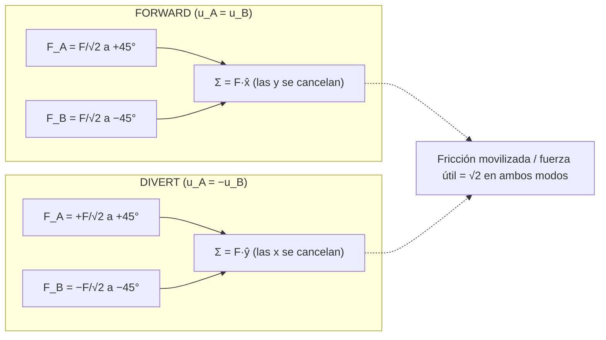
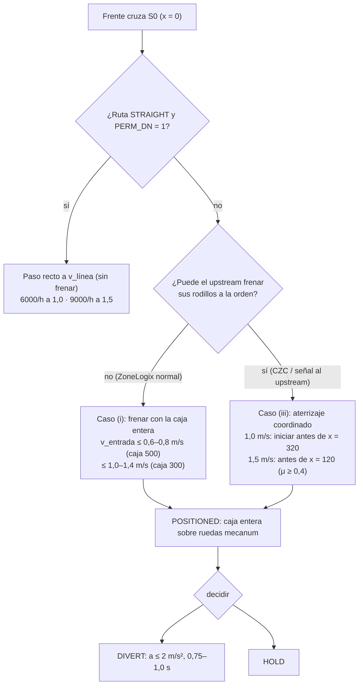

# Lente física — Lecho mecanum de ejes fijos ±45° (cinemática, dinámica, contención, guiñada, velocidad)

Proyecto Conveyone Omni-ZPA (Sergio Contreras). Fecha: 2026-09-03.
Capas: `user` (handoff §1–§17, REV B, prompts), `web` (`wf/research_tribologia_reglas.md`, `wf/research_diverters_comerciales.md`, `wf/research_motores_drivers.md`, con URL y fecha 2026-09-03), `calculo` (derivado aquí; script `wf/calc_lente_fisica.py` + adenda `wf/calc_lente_fisica_add.py`; salida íntegra en `wf/calc_lente_fisica.out`, extractos en §2.9).
Convención: x = avance UPSTREAM→DOWNSTREAM, y = transversal, z = vertical; ejes de rueda paralelos a y; rueda Ø50 (r = 25 mm) [user REV B]; 8 ejes a 76,2 mm con el primero a 38,1 mm [user REV B]; familias A (ejes impares) / B (pares) [user handoff §3].

---

## 1. Conclusiones en 10 líneas

1. La cinemática del lecho es exactamente la del handoff: `v_x = (u_A+u_B)/2`, `v_y = (u_A−u_B)/2`; cada familia sólo puede empujar **a lo largo del eje de su rodillo (45°)** y el reparto `F_fam = F_req/√2` de REV B es correcto. [calculo §2.1]
2. **Consecuencia que REV B y FISICA_PRIMEROS_PRINCIPIOS no aplicaron:** la fricción de cada rueda también actúa sólo a 45°, así que la tracción útil del lecho es `a_max = μ·g/√2 − μr·g`, **un 29 % menor** que en rodillos planos: 1,8 / 2,5 / 3,2 m/s² para μ = 0,3 / 0,4 / 0,5 (no 2,65 / 3,63 / 4,61). [calculo §2.3]
3. La guiñada **no es libre**: ≥2 ruedas de una familia (o una de cada) sobre-restringen la rotación de la caja mientras no deslizan; los "22–50° de giro" de FISICA y de la lente lógica son la cota superior con contactos saturados. El precio real de la asimetría A/B es que **reduce a_max en FORWARD a 1,5–1,65 m/s² (μ = 0,4)** porque parte de la fricción se gasta en sujetar la caja recta; en DIVERT el par de guiñada de primer orden es **cero**. [calculo §2.4]
4. **Contención:** con la caja de 500 en zona de 598/609,6 (ventana 98/110 mm) y el upstream empujando hasta que la caja entra entera, la Omni sola sólo puede detenerla si entra a **≤ 0,6–0,8 m/s** (μ 0,3–0,5). A 1,0 m/s hace falta que el upstream deje de empujar (rueda libre) o frene sus rodillos; **a 1,5 m/s la caja de 500 no se detiene dentro de la zona salvo aterrizaje coordinado con frenado del upstream iniciado antes de x ≈ 120 mm (μ ≥ 0,4)**. La caja de 300 sí se contiene sola hasta 1,0–1,4 m/s. [calculo §2.5]
5. Las latencias electrónicas (3–5 ms ≈ 3–8 mm) son irrelevantes frente a la rampa: el problema es de trayectoria, no de reacción. [calculo §2.5, coincide con lente lógica]
6. **CENTERED/POSITIONED es necesario** antes de DIVERT y de HOLD por contención (la caja debe estar entera sobre ruedas mecanum: los rodillos planos vecinos bloquean el desvío), **no** por paridad de ejes; no es necesario para paso recto. [calculo §2.4–2.5]
7. Desvío a 90° de cajas de 300/250 de ancho: **0,75–1,0 s** (recorrido 325–483 mm según se cruce o no la franja muerta de 133 mm; v_lat 1,0 m/s, a 2–2,5 m/s²); ciclo completo con aterrizaje ≈ 1,6–1,8 s ⇒ ≈ 2000–2250 cajas/h, del orden de un F-RAT (2250 c/h, web). [calculo §2.6]
8. Comparación: el lecho ±45° con 2 motores tiene tracción 0,71·μg en ambas direcciones (mejor que la eyección 0,36·μg del CV-OMW de ejes perpendiculares, peor que 1,0·μg de rueda pivotante/F-RAT), moviliza √2 veces más fricción que fuerza útil y **exige que ambas familias carguen**: una caja apoyada sólo en A se va a 45° (modo DIAGONAL involuntario). [calculo §2.7]
9. **Velocidades objetivo recomendadas: v_línea en la Omni 1,0 m/s (382 rpm); v_lateral 1,0 m/s con a ≤ 1,5–2,0 m/s²; 1,5 m/s sólo como paso recto** si el motor lo valida a 573 rpm. La discrepancia REV B (1,5) vs prompt (≥1,0) se resuelve por física: 1,5 m/s es incompatible con detener la caja crítica en una zona de 24 in con μ realista. [calculo §2.8]
10. Todo lo anterior depende de un número que **nadie ha medido**: μ rodillo (PA-CF/TPU/PU) – cartón corrugado (seco/húmedo/con cinta). El primer ensayo de banco es ése; el segundo, la caja vacía con fondo pandeado sobre 3 ejes. [web tribología §4; calculo §2.10]

---

## 2. Análisis

### 2.1 Ecuaciones de restricción y tabla de modos

Una rueda mecanum con eje paralelo a y, girando con velocidad periférica `u` (en x), y rodillos cuyo eje forma 45° con el eje de la rueda. En el plano de contacto el eje del rodillo es `ê_A = (1,1)/√2` (familia A) o `ê_B = (1,−1)/√2` (familia B). El rodillo rueda libremente en la dirección perpendicular a `ê`; **a lo largo de `ê` no puede rodar**, así que la velocidad relativa caja/periferia debe ser nula en esa dirección:

```
(v_caja + ω × r_i − u·x̂) · ê = 0
```

Con ω = 0 (caja sin girar) y escribiendo por familia:

```
A:  (v_x − u_A)/√2 + v_y/√2 = 0  →  v_x + v_y = u_A
B:  (v_x − u_B)/√2 − v_y/√2 = 0  →  v_x − v_y = u_B
⇒   v_x = (u_A + u_B)/2 ,  v_y = (u_A − u_B)/2
```

Fuerza: el rodillo sólo transmite fuerza **a lo largo de `ê`** (perpendicular sólo resistencia a rodadura). Con `F_A ê_A + F_B ê_B`:

```
F_x = (F_A + F_B)/√2 ,  F_y = (F_A − F_B)/√2
FORWARD recto (F_y = 0):  F_A = F_B = F_req/√2        ← igual a REV B §3
DIVERT   (F_x = 0):        F_A = −F_B = F_req/√2 ; F_y = F_req
```

| Modo | u_A | u_B | v_caja | Fuerza de cada familia | Rodillos ruedan a | Observación |
|---|---|---|---|---|---|---|
| HOLD | 0 | 0 | 0 | reacción ≤ μN a lo largo de ê | 0 | la caja sólo puede deslizar a lo largo de ê (ver §2.3) |
| FORWARD | +u | +u | (u, 0) | F_req/√2 cada una, a ±45° | **0** (ideal) | componentes y se cancelan; par de guiñada ≠ 0 si Δx ≠ 0 (§2.4) |
| REVERSE | −u | −u | (−u, 0) | ídem | 0 | servicio |
| DIVERT lado 1 | +u | −u | (0, u) | +F_req/√2 en A, −F_req/√2 en B | **√2·u = 1,41·u** | v_lat = u (no 0,5·u); componentes x se cancelan; par de guiñada = 0 a 1er orden |
| DIVERT lado 2 | −u | +u | (0, −u) | ídem opuesto | 1,41·u | |
| DIAGONAL_A | +u | 0 | (u/2, u/2), \|v\| = 0,71·u | sólo A empuja; B sólo reacciona | 0,71·u | la familia parada no frena (sus rodillos ruedan) |

Verificación numérica de las restricciones (residuo 0) en `calc_lente_fisica.out` §A. Dos datos nuevos que salen de la tabla:

- **La velocidad lateral efectiva es igual a la periférica de rueda** (1,0 m/s de rueda ⇒ 1,0 m/s de caja), no la mitad: la relación 0,5·V de la patente SF Taisen CN112850069B (web) corresponde a otra configuración (mecanum como transmisión por fricción a una rueda de transporte).
- **En DIVERT cada rodillo gira a √2·u sobre su pasador**: rodillo Ø18 (rueda v7 del usuario, pasador Ø3,2) ⇒ **1500 rpm a 1,0 m/s, 2250 rpm a 1,5 m/s**; en FORWARD ideal no giran (sólo micro-deslizamiento). Cojinete deslizante impreso a 1500–2250 rpm con 2–6 N radiales: pv bajo (≈0,01 MPa·m/s [calculo]) pero desgaste/polvo A VERIFICAR (§2.10).



### 2.2 Geometría de contacto: qué ruedas tocan cada caja

Ejes en x = 38,1 + i·76,2 (A: 38,1 / 190,5 / 342,9 / 495,3; B: 114,3 / 266,7 / 419,1 / 571,5) [user]. Ruedas transversales REV B en y = 50/150/250/350 (paso 100) [user]; Bloque v4 en y = −39/39/117/195 (paso 78) [user, repo]. Criterio: una rueda a < 15 mm del borde de la caja no cuenta como apoyo (chaflán/pestaña del fondo, supuesto).

| Caja | Posición | Ejes bajo la caja | Contactos REV B (paso 100) | Contactos v4 (paso 78) | Δx = x̄_A − x̄_B |
|---|---|---|---|---|---|
| 500×300 | centrada (304,8) | 6 (3A+3B) | 12 (2/eje: la caja de 300 centrada cae con sus bordes sobre las ruedas de 50 y 350) | 24 (4/eje) | +76,2 mm |
| 500×300 | centrada sobre eje 4 (266,7) | 7 (4A+3B) | 14 | 28 | 0 |
| 300×250 | centrada (304,8) | 4 (2A+2B) | 8 | 8 | −76,2 mm |
| 300×250 | sobre eje 4 (266,7) | 3 (2A+1B) | 6 | 6 | 0 |

Lectura: el paso transversal de 100 mm de REV B deja a la caja crítica de 300 de ancho con **2 apoyos por eje**; la regla industrial "≥3 rodillos bajo el bulto y sólo 2/3 cargan" (Rulmeca, Interroll, web) en versión puntual sugiere paso ≤ 78 (v4) o 5 ruedas. Esto no cambia a_max (que es ∝ μ·N total) pero sí la robustez al fondo no plano (§2.3.3).

### 2.3 Tracción: a_max, carga por rueda, cajas vacías, fondo no plano

**2.3.1 Límite de fricción del lecho.** Por rueda `|F_i| ≤ μ·N_i` con `F_i ∥ ê`. En FORWARD `F_req = √2·F_fam` y `F_fam ≤ μ·N_fam`. Con N_A = N_B = mg/2:

```
F_req,max = √2·μ·mg/2 = μ·mg/√2   ⇒   a_max = μ·g/√2 − μr·g
```

El mismo factor aparece al **frenar con ruedas bloqueadas**: el deslizamiento relativo sólo ocurre a lo largo de ê (perpendicular, el rodillo rueda), la fricción vale μN a lo largo de ê y su componente x es μN/√2. Ni el frenado a rueda parada ni el rodante escapan al 1/√2.

| μ (rodillo–cartón) | a_max lecho mecanum | a_max rodillos planos (FISICA) | parada rodante desde 1,0 / 1,5 m/s |
|---|---|---|---|
| 0,3 (trincaje papel–superficie dura, web) | **1,79 m/s²** | 2,65 | 280 / 630 mm |
| 0,4 | **2,48** | 3,63 | 202 / 454 mm |
| 0,5 (goma/esterilla–papel, web) | **3,17** | 4,61 | 158 / 354 mm |
| 0,6 | 3,87 | 5,59 | 129 / 291 mm |

μ: ninguna fuente primaria da PU/TPU–corrugado; rango defendible 0,3–0,6 (`research_tribologia_reglas.md` §2.1: Container Handbook https://www.containerhandbuch.de/chb_e/stra/stra_04_04_05.html "paper/cardboard or wood = 0.3"; Gallagher https://gallaghercorp.com/polyurethane-coefficient-of-friction/ PU 0,2–2,5, "harder polyurethanes have a lower COF"). μr = 0,03 es el supuesto de REV B; Rulmeca (https://www.rulmeca.fi/Rulmeca_download/Rulmeca_BL3_EN_ed4.pdf) da 0,06 (cartón rígido) – 0,08 (blando) para rodillos Ø50, así que REV B es optimista ×2 en avance y más en desvío (§2.3.4).

**2.3.2 Nº impar de ejes.** FORWARD y DIVERT exigen |F_A| = |F_B| aunque N_A ≠ N_B: satura primero la familia con menos carga: `a_max = √2·μ·(N_min/m) − μr·g`. Con carga ∝ nº de ejes: 4A+3B ⇒ 2,08 m/s²; **2A+1B (caja 300 sobre 3 ejes) ⇒ 1,56 m/s²** (μ = 0,4).

**2.3.3 Carga por rueda y cajas vacías.** 5 kg sobre 12 contactos = 4,1 N/rueda (2,7 N con 3/eje; 6,1 N con 4 ejes×2); 2,5 kg/8 = 3,1 N; **0,5 kg/12 = 0,41 N/rueda** (0,2 N con 24 contactos v4). Capacidad de catálogo: Rotacaster Ø50 95A 25 kg/rueda, mecanum hobby Ø60 10–15 kg/set (web) ⇒ carga < 5 % de capacidad; el eje y el 6001 no son el problema (coincide con REV B). `a_max` no depende de la masa (F_req ∝ m, μN ∝ m): **la caja vacía no es peor por ligera, sino por (i) fondo pandeado y (ii) N por rodillo tan bajo (0,2–0,4 N) que la indentación del rodillo y la suciedad dominan el μ efectivo** (no cuantificable sin ensayo; IPN 2024 sólo reporta dispersión del COF según contracara, web).

Vuelco: `a_tip = g·b/h`; caja 300 de base en dirección lateral con h ≤ 600 ⇒ a_tip ≥ 4,9 m/s² > a_max ⇒ manda el deslizamiento (h de las cajas A VERIFICAR; Hytrol/Interroll sólo excluyen "top heavy", web).

**Fondo no plano — el fallo característico de este lecho.** Si la caja se apoya en 3 puntos (2A + 1B) con el contacto B poco cargado, el modelo de §2.4 da (μ = 0,4, caja 300×250 sobre 3 ejes): B con 33 % del peso ⇒ a_max 1,5 (FWD) / 1,0 (DIV) m/s²; **B con 15 % ⇒ 0,54 m/s²; B con 5 % ⇒ ≈ 0**. Con B = 0 la caja obedece sólo a A: `v_x + v_y = u_A` con el otro grado de libertad suelto ⇒ **la caja se desplaza a 45° (DIAGONAL involuntario)** en cuanto se le aplica fuerza. En rodillos planos este modo de fallo no existe. Mitigaciones físicas: paso de eje menor que 76,2 o 5 ruedas por eje (más probabilidad de ≥2 contactos por familia), rodillos blandos (TPU 95A en vez de PA-CF: mayor μ y mayor huella, Gallagher web), y **guías laterales** en la Omni como seguro pasivo.

**2.3.4 Resistencia a rodadura en DIVERT.** En desvío los rodillos ruedan a √2·u; rodillo Ø18 tiene ~2,8× menos radio que un rodillo transportador Ø50: para la misma indentación la resistencia crece ≈ ∝ 1/r ⇒ μr_lat del orden de 0,1–0,2 (supuesto, A MEDIR). Efecto: a_max,lat (μ = 0,4) 2,48 → 1,79 (μr 0,10) → 0,81 m/s² (μr 0,20). Éste es el segundo número que sólo el banco puede dar.

### 2.4 Guiñada y deriva lateral: por qué la caja no gira "libremente" y qué cuesta sujetarla

**Par de guiñada de primer orden.** Fuerzas por familia aplicadas en el centroide de sus contactos (x̄_A, x̄_B), CG de la caja en el centroide de las normales. En FORWARD las componentes y son opuestas (+F_req/2 en x̄_A, −F_req/2 en x̄_B):

```
M_yaw = (F_req/2)·(x̄_A − x̄_B) = F_req·Δx/2
m = 5 kg, a = 2 m/s²: F_req = 11,47 N, Δx = 76,2 mm ⇒ M = 0,437 N·m   (= FISICA)
I = m(L²+W²)/12 = 0,142 kg·m² ⇒ α = 3,09 rad/s² ⇒ giro LIBRE en 0,5 s = 22° ; en 0,75 s = 50°
```

En DIVERT las componentes y tienen el **mismo signo** en A y B (+F_req/2 cada una) y las componentes x se cancelan en el mismo y: `M = (F_req/2)(x̄_A + x̄_B − 2x_cg) = 0` cuando el patrón es simétrico (6 ejes: 342,9 + 266,7 = 2·304,8; 7 ejes: x̄_A = x̄_B = x_cg). **El par de guiñada por paridad es un fenómeno de FORWARD/REVERSE (aceleración y frenado), no de DIVERT.** Esto corrige a la lente lógica (§2.4 de `lente_logica_zpa.md`: "POSITIONED obligatorio antes de DIVERT por paridad"); POSITIONED sigue siendo obligatorio, pero por contención (§2.5).

**El lecho es rígido en guiñada mientras no desliza.** Para dos ruedas de la misma familia en r₁, r₂: `(ω×(r₁−r₂))·ê_A = ω(Δx − Δy)/√2 = 0` ⇒ ω = 0 salvo que Δx = Δy (ruedas alineadas exactamente a 45°, que no ocurre: ruedas de un eje tienen Δx = 0, Δy ≠ 0; de ejes distintos Δx = 152,4 ≠ Δy). Con una sola rueda de cada familia también ω = 0. Es decir, **cualquier caja apoyada en ≥2 ruedas mecanum sin deslizar no puede girar**: el par M_yaw se reacciona con fuerzas tangenciales adicionales en los contactos, no con rotación. Los 22–50° de FISICA (y "22° en 0,5 s" de la lente lógica) son la cota superior válida sólo cuando todos los contactos deslizan (caja vacía sucia, fondo en 3 puntos, o aceleración por encima de a_max). Este resultado es coherente con la literatura: los lechos acoplados "no controlan" la guiñada (Keek 2021, https://doi.org/10.3390/machines9020043; BIBA EP2874923B1) en el sentido de que no pueden **imponer** un giro, no de que la caja gire sola.

**Cuánto cuesta sujetarla.** Resolví la distribución de fuerzas de mínima energía Σf_i²/N_i (contactos como muelles tangenciales de rigidez ∝ N) con las restricciones ΣF = F_req y ΣM = 0, y calculé la utilización máxima |f_i|/(μN_i) — el primer contacto que desliza (`calc_lente_fisica.out` §C):

| Caso (μ = 0,4, REV B paso 100) | Modo | M_yaw libre | utilización a 2 m/s² sin sujetar / con ω = 0 | **a_max 1er deslizamiento** (con ω = 0) | a_max ideal |
|---|---|---|---|---|---|
| 500×300, 6 ejes (3A+3B) | FORWARD | 0,437 N·m | 0,83 / **1,18** | **1,65 m/s²** | 2,48 |
| ídem | DIVERT | 0 | 0,83 / 0,83 | 2,48 | 2,48 |
| 500×300, 7 ejes (4A+3B) | FORWARD y DIVERT | 0 | 0,96 / 0,96 | 2,08 (desbalance de familias) | 2,48 |
| 300×250, 4 ejes (2A+2B) | FORWARD | 0,219 N·m (α = 6,9 rad/s²) | 0,83 / **1,31** | **1,46 m/s²** | 2,48 |
| ídem | DIVERT | 0 | 0,83 / 0,83 | 2,48 | 2,48 |
| 300×250, 3 ejes (2A+1B) | FORWARD y DIVERT | 0 | 1,24 / 1,24 | 1,56 | 2,48 |
| 500×300 vacía 0,5 kg, 6 ejes | FORWARD | 0,044 N·m | 0,83 / 1,18 | 1,65 | 2,48 |

Tabla para otros μ (misma geometría): μ = 0,3 ⇒ FORWARD 1,0–1,5 / DIVERT 1,1–1,8 m/s²; μ = 0,5 ⇒ 1,9–2,7 / 2,0–3,2; μ = 0,6 ⇒ 2,3–3,3 / 2,5–3,9 (`calc_lente_fisica.out`, adenda). La disposición v4 (24 contactos) da los mismos valores ±1 %: **el nº de ruedas por eje no cambia a_max, sólo la robustez**.

Lectura: (i) con μ = 0,4 la rampa de **2 m/s² de la lente lógica y de REV B está por encima del primer deslizamiento en FORWARD (1,5–1,65 m/s²)**; hasta medir μ, diseñar con **a ≤ 1,5 m/s² en avance/frenado y ≤ 2,0 m/s² en desvío**; (ii) entre el primer deslizamiento (1,65) y la saturación total (2,48) la caja empieza a girar de forma progresiva: es la zona donde aparecerían los grados de FISICA; (iii) el desbalance de familias (3 o 7 ejes) cuesta lo mismo que la paridad (4 o 6 ejes): no hay posición "buena" para todas las cajas; centrar la caja sobre un eje (7 ejes) mejora la de 500 pero la de 300 queda en 3 ejes (1,56).

**Qué mitiga la guiñada, en orden de eficacia física:** (1) aceleración/deceleración limitada (el par ∝ a; a ≤ 1,5 m/s² deja el lecho en régimen elástico); (2) μ alto y limpio (rodillos blandos); (3) ambas familias cargadas por igual (paso menor, más ruedas); (4) velocidad: no interviene directamente, sólo a través de la distancia de frenado que obliga a decelerar más fuerte; (5) guías laterales: no evitan el par, pero acotan el giro cuando los contactos saturan y son imprescindibles para alinear la caja en la salida lateral; (6) patrón de ruedas: sólo un patrón con las ruedas A y B **en el mismo eje** (mecanum a tresbolillo en cada eje, o rueda doble A/B) anula Δx — cambiaría la base mecánica congelada, se registra en §4.

**Deriva lateral en FORWARD:** nula a primer orden (F_A = F_B); aparece si N_A ≠ N_B con contactos saturados (la familia saturada empuja menos ⇒ F_y = (F_A − F_B)/√2 ≠ 0). Con 4A+3B saturando B: F_y ≤ (μN_A − μN_B)/√2 = 0,4·49·(1/7)/√2 = 2,0 N ⇒ deriva 0,4 m/s² lateral sobre 0,5 s = 50 mm. Segundo argumento para guías laterales y para no saturar.

**Entrada y salida con una sola familia (1 paso):** durante 76 ms (1,0 m/s) / 51 ms (1,5 m/s) sólo el eje 1 (A) está bajo el frente. Si u_A = v_línea no hay fuerza lateral (v_y = u_A − v_x = 0). Si hay desajuste de velocidad Omni/upstream, el eje 1 desliza a 45° con F_lat = μN₁/√2 ≈ 3,2 N (N₁ ≈ 11 N por área tributaria) ⇒ M ≈ 0,55 N·m ⇒ giro libre ≤ 0,3–0,65° en ese paso, y además los rodillos planos upstream sujetan la caja lateralmente. **El transitorio de entrada/salida es benigno; lo que importa es igualar velocidades entre zonas** (el UniDrive real corre a 0,9–1,25 m/s según lente control; el stepper a lo que se le mande).

### 2.5 Contención: ¿puede la Omni detener la caja que entra a 1,0 o 1,5 m/s?

Ventanas (zona − caja): 598 − 500 = **98 mm** (ZP2026 real, paso 74,75) / 609,6 − 500 = **110 mm** (REV B); caja 300: 298 / 310 mm. Latencia electrónica sensor→STEP/DIR ≈ 3 ms (Keyence PZ-G 500 µs, web https://www.keyence.com/products/sensor/photoelectric/pz-g/specs/; lógica ≈ 2 ms; coincide con lente lógica) = 3–5 mm; con driver tipo MDR (≤ 15 ms, Itoh web) 18–27 mm. **Irrelevante frente a 200–630 mm de rampa.**

Tres situaciones físicas distintas (`calc_lente_fisica.out` §E):

**(i) Frenado sólo con la caja entera dentro** (el upstream ZoneLogix sigue accionando con Run-After 0,4 s / Run-On mientras la cola está sobre él; a 1 m/s son 400 mm ⇒ la caja ya salió). `v_adm = √(2·a_max·(ventana − v·t_lat))`:

| μ | a_max | ventana 98 (caja 500, zona 598) | 110 (609,6) | 298 (caja 300) |
|---|---|---|---|---|
| 0,3 | 1,79 | **0,59 m/s** | 0,62 | 1,03 |
| 0,4 | 2,48 | **0,69** | 0,73 | 1,21 |
| 0,5 | 3,17 | **0,78** | 0,83 | 1,37 |

Y además ese frenado a a_max es con los contactos saturados (la caja gira, §2.4); a 1,5 m/s² la ventana de 98 mm permite sólo 0,54 m/s.

**(ii) Frenado con la caja parcialmente dentro.** La Omni sólo frena la fracción f = x/L del peso: `a_neta = f·μg/√2 − (1−f)·μ_up·g` si el upstream empuja (μ_up rodillo–cartón, supuesto 0,4): positiva sólo si f > μ_up/(μ_up + μ/√2) = **59 %**. Si el upstream está en rueda libre: integrando `a = f·μg/√2 − μr·g` desde el frente en x₀: a 1,0 m/s (μ = 0,4) el frente se detiene en 478–546 mm (**dentro**) aunque se empiece en x₀ = 0–300; **a 1,5 m/s se detiene en 626–798 mm (fuera, +28…+200 mm) para μ 0,4–0,5 cualquiera que sea x₀**.

**(iii) Aterrizaje coordinado: el upstream frena sus rodillos en el mismo instante** (ZMH/freno dinámico) y la cola desliza sobre rodillos parados: `a = f·μg/√2 + (1−f)·μ_up·g − μr·g`. Es lo único que contiene la caja de 500 a 1,5 m/s: con μ = μ_up = 0,4 el frente aterriza en 549 ± 49 mm si el frenado empieza con el frente en **x ≤ 120 mm** (x ≤ 250 a 1,2 m/s; x ≤ 320 a 1,0 m/s); con μ = 0,3 sólo desde x = 0 a 1,5 m/s. Requiere que la zona upstream (a) sepa que la Omni va a aterrizar y (b) frene sus rodillos mientras la caja está a caballo — una zona ZoneLogix en modo normal no hace (b) espontáneamente; la reacción interna de ZoneLogix a la retirada de permiso no está publicada (lente control, NO ENCONTRADO).



**¿Es necesario CENTERED?** Sí, con nombre POSITIONED y por una razón física distinta a la paridad: la caja debe estar **entera sobre ruedas mecanum** antes de DIVERT, porque cualquier parte apoyada en rodillos planos (zona vecina) tiene fricción lateral completa μ_up·N y actúa como freno excéntrico: con 20 % del peso sobre rodillos planos, la fuerza que se opone al desvío es 0,2·μ_up·mg = 3,9 N (5 kg, μ_up 0,4) contra 11,5 N disponibles, aplicada en un extremo ⇒ par 3,9 N × 0,25 m ≈ 1 N·m (más del doble del par de guiñada de §2.4) ⇒ la caja gira sobre el borde de la zona. Para HOLD (acumulación) también: la caja a caballo bloquea la zona vecina. **Para paso recto no hace falta** (ni parar ni centrar). Posición objetivo: frente en 549 ± 49 (zona 598); si se quiere además paridad favorable para la caja de 500, centrarla sobre el eje 4 (7 ejes, Δx = 0, a_max FORWARD 2,08 en vez de 1,65) — pero la de 300 queda entonces en 3 ejes (1,56): no hay óptimo común.

**Conclusión sobre velocidades y contención:** la ventana de 98–110 mm es un dato de producto (zona de 24 in) que no cambia; con ella, **1,5 m/s de entrada sólo es físicamente compatible con un aterrizaje coordinado (ruta B/C con CZC en la zona upstream de cada Omni) y μ ≥ 0,4, o con una Omni de 2 zonas (1196 mm: ventana 696 mm ⇒ v_adm ≈ 1,8 m/s sola)**; 1,0 m/s es compatible con upstream en rueda libre o coordinado; ≤ 0,7 m/s es compatible con cualquier upstream. Una alternativa dentro de la ruta A: que la Omni ordene al ZoneLogix upstream bajar su velocidad (entrada analógica 0–10 V citada en la conversación previa, digest_logica_zpa A1 — A VERIFICAR en el manual 301208) cuando la caja va a aterrizar.

### 2.6 Tiempos de desvío y ritmo

Recorrido lateral hasta que la cola de la caja abandona el cuerpo activo de 400: s = (400 + W)/2 = 350 (W = 300) / 325 (W = 250); si la salida está del lado de la franja muerta de 133,4 mm (REV B: "mesa muerta o rodillos pasivos"), s = 483 / 458 y los últimos 133 mm la caja los recorre **por inercia deslizando sobre rodillos pasivos transversales**: d_coast = v²/(2·μ_up·g) = 62–127 mm a 0,7–1,0 m/s (μ_up 0,4) ⇒ la caja **puede quedar parada sobre la franja**. Físicamente la salida debe ser hacia el lado activo con un labio corto, o la franja muerta debe llevar ruedas/rodillos que rueden en y (omnis pasivas o bolas), o la Omni debe ocupar los 21 in (lo que hace el Bloque v4: cuerpo de −160 a +220 y franja libre de 107 mm).

| W caja | Recorrido | v_lat 0,7 / a 2,0 | v_lat 1,0 / a 2,0 | v_lat 1,0 / a 2,5 | v_lat 1,5 / a 2,5 |
|---|---|---|---|---|---|
| 300 | 350 mm (lado activo) | 0,85 s | 0,84 s (v pico 0,84) | 0,75 s | 0,75 s (pico 0,94: no llega a 1,5) |
| 300 | 483 mm (cruza franja) | 1,04 s | 0,98 s | 0,88 s | 0,88 s |
| 250 | 325 mm | 0,81 s | 0,81 s | 0,72 s | 0,72 s |
| 250 | 458 mm | 1,00 s | 0,96 s | 0,86 s | 0,86 s |

Con a ≤ 2,5 m/s² y s ≤ 483 mm la caja **nunca alcanza 1,5 m/s lateral** (perfil triangular, pico ≤ 1,1 m/s): pedir 1,5 m/s de desvío no acorta nada. El tiempo de desvío depende del ancho, no del largo (coincide con lente lógica). Referencias: Interroll HPD 0,3 s por giro de 90° a 1,4 m/s (web RM8711), Flowsort 0,3 s/180° (web), F-RAT ciclo 1,10 s (web) — ninguno publica aceleración lateral.

Ritmo: recepción + aterrizaje 0,7–0,8 s (lente lógica) + desvío 0,75–1,0 s + liberación ≈ 1,6–1,9 s ⇒ **≈ 1900–2250 cajas/h desviando todas** (F-RAT-NX75: 2250 c/h al 50 % de desvío, web); paso recto sin parar: 6000/h a 1,0 m/s, 9000/h a 1,5 m/s (caja 500 + hueco 100).

### 2.7 Comparación física con las alternativas del repositorio y comerciales

| Arquitectura | Ruedas activas por modo | k (a_max = μ·g·k − μr·g) avance / lateral | Fricción movilizada / fuerza útil | Guiñada | Nº motores | Reversión de motor para desviar | Complejidad mecánica |
|---|---|---|---|---|---|---|---|
| **Lecho ±45° ejes fijos (REV B, v4)** | todas en todos los modos | **0,71 / 0,71** (si N_A = N_B; 0,60 con 4A+3B; 0,47 con 2A+1B) | √2 = 1,41 | rígido si no desliza; par parásito F_req·Δx/2 en FORWARD; **requiere ambas familias cargadas** (si no: diagonal) | 2 | sí (una familia; desde reposo, sin inversión a velocidad) | 8 ejes, 32–48 ruedas, 2 transmisiones; sin homing; sin partes pivotantes |
| **CV-OMW ejes perpendiculares** (omnis clásicas, 16 contactos avance 4×4 + 9 eyección 3×3, tangente común) | media flota por sentido | 0,64 / **0,36** (∝ reparto de normales) | 1,0 | rígido; sin par parásito (fuerza colineal con el movimiento) | 7 en el diseño del repo (uno por eje) | no: se para una familia y arranca la otra; la familia parada rueda libre | dos alturas de eje, ruedas Ø70/Ø120, 25 contactos |
| **TRANSFER-BF21** (22 omnis avance / 14 giradas 90°, o-rings, 2 UniDrive) | ídem | 0,61 / 0,39 | 1,0 | ídem | 2 | no | 36 ruedas Ø58, 19 lazos de o-ring, eje común inferior |
| **Rueda pivotante (Flowsort SLD/DLD, Interroll HPD, Hytrol SC)** | todas, en la dirección de giro | **1,0 / 1,0** | 1,0 | rígido; la caja se desvía en trayectoria oblicua | 2 (rodadura + giro) | no; giro 0,3 s/90° [web] | torreta, homing periódico cada 50–100 desvíos (Flowsort, web), juego de reductor |
| **F-RAT (Itoh)** | superficie conmutada | 1,0 / 1,0 | 1,0 | rígido | 3 MDR | no; ciclo 1,10 s [web] | mecanismo de elevación/descenso |

Lecturas físicas: (1) el lecho ±45° **empata o supera en tracción** a los lechos de ejes perpendiculares con reparto 60/40 porque usa todas las ruedas siempre, pero paga con √2 de fricción movilizada (desgaste, polvo de cartón — Keek: "the omniwheel experiences slippage more easily", web) y con la dependencia de ambas familias; (2) los perpendiculares y las pivotantes no tienen modo de fallo "diagonal"; (3) la pivotante es la única con k = 1 y por eso Flowsort/HPD declaran 1,4–1,5 m/s con 35–50 kg (web) — con torreta, homing y 2 motores igual que la Omni; (4) ningún producto occidental de catálogo usa el lecho ±45° de 2 motores; sí existe en patentes de fabricantes chinos (CN111747090A Tungray, CN213863900U FDT, web) sin datos publicados de velocidad — **no hay evidencia empírica externa de 1,5 m/s con este lecho**; (5) la ventaja documentable del lecho fijo es no tener posición angular (sin homing, sin juego de torreta, web §5.6 diverters).

### 2.8 Velocidades objetivo: resolución de "1,5 m/s (REV B)" vs "≥ 1 m/s (prompt)"

| Requisito | 1,0 m/s (382 rpm) | 1,5 m/s (573 rpm) |
|---|---|---|
| Contener caja 500 en zona 598 sin cooperación del upstream | no (necesita ≤ 0,7); sí con upstream en rueda libre | **no** (frente a +28…+200 mm fuera) |
| Contener con aterrizaje coordinado (CZC upstream, μ ≥ 0,4) | sí, iniciando antes de x = 320 | sólo iniciando antes de x = 120 (margen 5 % de dispersión = 28 mm) |
| Contener caja 300 sola | sí (v_adm 1,0–1,4) | marginal (μ ≥ 0,5) |
| Par de motor a esa rpm (lente motores, web) | NEMA 23 pull-out ≈ 1,9 N·m a 390 rpm | 1,1–1,5 N·m a 573 rpm, justo tras el "codo"; curva oficial 36 V no cubre 573 |
| Giro de rodillos en DIVERT (rueda v7, Ø18) | 1500 rpm | 2250 rpm |
| Compatibilidad con UniDrive real de las zonas normales | 0,9–1,25 m/s (lente control) | fuera del rango |
| Paso recto (throughput) | 6000/h | 9000/h |

**Recomendación (calculo):** v_línea de diseño en la Omni **1,0 m/s**; v_lateral **1,0 m/s pico** con a_lat ≤ 2,0 m/s² (μ ≥ 0,35 con margen 1,2) y a_avance/frenado ≤ **1,5 m/s²** hasta medir μ; **1,5 m/s únicamente como velocidad de paso recto** (modo STRAIGHT sin aterrizaje) si el motor la valida a 573 rpm y el cliente la exige, y con la regla de que toda caja que vaya a aterrizar/desviar entre a ≤ 1,0 m/s (reducción de velocidad en la zona upstream). Esto satisface "por lo menos 1 m/s" del usuario y deja 1,5 m/s como capacidad de tránsito, no de contención. Si el producto debe aterrizar cajas de 500 a 1,5 m/s, la solución física es la **Omni de dos zonas (1196 mm)**, no un motor más rápido.

### 2.9 Extracto de la verificación numérica

Script `wf/calc_lente_fisica.py` (+ `calc_lente_fisica_add.py`), salida completa en `wf/calc_lente_fisica.out`. Extracto:

```text
FORWARD u_A=+1 u_B=+1 -> v=(+1.00,+0.00) ; rodillos ruedan a 0.00·u
DIVERT  u_A=+1 u_B=-1 -> v=(+0.00,+1.00) ; rodillos ruedan a 1.41·u
DIAGONAL_A u_A=+1 u_B=0 -> v=(+0.50,+0.50) |v|=0.71·u
DIVERT a v_lat=1.0: rodillo Ø18 gira a 1501 rpm ; v_lat=1.5: 2251 rpm
μ=0.3: a_max = 1.79 m/s² (plano 2.65) ; parada 1.0→280 mm, 1.5→630 mm
μ=0.4: a_max = 2.48 (plano 3.63) ; 202 / 454 mm
μ=0.5: a_max = 3.17 (plano 4.61) ; 158 / 354 mm
500x300 5kg 6 ejes: Δx=+76.2 ; a=2 FORWARD: M_yaw libre 0.437 N·m, giro LIBRE 22.1° en 0.5 s ;
   utilización μN sin sujetar 0.83, con guiñada=0 1.18 ; a_max 1er deslizamiento FORWARD 1.65, DIVERT 2.48
300x250 2.5kg 4 ejes: FORWARD a_max 1.46 ; 3 ejes (2A+1B): 1.56 ambos modos
Fondo no plano 2A+1B, B con 15% del peso: a_max 0.54 ; B 5%: ≈0 (diagonal involuntario)
E1 (frenar con caja entera): μ=0.4 ventana 98 → v_adm 0.69 m/s ; ventana 298 → 1.21 m/s
E2 (upstream libre): μ=0.4 v0=1.0 desde x=0 → para en 478 (DENTRO) ; v0=1.5 → 730 (FUERA +132)
E4 (upstream frena): μ=0.4 v0=1.5 inicio x=100 → 480 DENTRO ; x=200 → 612 FUERA
   aterriza en 549±49: v0=1.0 iniciar ≤ x=320 ; v0=1.5 iniciar ≤ x=120 (μ=0.4) ; μ=0.3 v0=1.5 sólo x=0
W=300 s=350 v_lat=1.0 a=2.0: t=0.84 s ; s=483: 0.98 s ; W=250: 0.81 / 0.96 s
coast sobre franja muerta μ_up=0.4: v=1.0 → 127 mm (franja 133)
k: mecanum 0.707/0.707 ; CV-OMW 0.64/0.36 ; pivotante 1.0 → a_max(μ=0.4) 2.48 / 2.22 / 1.12 / 3.63
```

### 2.10 Ensayos físicos mínimos (banco)

| # | Ensayo | Qué mide | Criterio de paso / uso |
|---|---|---|---|
| T1 | Plano inclinado (TAPPI T815, web) rodillo real (PA-CF, TPU 95A, PU comercial) vs cartón corrugado seco / 85 % HR / con cinta / con polvo | μ estático y cinético | fija a_max de todo el diseño; objetivo μ ≥ 0,4 en seco, informar el peor caso |
| T2 | Una rueda mecanum sobre placa de cartón cargada con 0,3 / 3 / 6 N, arrastrada a lo largo de ê y perpendicular a ê (rodillo rodando) a 0,3–1,4 m/s | fuerza tangencial máx. y **μr_lat del rodillo Ø18** girando a 1500–2250 rpm | valida §2.3.4; μr_lat ≤ 0,1 |
| T3 | Mini-lecho de 3 ejes (A-B-A) con 2 ruedas por eje y célula de carga: caja 300×250 de 2,5 kg y vacía 0,5 kg; rampas 0,5–3 m/s² en FORWARD y DIVERT | a de primer deslizamiento; giro de la caja (vídeo cenital con marcadores) | compara con tabla §2.4 (1,5 / 1,56 m/s² a μ 0,4); giro < 2° a a_diseño |
| T4 | Mismo lecho con la caja vacía y fondo deliberadamente pandeado (calza de 2–5 mm bajo una esquina) | aparición del modo DIAGONAL involuntario | define el paso de eje / nº de ruedas mínimo o la necesidad de guías |
| T5 | Módulo completo entre dos zonas de rodillos: entrada a 0,7 / 1,0 / 1,2 / 1,5 m/s, upstream (a) accionando, (b) libre, (c) frenando a la orden | posición de parada del frente vs x de inicio de frenado | reproduce §2.5 (i)/(ii)/(iii); decide la velocidad de producto y la ruta A/B/C |
| T6 | Desvío completo hacia ambos lados con cajas 300 y 250 de ancho, incluido cruce de la franja muerta | tiempo, alineación de la caja al llegar al lateral, cajas que quedan sobre la franja | ≤ 1,0 s; giro < 5°; ninguna caja detenida en franja |
| T7 | Desajuste de velocidad Omni vs zona vecina ±10 / ±20 % | fuerza lateral en la entrada, marcas en el cartón, giro | acota la tolerancia de velocidad entre zonas |
| T8 | Endurance: 10⁵ desvíos con la caja de 5 kg | desgaste de rodillos/pasadores (Ø3,2) a 2250 rpm, generación de polvo de cartón, pérdida de μ | mantiene μ dentro de ±20 % del inicial |

---

## 3. Afirmaciones numeradas

- [A1] (calculo) Restricción por rueda `(v + ω×r − u x̂)·ê = 0` con ê_A = (1,1)/√2, ê_B = (1,−1)/√2 ⇒ v_x = (u_A+u_B)/2, v_y = (u_A−u_B)/2; verificado con residuo 0 para los 7 modos. Fuente: §2.1, `calc_lente_fisica.out` §A.
- [A2] (calculo) La fuerza de cada familia actúa a lo largo del eje de su rodillo; FORWARD recto exige F_A = F_B = F_req/√2 (coincide con REV B §3, capa user); DIVERT exige F_A = −F_B = F_req/√2. §2.1.
- [A3] (calculo) v_lateral = velocidad periférica de rueda (no 0,5·u); en DIVERT los rodillos giran a √2·u: Ø18 ⇒ 1500 rpm a 1,0 m/s, 2250 rpm a 1,5 m/s. §2.1.
- [A4] (calculo) a_max del lecho mecanum = μ·g/√2 − μr·g = 1,79 / 2,48 / 3,17 m/s² (μ 0,3 / 0,4 / 0,5); **contradice FISICA_PRIMEROS_PRINCIPIOS** ((μ−μr)g = 2,65 / 3,63 / 4,61): falta el factor 1/√2. §2.3.1.
- [A5] (calculo) El mismo 1/√2 aplica al frenado con ruedas bloqueadas (deslizamiento sólo a lo largo de ê). §2.3.1.
- [A6] (calculo) Con nº impar de ejes bajo la caja satura la familia menos cargada: a_max = √2·μ·(N_min/m) − μr·g ⇒ 2,08 (4A+3B) y 1,56 m/s² (2A+1B) a μ = 0,4. §2.3.2.
- [A7] (dato, web) μ rodillo–cartón corrugado no existe en fuente primaria; rango defendible 0,3–0,6 (Container Handbook 0,3; Gallagher PU 0,2–2,5, más duro = menor μ). `research_tribologia_reglas.md` §2.1, URLs en §2.3.1.
- [A8] (dato, web) Coeficiente de rodadura cartón–rodillo Ø50: 0,06 rígido / 0,08 blando (Rulmeca BL3) ⇒ el μr = 0,03 de REV B es optimista ×2; en DIVERT con rodillo Ø18, μr_lat estimado 0,1–0,2 (supuesto A MEDIR) reduce a_max lateral a 1,8–0,8 m/s². §2.3.4.
- [A9] (calculo) Carga por rueda: 5 kg/12 contactos = 4,1 N; 0,5 kg = 0,2–0,4 N; < 5 % de la capacidad de Rotacaster Ø50 (25 kg/rueda, web). a_max no depende de la masa. §2.3.3.
- [A10] (calculo) Vuelco a_tip = g·b/h ≥ 4,9 m/s² para h ≤ 600 ⇒ manda el deslizamiento (h A VERIFICAR). §2.3.3.
- [A11] (riesgo, calculo) Caja apoyada en 3 puntos con la familia B al 15 % del peso ⇒ a_max 0,54 m/s²; al 5 % ⇒ ≈ 0; al 0 % la caja se mueve a 45° (DIAGONAL involuntario). Modo de fallo inexistente en rodillos planos. §2.3.3.
- [A12] (calculo) Par de guiñada en FORWARD M = F_req·Δx/2 = 0,437 N·m (5 kg, 2 m/s², Δx 76,2); giro libre 22° en 0,5 s — coincide numéricamente con FISICA y lente lógica, **pero es cota superior**. §2.4.
- [A13] (calculo) En DIVERT el par de guiñada de primer orden es cero para patrones simétricos (6 o 7 ejes); la paridad afecta a FORWARD/REVERSE, no al desvío. Corrige el motivo dado por la lente lógica para POSITIONED. §2.4.
- [A14] (calculo) Con ≥2 ruedas de una familia (o una de cada) sin deslizar, ω = 0 es forzado cinemáticamente: el lecho es rígido en guiñada; la caja gira sólo con contactos saturados. Coherente con Keek 2021 / BIBA (web: no se puede **imponer** giro). §2.4.
- [A15] (calculo) Costo de sujetar la guiñada (mínima energía Σf²/N): a_max de primer deslizamiento en FORWARD = 1,65 (500/6 ejes), 1,46 (300/4 ejes) m/s² a μ = 0,4; DIVERT 2,48; con 3 o 7 ejes 1,56 / 2,08. Con μ = 0,3: 1,0–1,5 / 1,1–1,8. §2.4 y adenda.
- [A16] (decision, calculo) Rampas de diseño hasta medir μ: ≤ 1,5 m/s² avance/frenado, ≤ 2,0 m/s² desvío. La a_design = 2,0 de la lente lógica y de REV B supera el primer deslizamiento a μ = 0,4. §2.4.
- [A17] (calculo) Deriva lateral en FORWARD sólo con familias desbalanceadas y saturadas: ≤ 2 N ⇒ ≈ 50 mm en 0,5 s (4A+3B) ⇒ guías laterales como seguro pasivo. §2.4.
- [A18] (calculo) Transitorio de entrada con una sola familia: 76 / 51 ms (1,0 / 1,5 m/s); fuerza lateral sólo si hay desajuste de velocidad entre zonas; giro ≤ 0,65°. Benigno. §2.4.
- [A19] (calculo) Ventana de contención 98 mm (zona 598) / 110 (609,6) para caja 500; 298 / 310 para caja 300. Latencia electrónica 3–5 ms = 3–8 mm (coincide con lente lógica; Keyence 500 µs web): < 2 % de la rampa. §2.5.
- [A20] (calculo) Si el frenado sólo empieza con la caja entera dentro (upstream ZoneLogix empujando con Run-After), v_adm = 0,59 / 0,69 / 0,78 m/s (μ 0,3/0,4/0,5) para la caja de 500; 1,03 / 1,21 / 1,37 para la de 300. §2.5 (i).
- [A21] (calculo) Con upstream en rueda libre, a 1,0 m/s la caja de 500 para dentro (478–546 mm) desde cualquier x₀; **a 1,5 m/s para fuera (+28…+200 mm) para μ 0,4–0,5**. §2.5 (ii).
- [A22] (calculo) Con el upstream frenando sus rodillos a la orden (aterrizaje coordinado), la caja de 500 aterriza en 549 ± 49 a 1,5 m/s sólo si el frenado empieza con el frente en x ≤ 120 mm (μ = 0,4) o x = 0 (μ = 0,3); a 1,0 m/s, x ≤ 320. Esto exige que la zona upstream sea controlable (CZC, ruta B/C) o que ZoneLogix reaccione a la retirada de permiso con latencia no publicada (NO ENCONTRADO, lente control). §2.5 (iii).
- [A23] (decision, calculo) POSITIONED es necesario antes de DIVERT y HOLD por contención (parte de la caja sobre rodillos planos = freno excéntrico ≈ 1 N·m con 20 % del peso fuera), no por paridad; no es necesario para paso recto. §2.5.
- [A24] (calculo) Tiempo de desvío: 0,75–0,84 s (W = 300, lado activo, a 2–2,5), 0,88–0,98 s cruzando la franja muerta; W = 250: 0,72–0,96 s; perfil triangular, pico ≤ 1,1 m/s ⇒ pedir 1,5 m/s lateral no acorta nada. §2.6.
- [A25] (riesgo, calculo) Salida por la franja muerta de 133 mm con rodillos pasivos transversales: la caja desliza y se detiene en 62–127 mm (μ_up 0,4, 0,7–1,0 m/s) ⇒ puede quedar sobre la franja; la franja necesita elementos que rueden en y o la salida debe ser por el lado activo. §2.6.
- [A26] (calculo) Ritmo: ≈ 1900–2250 cajas/h desviando todas (comparable a F-RAT 2250 c/h, web); paso recto 6000/h a 1,0 m/s, 9000/h a 1,5. §2.6.
- [A27] (calculo) Factores geométricos k de tracción: mecanum ±45° 0,71/0,71; CV-OMW 0,64/0,36; TRANSFER-BF21 0,61/0,39; pivotante y F-RAT 1,0/1,0; fricción movilizada/útil: √2 en mecanum, 1 en el resto. §2.7.
- [A28] (dato, web) Ningún producto occidental de catálogo usa lecho mecanum de ejes fijos con 2 motores; el concepto está en patentes chinas (CN111747090A, CN213863900U) sin datos de velocidad; los pivotantes declaran 1,4–1,5 m/s (Interroll HPD, Flowsort) con homing periódico. `research_diverters_comerciales.md` §2.7, §5.
- [A29] (decision, calculo) Velocidades objetivo: v_línea en Omni 1,0 m/s (382 rpm); v_lateral 1,0 m/s pico; 1,5 m/s sólo como paso recto validado en motor; si se exige aterrizar cajas de 500 a 1,5 m/s, Omni de 2 zonas (ventana 696 mm ⇒ v_adm ≈ 1,8 m/s). Resuelve REV B (1,5) vs prompt (≥ 1,0) por física. §2.8.
- [A30] (dato, web) A 573 rpm el NEMA 23 de 2–3 N·m entrega 1,1–1,5 N·m pull-out justo tras el codo y sin curva oficial a 48 V; a 382 rpm ≈ 1,9 N·m. `research_motores_drivers.md` §1 (stepperonline curvas). Refuerza 1,0 m/s como velocidad de diseño.
- [A31] (decision, calculo) Ensayos mínimos T1–T8 (§2.10): μ en plano inclinado, μr_lat del rodillo a 1500–2250 rpm, mini-lecho de 3 ejes con guiñada, caja vacía con fondo pandeado, aterrizaje con upstream (a)/(b)/(c), desvío con cruce de franja, desajuste de velocidad, endurance 10⁵ ciclos.

---

## 4. Alternativas descartadas y por qué

| Alternativa | Por qué se descarta (o se aparca) |
|---|---|
| Aumentar a_design a ≥ 2,5–3 m/s² para caber en la ventana de 98 mm a 1,5 m/s | Está por encima de a_max de primer deslizamiento (1,5–2,5) para μ ≤ 0,5: la caja desliza y gira; sólo sería válido con μ medido ≥ 0,6 y rodillos limpios. |
| Detener la caja con ruedas bloqueadas (HOLD como freno) | Deceleración μg/√2 con todos los contactos saturados ⇒ guiñada máxima (§2.4); peor que la rampa controlada. |
| Frenar sólo con la Omni cuando la caja está parcialmente dentro y el upstream acciona | a_neta > 0 sólo con > 59 % del peso dentro (μ = μ_up = 0,4): ineficaz. |
| Diseñar la salida lateral cruzando la franja muerta de 133 mm con rodillos pasivos transversales | La caja desliza y se detiene en 62–127 mm; solución: franja con elementos que rueden en y, salida por el lado activo, o módulo a todo el ancho (v4). |
| Pedir v_lateral = 1,5 m/s | Con a ≤ 2,5 m/s² y s ≤ 483 mm el perfil es triangular (pico ≤ 1,1 m/s): no aporta. |
| Patrón de ruedas con A y B en el mismo eje (rueda doble A/B o tresbolillo por eje) para anular Δx | Anula el par de paridad en FORWARD, pero cambia la base mecánica congelada (8 ejes alternados, 1 motor por familia con ejes enteros). Se registra como opción si el ensayo T3 muestra guiñada inaceptable. |
| Tomar el "giro 22–50°" de FISICA como predicción | Es la cota superior con contactos saturados; con ≥2 ruedas sin deslizar ω = 0 (sobre-restricción). |
| Reemplazar por ejes perpendiculares (CV-OMW) sólo por física | Tracción de eyección 0,36·μg (peor que 0,71) y 7 motores en el diseño del repo; su ventaja real es la ausencia de modo diagonal y de fricción parásita, no la tracción. Decisión de arquitectura, no de esta lente. |
| Rueda pivotante (Flowsort/HPD) | k = 1 y 1,4–1,5 m/s probados, pero torreta + homing + juego; el usuario fijó el lecho de ejes fijos como base. Referencia de rendimiento, no alternativa aquí. |

---

## 5. Preguntas que sólo el usuario puede responder

1. ¿Puede medirse μ rodillo–cartón con los rodillos reales (PA-CF v7, TPU 95A, o la rueda china de PU) antes de fijar rampas? ¿Qué material de rodillo va a producción?
2. ¿La zona Omni del producto es de **598 mm (ZP2026 real, paso 74,75)** o de **609,6 mm (REV B, paso 76,2)**? Cambia la ventana 98 vs 110 mm y la posición de los ejes.
3. ¿Es aceptable que las cajas que van a aterrizar/desviar entren a la Omni a 1,0 m/s (o 0,7 si el upstream es ZoneLogix sin coordinación) aunque la línea corra a 1,5 m/s en paso recto? ¿O la contención a 1,5 m/s es requisito (⇒ Omni de dos zonas)?
4. ¿Hacia qué lado sale la caja: el lado de la transmisión (poleas/guarda) o el lado de la franja muerta de 133 mm? ¿Qué hay físicamente en esa franja (mesa muerta, rodillos pasivos, nada)?
5. Altura h de las cajas (para vuelco) y estado real de los fondos: ¿cajas nuevas, recicladas, con cinta o flejes en el fondo?
6. ¿La zona ZoneLogix upstream de cada Omni puede recibir una consigna de velocidad (0–10 V) o una orden de frenado desde la Omni? (Determina si el aterrizaje coordinado cabe en la ruta A.)
7. ¿Se admite instalar guías laterales fijas en la Omni (un seguro pasivo contra guiñada y deriva) o el desvío a ambos lados lo impide?
8. ¿Cuál es el desvío máximo de velocidad tolerado entre la Omni y las zonas UniDrive vecinas (el UniDrive real corre a 0,9–1,25 m/s)?

---

## 6. Riesgos abiertos

- **R1 — μ desconocido.** Todo a_max, distancia de parada y tiempo de desvío escala con μ (0,3 vs 0,5 = ×1,8). Sin T1 no hay diseño de rampas defendible.
- **R2 — Modo DIAGONAL involuntario** con cajas vacías o fondos pandeados apoyadas en pocos contactos de una familia: sin guías ni paso menor puede sacar la caja de la zona en diagonal.
- **R3 — Contención a 1,5 m/s físicamente inviable** con la ventana de 98–110 mm sin coordinación con la zona upstream; si el producto promete 1,5 m/s "con desvío", el largo de la Omni debe crecer.
- **R4 — Rodillos a 1500–2250 rpm en DIVERT** sobre pasadores lisos Ø3,2 de rueda impresa: desgaste, calentamiento y polvo de cartón (Keek: los omni deslizan más; IPN: el cartón se desgasta prematuramente contra ciertas contracaras, web). Sin dato de vida.
- **R5 — μr_lat del rodillo pequeño** (estimado 0,1–0,2): si es alto, a_max lateral cae a < 1 m/s² y el desvío se va a > 1,2 s.
- **R6 — Franja muerta de 133 mm**: cajas que quedan detenidas sobre ella si se cruza deslizando.
- **R7 — Desbalance de familias** (3 o 7 ejes bajo la caja) reduce a_max un 16–37 % y produce deriva lateral si satura; ninguna posición de aterrizaje es óptima para las dos cajas.
- **R8 — Desajuste de velocidad entre zonas** (stepper exacto vs UniDrive con tolerancia): deslizamiento a 45° en entrada/salida, marcas en el cartón y polvo; requiere igualar velocidades o tolerar micro-deslizamiento.
- **R9 — Modelo de distribución de fuerzas** (mínima energía, contactos elásticos, normales uniformes): es una aproximación; la distribución real (fondo irregular, rigidez del rodillo) puede mover el primer deslizamiento ±30 %. Sólo T3 lo cierra.
- **R10 — No hay evidencia externa** de un lecho mecanum de ejes fijos de 2 motores funcionando a 1,0–1,5 m/s con cajas de cartón (web: sólo patentes sin datos; prototipo académico limitado a 0,2 m/s por deslizamiento).
