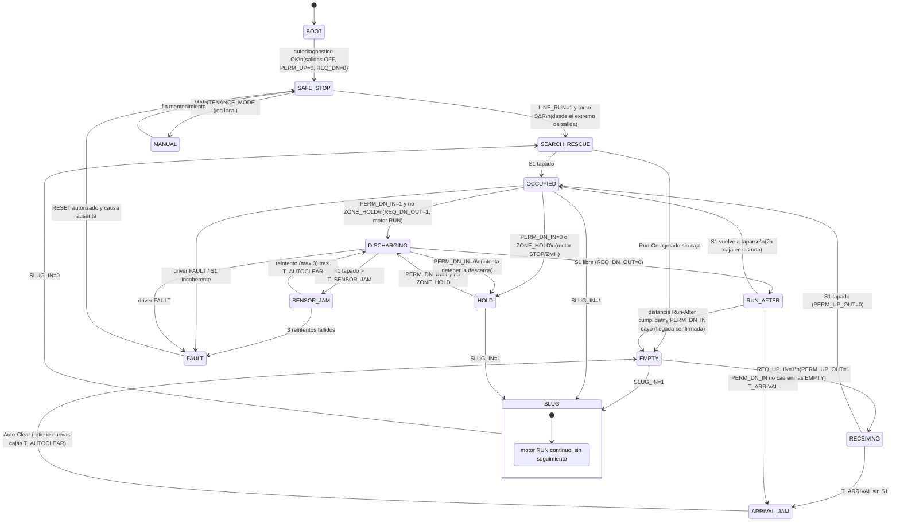

# Lente: lógica ZPA normal y Omni — máquinas de estado, sensores, temporización y recuperación

Proyecto Conveyone (Chile) — replanteamiento ZPA + zonas Omni. Fecha: 2026-09-03.
Capas: `user` (handoff, prompts, REV B), `web` (informes `wf/research_*.md` y manuales extraídos en `wf/pdftext/`, con URL y cita), `calculo` (derivado aquí; script `wf/calc_lente_logica.py`, salida pegada en §2.13).
Nota: el informe `research_tribologia_reglas` citado en el encargo **no existe** en `wf/` (glob `*tribolog*` sin resultados). Los coeficientes de fricción se toman como rango paramétrico μ = 0,3–0,5 de `ref/FISICA_PRIMEROS_PRINCIPIOS.txt` (capa `calculo`, no verificados) y se marcan A VERIFICAR con ensayo.

---

## 1. Conclusiones (10 líneas)

1. El presupuesto temporal electrónico (sensor + filtro + lógica + STEP/DIR) es de 3–5 ms ≈ 5–8 mm a 1,5 m/s; **no es el cuello de botella**. Lo que manda es la rampa de frenado: parar desde 1,5 m/s a 2 m/s² recorre 570 mm; a 1,0 m/s, 255 mm. [calculo §2.13-C]
2. Una caja de 500 mm en una zona de 598 mm deja una **ventana de contención de 98 mm** (65 ms a 1,5 m/s). Ninguna lógica "parar cuando S1 se tapa" puede contener la caja dentro de la Omni a 1,0 ni a 1,5 m/s: la Omni necesita **aterrizaje por perfil** disparado por un sensor de borde upstream (S0) y odometría de rueda. [calculo §2.13-D/E]
3. **Sí hace falta un segundo sensor longitudinal (S0)** en el borde upstream de la Omni y **S1 en el extremo downstream**, ambos de haz transversal (retro-reflectivo) a todo el ancho de 21 in: S1 transversal se libera exactamente cuando la caja abandona el ancho de la Omni y sirve de fin de desvío. La zona NORMAL sigue con 1 sensor (S1) como en la industria. [calculo + web ZoneLogix/ConveyLinx]
4. "CENTERED" debe llamarse **POSITIONED**: es obligatorio antes de DIVERT y HOLD (contención + paridad de ejes: caja centrada sobre un eje = desfase 0 entre familias; centrada en el módulo = desfase 76,2 mm = par de guiñada 0,44 N·m que gira una caja de 5 kg 22° en 0,5 s), pero **no** para paso recto: la decisión se toma al entrar por S0, no al llegar a S1. [calculo §2.13-F/G]
5. Handshake REQUEST/PERMISSION: dos hilos PNP 24 V por enlace, nivel activo-alto = fail-safe, semántica idéntica a ZoneLogix ("Smart 2 Out = permission: the zone is empty and ready to receive"; "when permission is removed the zone will attempt to stop any discharge"). La caída de PERMISSION del receptor tras la transferencia **es la confirmación de llegada**; no hace falta hilo extra si el receptor es zona ZPA. [web research_ecosistemas_zpa §2.1]
6. La salida lateral se integra como **segundo downstream lógico** con el mismo par REQ/PERM (SIDE_REQ_OUT / SIDE_PERM_IN); "espacio disponible" (S2) ≠ "transferida": la confirmación viene de la caída de SIDE_PERM o de un S3 en la entrada del receptor si éste no es zona ZPA. [user §4, web]
7. Timeouts: atasco de llegada 2,2 s (1,5 m/s) / 3,3 s (1,0 m/s) = 3× el nominal; atasco de sensor 5 s (defecto de la industria: ConveyLinx 5 s, ZoneLogix PRO 6 s); desvío 3 s; confirmación lateral 1 s. Todos parametrizables e inversamente proporcionales a la velocidad como el Run-On-Time de ZoneLogix. [calculo + web]
8. Brownout/reinicio: salidas OFF por hardware durante boot, ningún movimiento hasta habilitación explícita de línea (E-stop rearmado + RUN); después, **Search & Rescue** desde el extremo de salida, zona por zona, solo FORWARD a velocidad reducida y con permiso del vecino — exactamente lo que hace ZoneLogix (Run-On-Time 2,5 s a velocidad máxima) pero condicionado a RUN. Hay una contradicción entre "reinicio sin movimiento espontáneo" (§13) y el S&R de la industria; se resuelve con la habilitación explícita.
9. Caja sobre dos zonas: la Omni la resuelve **siempre hacia adelante** (nunca REVERSE automático al arrancar): S0 tapado ⇒ PERM_UP=1 y FORWARD a creep hasta S0 libre; S1 tapado con caja saliendo ⇒ REQ_DN=1 y se completa la descarga. REVERSE solo bajo comando de mantenimiento.
10. Capacidad: paso recto 6000–9000 cajas/h (1,0–1,5 m/s, caja 500 + gap 100); ciclo de desvío ≈ 1,6–1,7 s ⇒ ≈ 2100–2300 desvíos/h, comparable con el F-RAT-NX75 de Itoh (2250 c/h al 50 % de desvío). Tiempo real de desvío de una caja de 300/250 mm: 0,5–0,6 s sin franja muerta, 0,6–0,7 s si debe cruzar la franja pasiva de 133 mm.

---

## 2. Análisis

### 2.1 Alcance y supuestos de esta lente

| Dato | Valor | Capa / fuente |
|---|---|---|
| Zona normal ZP2026 | 598 mm (8 rodillos a 74,75), interior 533,6, plano 115,1 | user (BLOQUE_OMNI_v1, malla medida) |
| Lecho Omni REV B | 8 ejes a 76,2 (609,6 mm útil), 4 ruedas Ø50/eje, 400 mm activos + 133,4 mm franja pasiva hasta 21 in | user (MEMORIA_REV_B) |
| Cajas | 500×300/5 kg; 300×250/2,5 kg; vacías 0,5 kg | user |
| Velocidad | 1,5 m/s (REV B) y "por lo menos 1 m/s" (prompt 1) | user |
| Cinemática mecanum ±45° | FORWARD: v_caja = v_rueda; DIVERT (A+, B−): v_x = 0, v_y = v_rueda | calculo (restricciones cinemáticas A: v_x+v_y=ωr; B: v_x−v_y=−ωr) |
| Fricción rueda-caja | μ = 0,3–0,5 (paramétrico, A VERIFICAR) | calculo (FISICA) |
| Deslizamiento en omni | "the omniwheel experiences slippage more easily than a conventional wheel"; prototipo académico limitado a 0,20 m/s | web research_diverters_comerciales #65 (Keek 2021) |

**Discrepancia señalada:** REV B usa paso 76,2 mm (8 ejes = 609,6 mm) mientras el ZP2026 real tiene zonas de 598 mm (paso 74,75) y el Bloque OMNI v4 del repo usa 74,75. Para esta lente uso L_zona = 598 (ventana más exigente); con 609,6 la ventana crece 11,6 mm (§2.13-D). Debe fijarse cuál es el largo real de la zona Omni antes de cotar sensores.

### 2.2 Presupuesto temporal a 1,0 y 1,5 m/s

Cadena real de parada = detección + filtro + lógica + comando driver + rampa + deslizamiento (handoff §13).

| Elemento | Valor adoptado | Recorrido a 1,0 / 1,5 m/s | Evidencia |
|---|---|---|---|
| Respuesta del sensor fotoeléctrico | 1 ms (placeholder, **A VERIFICAR** en hoja de datos del sensor elegido) | 1,0 / 1,5 mm | — |
| Filtro anti-glitch hardware/ISR | 1 ms | 1,0 / 1,5 mm | calculo |
| Debounce lógico | **0 ms en flanco de entrada** (solo retención del estado tras el flanco, como ConveyLinx: "this is not a delay prior to detecting a carton when it first blocks the sensor") | 0 | web conveylinx_ai2_v21 §7.2.1.5; defecto "Sensor Debounce = 0.10" s |
| Ciclo de máquina de estados | 1 ms (ISR por flanco + tarea 1 kHz) | 1,0 / 1,5 mm | calculo |
| Comando al driver STEP/DIR | ≈0,1 ms + 1 periodo de paso (52 µs a 19,1 kpps) | <0,2 mm | web research_motores_drivers (2000 µpasos/rev ⇒ 19,1 kpps a 573 rpm) |
| **Subtotal electrónico (stepper)** | **≈3,2 ms** | **3 / 5 mm** | calculo §2.13-B |
| Si el accionamiento fuera tipo MDR con arranque por señal | +15 ms ("Time from RUN signal input to motor starting 15 msec or less") | 18 / 27 mm | web research_diverters_comerciales #21 (Itoh F-RAT) |
| Rampa de frenado a 2 m/s² | 0,50 / 0,75 s | **250 / 562 mm** | calculo (REV B usa 2 m/s² como caso de diseño) |
| Rampa a 3 m/s² | 0,33 / 0,50 s | 167 / 375 mm | calculo |
| Límite físico por deslizamiento a_max = (μ−μr)·g | 2,65 (μ 0,3) … 4,61 m/s² (μ 0,5) | d_min = 189 … 108 mm (1,0) ; 425 … 244 mm (1,5) | calculo (FISICA verificada) |

Conclusión: el término electrónico es < 2 % del recorrido de parada; la rampa (limitada por tracción y par) es el 98 %. El objetivo de diseño de "reacción lógica < 10 ms" de la conversación previa (digest_logica_zpa A1) es correcto pero irrelevante frente a la ventana de 98 mm: hay que diseñar la **trayectoria** de la caja, no solo la latencia.

Par disponible vs. requerido para la rampa (verificación cruzada con REV B): a 3 m/s², T_contacto = 0,291 N·m + T_inercia ≈ 0,117 N·m (J_fam = 9,73·10⁻⁴ kg·m² × 120 rad/s²) = 0,41 N·m por familia < par pull-out 1,1–1,5 N·m a 573 rpm de la clase NEMA 23 2–3 N·m (web research_motores_drivers §1.2). El límite es la tracción, no el motor: **a_diseño = 2,0 m/s²** (margen 1,3× frente a μ = 0,3) y **a_creep = 3 m/s²** solo a velocidades < 0,5 m/s.

### 2.3 Contención de la caja: por qué la Omni necesita S0 y aterrizaje por perfil

Ventana de contención = L_zona − L_caja (§2.13-D):

| Zona | Caja 500 | Caja 300 |
|---|---|---|
| 598 mm | 98 mm (98 ms a 1,0; 65 ms a 1,5 m/s) | 298 mm |
| 609,6 mm | 109,6 mm | 309,6 mm |

Con el esquema ZPA clásico (correr hasta que S1 se tapa y entonces frenar), el frente sobrepasa S1 en d_parada = 255–570 mm ≫ 98 mm. En una zona de rodillos esto es benigno (todas las cajas sobrepasan lo mismo y el paso se conserva; la caja apoya sobre los rodillos detenidos del vecino), pero en la Omni **es inadmisible**: para desviar, la caja no puede solapar rodillos vecinos que no ruedan lateralmente (handoff §5) y además la caja del vecino upstream que sobrepasa hasta 400 mm entraría en el lecho Omni y chocaría con la caja contenida (frente del vecino en x ≈ 400 vs. cola de la caja Omni en x ≈ 50).

**Solución: aterrizaje en ventana disparado por S0** (sensor en el borde upstream, x = 0). Al tapar S0, se conoce la posición del frente; se corre a velocidad de línea hasta x_inicio y se frena a a_diseño para que el frente aterrice en el centro de la ventana x_target = L_zona − (L_zona − L_caja)/2 (§2.13-E):

| Caja | v (m/s) | a (m/s²) | Inicio de frenado tras S0 | Frente aterriza en | Margen ± | Tiempo hasta parada |
|---|---|---|---|---|---|---|
| 500 | 1,0 | 2,0 | 294 mm | 549 mm | 49 mm | 0,80 s |
| 500 | 1,5 | 2,0 | inmediato (−21 mm) | **570 mm** | +28 / −70 mm | 0,76 s |
| 500 | 1,5 | 2,5 | 92 mm | 549 mm | 49 mm | 0,67 s |
| 300 | 1,0 | 2,0 | 194 mm | 449 mm | 149 mm | 0,70 s |
| 300 | 1,5 | 2,0 | inmediato | 570 mm | +28 / −270 mm | 0,76 s |

Lectura: a 1,5 m/s con a = 2 m/s² el aterrizaje de la caja de 500 queda con solo +28 mm de margen (un 5 % de dispersión en la distancia de frenado = 28 mm lo consume). A 1,5 m/s la contención de la caja grande exige a ≥ 2,5 m/s² (μ ≥ 0,29 sin margen) o un largo de zona Omni mayor; **a 1,0 m/s el problema desaparece** (margen ±49 mm con a = 2). Esto es una inconsistencia física entre "1,5 m/s" (REV B) y "caja 500 en zona ≈ 600 mm", no un problema de electrónica.

Cómo se determina que la caja está contenida (respuesta a §5): **CONTAINED ⇔ S0 libre ∧ S1 tapado ∧ odometría dentro de ventana ∧ velocidad = 0**. S0 libre garantiza cola ≥ 0; S1 tapado (S1 en x_S1 ≈ 540) garantiza frente ≥ 540 ≥ L_caja para cualquier caja ≥ 300; la odometría desde el flanco de bajada de S0 (cola en x = 0) da la posición del frente = L_caja_medida + recorrido, con L_caja_medida = pasos durante S0 tapado × 0,0785 mm/paso (§2.13-K). Si S0 sigue tapado al detenerse ⇒ NUDGE forward a creep hasta S0 libre (+20 mm); si S1 se destapa ⇒ la caja es < 60 mm o se salió: FAULT.

Diagrama de posiciones (mm desde el borde upstream de la Omni):

```text
x=0        S0            ejes 1..8 (38.1 + i·76.2)                 S1≈540   598/609.6
|----------|---A---B---A---B---A---B---A---B----------------------|--------|
           caja 500 contenida: [50 .. 550]   (ventana del frente: 500..598)
           caja 300 sobre eje 4 (x=266.7): [116.7 .. 416.7]  → ejes 3,4,5 (A,B,A) sin desfase
```

### 2.4 ¿Es realmente necesario CENTERED antes del desvío? Paridad de ejes y guiñada

Con un motor por familia el lecho tiene 2 grados de libertad de mando; la rotación de la caja no es controlable ("Flexconveyor is incapable of realizing the yaw or orientation control of the carton", web Keek 2021; BIBA EP2874923B1: rotación requiere ≥3 unidades independientes). La guiñada parásita depende del desfase entre los centroides de contacto de las familias A y B bajo la caja (§2.13-F):

| Caja | Centro en | Ejes bajo la caja | A / B | Desfase centroides | M_yaw (5 kg, 2 m/s²) | Giro en 0,5 s |
|---|---|---|---|---|---|---|
| 500 | 304,8 (centro del módulo) | 2–7 | 3 / 3 | **76,2 mm** | 0,437 N·m | 22° |
| 500 | 266,7 (eje 4) | 1–7 | 4 / 3 | 0 | 0 | 0 |
| 300 | 304,8 (centro del módulo) | 3–6 | 2 / 2 | 76,2 mm | 0,219 N·m (2,5 kg) | 49° |
| 300 | 266,7 (eje 4) | 3–5 | 2 / 1 | 0 | 0 | 0 |

Consecuencias: (i) **CENTERED ≠ centro geométrico**: con 8 ejes el centro del módulo cae entre los ejes 4 y 5 y da siempre número par de ejes bajo la caja ⇒ desfase de un paso ⇒ guiñada; el objetivo de posicionamiento debe ser **"centro de la caja sobre un eje"** (número impar de ejes, familias simétricas). (ii) El modelo de fuerza (FISICA) es cota superior: con rodadura sin deslizamiento las restricciones cinemáticas tienden a anular la guiñada, pero con μ bajo y cajas vacías (0,5 kg, N/rueda 0,41 N) el deslizamiento es el caso normal, no la excepción. (iii) Una guía lateral en la salida lateral absorbe la guiñada residual (SF Taisen usa lechos mecanum fijos precisamente como alineador, CN210434874U, web). Observación fuera de mi lente pero derivada: un lecho de **7 o 9 ejes** tendría un eje central y haría coincidir "centro del módulo" con "posición sin guiñada" — REV B (8 ejes) está congelada, así que lo consigno como observación, no como decisión.

Respuesta a la pregunta: **POSITIONED es necesario para DIVERT y para HOLD; no para paso recto.** La decisión de ruta se toma al tapar S0 (DECIDE_EARLY): si RouteMode=STRAIGHT ∧ PERM_DN=1 ⇒ paso a velocidad de línea sin frenar (throughput 9000/h); en cualquier otro caso ⇒ perfil de aterrizaje. Mientras la caja frena, si PERM_DN pasa a 1 y la ruta lo permite, se puede reacelerar (DECIDE es continuo hasta que se compromete DIVERT: una vez iniciado el desvío no se aborta salvo fallo).

### 2.5 Sensores: número, posición y tipo

| Sensor / señal | Posición | Tipo | Zona NORMAL | Zona OMNI | Función |
|---|---|---|---|---|---|
| S1 (zone sensor) | Extremo downstream, x ≈ L_zona − 60 (A VERIFICAR posición real en ZP2026) | PNP 24 V; **haz transversal (retro-reflectivo) a todo el ancho** en la Omni | obligatorio | obligatorio | ocupación, fin de descarga (Run-After), fin de desvío lateral (se libera cuando la caja sale del ancho) |
| S0 (entry sensor) | Borde upstream, x = 0…30 | PNP, haz transversal | opcional (si la zona debe aterrizar cajas: look-ahead) | **obligatorio** | posición del frente al entrar (dispara perfil), cola al salir (odometría), medición de L_caja, detección de caja a caballo |
| SIDE_PERM_IN (S2 del usuario) | Entrada del receptor lateral | señal 24 V del receptor (clear-to-send) o fotocélula de "carril libre" si el receptor es tonto | — | obligatorio | destino lateral disponible; fail-safe = 0 |
| S3 (confirmación lateral) | Entrada del receptor lateral | fotocélula del receptor (= su S1 si es zona ZPA) | — | obligatorio si el receptor no es zona ZPA con PERM; opcional si lo es (la caída de PERM confirma) | caja efectivamente transferida |
| Odometría de rueda | motor A y B | contador de pasos (open-loop) o encoder (closed-loop) | opcional | **obligatorio** | posición estimada, medición de caja, detección de deslizamiento (pasos S0→S1 = 6875 esperados; 2 % de deslizamiento = 138 pasos, detectable) |
| REQ/PERM up y down | conectores UPSTREAM/DOWNSTREAM | 24 V PNP | obligatorio | obligatorio | handshake |

Por qué haz transversal en la Omni: un sensor difuso puntual pierde la caja cuando ésta se desplaza lateralmente o gira (guiñada); el haz transversal en x_S1 permanece tapado mientras cualquier parte de la caja cruce esa línea y se libera al salir del ancho de 533 mm, lo que da "caja fuera del lecho" sin hardware extra. Coste: el haz cruza la franja muerta de 133 mm; hay que confirmar que el reflector cabe fuera del larguero.

Caja oculta entre sensores: con S0 en 0 y S1 en 540, una caja de 300 mm cabe entre ambos sin verse (§2.13-L). Por eso el arranque exige Search & Rescue (§2.10) — igual que ZoneLogix ("avoid situations where parcels could become stranded between photo sensors", web) — o un tercer sensor a x ≈ 270 (descartado en §4).

¿Cuántos sensores mínimos hacen el sistema robusto a 1,5 m/s? (pregunta 14): **zona normal: 1 (S1) + handshake; zona Omni: 2 (S0, S1) + odometría + SIDE_PERM + confirmación lateral (S3 o caída de PERM).** Más sensores no compensan la física de la ventana de 98 mm; la robustez a 1,5 m/s viene del perfil de aterrizaje y de la odometría, no de más fotocélulas.

### 2.6 Handshake REQUEST / PERMISSION: semántica exacta y fail-safe

Semántica adoptada = ZoneLogix (para que la Ruta A/C sea posible por Smart I/O sin adaptación):

| Señal (vista desde la zona N) | Quién la genera | Significado exacto | Fail-safe |
|---|---|---|---|
| REQ_UP_IN | zona N−1 (su REQ_DN_OUT) | "N−1 está ocupada y lista para descargar hacia N" ("the zone is occupied and ready to discharge a parcel", web ZoneLogix UL §3.9.3) | 0 = nadie pide |
| PERM_UP_OUT | zona N | "N está vacía y lista para recibir" ("the zone is empty and ready to receive a parcel", ídem §3.9.1). Se pone a 1 solo en EMPTY (y en RECEIVING no); se baja al tapar S0 **o** S1 (lo que ocurra primero) y durante DIVERT, HOLD, FAULT, boot y MANUAL | 0 = no recibir |
| REQ_DN_OUT | zona N | "N tiene caja contenida/lista y quiere descargar a N+1" | 0 |
| PERM_DN_IN | zona N+1 | "N+1 vacía y lista"; si cae durante la descarga, N intenta detenerla ("when permission is removed the zone will attempt to stop any discharge that may be in process", ídem) | 0 = HOLD |
| SIDE_REQ_OUT | zona Omni | "quiero descargar lateralmente" | 0 |
| SIDE_PERM_IN | receptor lateral | "carril lateral vacío y listo" (clear-to-send generado por el receptor, no un simple "sensor sin caja") | 0 = no desviar |

Reglas de transferencia (nivel, no pulso; PNP 24 V, activo alto ≥ 18 V como Smart I/O; 0 V común entre fuentes):
1. La transferencia N→N+1 ocurre **solo** mientras REQ_DN_OUT ∧ PERM_DN_IN. N corre; N+1 corre en RECEIVING (ZoneLogix Entry: "If the zone is empty when this signal is active, it will cause the zone to run", web ZoneLogix PRO §3.2.1).
2. N mantiene REQ_DN_OUT = 1 hasta que su S1 se libera, y sigue corriendo Run-After (distancia, no tiempo: 100 mm por defecto en Omni; ConveyLinx ofrece "Run After Distance … default is 1000 mm" y tiempo 5 s por defecto, web) para que la cola entre en N+1.
3. N+1 mantiene PERM_DN = 1 hasta que su S0 (si existe) o S1 se tapa; **esa caída es la confirmación de llegada** que N vigila: si tras liberar S1 no cae PERM_DN dentro de T_ARRIVAL ⇒ N declara ARRIVAL_JAM (patrón ConveyLinx: "the upstream zone expects positive confirmation of carton arrival from the downstream zone … If the upstream zone does not receive this confirmation within the Jam Timer interval … Arrival Jam", web). N no puede confirmar por sí sola porque su S1 se libera antes de que la cola salga.
4. Pérdida de vecino (cable, alimentación, boot) ⇒ las entradas leen 0 ⇒ ni se pide ni se concede: seguro por construcción. Detección de vecino ausente para diagnóstico: por el bus (heartbeat), no por el handshake.
5. Interfaz con ZoneLogix Plus (Ruta A/C): la zona ZoneLogix upstream se configura **Exit** (Smart 2 Out = request → REQ_UP_IN; Smart 1 In = permission ← PERM_UP_OUT) y la downstream **Entry** (Smart 1 In = request ← REQ_DN_OUT; Smart 2 Out = permission → PERM_DN_IN); los RJ-25 hacia la Omni quedan sin conectar. Limitación: la zona Exit de ZoneLogix no conoce look-ahead ni la posición de su caja; su sobrepaso hacia la Omni es el de un frenado ZMH sin rampa controlada (A VERIFICAR midiendo en el ZP2026).
6. ¿Handshake discreto además del bus? (pregunta 6 §14): **sí**. El handshake crítico va por hilos discretos punto a punto (2 señales + 0 V por sentido) y el bus lo replica solo para diagnóstico y para las funciones no críticas (rutas, Slug, contadores). Ninguna prevención de colisión depende de un telegrama.

### 2.7 Máquina de estados de la zona NORMAL (CZC ZONE_TYPE = NORMAL)



Reglas de salida por estado (versión legible del código de la conversación previa, corregida):

```text
PERM_UP_OUT = (estado == EMPTY) AND NOT ZONE_HOLD AND NOT FAULT AND LINE_RUN
REQ_DN_OUT  = (estado in {OCCUPIED, HOLD, DISCHARGING}) AND S1
MOTOR_RUN   = RECEIVING OR DISCHARGING OR RUN_AFTER OR SEARCH_RESCUE OR SLUG_RUN
MOTOR_STOP  = HOLD OR EMPTY OR FAULT OR SAFE_STOP        (freno ZMH en HOLD)
```

Diferencias respecto a la conversación previa (digest A4): se añade RUN_AFTER con confirmación de llegada, ARRIVAL_JAM/SENSOR_JAM con auto-clear (patrón ConveyLinx), SEARCH_RESCUE condicionado a LINE_RUN, y ZONE_HOLD (equivalente al "Zone Hold Input" de ZoneLogix: "that object will be held in that zone and will not exit while the zone hold signal remains active", web).

### 2.8 Máquina de estados de la zona OMNI (CZC ZONE_TYPE = OMNI)

```mermaid
stateDiagram-v2
    [*] --> BOOT
    BOOT --> SAFE_STOP : salidas OFF, A=B=0,\nPERM_UP=0, REQ_DN=0, SIDE_REQ=0
    SAFE_STOP --> RECOVER : LINE_RUN=1
    RECOVER --> SEARCH_RESCUE : S0=0 y S1=0 (posible caja oculta)
    RECOVER --> STRADDLE_IN : S0=1 (caja a caballo con upstream)
    RECOVER --> CONTAINED : S0=0, S1=1, odometria valida
    RECOVER --> STRADDLE_OUT : S0=0, S1=1, odometria invalida\n(frente puede estar sobre N+1)
    SEARCH_RESCUE --> EMPTY : Run-On agotado
    SEARCH_RESCUE --> LANDING : S0 tapado
    EMPTY --> RECEIVING : REQ_UP_IN=1 (PERM_UP_OUT=1 en EMPTY)
    RECEIVING --> DECIDE_EARLY : S0 tapado (PERM_UP_OUT=0,\n t0 y odometria = 0)
    RECEIVING --> ARRIVAL_JAM : T_ARRIVAL sin S0
    DECIDE_EARLY --> PASS_THROUGH : Route=STRAIGHT y PERM_DN_IN=1\ny DivertPriority=THROUGH_FIRST
    DECIDE_EARLY --> LANDING : cualquier otro caso
    PASS_THROUGH --> LANDING : PERM_DN_IN cae antes de x_inicio_frenado
    PASS_THROUGH --> RUN_AFTER : S1 libre (caja saliendo)
    LANDING --> POSITIONED : v=0, S0=0, S1=1,\nfrente en ventana (odometria)
    LANDING --> NUDGE : v=0 y S0=1 (cola fuera)
    NUDGE --> POSITIONED : S0=0 (creep +20 mm)
    LANDING --> FAULT : v=0 y S1=0 (caja perdida) o T_S0_S1
    POSITIONED --> DECIDE
    DECIDE --> FORWARD_TRANSFER : destino=STRAIGHT y PERM_DN_IN=1
    DECIDE --> LATERAL_DIVERT : destino=SIDE y SIDE_PERM_IN=1\ny DIVERT_ENABLE y lado mapeado
    DECIDE --> HOLD : sin destino disponible
    HOLD --> DECIDE : PERM_DN_IN o SIDE_PERM_IN sube,\no nueva orden de ruta
    FORWARD_TRANSFER --> RUN_AFTER : S1 libre
    FORWARD_TRANSFER --> HOLD : PERM_DN_IN cae (frenar; si ya cruzo\nS1 continuar: caja comprometida)
    RUN_AFTER --> EMPTY : Run-After cumplido y\nPERM_DN_IN cayo (llegada confirmada)
    RUN_AFTER --> ARRIVAL_JAM : PERM_DN_IN no cae en T_ARRIVAL
    LATERAL_DIVERT --> LATERAL_CLEARING : S1 (haz transversal) libre
    LATERAL_DIVERT --> DIVERT_JAM : S1 sigue tapado > T_DIVERT
    LATERAL_DIVERT --> FAULT : S0 se tapa (esquina en zona vecina)
    LATERAL_CLEARING --> EMPTY : SIDE_PERM_IN cae o S3 tapado\nen T_CONFIRM (transferida)
    LATERAL_CLEARING --> EMPTY_UNCONFIRMED : T_CONFIRM sin confirmacion\n(desvio deshabilitado, alarma)
    EMPTY_UNCONFIRMED --> EMPTY : S3/SIDE_PERM confirma o reset
    DIVERT_JAM --> LATERAL_DIVERT : 1 reintento (reversa 100 mm + avance)
    DIVERT_JAM --> FAULT : reintento fallido
    STRADDLE_IN --> LANDING : PERM_UP_OUT=1, FORWARD creep\nhasta S0=0 (upstream empuja)
    STRADDLE_OUT --> FORWARD_TRANSFER : PERM_DN_IN=1 (REQ_DN_OUT=1)
    STRADDLE_OUT --> HOLD : PERM_DN_IN=0 (alarma STRADDLE,\nsin reversa automatica)
    ARRIVAL_JAM --> SEARCH_RESCUE : Auto-Clear
    FAULT --> SAFE_STOP : RESET autorizado
    SAFE_STOP --> MANUAL : MAINTENANCE_MODE\n(jog A/B, REVERSE, calibracion de signos)
    MANUAL --> SAFE_STOP
    state SLUG {
        [*] --> SLUG_FORWARD
        SLUG_FORWARD : A=B=+v_linea, desvio inhibido,\nsin seguimiento
    }
    EMPTY --> SLUG : SLUG_IN=1
    SLUG --> SEARCH_RESCUE : SLUG_IN=0
```



Acciones por estado (motor A / motor B en signo de familia, velocidades):

| Estado | A | B | Salidas handshake | Comentario |
|---|---|---|---|---|
| EMPTY | 0 | 0 | PERM_UP=1 | única situación en que se admite caja |
| RECEIVING | +v_línea | +v_línea | PERM_UP=1 hasta S0 | arranca al ver REQ_UP; motores ya a velocidad cuando llega la caja |
| PASS_THROUGH | +v_línea | +v_línea | REQ_DN=1 | sin frenado; cadencia máxima |
| LANDING | perfil v_línea → 0 (a_diseño) | ídem | REQ_DN=1 si Route=STRAIGHT | inicio de frenado en x_inicio (tabla §2.3) |
| POSITIONED / DECIDE | 0 | 0 | según destino | evaluación < 1 ms |
| HOLD | 0 (ZMH) | 0 | REQ_DN=1, SIDE_REQ=1 según ruta | re-evalúa por flanco de PERM |
| FORWARD_TRANSFER | +v_línea | +v_línea | REQ_DN=1 | rampa a_diseño desde 0 |
| LATERAL_DIVERT | s_A·v_div | s_B·v_div | SIDE_REQ=1, PERM_UP=0 | rampa desde 0 (ambos motores ya en 0: no hay inversión a plena velocidad) |
| LATERAL_CLEARING | Run-After lateral 50 mm y 0 | ídem | SIDE_REQ=1 hasta confirmar | espera confirmación |
| REVERSE | −v_creep | −v_creep | todas 0 | **solo en MANUAL** |
| SEARCH_RESCUE | +v_creep (≤0,5 m/s) | +v_creep | PERM_UP=0, REQ_DN=1 si S1 | Run-On escalado con velocidad |

Inversión de sentido: la matriz de modos nunca pasa de FORWARD a DIVERT sin POSITIONED (v = 0) intermedio, así que la inversión de una familia siempre parte del reposo; se cumple el interlock del handoff §3 sin temporizador adicional. El único cambio de signo con velocidad ≠ 0 es abortar un desvío por fallo (⇒ STOP, no inversión).

### 2.9 Timing diagrams

Transferencia zona→zona (N normal → N+1 normal, 1,5 m/s, caja 500). Tiempos desde t0 = PERM_DN=1 ∧ REQ=1:

```mermaid
sequenceDiagram
    participant U as Zona N (upstream)
    participant D as Zona N+1 (downstream)
    Note over U: OCCUPIED (S1=1), REQ_DN_OUT=1
    D-->>U: PERM_DN_IN=1 (N+1 EMPTY)
    Note over U: t=0: DISCHARGING, rampa 0→1,5 m/s (0,75 s a 2 m/s²)
    Note over D: t≈0: RECEIVING, motor RUN (arranca al ver REQ)
    Note over U: t≈0,75 s: v=1,5; t≈0,80 s: S1 de N libre → REQ_DN_OUT=0, RUN_AFTER 100 mm
    Note over D: t≈1,1 s: frente cruza S0 de N+1 → PERM_UP_OUT=0
    D-->>U: PERM_DN_IN=0  (= confirmación de llegada)
    Note over U: RUN_AFTER cumplido ∧ PERM cayó → EMPTY, PERM_UP_OUT=1
    Note over D: caja recorre N+1 a 1,5 m/s; S1 de N+1 tapado t≈1,5 s
    Note over D: si PERM de N+2=0 → LANDING/HOLD; si =1 → sigue
    Note over U,D: T_ARRIVAL (2,2 s) vigila que PERM caiga tras liberar S1
```

Desvío lateral (Omni, caja 300 × 250, v_div = 1,0 m/s, a = 2 m/s², receptor = zona ZPA lateral):

```mermaid
sequenceDiagram
    participant Up as Zona N-1
    participant O as Omni N
    participant Dn as Zona N+1
    participant L as Receptor lateral
    Up-->>O: REQ_UP_IN=1
    Note over O: EMPTY→RECEIVING, A=B=+1,5 m/s, PERM_UP_OUT=1
    Note over O: t=0 S0 tapado → PERM_UP_OUT=0, DECIDE_EARLY
    Dn-->>O: PERM_DN_IN=0 (ocupada)
    Note over O: LANDING: frenado desde x=66 mm (a=3) o inmediato (a=2)
    Note over O: t≈0,6–0,8 s: v=0, S0=0, S1=1, frente en 449 mm → POSITIONED
    Note over O: DECIDE: STRAIGHT no disponible; RouteMode=ANY_AVAILABLE
    O->>L: SIDE_REQ_OUT=1
    L-->>O: SIDE_PERM_IN=1 (clear-to-send, ya alto)
    Note over O: LATERAL_DIVERT: A=+s_A·v_div, B=+s_B·v_div, rampa 2 m/s² (0,5 s)
    Note over O: caja avanza 325 mm lateral en ≈0,57 s; S1 transversal sigue tapado
    Note over O: t_div≈0,6–0,7 s: S1 libre → LATERAL_CLEARING (Run-After lateral 50 mm)
    L-->>O: SIDE_PERM_IN=0 (S1 del receptor tapado) → transferencia confirmada
    Note over O: EMPTY, PERM_UP_OUT=1, contador desviadas++
    Note over O,L: T_DIVERT 3 s (S1 no se libera → DIVERT_JAM); T_CONFIRM 1 s
    Note over Up: durante todo el desvío PERM_UP_OUT=0: N-1 retiene su caja
```

Tabla de temporización consolidada (§2.13-E/H/I/J):

| Fase | 1,0 m/s | 1,5 m/s | Fuente |
|---|---|---|---|
| Recepción + aterrizaje (caja 500) | 0,80 s | 0,67–0,76 s | calculo E |
| Recepción + aterrizaje (caja 300) | 0,70 s | 0,55–0,76 s | calculo E |
| Decisión | < 1 ms | < 1 ms | calculo |
| Desvío hasta salir del lecho (W=300, sin franja) | 0,52–0,60 s | 0,48–0,59 s | calculo H |
| Desvío cruzando franja pasiva 133 mm | 0,65–0,73 s | 0,57–0,70 s | calculo H |
| Confirmación lateral | ≤ 0,2 s | ≤ 0,2 s | supuesto (caída de PERM) |
| **Ciclo de desvío completo** | **≈1,7 s (≈2100/h)** | **≈1,6 s (≈2300/h)** | calculo I |
| Paso recto (caja 500 + gap 100) | 0,60 s (6000/h) | 0,40 s (9000/h) | calculo I |
| Referencia comercial | F-RAT-NX75: 2250 c/h al 50 % de desvío; "One cycle time = 1,10 sec" | | web research_diverters #21/#23 |

Respuesta a la pregunta 18 (§14): el desvío físico de una caja de 300 mm tarda **0,5–0,6 s** (0,6–0,7 s si cruza la franja muerta); el de 500 mm (ancho 300) es igual porque el recorrido lateral depende del ancho, no del largo. Sumando recepción/aterrizaje, el ciclo Omni completo es 1,6–1,7 s. A VERIFICAR con ensayo: la velocidad lateral efectiva (REV B la deja abierta) puede ser inferior a v_rueda por deslizamiento de los rodillos a 45°.

### 2.10 Timeouts y detección de atasco

| Timeout | Valor propuesto (1,5 / 1,0 m/s) | Regla | Precedente web |
|---|---|---|---|
| T_ARRIVAL (atasco de llegada) | 2,2 / 3,3 s | 3 × (L_zona + L_caja)/v, mín 1 s | ConveyLinx Jam Timer 5 s por defecto; ZoneLogix PRO Sleep Timer 5 s |
| T_S0_S1 (caja entró y no llega a S1) | 1,1 / 1,6 s | 3 × 540 mm / v | ZoneLogix PRO: "object enters a zone … but does not reach the downstream sensor within the defined timeout" |
| T_SENSOR_JAM (S1 tapado descargando) | 5 s | fijo | ConveyLinx 5 s; ZoneLogix PRO Jam Time 6 s |
| T_AUTOCLEAR | 5 s | fijo; 3 reintentos (reversa ≤ 1 s + avance) | ConveyLinx Sensor Jam Auto Clear (3 intentos, reversa hasta 1 s) |
| T_DIVERT (S1 no se libera desviando) | 3,2 / 2,9 s | 3 × (483 mm / v + v/a) | — |
| T_CONFIRM (sin confirmación lateral) | 1 s | tras liberar S1 | — |
| Run-On S&R | 2,5 s a v_máx, escala 1/v | ídem ZoneLogix ("2.5 seconds is the nominal Run-On-Time when the controls are set for maximum speed … doubled to 5.0 seconds" a media velocidad) | web zonelogix_UL_manual §4.3.1 |
| Run-After | 100 mm (Omni), distancia por odometría | ConveyLinx "Run After Distance … default 1000 mm", tiempo 5 s | web |
| Watchdog externo | 100 ms (supervisor HW) | reset ⇒ salidas OFF | research_controladores_din §2(b) |

¿Qué timeout implica jam? Dos tipos, como en la industria: (a) **atasco de llegada** (la caja salió de N y no apareció en N+1 en T_ARRIVAL): caja atravesada entre sensores ⇒ N retiene nuevas cajas T_AUTOCLEAR y luego reanuda (ConveyLinx); N+1 hace S&R; (b) **atasco de sensor** (S1 tapado más de T_SENSOR_JAM mientras el motor corre): caja trabada ⇒ auto-clear con reversa corta + reintento ×3 ⇒ FAULT. Para la Omni se añade (c) **atasco de desvío** (S1 transversal no se libera en T_DIVERT): 1 reintento y FAULT, con ambos motores detenidos ("driver fault = detener ambos grupos", handoff §13).

### 2.11 Brownout, reinicio y Search & Rescue

Contradicción a resolver: el handoff §13 exige "reinicio sin movimiento espontáneo", pero todos los controles ZPA de la industria mueven las zonas al energizar para encontrar cajas perdidas (ZoneLogix: "During Power Up … each zone then runs for a period of time (Run-on-Time), or until a parcel arrives"; ZoneLogix PRO "Lost Package Detection"; ambos "beginning at the Exit end … after very brief intervals to avoid creating high inrush current", web). Sin S&R una caja oculta entre S0 y S1 (§2.5) queda abandonada.

Resolución propuesta:
1. **Boot**: ESP32 con brownout a nivel alto (por defecto 2,44 V en S3, web research_controladores), enable de drivers activo-bajo con pull-down por hardware y latch gobernado por el watchdog externo, porque los GPIO del ESP32 pulsan en reset ("at boot or reset, the GPIO pin is going high, then low", web). Todas las salidas de handshake en 0 ⇒ los vecinos ven "no permiso" y retienen.
2. **SAFE_STOP** hasta LINE_RUN = 1, que es una señal cableada del circuito de seguridad rearmado + orden de marcha (E-stop reset no arranca: "reset shall not initiate a restart", IEC 60204-1 [SEC, no verificado literalmente]). Esto satisface "sin movimiento espontáneo": el movimiento es consecuencia de una acción humana o del PLC, no del retorno de energía.
3. **RECOVER** (Omni): lee S0/S1 y la odometría/estado persistido en RTC-RAM/NVS (última posición, L_caja, ruta comprometida; escritura solo en transiciones — desgaste de NVS **A VERIFICAR**). Casos: S0=1 ⇒ STRADDLE_IN; S1=1 con odometría válida ⇒ CONTAINED; S1=1 sin odometría ⇒ STRADDLE_OUT (el frente pudo quedar sobre N+1); S0=S1=0 ⇒ SEARCH_RESCUE.
4. **SEARCH_RESCUE** encadenado desde el extremo de salida: cada zona corre FORWARD a v_creep ≤ 0,5 m/s durante Run-On (escalado 1/v) o hasta ver caja; la Omni **nunca desvía en S&R** y solo avanza si PERM_DN=1 o su S1 está libre (una caja oculta se descubre al tapar S0/S1 y entra en LANDING). Arranque escalonado 100–200 ms entre zonas para limitar inrush (ZoneLogix hace lo mismo).
5. **Brownout de 48 V con 24 V vivos**: drivers deshabilitados por FAULT/UVLO; el CZC mantiene diagnóstico y pone todos los permisos a 0 (patrón conversación previa §17). Brownout de 24 V: reset controlado y vuelta a 1.

Tras un reinicio la caja que estaba siendo desviada (LATERAL_DIVERT interrumpido) queda en cualquier posición lateral: S1 transversal tapado, S0 libre, odometría lateral perdida ⇒ RECOVER la trata como CONTAINED solo si la odometría persistida dice "sin desvío iniciado"; si había desvío iniciado ⇒ HOLD + alarma DIVERT_INTERRUPTED (posición lateral desconocida; puede estar a caballo de la franja muerta) ⇒ resolución por MANUAL/gateway (continuar desvío o traer de vuelta con signos invertidos). Automatizar "completar el desvío" es posible pero requiere que SIDE_PERM siga en 1 y que el S1 transversal siga tapado; lo dejo como opción configurable RESUME_DIVERT_ON_BOOT = false por defecto.

### 2.12 Caja sobre dos zonas, modos Singulation/Slug, parámetros

**Caja sobre dos zonas** (respuesta §5):
- Omni ⟷ upstream (S0 = 1): la Omni pone PERM_UP_OUT = 1 y avanza a creep; si la zona upstream es ZoneLogix Exit, verá permission y correrá ("Search & Rescue after discharge": la zona que acaba de descargar corre Run-On, web §4.3.2); si es CZC, su RUN_AFTER/S&R hace lo mismo. Ambas empujan en el mismo sentido hasta S0 = 0 ⇒ LANDING normal. Nunca REVERSE.
- Omni ⟷ downstream (frente sobre N+1, STRADDLE_OUT): REQ_DN_OUT = 1; si N+1 concede, se completa hacia adelante (la caja pierde su oportunidad de desvío: se registra "desvío perdido por recuperación"); si N+1 está ocupada, HOLD + alarma. La reversa automática se descarta porque no se sabe si la caja toca la caja de N+1.
- Normal ⟷ normal: idéntico al comportamiento ZoneLogix (S&R al energizar + Run-On tras descarga).
- Durante DIVERT, S0 se tapa (esquina girada invade la zona upstream) ⇒ STOP inmediato + FAULT_LATERAL: la caja tiene una parte sobre rodillos que no ruedan lateralmente; continuar la arrastraría.

**Singulation vs Slug**:
- SINGULATION (ZPA): una caja por zona; PERM_UP_OUT solo en EMPTY. Es el modo base; la Omni exige singulation para desviar (necesita ser dueña exclusiva de su lecho).
- ZIP / small-gap (ZoneLogix "ZIP (Small Gap Accumulation)", web): se admite la siguiente caja cuando la anterior ha liberado S1 (no cuando salió del todo). Compatible con zonas normales; **incompatible con la Omni en DIVERT** (la siguiente caja entraría mientras se desvía). Regla: la Omni fuerza singulation hacia su upstream (PERM_UP_OUT=0 desde S0 hasta EMPTY).
- SLUG (tren): todas las zonas corren sin seguimiento (ZoneLogix: "During Slug mode of operation, parcels are not tracked"); se propaga por el bus (o por un tercer hilo SLUG en el conector, como el pin 2 Smart I/O de ZoneLogix). La Omni en SLUG hace FORWARD a v_línea con desvío inhibido; al salir de SLUG toda zona hace S&R (ZoneLogix §4.3.3) y la Omni vuelve a ser punto de singulation (retiene la primera caja que entra hasta recuperar gap). Si la ruta exige desvío durante SLUG ⇒ el gateway debe sacar del SLUG a las zonas upstream de la Omni primero.

**Parametrización (por zona, desde gateway o botón local, validada y con número de secuencia)**:

| Parámetro | Valores | Defecto | Efecto |
|---|---|---|---|
| ZONE_TYPE | NORMAL / OMNI | — | firmware/E-S |
| RouteMode | STRAIGHT / LEFT / RIGHT / ANY_AVAILABLE / BY_COMMAND | STRAIGHT | BY_COMMAND: token de ruta por caja enviado por el PLC vía gateway con TTL (caduca si no llega caja en T_ROUTE); sin token ⇒ fallback RouteFallback |
| DivertPriority | THROUGH_FIRST / SIDE_FIRST | THROUGH_FIRST | THROUGH_FIRST = "acumulo y si me detengo miro al lado" (prompt 1); SIDE_FIRST = desvía aunque adelante esté libre (sorting) |
| RouteFallback | HOLD / STRAIGHT | HOLD | qué hacer sin ruta válida (pérdida de gateway: "bloquear desvío que requiera ruta nueva", conversación previa) |
| SIGN_A, SIGN_B | ±1 | +1 | sentido de FORWARD por familia tras montaje |
| SIDE_MAP_LEFT | (s_A, s_B) ∈ {(+,−),(−,+)} | — | qué combinación desvía a la izquierda; SIDE_MAP_RIGHT = opuesto |
| v_line, v_div, v_creep | m/s | 1,0 / 1,0 / 0,3 | v_div ≤ v_line; empezar en 1,0 |
| a_design, a_creep | m/s² | 2,0 / 3,0 | a_design ≤ 0,75·(μ−μr)·g medido |
| x_S0, x_S1, L_zone | mm | 15 / 540 / 598 | geometría real (A VERIFICAR) |
| x_target_offset | mm | 0 = sobre eje más cercano al centro de ventana | paridad §2.4 |
| RunAfter_mm, RunAfterLat_mm | mm | 100 / 50 | |
| T_ARRIVAL, T_S0_S1, T_SENSOR_JAM, T_AUTOCLEAR, T_DIVERT, T_CONFIRM | s | §2.10 | escalan con 1/v salvo los fijos |
| SLUG_SOURCE | BUS / WIRE | BUS | |
| RESUME_DIVERT_ON_BOOT | bool | false | §2.11 |
| DIVERT_ENABLE | bool (comando) | true | pérdida de S3/SIDE_PERM ⇒ false automático |

Calibración de signos en puesta en marcha (MANUAL, sin adivinar): (1) jog A+ solo con caja de prueba a v_creep: la caja debe moverse en diagonal hacia +x; si va hacia −x ⇒ SIGN_A = −1; ídem B. (2) Con ambos signos fijados, ejecutar candidato (A+, B−) a v_creep y observar qué sensor lateral (S3 izquierdo o derecho, o el operador) ve la caja ⇒ SIDE_MAP. El firmware guarda el resultado y lo exige antes de habilitar DIVERT (DIVERT_ENABLE = false hasta calibrar).

### 2.13 Script de verificación (salida íntegra)

```text
=== A. Cinematica rueda Ø50 (1:1) ===
v=1.0 m/s -> n=382.0 rpm, w=40 rad/s, 1 ms = 1.0 mm
v=1.5 m/s -> n=573.0 rpm, w=60 rad/s, 1 ms = 1.5 mm
=== B. Cadena de latencia ===
latencia electrica total (stepper) = 3.15 ms -> {1.0: 3.1, 1.5: 4.7} mm
latencia con driver tipo MDR (<=15 ms Itoh, web) = 18.0 ms -> {1.0: 18.0, 1.5: 27.0} mm
=== C. Distancia de parada d = v*t_lat + v^2/(2a) ===
 v=1.0 a=2.0 t_lat=5ms -> 255 mm (0.51 s); a=3.0 -> 172 mm; a=5.0 -> 105 mm
 v=1.5 a=2.0 t_lat=5ms -> 570 mm (0.76 s); a=2.5 -> 458 mm; a=3.0 -> 382 mm; a=5.0 -> 232 mm
limite por deslizamiento a_max=(mu-mur)g, mur=0.03:
 mu=0.3: a_max=2.65 m/s2; d(1.0)=189 mm; d(1.5)=425 mm
 mu=0.4: a_max=3.63 m/s2; d(1.0)=138 mm; d(1.5)=310 mm
 mu=0.5: a_max=4.61 m/s2; d(1.0)=108 mm; d(1.5)=244 mm
=== D. Ventana de contencion ===
 L_zona=598 L_caja=500: ventana = 98.0 mm; 98 ms a 1.0; 65 ms a 1.5
 L_zona=598 L_caja=300: ventana = 298.0 mm
 L_zona=609.6 L_caja=500: ventana = 109.6 mm ; L_caja=300: 309.6 mm
=== E. Aterrizaje en ventana disparado por S0 ===
 Lc=500 v=1.0 a=2.0: inicio decel x=294 mm, aterriza 549 [OK], t=0.80 s; margen ±49
 Lc=500 v=1.5 a=2.0: inicio decel x=-21 mm, aterriza 570 [OK], t=0.76 s; margen +28/-70
 Lc=500 v=1.5 a=2.5: inicio decel x=92 mm, aterriza 549 [OK], t=0.67 s; margen ±49
 Lc=500 v=1.5 a=3.0: inicio decel x=167 mm, aterriza 549 [OK], t=0.62 s; margen ±49
 Lc=300 v=1.0 a=2.0: inicio decel x=194 mm, aterriza 449 [OK], t=0.70 s; margen ±149
 Lc=300 v=1.5 a=2.0: inicio decel x=-121 mm, aterriza 570 [OK], t=0.76 s; margen +28/-270
 Lc=300 v=1.5 a=3.0: inicio decel x=66 mm, aterriza 449 [OK], t=0.55 s; margen ±149
=== F. Paridad de ejes (8 ejes, paso 76.2, primer eje 38.1) ===
 Lc=500 centro 304.8: ejes [2..7] (A=3,B=3) desfase 76.2 mm
 Lc=500 centro 266.7: ejes [1..7] (A=4,B=3) desfase 0.0 mm
 Lc=300 centro 304.8: ejes [3..6] (A=2,B=2) desfase -76.2 mm
 Lc=300 centro 266.7: ejes [3,4,5] (A=2,B=1) desfase 0.0 mm
 centro geometrico del modulo = 304.8 -> entre ejes 4 y 5
=== G. Guinada M = F_fam*sin45*dx ===
 m=5 a=2.0: F_fam=8.11 N, dx=76 mm -> M=0.437 N.m, I=0.1417 kg.m2, alpha=3.09 rad/s2, 22.1 deg en 0.5 s
 m=2.5 a=2.0: F_fam=4.06 N, dx=76 mm -> M=0.219 N.m, I=0.0318, alpha=6.88 rad/s2, 49.3 deg en 0.5 s
=== H. Tiempo de desvio lateral ===
 W=300 sin franja s=350: v=1.0 a=2 0.60 s; a=3 0.52 s | v=1.5 a=2 0.59 s; a=3 0.48 s
 W=300 con franja s=483: v=1.0 a=2 0.73 s; a=3 0.65 s | v=1.5 a=2 0.70 s; a=3 0.57 s
 W=250 sin franja s=325: v=1.0 0.57/0.49 s | v=1.5 0.57/0.47 s ; con franja: 0.71/0.63 | 0.68/0.56 s
 coast sobre franja muerta v^2/(2 mu g): mu=0.2 {1.0:255,1.5:573} mm; mu=0.3 {170,382}; mu=0.5 {102,229}
=== I. Ciclo y capacidad ===
 v=1.0: paso caja500 por zona 598 = 1.10 s; cadencia 500+100 = 0.60 s -> 6000/h ; ciclo desvio ~1.70 s -> 2118/h
 v=1.5: paso = 0.73 s; cadencia 0.40 s -> 9000/h ; ciclo desvio ~1.58 s -> 2278/h
=== J. Timeouts (3x nominal) ===
 v=1.0: T_ARRIVAL 3.3 s ; T_DIVERT 2.9 s ; T_S0_S1 nominal 0.54 s
 v=1.5: T_ARRIVAL 2.2 s ; T_DIVERT 3.2 s ; T_S0_S1 nominal 0.36 s
=== K. Odometria ===
 0.0785 mm/paso (2000 pasos/rev); 540 mm = 6875 pasos; deslizamiento 2% = 10.8 mm = 138 pasos; 19100 pps a 573 rpm
=== L. Caja oculta: S0 en 0, S1 en 540 -> caja < 540 mm cabe sin verse (caja 300: si)
```

Contradicciones con documentos previos, explícitas: (a) la conversación previa (digest A1/A2) fijó "debounce 2–10 ms" como retardo; aquí el debounce es retención tras flanco (0 ms de retardo), siguiendo ConveyLinx. (b) A2 situaba S1 "al centro de la zona" (Fig. 1); aquí S1 va al extremo downstream y se añade S0. (c) A1/A2 recomendaban 2 sensores instalados; aquí son 2 en la Omni **más** odometría y S3/PERM lateral. (d) REV B/FISICA asumen 1,5 m/s; el cálculo E muestra que la contención de la caja de 500 a 1,5 m/s solo es viable con a ≥ 2,5 m/s² o zona más larga. (e) FISICA: "giro 49,7° en 0,75 s" se confirma (α = 3,09 rad/s²).

---

## 3. Afirmaciones numeradas

- [A1] (calculo) Latencia electrónica sensor→STEP/DIR ≈ 3,2 ms = 3 mm a 1,0 y 5 mm a 1,5 m/s; con driver tipo MDR (arranque ≤ 15 ms, web Itoh) 18/27 mm. Fuente: §2.13-B.
- [A2] (calculo) Distancia de parada a a = 2 m/s²: 255 mm (1,0) / 570 mm (1,5); a 3 m/s²: 172 / 382 mm. §2.13-C.
- [A3] (calculo) Límite por tracción a_max = (μ−0,03)·g = 2,65–4,61 m/s² para μ = 0,3–0,5 (μ A VERIFICAR). §2.13-C.
- [A4] (calculo) Ventana de contención caja 500 en zona 598 = 98 mm (65 ms a 1,5 m/s); caja 300 = 298 mm. §2.13-D.
- [A5] (decision) La Omni requiere sensor S0 en el borde upstream y aterrizaje por perfil disparado por S0 con odometría; "parar al tapar S1" no contiene la caja. §2.3.
- [A6] (calculo) A 1,5 m/s y a = 2 m/s² la caja de 500 aterriza en 570 mm con solo +28 mm de margen; con a ≥ 2,5 m/s² margen ±49 mm; a 1,0 m/s margen ±49 mm con a = 2. §2.13-E.
- [A7] (riesgo) Inconsistencia física: 1,5 m/s (REV B) + caja 500 + zona ≈ 600 mm exige a ≥ 2,5 m/s² (μ ≥ 0,29 sin margen) o zona Omni más larga; a 1,0 m/s no hay conflicto. §2.3.
- [A8] (calculo) Centrar la caja en el centro geométrico del módulo de 8 ejes da número par de ejes bajo la caja y desfase de centroides A–B de 76,2 mm ⇒ M_yaw = 0,437 N·m (5 kg) ⇒ 22° en 0,5 s; centrarla sobre un eje da desfase 0. §2.13-F/G.
- [A9] (decision) POSITIONED (no "CENTERED") es obligatorio antes de DIVERT/HOLD y su objetivo es "centro de caja sobre un eje"; para paso recto no se posiciona (DECIDE_EARLY en S0). §2.4.
- [A10] (dato, web) "Flexconveyor is incapable of realizing the yaw or orientation control of the carton" (Keek 2021, research_diverters #64); rotación requiere ≥ 3 unidades independientes (BIBA EP2874923B1, #41).
- [A11] (decision) Sensores mínimos: NORMAL = S1; OMNI = S0 + S1 (ambos haz transversal a todo el ancho) + odometría + SIDE_PERM + confirmación (S3 o caída de PERM). §2.5.
- [A12] (calculo) Con S0 en 0 y S1 en 540 una caja de 300 mm cabe oculta entre sensores ⇒ Search & Rescue obligatorio al arrancar. §2.13-L.
- [A13] (dato, web) ZoneLogix Entry: "Smart 2 Output (a PNP output called permission) to notify an external device that the zone is empty and ready to receive"; Exit: "when permission is removed the zone will attempt to stop any discharge that may be in process" (manual UL 301622, research_ecosistemas §2.1).
- [A14] (decision) Handshake de nivel, PNP 24 V activo-alto, 2 hilos por enlace + 0 V; pérdida de vecino = 0 = seguro; la caída de PERMISSION del receptor es la confirmación de llegada. §2.6.
- [A15] (dato, web) ConveyLinx: "the upstream zone expects positive confirmation of carton arrival from the downstream zone"; Jam Timer y Auto Clear 5 s por defecto; Sensor Jam Auto Clear con 3 intentos y reversa ≤ 1 s (guía v2.1, wf/pdftext/conveylinx_ai2_v21.txt §6.3).
- [A16] (dato, web) ConveyLinx "Sensor Debounce … is not a delay prior to detecting a carton when it first blocks the sensor" (§7.2.1.5; defecto 0,10 s).
- [A17] (decision) Debounce = retención tras flanco (0 ms de retardo en flanco de entrada); filtro HW 1 ms. §2.2.
- [A18] (calculo) Timeouts: T_ARRIVAL 2,2 s (1,5) / 3,3 s (1,0); T_S0_S1 1,1/1,6 s; T_SENSOR_JAM 5 s; T_AUTOCLEAR 5 s; T_DIVERT ≈ 3 s; T_CONFIRM 1 s. §2.13-J.
- [A19] (dato, web) ZoneLogix Search & Rescue: al energizar, desde el extremo de salida, cada zona corre Run-On-Time (2,5 s a velocidad máxima, duplicado a media velocidad) o hasta ver caja (manual UL §4.3.1); también tras descargar y al salir de Slug.
- [A20] (decision) Reinicio: salidas OFF por hardware, ningún movimiento hasta LINE_RUN cableado; luego S&R solo FORWARD a v_creep, Omni sin desviar. Resuelve la contradicción entre §13 del handoff y la práctica de la industria. §2.11.
- [A21] (dato, web) ESP32: "at boot or reset, the GPIO pin is going high, then low" ⇒ enable de drivers activo-bajo con pull-down y latch por watchdog externo (research_controladores_din §2(b)).
- [A22] (decision) Caja sobre dos zonas: recuperación siempre hacia adelante (STRADDLE_IN con PERM_UP=1 y creep; STRADDLE_OUT con REQ_DN=1); REVERSE solo en MANUAL. §2.12.
- [A23] (decision) Durante DIVERT, S0 tapado ⇒ STOP + FAULT_LATERAL (esquina sobre rodillos que no ruedan lateralmente). §2.8.
- [A24] (calculo) Desvío lateral W = 300: 0,48–0,60 s sin franja muerta; 0,57–0,73 s cruzando 133 mm; W = 250: 0,47–0,71 s. §2.13-H.
- [A25] (riesgo, calculo) Coast sobre franja muerta de 133 mm + engarce: con μ = 0,3 la caja se detiene en 170 mm a 1,0 m/s (382 mm a 1,5): desviar hacia el lado de la franja pasiva es marginal a 1,0 m/s. §2.13-H.
- [A26] (calculo) Ciclo de desvío Omni ≈ 1,6–1,7 s ⇒ 2100–2300 desvíos/h; paso recto 6000–9000/h. Referencia F-RAT-NX75 2250 c/h al 50 % (web research_diverters #23). §2.13-I.
- [A27] (calculo) Odometría: 0,0785 mm/paso; S0→S1 = 6875 pasos; 2 % de deslizamiento = 138 pasos, detectable por comparación sensor/odometría. §2.13-K.
- [A28] (decision) Slug: la Omni hace FORWARD sin desvío; ZIP no se admite hacia la Omni; al salir de Slug, S&R y la Omni re-singula. §2.12.
- [A29] (decision) Parámetros: RouteMode (STRAIGHT/LEFT/RIGHT/ANY_AVAILABLE/BY_COMMAND), DivertPriority (THROUGH_FIRST/SIDE_FIRST), RouteFallback, SIGN_A/B, SIDE_MAP con calibración obligatoria en MANUAL antes de habilitar DIVERT. §2.12.
- [A30] (riesgo) REV B usa paso 76,2 (609,6 mm) y el ZP2026 real tiene zonas de 598 (74,75); el largo real de la zona Omni cambia x_S1 y la ventana en 11,6 mm. §2.1.
- [A31] (dato, web) Par disponible a 573 rpm en NEMA 23 de 2–3 N·m: 1,1–1,5 N·m pull-out (research_motores_drivers §1.2) frente a 0,41 N·m requeridos por familia a 3 m/s² ⇒ el límite de frenado es la tracción, no el motor.
- [A32] (dato, web) Interroll HPD y Flowsort necesitan homing periódico (cada 50–100 desvíos / ≤ 30 s); el lecho de ejes fijos no tiene posición angular ⇒ sin homing (research_diverters §5.6).

---

## 4. Alternativas descartadas y por qué

| Alternativa | Por qué se descarta |
|---|---|
| Un solo sensor S1 en la Omni ("como ZPA estándar") | No da la posición del frente al entrar; el sobrepaso (255–570 mm) supera la ventana de 98 mm; imposible contener la caja de 500 [A4, A5]. |
| Tercer sensor longitudinal a mitad de zona en vez de S&R | Resuelve la caja oculta pero no la contención; el S&R ya es necesario tras Slug y tras descarga (ZoneLogix) y cuesta 0 hardware. Queda como opción si el ensayo muestra cajas < 300 mm. |
| Sensores difusos puntuales en la Omni | Pierden la caja al desplazarse lateralmente o girar; el haz transversal da además el fin de desvío sin hardware extra [A11]. |
| Confirmación lateral por temporizador ("si pasaron 1 s, se fue") | "espacio disponible" y "transferida" son estados distintos (handoff §4); un temporizador no distingue una caja detenida sobre la franja muerta. |
| Decidir la ruta al llegar a S1 (CENTERED siempre) | Penaliza el paso recto en ≈0,7 s por caja (9000/h → ≈2500/h). DECIDE_EARLY en S0 conserva el throughput [A9]. |
| Inversión directa FORWARD→DIVERT con la caja en movimiento | El handoff §3 lo prohíbe; además, sin contención la caja no está sobre las ruedas correctas. Ninguna transición de la FSM inverte una familia con v ≠ 0. |
| REVERSE automático al arrancar para recuperar cajas a caballo | No se sabe si la caja toca la caja de N+1 ni si la zona vecina está empujando; la industria recupera siempre hacia adelante (S&R) [A22]. |
| Reanudar automáticamente un desvío interrumpido por corte de energía | Posición lateral desconocida; se deja como opción RESUME_DIVERT_ON_BOOT = false. |
| Handshake exclusivamente por bus (CAN/Ethernet) | Añade dependencia de software y del nodo intermedio; el handoff §8 exige que la ZPA funcione sin PLC y la industria mantiene señales punto a punto (ZoneLogix Smart I/O, MultiControl AUX, P+F X1/X2) [A14]. |
| Emular el RJ-25 de ZoneLogix | Pinout no publicado (research_ecosistemas §4.1); Smart I/O es la interfaz oficial. |
| Debounce como retardo de 2–10 ms (conversación previa) | Innecesario: el flanco de entrada se usa inmediato y se retiene el estado; el retardo solo suma recorrido [A16, A17]. |
| Search & Rescue automático al energizar (como ZoneLogix) | Contradice "reinicio sin movimiento espontáneo"; se condiciona a LINE_RUN [A20]. |

---

## 5. Preguntas que solo el usuario puede responder

1. ¿Cuál es el largo real de la zona Omni: 598 mm (una zona ZP2026, paso 74,75, como el Bloque OMNI v4) o 609,6 mm (REV B, paso 76,2)? Cambia x_S1 y la ventana de contención [A30].
2. ¿A qué lado está la salida lateral respecto a la franja muerta de 133,4 mm y al lado de transmisión? Si la caja debe cruzar la franja pasiva, ¿se admite poner rodillos/bolas pasivos o extender los rodillos motorizados del receptor bajo esa franja? [A25]
3. ¿El receptor lateral es una zona ZPA (CZC o ZoneLogix Entry) que puede dar SIDE_PERM y cuya caída sirva de confirmación, o es un transportador "tonto"/tobogán que obliga a instalar S3 y una fotocélula de "carril libre"?
4. ¿Se acepta que la velocidad de diseño del prototipo sea 1,0 m/s y que 1,5 m/s se valide después con μ medido, dado que la contención de la caja de 500 a 1,5 m/s exige a ≥ 2,5 m/s² [A6, A7]?
5. ¿Existe una caja más corta que 300 mm o más larga que 500 mm en la aplicación? Define si hace falta el tercer sensor y el margen de ventana.
6. ¿Puede el receptor lateral recibir a la velocidad de desvío (0,5–1,0 m/s de entrada lateral) o exige que la caja llegue casi detenida (cambia v_div y el tiempo de desvío)?
7. ¿Qué señal humana/PLC constituye LINE_RUN tras un corte de energía (botón de marcha en cabecera, orden del PLC, ambos)? Define la semántica de "sin movimiento espontáneo" [A20].
8. ¿Se autoriza que, en recuperación STRADDLE_OUT, la caja pierda su desvío y siga recta (política "forward-first")? [A22]
9. Posición real de S1 en las zonas ZP2026 actuales y sobrepaso medido de una caja de 500 a la velocidad actual (dato `measured` que falta para dimensionar la interfaz con ZoneLogix Exit).
10. ¿Se quiere modo ZIP (small gap) en zonas normales? La Omni lo bloquea hacia arriba [A28].

---

## 6. Riesgos abiertos

1. **Velocidad 1,5 m/s vs. contención**: margen de +28 mm con a = 2 m/s²; cualquier dispersión de deslizamiento > 5 % saca la caja de la zona Omni [A6, A7]. Mitigación: prototipo a 1,0 m/s; medir μ y distancia de frenado real (capa `measured`); parametrizar a_design.
2. **Fricción y cajas vacías**: N/rueda = 0,41 N (0,5 kg, 4 ejes); el deslizamiento omni es mayor que en rueda convencional (web Keek). Todo el esquema de odometría depende de deslizamiento < 5 % ⇒ la odometría se valida sensor a sensor por caja y se degrada a modo conservador (v_creep) si el error crece.
3. **Guiñada no controlable** con 2 motores: incluso posicionada sobre un eje, la asimetría 4A/3B y el deslizamiento producen giro; hace falta guía lateral en la salida y ensayo con las tres cajas [A8, A10].
4. **Franja muerta de 133 mm** en el lado de desvío: coast marginal a 1,0 m/s [A25]; si el desvío es hacia ese lado, el tiempo de desvío sube y la confirmación puede fallar.
5. **Sensor de haz transversal** a través de la franja muerta y el larguero: geometría del reflector y del soporte A VERIFICAR con la mecánica; alternativa: dos difusos redundantes por lado.
6. **Interfaz con ZoneLogix Exit** (Ruta A/C): la zona ZoneLogix no hace look-ahead; su caja sobrepasa hacia la Omni una distancia que no está documentada (freno ZMH) y que puede invadir el lecho Omni ⇒ medir en el ZP2026 antes de decidir la ruta.
7. **Caja oculta y S&R**: el S&R mueve zonas vacías tras cada arranque; si el usuario rechaza cualquier movimiento sin caja visible, la única alternativa es el tercer sensor (coste y cableado) [A12].
8. **Persistencia de estado** en NVS: número de escrituras por caja y desgaste de flash A VERIFICAR; alternativa RTC-RAM (se pierde en corte total) ⇒ RECOVER debe funcionar sin estado persistido (ya contemplado, con alarma STRADDLE).
9. **Respuesta de sensor y filtro**: el 1 ms de sensor es un placeholder; sensores lentos (> 5 ms) o con retardo de apagado largo afectan la medición de L_caja por S0 (error = v·Δt: 7,5 mm por 5 ms a 1,5 m/s).
10. **Timeouts fijos a 5 s** copiados de la industria: en una línea a 1,5 m/s un atasco de sensor de 5 s equivale a 7,5 m de recorrido teórico; conviene revisar a la baja (2–3 s) tras ensayo, sin caer bajo el tiempo de una descarga normal con caja pesada.
11. **Seguridad funcional**: HOLD por freno ZMH no es retención garantizada tras STO (research_potencia_seguridad §5); la FSM asume que en SAFE_STOP la caja no se mueve, lo que en una Omni horizontal es cierto salvo empuje externo. Evaluación formal pendiente (handoff §13).
12. **Pérdida de gateway con RouteMode = BY_COMMAND**: sin token la Omni cae a RouteFallback = HOLD y puede detener la línea; hay que decidir si el fallback debe ser STRAIGHT para no bloquear acumulación.
