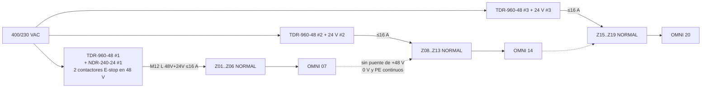

# Lente potencia 48/24 V, distribución en cadena, caja DIN, EMC y seguridad funcional

Proyecto Conveyone (Chile), ingeniero Sergio Contreras. Fecha 2026-09-03.
Capas: `user` (HANDOFF_2026-09-03 §6, §10, §11, §13, §14; MEMORIA_REV_B; prompts §17; BLOQUE_OMNI_v1/v4), `web` (`wf/research_potencia_seguridad.md`, `wf/research_motores_drivers.md`, `wf/research_controladores_din.md`, `wf/research_ecosistemas_zpa.md`, con URL y fecha de acceso 2026-09-03 en cada informe; manuales extraídos en `wf/pdftext/`), `calculo` (script `wf/calc_lente_potencia.py`, salida íntegra en `wf/calc_lente_potencia.out`; extractos en §2.16). Los pares de entrada (0,22–0,30 N·m continuo por familia; 0,28–0,57 N·m de inercia en inversión) se toman de la lente mecánica (`wf/lente_mecanica.md` A13/A14) y no se recalculan aquí. Todo dato sin fuente se marca **A VERIFICAR**.

---

## 1. Conclusiones en 10 líneas

1. **Una zona Omni con 2 steppers NEMA 23 a 48 V consume ≈ 4,3 A continuos (≈ 210 W) y ≈ 6,3 A de pico (≈ 300 W, ≤ 0,3 s) durante una inversión/desvío**; la fuente de 120 W (NDR-120-48) de la conversación previa queda descartada por cálculo, como ya advertía el digest. Con servos 48 V de 400 W: ≈ 3,1 A continuos, pico fijado por parámetro del driver. Con 2 UniDrive One 24 V (Bloque v4): 4,6 A nominal / 8,6 A en stall a 24 V. [calculo §2.2–2.3]
2. **Zona NORMAL**: 2,35 A nom / 4,35 A stall a 24 V (ZoneLogix + UniDrive One) o ≈ 2,0 A nom / 4,1 A arranque a 48 V (CZC + MDR 48 V). Línea de 20 zonas (17 N + 3 O) en flujo: **47 A a 48 V (2,26 kW)** o **54 A a 24 V (1,29 kW)**; arranque simultáneo no escalonado: 89 A / 100 A. [calculo §2.4]
3. **Zonas por ramal**: el límite no es la fuente sino el **conector pasante** (M12 L-coded 16 A a 63 V DC) y, a 24 V, el **presupuesto de caída** (UniDrive One 23–28 V ⇒ 1 V con fuente a 24 V). A 48 V: ≤ 16 A en el primer conector ⇒ **6 NORMAL + 1 OMNI ó 3 OMNI por segmento**, alimentado por una TDR-960-48 (20 A, trifásica) o desde el centro del segmento; una línea de 20 zonas = **3 segmentos/3 fuentes**. A 24 V: **≤ 6 zonas por fuente** (regla ZoneLogix: breaker máx. 20 A) y tramos de ≤ 3,6 m. [calculo §2.4–2.5]
4. **Caída de tensión** en 12 m con carga distribuida (47 A a 48 V): 4,2 V (2,5 mm²), 2,6 V (4 mm²), 1,7 V (6 mm²), +20 % a 70 °C; alimentando al centro se divide por 4. Los **contactos de 20 conectores pasantes** añaden 2–5 V a 2–5 mΩ/polo (**A VERIFICAR** en ficha): el trunk pasante por conector debe segmentarse aunque el cable sea de 6 mm². [calculo §2.5]
5. **Regeneración**: frenar una caja de 5 kg desde 1,5 m/s más las dos familias devuelve ≈ 9,6 J; sin cargas vecinas el bus de 48 V sube por encima de 60 V (umbral de sobretensión de DM556T/iSV) salvo ≥ 15 mF de capacidad. **Cada caja Omni necesita un chopper de freno (umbral 52–54 V, R ≈ 90 Ω, ≤ 5 W medios)** — igual que Interroll (MultiControl 52 V, DriveControl 2048 "integral brake chopper"). A 1,0 m/s la energía baja a 2,5 J de caja. [calculo §2.7]
6. **Decisión de contenido de UPSTREAM/DOWNSTREAM: comunicación + handshake, sin potencia** (opción 2 del handoff §11); **potencia por trunk separado POWER IN/OUT en un M12 L-coded 4+FE que lleva 48 V (motores) y 24 V (lógica/sensores/handshake) como dos circuitos**, 0 V unidos y un solo punto de PE por segmento. La lógica vive cuando el E-stop corta el 48 V (patrón ConveyLinx/MultiControl). [§2.9]
7. **Selectividad DC 48 V por limitación activa de corriente** (E-T-A ESX10-TC DC48V 1,2×IN): fuente 20 A → ramal 16 A → nodo Omni 8 A → driver 3 A. Los CBM E4 / REX12-T (24 V) sólo sirven aguas abajo del 24 V; fusibles gG en DC 48 V sin fuente verificada (**A VERIFICAR**). La limitación activa también resuelve el inrush de enchufe en caliente (i_pico teórico 240–960 A sin limitación). [calculo §2.6, §2.8]
8. **Seguridad funcional**: PLr preliminar **c–d** (gráfico de riesgo ISO 13849-1: S1–S2 / F2 / P1); diseño recomendado **PL d Cat 3** para el E-stop: relé de seguridad bicanal en cabecera de segmento + **dos contactores en serie en el 48 V** (o contactor + STO si el driver lo tiene; CL57T no declara STO). Un corte de potencia (cat. 0) **no detiene la caja**: rueda libre 1,7 m (1,0 m/s) / 3,8 m (1,5 m/s) con μr = 0,03 ⇒ paro cat. 1 (rampa + corte retardado) si la evaluación de riesgo lo exige. EN 619:2022 fija PLr para transportadores de rodillos, texto no accesible (**norma a comprar**). [§2.13]
9. **Guardas**: con ruedas Ø64 la luz de 10,75 mm entre ruedas exige ≥ 100 mm al punto peligroso (ISO 13857 T4) — la tapa v4 con ventanas es la solución correcta; correas/poleas en la zona muerta bajo tapa ciega con aberturas ≤ 4 mm (2 mm) o ≤ 8 mm (20 mm). Con Ø50 (luz 24,75 mm) la tabla pide 850 mm: inaceptable sin tapa. [calculo §2.10]
10. **Caja DIN Omni**: ≈ 440 mm de riel (2 rieles) + 2 drivers fuera de riel ⇒ gabinete ≈ 400×300×150 mm metálico, 32 W de disipación (ΔT ≈ 20 K sin ventilación, coef. **A VERIFICAR**); conectores M12 L (POWER IN/OUT), M12-8 A (UPSTREAM/DOWNSTREAM/SIDE), M12-4 A (SENSOR ZONE/SIDE), motores por prensaestopas con pantalla 360°; **el E-stop pasa por bornes de la caja, no por su electrónica**. [§2.11]

---

## 2. Análisis

### 2.1 Qué fija el usuario y qué se replantea (capa `user`)

| Fijado | Fuente | Se replantea aquí (handoff §16) |
|---|---|---|
| Cadena física UPSTREAM → DOWNSTREAM, "que se vea en serie"; cargas de potencia en paralelo sobre un trunk IN/OUT | handoff §6, prompts 1 y 3 | Qué transportan UPSTREAM/DOWNSTREAM (§11: sólo comunicación / +handshake / +24 V / separados) |
| ZPA local sin PLC; pérdida de gateway no destruye la ZPA | handoff §8-A, §13 | Distribución de potencia (§10), fuentes por tramo |
| Prototipo ESP32 industrial/DIN + NEMA 23 + driver básico | handoff §1.7, prompt 1 | Motor/driver definitivo (§12, §14.15–16) |
| Hipótesis 48 V motores / 24 V control; "no usar PoE para motores"; "no asumir que 120 W bastan" | handoff §10 | Se verifica por cálculo (§2.2–2.4) |
| Funciones mínimas de la caja (§11) y requisitos de confiabilidad (§13: watchdog, brownout, salidas OFF en boot, E-stop independiente, reinicio sin movimiento espontáneo) | handoff §11, §13 | Cómo se implementan (§2.11–2.13) |
| Velocidad 1,5 m/s (REV B) / "por lo menos 1 m/s" (prompt 1) | REV B, prompt 1 | La lente física/mecánica recomienda 1,0 m/s de diseño; aquí se calculan ambas |

Contradicciones internas de las conversaciones previas que esta lente resuelve con números: el PDF v1 marcó "24 + 48 V central" como recomendada y el mensaje final "48 V por tramos + DC/DC 48→24 en cada caja" (digest_logica_zpa §4 #6); la NDR-120-48 (120 W) fue declarada "no final" (digest §12); el DDR-30L-24 (30 W) se propuso sin balance de la lógica.

### 2.2 Balance eléctrico por accionamiento (dos opciones)

**Par y potencia mecánica por familia** (P = T·ω; ω = v/r; r = 0,025 m [user REV B]):

| Punto | T (N·m) | P @ 573 rpm (60 rad/s) | P @ 382 rpm (40 rad/s) | Fuente del par |
|---|---|---|---|---|
| Continuo (caja 5 kg a 2 m/s² + inercia) | 0,30 | 18,0 W | 12,0 W | lente mecánica A13 (calculo) |
| Criterio REV B "ideal 0,8 N·m a 573 rpm" | 0,80 | 48,0 W | 32,0 W | user REV B |
| Pico inversión ±1,5 m/s en 0,3 s (rueda 150 g) | 0,87 | 52,2 W | — | lente mecánica A14 |
| Pico inversión ±1,0 m/s en 0,3 s | 0,68 | — | 27,2 W | lente mecánica A14 |

**Opción 1 — NEMA 23 a 48 V** (23HE45-4204S: 4,2 A/fase, 0,88 Ω/fase, 3,4 mH; driver CL57T 24–48 V, 8 A pico; DM556T 1,8–5,6 A pico) [web research_motores_drivers §2a–2b, `https://www.stepperonline.es/download/23HE45-4204S_Torque_Curve.pdf`]. Un stepper con driver chopper mantiene la corriente de fase fija: pérdidas de cobre 2·I²·R = 2·4,2²·0,88 = **31 W** a plena corriente, 7,8 W en reposo (idle 50 %); pérdidas de hierro a 573 rpm **A VERIFICAR** (sensibilidad 10 W); rendimiento del puente 0,90 (**A VERIFICAR**). P_in = (P_mec + P_cu + P_fe)/0,9:

| Estado | P_mec | P_in (W) | I a 48 V |
|---|---|---|---|
| HOLD energizado | 0 | 19,7 | 0,41 A |
| FORWARD 1,0 m/s, 0,30 N·m | 12,0 | 58,9 | 1,23 A |
| FORWARD 1,5 m/s, 0,30 N·m | 18,0 | 65,6 | 1,37 A |
| FORWARD 1,5 m/s, 0,8 N·m (REV B) | 48,0 | 98,9 | 2,06 A |
| INVERSIÓN 1,5 m/s, 0,87 N·m | 52,2 | 103,6 | 2,16 A |
| INVERSIÓN 1,0 m/s, 0,68 N·m | 27,2 | 75,8 | 1,58 A |

Cota de diseño adoptada por driver stepper: **2,0 A continuos / 3,0 A pico (0,3 s) a 48 V** (margen ≈ 1,4× sobre el cálculo; la corriente de bus de un driver stepper no está publicada en las fichas consultadas → **medir en banco con pinza DC**). Nota: el stepper consume ≈ 20 W por familia aunque la caja esté detenida (HOLD energizado); si se desenergiza en HOLD (idle current 50 %) baja a 8 W pero se pierde par de retención — en un lecho horizontal no hace falta retener.

**Opción 1b — servo integrado 48 V 400 W** (IDS-C60AP-48V400W / JMC iHSV60-30-40-48: 1,27 N·m nominal, 10–11,2 A a 3000 rpm; iSV57T-180: 0,6/1,1 N·m, 0–6 A) [web research_motores §2c]. A 573 rpm (19 % de la velocidad nominal), P_in ≈ P_mec/0,8 + 8 W: 30 W (0,3 N·m) a 73 W (0,87 N·m) ⇒ **0,6–1,5 A por motor**; el pico lo fija el parámetro de límite de corriente del driver (180–250 % durante 1 s [web]) y debe parametrizarse a ≤ 4 A por motor para que la protección de nodo sea selectiva.

**Opción 2 — motores tipo UniDrive/MDR** (fichas) [web research_ecosistemas_zpa §1 #2, spec UL S-UD22011001R01; research_motores §2d]:

| Motor | V | I nominal | I arranque/stall |
|---|---|---|---|
| UniDrive One 60 W (el del ZP2026 y del Bloque v4) | 24 | 2,0 A (48 W) | 4,0 A |
| ZoneLogix UL con motor 60 W | 24 | 4 A @ 15 in·lbf | 4,5 A máx |
| ZoneLogix PRO UD100 | 24 | 5,6 A @ 15 in·lbf | 7,0 A |
| UniDrive CORE 120 W | 48 | 3,3 A | > 15 in·lbf, corriente A VERIFICAR |
| Interroll EC5000 50 W | 48 / 24 | 1,7 / 3,4 A | 3,8 / 7,5 A |
| Pulseroller PGD-Ai-48 50 W | 48 | 1,6 A | 4,0 A |

Lectura: el motor de 60 W del ZP2026 a 24 V toma 2 A nominales pero **4 A en stall**, y ZoneLogix llega a 4–4,5 A "@ 15 in·lbf" — es decir, con par alto una zona 24 V se acerca a 100 W eléctricos. A 48 V los MDR de 50 W toman la mitad de corriente que a 24 V (Interroll: "Doubling the voltage halves the current" [web research_potencia §2(b)]).

### 2.3 Balance por zona (control + accionamiento)

Control de una zona CZC a 24 V (calculo): placa ESP32 DIN 24 V/0,4 A = 9,6 W (Norvi ENET declara "24 V DC 0,4 A" [web research_controladores 2(a)]; Waveshare/StamPLC no declaran consumo → **A VERIFICAR**) + 2 sensores fotoeléctricos PNP a 35 mA (**A VERIFICAR** ficha del sensor) 1,7 W + 4 salidas handshake/LED 1,0 W + transceptor CAN aislado 1,2 W (**A VERIFICAR**) = **13,4 W = 0,56 A a 24 V**; vía DDR 48→24 (91 %) = 0,31 A a 48 V. ZoneLogix Plus/UL sin motor: 0,2–0,3 A [web spec UL].

| Zona | Continuo | Pico | Observación |
|---|---|---|---|
| NORMAL Ruta A: ZoneLogix + UniDrive One 24 V | 2,35 A @ 24 V (56 W) | 4,35 A stall (104 W) | tarjeta 0,3 + motor 2,0 + sensor |
| NORMAL Ruta B: CZC + MDR 48 V (EC5000/PGD 50 W) | 2,0 A @ 48 V (97 W) | 4,1 A arranque | control vía DDR incluido |
| NORMAL Ruta B: CZC + UniDrive One 24 V | 2,56 A @ 24 V | 4,56 A stall | requiere conmutación propia o placa de driver A VERIFICAR |
| **OMNI 2× NEMA 23 + CL57T 48 V** | **4,31 A @ 48 V (207 W)** | **6,31 A (303 W, ≤ 0,3 s)** | 2×2,0 + 0,31 / 2×3,0 + 0,31 |
| OMNI 2× servo 48 V 400 W | 3,1 A @ 48 V (150 W) | ≤ 8,3 A si se limita a 4 A/motor | pico por parámetro |
| OMNI 2× UniDrive One 24 V (Bloque v4) | 4,56 A @ 24 V (109 W) | 8,56 A stall | sólo alcanza ≈ 0,92 m/s a 1:1 (lente control A-9) |

**Contradice a la conversación previa**: "NDR-120-48 (48 V, 2,5 A, 120 W) para prototipo" — una sola Omni continua = 207 W > 120 W y el pico de 303 W la apagaría (NDR: "105–130 % … shut down after 3 sec., re-power on to recover" [web research_potencia §2(a), `https://www.meanwell.com/Upload/PDF/NDR-480/NDR-480-SPEC.PDF` — mismo comportamiento de la familia NDR]). Confirma la advertencia "dos NEMA 23 pueden superar 120 W" del digest (§5.3).

### 2.4 Línea de 20 zonas y zonas por ramal (respuesta a la pregunta 20 del §14)

Longitud de línea = 20 × 0,598 m = **11,96 m** (zona ZP2026 de 598 mm [user BLOQUE_OMNI_v1]). Composición supuesta 17 NORMAL + 3 OMNI (prompt 1: "cinco zonas de acumulación, un Omniwheels, después una zona Unidrive, otra Omniwheels, después cinco Unidrive"). Simultaneidad: en flujo ZPA todos los motores corren (factor 1,0); en acumulación ≈ 0. Se dimensiona con todo en marcha a nominal y arranques escalonados (el Search & Rescue de ZoneLogix ya es zona a zona [web manual UL 301622 l.810]).

| Escenario | Nominal todo en marcha | Pico (3 Omni invirtiendo) | Arranque simultáneo (no escalonado) |
|---|---|---|---|
| Ruta B, todo 48 V | **47,1 A (2 259 W)** | 53,1 A | 88,8 A |
| Ruta A, todo 24 V | **53,6 A (1 287 W)** | — | 99,6 A |

Zonas por ramal según el eslabón limitante (calculo §5):

| Limitante | Valor (web) | Zonas 48 V | Zonas 24 V |
|---|---|---|---|
| SDR-480-48 / SDR-240-24: 10 A, pico 15 A 3 s, sin paralelo declarado | research_potencia §2(a) | 3 NORMAL ó 1 OMNI (80 %) | 3 NORMAL ó 1 OMNI |
| TDR-960-48: 20 A trifásica, paralelo hasta 4× (×0,9) | ídem | 7 NORMAL ó 3 OMNI | — |
| Regla ZoneLogix UL: "PELV 24 Vdc power supply, having a 20 A maximum output circuit breaker" | pdftext/zonelogix_UL_manual_301622.txt l.965 | — | 6 NORMAL ó 3 OMNI |
| **Conector pasante M12 L-coded 16 A @ 63 V DC (2,5 mm²)** | binder `https://www.binder-usa.com/us-en/products/automation-technology-voltage-and-power-supply/m12-l` | **≤ 7 NORMAL ó 3 OMNI ó 6 N + 1 O (16,4 A)** | ≤ 6 NORMAL ó 3 OMNI |
| Han Q 5/0 16 A; bornes PTFIX 24 A | harting / rspsupply | igual que M12 L / 8 N + 2 O = 24,7 A no cabe | — |

**Regla de diseño**: segmento de potencia = lo que pasa por el primer conector ≤ 16 A ⇒ **6 NORMAL + 1 OMNI** (o 3 OMNI) por segmento a 48 V; una línea de 20 zonas = **3 segmentos** con 3 fuentes TDR-960-48 (o 2 si cada fuente alimenta desde el **centro** del segmento: la corriente por conector y la caída se reparten en dos direcciones, 10 zonas por fuente de 20 A con ≤ 12 A por rama). A 24 V (Ruta A): 6 zonas por fuente NDR/SDR-240-24 ajustada a 26–27 V (ver §2.5), es decir **4 fuentes por 20 zonas**. Conectores > 16 A (7/8 in, M12 Power K/S): **no consultados → A VERIFICAR**.



Entre segmentos **no se puentea el +48 V ni el +24 V** (ZoneLogix: "When adjacent zones are operating from separate 24 VDC power supplies you must connect their 0 VDC grounds together. However, do not connect their positive voltage terminals together." [web manual UL 301622 l.252]); el conector POWER OUT del último nodo del segmento lleva un tapón codificado.

### 2.5 Caída de tensión (calculo §6; R′ IEC 60228 clase 2 a 20 °C: 2,5 mm² 7,41; 4 mm² 4,61; 6 mm² 3,08 Ω/km [web research_potencia #19]; ×1,2 a 70 °C)

Fórmulas: carga concentrada al final ΔV = 2·L·I·R′; carga uniforme alimentada por un extremo ΔV_final = R′·L·I_total (la mitad de la concentrada); alimentación al centro: L/2 e I/2 en cada dirección ⇒ ΔV/4.

Presupuestos admisibles: 48 V → 42 V mínimo de motor (ConveyLinx-Ai3-48 [web]) = **6 V**; DDR-120C/240C UVLO 33,6 V ⇒ 14,4 V antes de perder la lógica derivada; 24 V: ZoneLogix 22 V mín ⇒ **2 V** con fuente a 24 V (6 V si la fuente se ajusta a 28 V); **UniDrive One 23–28 V ⇒ 1 V con fuente a 24 V** (5 V a 28 V) [web research_ecosistemas #2 pinout M8].

| Caso | 2,5 mm² | 4 mm² | 6 mm² |
|---|---|---|---|
| 48 V, 12 m, 47,1 A uniforme desde un extremo | 4,17 V (5,00 a 70 °C) | 2,59 V (3,11) | 1,73 V (2,08) |
| 48 V, 12 m, 47,1 A concentrada (cota superior) | 8,34 V | 5,19 V | 3,47 V |
| 48 V, 12 m, 47,1 A alimentada al centro | 1,04 V | 0,65 V | 0,43 V |
| 48 V, segmento 6 m (8 N + 2 O = 24,7 A) uniforme | 0,66 V (0,79) ; 8,1 W | 0,41 V ; 5,0 W | 0,27 V ; 3,4 W |
| 24 V, 12 m, 53,6 A uniforme | 4,75 V | 2,96 V | 1,98 V |
| 24 V, segmento 4 zonas (2,4 m, 9,4 A) | 0,17 V | 0,10 V | 0,07 V |
| L_máx (m) para 6 V / 20 A uniforme a 48 V | 40,5 | 65,1 | 97,4 |
| L_máx (m) para 1 V / 10 A uniforme a 24 V | 13,5 | 21,7 | 32,5 |

Conclusiones: (i) a **48 V con 4 mm²** una línea entera de 12 m alimentada por un extremo cae 2,6–3,1 V (< 6 V): el cable no limita, limita el conector (16 A) y la fuente; (ii) a **24 V** el presupuesto de 1 V del UniDrive One obliga a **tramos ≤ 4–6 zonas** o a subir la fuente a 27–28 V (ajuste 24–28 V de NDR/SDR-240 [web]) — el ZP2026 actual ya debe estar segmentado así (**A VERIFICAR** en la instalación real); (iii) **contactos de conectores pasantes**: con 20 pares en cadena y corriente decreciente, ΔV ≈ 2·R_c·I_total·(N+1)/2 = **2,0 / 4,9 / 9,9 V para R_c = 2 / 5 / 10 mΩ por polo** — comparable o mayor que el cable; la resistencia de contacto del M12 L no está en los informes (**A VERIFICAR** en ficha binder/Molex). Esto refuerza segmentar a ≤ 7 nodos pasantes y alimentar al centro.

### 2.6 Inrush (calculo §7)

- **Lado AC** (fichas Mean Well [web research_potencia #1, #6, #10, #12, #14]): NDR-480-48 35 A/230 VAC; SDR-480-48 **80 A**/230 VAC; TDR-960-48 60 A; DDR-240C-24 30 A; DDR-120C-24 5 A. Tres TDR-960 en el mismo circuito ⇒ 180 A de inrush: interruptor magnetotérmico curva C/D y arranque escalonado de fuentes (A VERIFICAR con el tablero).
- **Lado DC — enchufe en caliente de un nodo**: i_pico = 48 V/R_lazo; τ = R_lazo·C_nodo. Con C_nodo = 470–2 200 µF (**A VERIFICAR**: condensadores de entrada de 2 drivers + DDR; el DDR-120C declara inrush 5 A) y R_lazo = 0,05–0,2 Ω: **i_pico 240–960 A durante 0,02–0,44 ms, energía 0,5–2,5 J**. Un e-fuse con **limitación activa 1,2×IN** en la entrada de cada nodo (E-T-A ESX10-TC DC48V: "Current limitation typically 1,2 x IN" [web `https://global.e-t-a.com/products/electronic_overcurrent_protection/electronic_overcurrent_protection_dc/p/esx10_tc_dc_48_v/`]) convierte el enchufe en una precarga a ≤ 9,6 A; sin él, el pico erosiona contactos y puede hacer caer el bus del segmento (fuente en limitación 105–130 %).
- Regla de instalación: el trunk pasante debe poder conectarse **sin tensión** (procedimiento) o con e-fuse por nodo; el conector POWER OUT del nodo no debe enchufarse "en caliente" a un segmento con la fuente en carga.

### 2.7 Regeneración a 48 V (calculo §8) — responde al handoff §10 último punto

Energías: caja 5 kg a 1,5 m/s = 5,6 J (2,5 J a 1,0 m/s); rotacional por familia 1,0–2,0 J (lente mecánica A14). Peor caso: frenado de caja + 2 familias = **9,6 J en 0,3 s ⇒ 32 W medios**; inversión de una familia en DIVERT (caja parada) = 2 J ⇒ 7 W. Los drivers stepper/servo consultados no tienen resistencia de freno y disparan por sobretensión a **60 V** (DM556T, iSV-B23) u 80 V (JMC) [web research_motores §2e]; las fuentes no absorben. Tensión del bus con capacidad C y sin otras cargas: V = √(48² + 2E/C):

| C del bus (µF) | 1 000 | 2 200 | 4 700 | 10 000 | necesaria para ≤ 60 V | para ≤ 55 V |
|---|---|---|---|---|---|---|
| V_final | 147 V | 105 V | 80 V | 65 V | **14,9 mF** | 26,7 mF |

⇒ **Chopper de freno por caja Omni**: umbral 52–54 V (Interroll MultiControl actúa a 52 V a 48 V [web research_motores §2e]; DriveControl 2048 "integral brake chopper (voltage-dependently switched load resistance)" [pdftext/interroll_drivecontrol2048.txt l.24]), R ≈ 54²/32 W ≈ **90 Ω**, energía por evento ≤ 10 J, potencia media a 2 000 desvíos/h ≈ 2 W (≤ 5 W con frenados). Alternativas: (a) confiar en que otras zonas del segmento estén en marcha (no garantizable: en acumulación están paradas); (b) servos con resistencia de freno interna (no documentada, **A VERIFICAR**); (c) bajar a 1,0 m/s (energía 2,5 + 4 J = 6,5 J, aún > 60 V con 4,7 mF). Además el límite PELV/contacto de 60 V DC (Interroll advierte que el EC5000 48 V en generador supera 60 V en el conector abierto [web]) obliga a que el chopper actúe por debajo de 60 V en todos los casos.

### 2.8 Selectividad de protecciones DC (calculo §9)

Con fuentes que entran en limitación de corriente (TDR-960: 105–130 %, apagado a 3 s y rearme por corte de red [web]), la selectividad no puede fiarse a curvas térmicas: **cada escalón inferior limita activamente por debajo del superior**.

| Escalón | Dispositivo (web) | IN | 1,2×IN | Debe cubrir |
|---|---|---|---|---|
| Fuente de segmento | TDR-960-48 | 20 A | limitación 21–26 A | 6 N + 1 O = 16,4 A nominal |
| Ramal (opcional, en la fuente) | ESX10-TC DC48V 16 A | 16 A | 19,2 A | < limitación de la fuente ✔ |
| Nodo OMNI | ESX10-TC 8 A | 8 A | 9,6 A | pico Omni 6,3 A (0,3 s) ✔; cortocircuito en el nodo ≤ 9,6 A < 19,2 A ✔ |
| Nodo NORMAL | ESX10-TC 4 A | 4 A | 4,8 A | arranque MDR 48 V 4,1 A ✔ (verificar curva t–I para 3,8 A/≤ 1 s) |
| Driver A / B | ESX10-TC 3 A c/u | 3 A | 3,6 A | pico 3,0 A ✔; la falla de un driver no tumba al otro ni al control |
| Control 24 V | e-fuse 24 V (REX12-T / CBM E4, sólo 18–30 V [web]) 1–2 A | — | — | aguas abajo del DDR o del trunk 24 V |

**Descartados a 48 V**: Phoenix CBM E4 24DC (18–30 V) y E-T-A REX12-T (sin versión 48 V) [web research_potencia §2(b)]. Fusibles gG DC 48 V: sin fuente primaria (**A VERIFICAR** tensión DC asignada y curva). El ESX10-TC tiene contacto auxiliar N/O 0,2 A [web] → entrada de diagnóstico del CZC ("FAULT_POWER").

### 2.9 Conectores IN/OUT y contenido de UPSTREAM/DOWNSTREAM (handoff §11: opciones 1–4)

| Opción §11 | Evaluación desde potencia/EMC | Veredicto |
|---|---|---|
| 1. Sólo comunicación | El handshake por bus depende del firmware del vecino; un nodo apagado no puede "negar permiso" por física | No |
| **2. Comunicación + handshake** | CAN (par trenzado) + REQ/PERM PNP 24 V (≤ 10 mA, alimentadas por el emisor) en un M12-8 A: corrientes despreciables, sin problema térmico; EMC manejable con par CAN trenzado y pantalla a FE (A VERIFICAR con ensayo) | **Sí (igual que lente control A30)** |
| 3. Comunicación + 24 V | Para que el 24 V "pase" hacia aguas abajo tendría que soportar la corriente de todos los nodos siguientes (≤ 11 A de lógica en 20 zonas; 47 A si además llevara motores): un M12-8 A-coded no lo admite (capacidad por contacto A VERIFICAR, típicamente ≤ 2 A); además un cortocircuito en el cable de datos apagaría la cadena | No |
| 4. Separados | Es la opción 2 más un trunk de potencia propio | **Sí** |

**Decisión**: UPSTREAM/DOWNSTREAM/SIDE = M12-8 A-coded con CAN + REQ/PERM + TOKEN + 0 V + LOOP (pinout de la lente control §2.5); **POWER IN/OUT = M12 L-coded 4+FE** (IEC 61076-2-111, 16 A/63 V DC, IP67 [web binder]) con **dos circuitos: 48 V+/48 V− motores y 24 V+/24 V− lógica-sensores-handshake**, FE al blindaje/PE. Ventajas: (i) el E-stop corta sólo el 48 V y la lógica sigue viva (ConveyLinx: "keep the logic and communications powered and active and disconnect the MDR Power … in an E-Stop situation" [pdftext/conveylinx_ai2_v21.txt l.1195–1200]; MultiControl separa L1 24 V / L2 48 V [web]); (ii) las zonas ZoneLogix de la Ruta A/C se alimentan del mismo 24 V; (iii) el DDR 48→24 por caja pasa a ser **opcional** (sólo si un cliente pide un único cable de 48 V) — con DDR el UVLO a 33 V apaga la lógica antes que los drivers (24–48 V), así que el firmware debe deshabilitar drivers por hardware al reiniciar (§2.13). 0 V de ambos circuitos unidos en la fuente y **un solo punto de PE por segmento** (ZoneLogix exige PELV con 0 V a tierra [web manual UL l.965]; ConveyLinx recomienda "tie all DC common terminals together and a single connection to earth ground" [pdftext/conveylinx_ai2_v21.txt l.1178]).

**Capacidad**: 16 A por contacto del L-coded ⇒ segmento ≤ 16 A en el 48 V (§2.4); el 24 V de 20 zonas CZC (11 A) cabe en un solo segmento de 24 V, pero en Ruta A (motores 24 V) el 24 V también se segmenta a 6 zonas.

### 2.10 Necesidad de fuentes por tramo — resumen

| Ruta | Tensión de motores | Fuentes por 20 zonas | Justificación |
|---|---|---|---|
| A (ZoneLogix + UniDrive One) | 24 V | 4 × 24 V/10 A (ajustadas a 26–27 V) | regla ZoneLogix 20 A; ΔV 1 V del UniDrive One; 2,35 A/zona |
| B (CZC + MDR 48 V, Omni stepper 48 V) | 48 V + 24 V lógica | 3 × TDR-960-48 (o 2 alimentando al centro) + 1–2 × 24 V/10 A | 16 A por conector; 47 A totales |
| C (transición: ZoneLogix 24 V + Omni 48 V) | 24 V y 48 V | 4 × 24 V + 1 × SDR-480-48 por cada 1–2 Omni (10 A, 15 A/3 s) | Omni 4,3 A cont / 6,3 A pico; SDR tolera el pico, NDR no |

La SDR-480-48 es la única monofásica de 480 W consultada que tolera 150 % durante 3 s [web]; ninguna monofásica de 480 W declara paralelo. Para producto con > 2 Omni por segmento se necesita la TDR-960 (trifásica 340–550 VAC) — coherente con el prompt 1 ("distribución eléctrica en paralelo trifásica").

### 2.11 Concepto de caja DIN por módulo Omni (handoff §11)

| Función mínima (§11) | Implementación propuesta | Fuente |
|---|---|---|
| Controlador ESP32 industrial/DIN | Prototipo: Waveshare ESP32-S3-ETH-8DI-8RO-C (CAN aislado + RS485 + 8 DI opto 5–36 V) o M5Stack StamPLC; producto: PCB propia ESP32-C6/P4 -IND con DI IEC 61131-2, watchdog externo | web research_controladores §1, §2(f) |
| Interfaz de comunicaciones | CAN 2.0 500 kbit/s pasante por UPSTREAM/DOWNSTREAM/SIDE (M12-8 A) | lente control |
| I/O 24 V | 2 DI sensor (S0/S1 de la lente lógica, S2/SIDE), 2 DI REQ/PERM, 2 DO PNP REQ/PERM, DI "48 V OK" (aux. del e-fuse), DI "E-stop OK" (contacto del relé de seguridad, sólo informativo) | calc |
| Dos interfaces de driver | STEP/DIR/ENA optoaisladas 24 V + ALM de cada CL57T (ALM 20 mA 5–24 V) [web]; ENA activo-bajo con pull-down por hardware | web research_motores §2e |
| Protección de control | e-fuse 24 V 2 A (REX12-T / CBM E4) | web |
| Protección individual o coordinada de drivers | ESX10-TC 8 A (nodo) + 3 A + 3 A (drivers) | §2.8 |
| DC/DC si aplica | DDR-120C-24 (32 mm, 5 A) sólo si no hay trunk de 24 V | web |
| Chopper de freno | módulo propio MOSFET + R 90 Ω/50 W, umbral 52–54 V, con salida "CHOPPER_ACTIVE" al ESP32 | §2.7 |
| Borneras | PTFIX 6/12×2,5 (24 A) para 48 V+, 48 V−/0 V, 24 V+, PE; bornes de paso del lazo E-stop (2 canales) | web |
| PE | placa de montaje metálica = plano de referencia; barra PE; pantallas de motor a 360° en abrazadera sobre la placa **junto al driver** (no en la entrada del gabinete) | web ABB/Parker research_potencia §2(e) |
| Conectores externos | POWER IN / POWER OUT (M12 L-coded 4+FE, 16 A), UPSTREAM / DOWNSTREAM / SIDE (M12-8 A), SENSOR ZONE / SENSOR SIDE (M12-4 A, o M8-3), MOTOR A / MOTOR B (prensaestopas EMC con contacto de pantalla; los motores no se desconectan en caliente), SAFETY IN / SAFETY OUT (M12-4 A, 2 canales del lazo de E-stop, pasante por bornes) | calc |
| LEDs/diagnóstico | 48 V OK, 24 V OK, RUN/FAULT del CZC, ALM A, ALM B, CAN, REQ/PERM up/down/side, CHOPPER; ordenados de UPSTREAM a DOWNSTREAM en la tapa | handoff §11 |
| Acceso de programación | USB-C detrás de la tapa (sin exponer 48 V) + OTA por CAN | web ESP-IDF OTA |
| Identificación | serigrafía "← UPSTREAM / DOWNSTREAM →", conectores codificados por color, POWER OUT con tapón en fin de segmento | handoff §6 |

Presupuesto de riel (calculo §11): 4 × ESX10-TC (12,5 mm) 50 + DDR-120C 32 + e-fuse 24 V 12,5 + placa ESP32 ≈ 145 (**A VERIFICAR**) + relé/contactores 48 V 2 canales 35 + bornes 100 + chopper 45 + reserva ≈ **440 mm ⇒ 2 rieles de 250 mm**; 2 drivers CL57T fuera de riel sobre la placa (dimensiones **A VERIFICAR**). Gabinete metálico ≈ **400 × 300 × 150 mm**, IP54; disipación ≈ 32 W (2 drivers ≈ 10 W c/u a 100 W, DDR 1,4 W, chopper ≤ 5 W, ESP32 5 W) ⇒ ΔT ≈ 20 K en 0,3 m² a 5 W/m²K (coef. **A VERIFICAR**; sin ventilador si T_amb ≤ 35 °C). El tamaño 300×250×150 del PDF v1 (digest §9) queda corto con 4 e-fuses + chopper + bornes de E-stop.

```mermaid
flowchart TB
  subgraph CAJA["Caja OMNI (placa metálica = referencia)"]
    direction LR
    subgraph RIEL1["Riel 1 · potencia"]
      EF[ESX10 8A nodo] --> EFA[ESX10 3A drv A] & EFB[ESX10 3A drv B]
      K[K1·K2 48 V\n(canales E-stop)] --> EF
      CH[Chopper 52–54 V] --- EF
      DDR[DDR-120C 48→24 opcional]
    end
    subgraph RIEL2["Riel 2 · control"]
      CZC[ESP32 DIN · CAN · DI/DO 24 V] --> DRVA[CL57T A] & DRVB[CL57T B]
      EF24[e-fuse 24 V 2 A] --> CZC
    end
  end
  PIN[POWER IN M12 L\n48 V + 24 V] --> K
  PIN --> EF24
  K --> POUT[POWER OUT M12 L]
  UP[UPSTREAM M12-8] --- CZC --- DN[DOWNSTREAM M12-8]
  SIDE[SIDE M12-8] --- CZC
  S1[SENSOR ZONE] --> CZC
  S2[SENSOR SIDE] --> CZC
  DRVA -->|pantalla 360° en placa| MA[MOTOR A]
  DRVB --> MB[MOTOR B]
  SIN[SAFETY IN 2 ch] -.bornes de paso.- SOUT[SAFETY OUT 2 ch]
```

Nota: K1·K2 dentro de la caja sólo si se elige "corte local por segmento de seguridad"; en el prototipo basta con los dos contactores en la fuente del segmento (§2.13) y la caja no lleva componentes de seguridad, sólo bornes pasantes del lazo.

### 2.12 Prácticas EMC (respuesta a la pregunta 21 del §14)

Fuentes primarias: ABB "Grounding and cabling of drive systems" y Parker OEM750 EMC guide (drivers paso a paso) [web research_potencia §2(e), URLs #51 y #52].

1. **Segregación**: cables de motor separados de control/sensores ≥ 200 mm (Parker: "at least 8 inches (200 mm)" de relés/contactores; ABB ≥ 300 mm en bandejas), cruces a 90°. Dentro de la caja: riel de potencia arriba, riel de control abajo, canaleta metálica intermedia.
2. **Motores**: cable apantallado con **360°** en el cuerpo del motor y en una abrazadera R-clamp sobre la placa junto al driver; **la pantalla no se une al gabinete en la entrada** ("The cable screen must not be connected to the cabinet at the point of entry. Its function is to return high-frequency chopping current back to the drive" — Parker). Cables volantes del NEMA 23 convertidos a cable apantallado a ≤ 10 cm del motor.
3. **Filtro**: un filtro por fuente DC, a ≤ 50 mm de ella (Parker); ferritas en cables de motor, E/S y CAN cerca del conector.
4. **CAN y handshake**: par trenzado apantallado, pantalla a FE en ambos extremos por la carcasa del M12 (o 3,3 nF/630 V en el extremo remoto para señales, ABB); terminación 120 Ω conmutada en fin de línea; transceptor CAN aislado (Waveshare -C ya lo aísla [web]).
5. **Sensores**: cable apantallado; DI tipo 3 IEC 61131-2 con filtro de 1 ms; nunca 24 V y 230 V en el mismo cable (ABB).
6. **Retornos**: 0 V de 48 V y 24 V unidos sólo en la fuente del segmento; un punto de PE por segmento; PE ≥ 2,5 mm² protegido / 4 mm² sin protección (ABB).
7. **Frecuencia de PWM**: los drivers CL57T/DM556T conmutan a decenas de kHz (valor no publicado, **A VERIFICAR**); la resistencia de chopper y su MOSFET deben ir sobre la misma placa con el lazo de corriente más corto posible.
8. **Ensayo**: verificar en banco que el CAN no tenga errores (contador de error frames) con los dos steppers invirtiendo a 4,2 A/fase; es la prueba de aceptación EMC del prototipo.

### 2.13 Seguridad funcional (respuesta a la pregunta 22 del §14)

**Estimación de PLr (ISO 13849-1, gráfico de riesgo)** para las funciones de seguridad de un transportador de acumulación con desvío que mueve cajas de ≤ 5 kg a 1,0–1,5 m/s:

| Función | S | F | P | PLr estimado | Comentario |
|---|---|---|---|---|---|
| Paro de emergencia (E-stop) | S1 (golpe/atrapamiento leve por caja ligera) → S2 si se accede a correas/poleas con guarda retirada | F2 (operarios despejan atascos con frecuencia) | P1 (velocidad baja, visible) | **c (S1) – d (S2)** | Fuente secundaria: mínimo habitual PL c y arquitectura "PL d Cat 3" [web research_potencia §2(d), no verificado en ISO 13850] |
| Enclavamiento de la tapa/guarda de correas | S2 (nip correa-polea 573 rpm) | F1–F2 | P1 | **d** | EN 619:2022 fija PLr por función; texto no accesible (norma de pago) [web #40] |
| Prevención de arranque inesperado tras rearme | S1 | F2 | P1 | **c** | IEC 60204-1: "reset shall not initiate a restart" [SEC, no verificado literalmente] |

Esto es una **estimación preliminar**; la evaluación formal (ISO 12100 + EN 619:2022 + IEC 60204-1) la debe firmar el integrador (Flowsort exige lo mismo a quien integra su desviador: "The diverter shall be incorporated into an emergency stop circuit arranged by the system integrator … EN-IEC 60204-1 … EN-ISO 13850" [pdftext/flowsort_SLD_DLD_manual.txt l.202–206]).

**Arquitectura de E-stop recomendada (PL d Cat 3, independiente del ESP32)**:

```mermaid
flowchart LR
  ES1[E-stop 1\n2 NC] --> SR[Relé de seguridad bicanal\nPNOZ s3 / XPSUAF13AP / 3SK1111\nPL e, 10–20 ms]
  ES2[E-stop n\n2 NC] --> SR
  SR -->|canal 1| K1[Contactor K1 48 V]
  SR -->|canal 2| K2[Contactor K2 48 V]
  K1 --> K2 --> TRUNK[Trunk 48 V del segmento]
  K1 -.contacto NC realimentación.-> SR
  K2 -.-> SR
  SR -->|salida informativa| CZCs[DI 'ESTOP_OK' de cada CZC\n(sólo diagnóstico)]
  START[Pulsador START\nseparado del RESET] --> SR
```

- Relés de seguridad con datos verificados: PNOZ s3 (PL e Cat 4, PFHd 2,31·10⁻⁹/h, apertura 10–20 ms, 17,5 mm), Schneider XPSUAF13AP (PL e, 1,13·10⁻⁹, 500 Ω de línea, 22,5 mm), Siemens 3SK1111-2AB30 (PL e, 1,7·10⁻⁹, cat. 0, 10 ms) [web research_potencia #42–44]. Con PL d (PFHd 10⁻⁷…10⁻⁶) el presupuesto lo consumen contactores y pulsadores, no el relé.
- **Corte de potencia vs STO**: CL57T/DM556T no declaran STO; los drivers con STO SIL 3/PL e Cat 3 existen (Oriental Motor AZ) [web #46]. STO = parada cat. 0 sin aislamiento y **sin frenado** [web Nidec #45]. Elección para el prototipo: **dos contactores en serie en el 48 V del segmento**, realimentados al relé; para producto, contactor + STO del driver como segundo canal.
- **Un corte cat. 0 no detiene la caja**: con las ruedas sin par, la caja rueda con μr ≈ 0,03 y recorre **1,7 m (1,0 m/s) / 3,8 m (1,5 m/s)** hasta detenerse (calculo §10). Si la evaluación de riesgo exige que la caja se detenga (p. ej. salida lateral hacia una persona), la función debe ser **cat. 1**: el relé ordena rampa a los drivers (DI "STOP_SAFE" → 0,3–0,5 s) y corta el 48 V con retardo (relés con retardo a la desconexión, no consultados → **A VERIFICAR**). Los rodillos de una zona ZP2026 con UniDrive One frenan por ZMH (0–2,2 V = "Stop (Braked ZMH)" [web]) mientras hay 24 V — con el 48 V cortado y el 24 V vivo, las zonas normales de la Ruta A siguen frenando; la Omni no.
- **Rearme sin movimiento espontáneo (IEC 60204-1)**: RESET del relé ≠ START de línea; el CZC arranca en SAFE_STOP y sólo pasa a Search & Rescue con la señal cableada LINE_RUN (lente lógica §2.11). El ZoneLogix mueve las zonas al energizar (Run-On-Time) [web manual UL l.810] — en Ruta A/C ese movimiento ocurrirá al rearmar el 24 V; si se corta sólo el 48 V, ZoneLogix (24 V) no se reinicia y no hay S&R espontáneo, pero **sí** reanuda su descarga en curso cuando vuelve el 24 V del motor: **A VERIFICAR** en banco qué hace ZoneLogix cuando el +24 V del motor se corta y vuelve (el motor y la tarjeta comparten alimentación en ZoneLogix Plus: no hay separación lógica/motor documentada).
- **Brownout seguro**: 48 V vigilado por ADC del CZC (drivers OFF por firmware a < 40 V, antes del UVLO del DDR a 33,6/33 V [web]); 24 V vigilado (< 19 V ⇒ SAFE_STOP; ZoneLogix mínimo 22 V); ESP32 con brownout a nivel alto (S3: por defecto 2,44 V, ajustable hasta 3,3 V [web research_controladores]).
- **Salidas OFF en boot**: los GPIO del ESP32 pulsan en reset ("at boot or reset, the GPIO pin is going high, then low" [web]); ENA de cada driver **activo-bajo con pull-down por hardware** y **latch de habilitación** que sólo cierra el watchdog externo (MAX6369/TPS3823 [web]) tras recibir pulsos válidos; REQ/PERM en 0 por defecto (fail-safe: vecino apagado = sin permiso).
- **Watchdog**: externo, 100 ms (lente lógica); su reset abre el latch de ENA ⇒ drivers OFF y handshake en 0.
- **Guardas (ISO 13857:2019 Tabla 4 [web Troax #47])**: e ≤ 4 mm → 2 mm; 4–6 → 10; 6–8 → 20; 8–10 → 80; 10–12 → 100; 12–20 → 120; 20–30 → 850 (200 si ranura ≤ 65 mm). Aplicado al lecho (calculo §10): luz entre ruedas Ø64 vecinas 10,75 mm ⇒ ≥ 100 mm al punto peligroso (correas/poleas bajo la tapa, a > 100 mm por debajo del plano ⇒ cumple si la tapa v4 cierra el resto); luz 6,7 mm banda↔rueda (v4) ⇒ 20 mm; **con Ø50 (luz 24,75 mm) la tabla pide 850 mm**: sólo admisible con tapa perforada entre ruedas. La tapa ciega de la zona muerta (v4) sobre poleas/correas debe tener aberturas ≤ 4 mm o enclavamiento; guarda "desmontable" (REV B) ⇒ herramienta + enclavamiento si se abre en marcha (ISO 14120 referida por Troax). Los puntos de atrapamiento rueda-rodillo vecino y EN 619 (texto): **A VERIFICAR** con la norma.

### 2.14 Respuestas a las preguntas 19–22 del handoff §14

- **19. ¿Corriente pico de dos accionamientos durante inversión/desvío?** Steppers NEMA 23 a 48 V: cálculo 2 × 2,2 A = 4,3 A (a 0,87 N·m, 573 rpm) ⇒ **diseño 6,3 A por Omni (2 × 3,0 A + control) durante ≤ 0,3 s, 303 W**; a 1,0 m/s: 2 × 1,6 A. Servos 48 V: lo que se parametrice (recomendado ≤ 4 A/motor ⇒ ≤ 8,3 A). UniDrive One 24 V: 2 × 4 A stall = **8,6 A a 24 V**. Además de la corriente **entrante**, en la inversión hay corriente **regenerada** (≈ 9,6 J/0,3 s = 32 W ⇒ 0,6 A "hacia el bus") que exige chopper.
- **20. ¿Cuántas zonas alimenta un tramo de 48 V?** Por fuente TDR-960 (20 A al 80 %): 7 NORMAL ó 3 OMNI; por conector M12 L (16 A): **6 NORMAL + 1 OMNI ó 3 OMNI**; por caída con 4 mm²: > 12 m sin problema. Regla práctica: **≈ 7 zonas (una Omni) por segmento**, o 10 zonas si la fuente entra por el centro del segmento; 20 zonas = 3 fuentes (2 al centro).
- **21. ¿EMC con drivers, motores, sensores y bus en la misma caja?** Segregación 200–300 mm, pantallas de motor 360° devueltas al driver (no al gabinete), un filtro por fuente a ≤ 50 mm, CAN apantallado con pantalla en ambos extremos y transceptor aislado, 0 V y PE en un solo punto por segmento, chopper con lazo corto; aceptación por conteo de errores CAN con ambos motores invirtiendo (§2.12).
- **22. ¿Nivel de seguridad funcional?** Preliminar **PL c–d**; diseñar el E-stop a **PL d Cat 3** con relé de seguridad + dos contactores (o contactor + STO), lógica 24 V viva, rearme manual separado del START, y evaluación formal ISO 12100/EN 619:2022 (comprar la norma) antes de la FAT (§2.13).

### 2.15 FMEA preliminar de la zona Omni (top 12)

Gravedad G, ocurrencia O, detección D en escala 1–5 (juicio, capa calculo; para priorizar, no para certificar).

| # | Modo de falla | Causa | Efecto | Detección | Mitigación | G/O/D |
|---|---|---|---|---|---|---|
| 1 | Pérdida de sincronismo / stall de un stepper (lazo abierto) | par de inversión 0,57–0,87 N·m cerca del pull-out 1,1–1,5 N·m a 573 rpm [web research_motores]; μ bajo; correa floja | una familia se detiene ⇒ la caja se va a 45° (modo DIAGONAL involuntario, lente física) y puede cruzar a la zona vecina | sin encoder: ninguna; con CL57T: ALM "position following error" [web] | closed-loop (23HE45 + CL57T), rampa t_inv ≥ 0,3 s, v = 1,0 m/s; "driver fault ⇒ STOP ambos" (handoff §13) | 4/3/1(cl)–5(ol) |
| 2 | Driver en sobretensión por regeneración | inversión/frenado sin cargas vecinas; bus > 60 V | ALM del driver, STOP en medio del desvío; caja sobre dos zonas | ALM + ADC del bus | chopper 52–54 V por caja (§2.7); registro de "CHOPPER_ACTIVE" | 4/4/2 |
| 3 | Caída del 48 V del segmento (fuente en limitación, e-fuse de ramal, contactor E-stop) | sobrecarga por arranques simultáneos (89 A), cortocircuito aguas arriba, E-stop | los motores paran sin rampa; la caja rueda libre hasta 3,8 m (1,5 m/s) | DI "48 V OK" (aux. ESX10) + ADC | escalonar arranques (S&R zona a zona), selectividad §2.8, cat. 1 si el riesgo lo exige | 3/3/1 |
| 4 | Pérdida del 24 V de lógica | e-fuse 24 V, conector L-coded, DDR UVLO (33 V en el 48 V) | CZC reinicia; REQ/PERM caen a 0 ⇒ vecinos retienen (fail-safe); drivers OFF por latch | vecinos (heartbeat CAN ausente + PERM = 0) | trunk 24 V separado del 48 V; ENA con pull-down; brownout alto | 2/2/1 |
| 5 | ESP32 colgado | fallo de firmware, EMC | sin watchdog: motores siguen con la última orden | watchdog externo 100 ms | watchdog HW → reset + apertura del latch ENA; salidas en 0 | 5/2/1 |
| 6 | Movimiento espontáneo en boot/rearme | pulso de GPIO en reset [web]; ENA activo-alto; S&R sin LINE_RUN | arranque inesperado con personas despejando un atasco | — | ENA activo-bajo + pull-down + latch; SAFE_STOP hasta LINE_RUN; START ≠ RESET (IEC 60204-1) | 5/2/2 |
| 7 | Sensor S1/S0 pegado en "tapado" o "libre" | suciedad, desalineación, cable | "tapado": la zona cree tener caja ⇒ nunca concede PERM (línea se detiene); "libre": deja pasar cajas ⇒ colisión en la Omni | timeout de sensor (5 s) y contradicción con odometría/vecinos (lente lógica) | sensores retro-reflectivos con cable apantallado, DI tipo 3, plausibilidad S0/S1/PERM | 4/3/2 |
| 8 | Falsa "salida lateral disponible" | S2 tapado por reflejo, PERM_SIDE cableado fijo a 24 V, receptor no ZPA | desvío hacia un carril lleno ⇒ atasco/caída de caja | timeout de confirmación lateral (1 s) | PERM del receptor en vez de S2; nunca puentear PERM; confirmación S3/caída de PERM (lente control/lógica) | 4/3/3 |
| 9 | Handshake abierto o en corto (cable M12-8) | conector suelto, cable dañado | abierto: sin permiso ⇒ parada (segura); corto a 24 V: permiso permanente ⇒ **colisión** | LOOP (cable conectado) + plausibilidad con CAN | lógica activa-alta con verificación de eco por CAN; e-fuse de salidas PNP; diagnóstico de "PERM fijo > 30 s sin tráfico" | 4/2/3 |
| 10 | Bus CAN caído (terminación, nodo en bus-off, cable) | terminación errónea al reconfigurar, EMC de los steppers | se pierde diagnóstico/gateway; **la ZPA discreta sigue** | contadores de error, heartbeat | terminación conmutada por LOOP, transceptor aislado, ferritas; la ZPA no depende del CAN (handoff §8-A) | 2/3/2 |
| 11 | Rotura o patinaje de correa de una familia | tensado, fatiga (267 Hz de engrane, lente mecánica), o-ring | familia parada con motor girando ⇒ caja a 45°; en lazo cerrado el driver no lo ve | comparar odometría del motor con tiempo de tránsito S0→S1; sensor de velocidad en el último eje (**A VERIFICAR** necesidad) | HTD serpentín con tensor (lente mecánica D7), tapa con enclavamiento, timeout de desvío 3 s ⇒ STOP ambos | 4/2/4 |
| 12 | Contactor de E-stop pegado / relé de seguridad monocanal | soldadura de contactos, cableado monocanal ("With single-channel wiring the safety level … may be lower" [web PNOZ]) | el E-stop no corta el 48 V | realimentación NC de K1/K2 al relé; ensayo periódico | 2 contactores en serie con contactos guiados y realimentación; prueba de E-stop en cada FAT y mensual | 5/1/2 |

Otros modos considerados (fuera del top 12): sobretemperatura de la caja (32 W, ΔT ≈ 20 K) → sensor de temperatura y derating; enchufe en caliente del POWER OUT (§2.6); inversión de polaridad en el trunk (ESX10-TC: protección inversa 63 V [web]); rotura del conector SIDE con la Omni activa; pérdida de gateway (no afecta a la ZPA local por diseño).

### 2.16 Extractos verificados del script (`wf/calc_lente_potencia.out`)

```
Zona OMNI (2 steppers 48 V): continuo 2×2.0 + 0.31 = 4.31 A (207 W) ; pico 2×3.0 + ctrl = 6.31 A (303 W, ≤0.3 s)
Zona NORMAL CZC + MDR 48 V (EC5000/PGD 50 W): 2.01 A nom / 4.11 A arranque @48 V
48 V: nominal todo en marcha = 47.1 A (2259 W); 3 Omni invirtiendo = 53.1 A; arranque simultáneo total = 88.8 A
24 V: nominal todo en marcha = 53.6 A (1287 W); stall/arranque simultáneo = 99.6 A
Conector pasante M12 L-coded: 16 A → 48 V: ≤ 7 NORMAL ó 3 OMNI ó p.ej. 5 NORMAL + 2 OMNI = 18.7 A (no cabe) ; 6 N + 1 O = 16.4 A
48 V, 12 m, 47.1 A: 2.5 mm² uniforme 4.17 V (5.00 a 70 °C) ; 4 mm² 2.59 V (3.11) ; 6 mm² 1.73 V (2.08) ; al centro 1.04 / 0.65 / 0.43 V
R_contacto 5.0 mΩ/polo × 20 pares pasantes: ΔV ≈ 4.94 V a 47.1 A
Regeneración: 9.6 J en 0.3 s → 32 W ; bus con 2200 µF → 105 V ; C para ≤ 60 V = 14.9 mF ; chopper R ≈ 91 Ω
Recorrido libre tras corte cat. 0: 1.7 m (1.0 m/s) / 3.8 m (1.5 m/s) con μr = 0.03
Riel ≈ 442 mm ; disipación ≈ 32 W → ΔT ≈ 21 K (coef. A VERIFICAR)
```

---

## 3. Afirmaciones numeradas

- [A1] (calculo) Potencia mecánica por familia: 18 W continuo (0,30 N·m a 573 rpm), 48 W al criterio REV B (0,8 N·m), 52 W en el pico de inversión a 1,5 m/s; a 1,0 m/s 12/32/27 W. — script §1; pares de lente_mecanica A13/A14.
- [A2] (calculo) Stepper 23HE45 (4,2 A, 0,88 Ω): pérdidas de cobre 31 W a plena corriente; P_in por familia 59–104 W (1,2–2,2 A a 48 V); cota de diseño 2,0 A continuo / 3,0 A pico por driver; **medir en banco** (corriente de bus no publicada). — script §2; web research_motores_drivers §2a–2b.
- [A3] (calculo) Zona OMNI con 2 steppers 48 V: 4,31 A continuo (207 W), 6,31 A pico ≤ 0,3 s (303 W); con 2 servos 48 V: ≈ 3,1 A; con 2 UniDrive One 24 V: 4,56 A nom / 8,56 A stall. — script §3.
- [A4] (calculo, contradice conversación previa) La NDR-120-48 (120 W) no alimenta ni una Omni (207 W continuos); confirma la advertencia del digest. — script §3; digest_logica_zpa §5.3.
- [A5] (dato, web) UniDrive One 60 W: 2 A nominal, 4 A stall, 23–28 V; ZoneLogix UL 60 W: 4 A @ 15 in·lbf, 4,5 A máx; PRO UD100 5,6/7 A; tarjeta 0,2–0,3 A sin carga. — research_ecosistemas_zpa #2, #16, #21.
- [A6] (calculo) Zona NORMAL: 2,35 A/4,35 A a 24 V (Ruta A) ó 2,0 A/4,1 A a 48 V (CZC + MDR 48 V). — script §3.
- [A7] (calculo) Línea 17 N + 3 O en flujo: 47,1 A a 48 V (2,26 kW) ó 53,6 A a 24 V (1,29 kW); arranque simultáneo 89/100 A ⇒ arranques escalonados obligatorios. — script §4.
- [A8] (dato, web) M12 L-coded 4+FE: 12/16 A a 63 V DC (IEC 61076-2-111); T-coded 12 A; Han Q 5/0 16 A; PTFIX 6/12×2,5 24 A. — research_potencia #24–27.
- [A9] (decision) Segmento de potencia 48 V ≤ 16 A en el primer conector ⇒ 6 NORMAL + 1 OMNI ó 3 OMNI; 20 zonas = 3 fuentes TDR-960-48 (2 si alimentan al centro). — §2.4.
- [A10] (dato, web) ZoneLogix UL exige fuente PELV 24 V con breaker máx. 20 A y 0 V comunes entre fuentes sin unir positivos. — pdftext/zonelogix_UL_manual_301622.txt l.252, l.965.
- [A11] (calculo) A 24 V el presupuesto de caída del UniDrive One es 1 V (fuente a 24 V) ⇒ tramos ≤ 4–6 zonas o fuente ajustada a 27–28 V; L_máx 13,5 m a 10 A con 2,5 mm². — script §6.
- [A12] (calculo) 48 V, 12 m, 47,1 A distribuidos: 4,17 / 2,59 / 1,73 V para 2,5/4/6 mm² (+20 % a 70 °C); al centro ÷4; concentrada ×2. Con 4 mm² el cable no limita. — script §6; R′ de research_potencia #19.
- [A13] (calculo, paramétrico) 20 pares de contactos pasantes a 2–10 mΩ/polo añaden 2–10 V a 47 A; R_contacto del M12 L **A VERIFICAR**. — script §6.
- [A14] (dato, web) Inrush AC: NDR-480 35 A, SDR-480 80 A, TDR-960 60 A, DDR-240C 30 A, DDR-120C 5 A. — research_potencia #1, #6, #10, #12, #14.
- [A15] (calculo) Enchufe en caliente sin limitación: 240–960 A durante 0,02–0,44 ms (C 470–2 200 µF A VERIFICAR); el e-fuse ESX10-TC con limitación 1,2×IN actúa como precarga. — script §7; research_potencia #22.
- [A16] (calculo) Regeneración peor caso 9,6 J en 0,3 s (32 W); sin cargas el bus supera 60 V salvo ≥ 14,9 mF ⇒ chopper 52–54 V, R ≈ 90 Ω, ≤ 5 W medios por caja Omni. — script §8; umbral 60 V de research_motores §2e; Interroll 52 V.
- [A17] (dato, web) DM556T e iSV-B23 disparan sobretensión a 60 V; JMC a 80 V; ningún driver stepper/servo consultado trae resistencia de freno; Interroll MultiControl chopper a 52 V, DriveControl 2048 chopper integrado. — research_motores_drivers §2e; pdftext/interroll_drivecontrol2048.txt l.24.
- [A18] (decision) Selectividad por limitación activa: TDR-960 20 A → ESX10-TC 16 A (ramal) → 8 A (nodo Omni) / 4 A (nodo normal) → 3 A por driver; e-fuses 24 V (CBM E4, REX12-T) sólo aguas abajo del 24 V. — §2.8; research_potencia #21–23.
- [A19] (dato, web) NDR-480-48 se apaga tras 3 s por encima de 105–130 % y necesita corte de red para rearmar; SDR-480-48 tolera 150 % (720 W) 3 s; ninguna monofásica de 480 W declara paralelo; TDR-960-48 paralelo 4× ×0,9. — research_potencia §2(a).
- [A20] (decision) UPSTREAM/DOWNSTREAM/SIDE = comunicación + handshake (opción 2 §11) sin potencia; POWER IN/OUT = M12 L-coded con 48 V y 24 V como dos circuitos, 0 V unidos y un solo PE por segmento; DDR 48→24 opcional. — §2.9; coincide con lente_control A30.
- [A21] (dato, web) ConveyLinx: lógica alimentada aparte para "keep the logic and communications powered and active and disconnect the MDR Power … in an E-Stop situation"; recomienda unir todos los 0 V y un solo punto a tierra. — pdftext/conveylinx_ai2_v21.txt l.1178, 1195–1200.
- [A22] (dato, web) Relés de seguridad: PNOZ s3 PL e/Cat 4, PFHd 2,31·10⁻⁹, 10–20 ms; XPSUAF13AP 1,13·10⁻⁹, 500 Ω; 3SK1111 1,7·10⁻⁹, cat. 0; STO = cat. 0 sin aislamiento ni freno; drivers stepper con STO SIL 3/PL e existen (Oriental AZ); CL57T/DM556T sin STO declarado. — research_potencia #42–46; research_motores §2b.
- [A23] (calculo) Tras un corte cat. 0 la caja rueda libre 1,7 m (1,0 m/s) / 3,8 m (1,5 m/s) con μr = 0,03: el E-stop por corte de 48 V no detiene la caja; cat. 1 si el riesgo lo exige. — script §10.
- [A24] (decision) E-stop PL d Cat 3: relé bicanal en cabecera de segmento + 2 contactores en serie en el 48 V (o contactor + STO), realimentación, lógica 24 V viva, START separado del RESET, lazo pasante por bornes de cada caja (SAFETY IN/OUT). — §2.13.
- [A25] (riesgo) PLr formal no disponible: EN 619:2022 fija PL requeridos y velocidades por masa/área pero el texto no fue accesible; estimación preliminar PL c–d por gráfico de riesgo. — research_potencia #40, #41.
- [A26] (calculo) ISO 13857 T4 aplicada: luz 10,75 mm (Ø64) ⇒ ≥ 100 mm; 6,7 mm ⇒ 20 mm; 24,75 mm (Ø50) ⇒ 850 mm ⇒ con Ø50 la tapa perforada es obligatoria. — script §10; research_potencia #47.
- [A27] (decision) Boot/brownout/watchdog: ENA activo-bajo con pull-down y latch abierto por el watchdog externo; drivers OFF a < 40 V del 48 V (antes del UVLO 33,6 V del DDR); SAFE_STOP hasta LINE_RUN cableado. — §2.13; research_controladores §2(b).
- [A28] (riesgo) ZoneLogix Plus no separa alimentación de lógica y motor: al cortar el 24 V por E-stop y rearmar ejecuta Run-On-Time (movimiento al energizar); comportamiento al cortar sólo el +24 V del motor **A VERIFICAR** en banco. — pdftext/zonelogix_UL_manual l.810.
- [A29] (calculo) Caja DIN Omni: ≈ 440 mm de riel (2 rieles) + 2 drivers en placa ⇒ ≈ 400×300×150 mm; disipación ≈ 32 W (ΔT ≈ 20 K, coef. A VERIFICAR); el 300×250×150 del PDF v1 queda corto. — script §11.
- [A30] (dato, web) Prácticas EMC: separación ≥ 200/300 mm y cruces a 90°; pantalla de motor 360° devuelta al driver y no al gabinete en la entrada; filtro a ≤ 50 mm de cada fuente; 3,3 nF/630 V en extremo remoto de señales; PE 2,5/4 mm². — research_potencia #51, #52.
- [A31] (decision) FMEA top 12 (§2.15): los tres modos de mayor prioridad son pérdida de sincronismo en lazo abierto (G4/O3/D5), sobretensión por regeneración (G4/O4/D2) y movimiento espontáneo en boot (G5/O2/D2); los tres tienen mitigación de hardware definida. — §2.15.
- [A32] (dato, web) Flowsort exige que el integrador incorpore el desviador en un circuito de E-stop conforme a EN-IEC 60204-1 / EN-ISO 13850; Itoh F-RAT exige E-stop que corte el 24 V de la fuente y breaker "inverter corresponding". — pdftext/flowsort_SLD_DLD_manual.txt l.202–206; pdftext/frat_nx75_tech.txt l.718–734.

---

## 4. Alternativas descartadas y por qué

| Alternativa | Motivo del descarte |
|---|---|
| Fuente NDR-120-48 (120 W) por Omni (conversación previa) | 207 W continuos / 303 W pico por Omni [A3][A4] |
| Familia NDR (480 W) como fuente de segmento | se apaga a los 3 s en sobrecarga y necesita corte de red para rearmar: inaceptable en ZPA con arranques [A19] |
| Un solo trunk de 48 V con DDR 48→24 en cada caja como única opción | el E-stop que corta el 48 V mataría la lógica; Ruta A/C necesita 24 V de todas formas; UVLO 33 V del DDR apaga la lógica antes que los drivers [A20][A27]. Queda como opción para cliente que exija un solo cable |
| 24 V como bus único de motores para la Omni (Bloque v4 con 2 UniDrive One) | 4,6/8,6 A por Omni a 24 V y presupuesto de caída de 1 V ⇒ tramos de ≤ 4 zonas; además el UniDrive One no alcanza 1,5 m/s (lente control) [A11] |
| Comunicación + 24 V en el mismo conector UPSTREAM/DOWNSTREAM (opción 3 §11) | capacidad de contacto y dependencia de la cadena de un cable de datos; cortocircuito de datos apaga la potencia [A20] |
| PoE para motores | excluido por el handoff §10; potencia insuficiente (no calculado por innecesario) |
| Fusibles gG / termomagnéticos AC en el 48 V DC | sin fuente primaria con tensión DC asignada; sin limitación activa no hay selectividad frente a una fuente que limita a 105–130 % [A18] |
| Absorber la regeneración con capacidad de bus | 15–27 mF impracticables [A16] |
| E-stop por software del ESP32 o por ENA del driver únicamente | no es independiente del ESP32 (handoff §13); ENA no es función de seguridad; sin STO declarado en CL57T [A22][A24] |
| Trifásica distribuida con transformador en cada caja (prompt 1) | la conversión AC/DC por caja multiplica fuentes, inrush y PE; el trunk DC de 48 V con 3 fuentes por 20 zonas cumple la cadena física con menos componentes [A9] (coincide con la conversación previa) |
| Conector T-coded (12 A) para el trunk | limita el segmento a ≈ 5 zonas; L-coded 16 A es el estándar PROFINET de potencia [A8] |

## 5. Preguntas que sólo el usuario puede responder

1. ¿Cuál es la velocidad que manda para dimensionar potencia y seguridad: 1,5 m/s (REV B) o 1,0 m/s (prompt, y recomendación de las lentes física/mecánica)? Cambia el pico de inversión (2,2 vs 1,6 A por driver), la energía de regeneración (9,6 vs 6,5 J) y el recorrido libre tras E-stop (3,8 vs 1,7 m).
2. ¿La instalación destino tiene 400 V trifásica disponible junto a la línea (para TDR-960-48), o sólo 230 V monofásica (SDR-480-48, 10 A ⇒ 3 zonas normales o 1 Omni por fuente)?
3. ¿Cuántas zonas y cuántas Omni por línea prevé el producto (máximo)? Define el número de segmentos y si conviene alimentar al centro.
4. ¿Debe el E-stop detener la caja (cat. 1, rampa + corte) o basta con quitar la potencia (cat. 0, la caja rueda libre hasta 3,8 m)? ¿Hay salidas laterales hacia puestos con personas?
5. ¿El E-stop corta sólo el 48 V de motores (lógica viva, patrón ConveyLinx) o también el 24 V? Si corta el 24 V, las zonas ZoneLogix harán Run-On-Time al rearmar.
6. ¿Cómo está segmentada hoy la alimentación 24 V del ZP2026 (cuántas zonas por fuente, tensión ajustada, sección de cable)? Sirve para validar [A11] contra la instalación real.
7. ¿Qué motor/driver queda fijado para el prototipo (23HS45 + DM556 ya comprados en Chile, o 23HE45 + CL57T)? Con lazo abierto el modo de falla #1 del FMEA no tiene detección.
8. ¿Se acepta que cada caja Omni lleve un chopper de freno propio (módulo a diseñar) o se prefiere un driver/servo con frenado integrado (a buscar)?
9. ¿El mercado destino exige UL/cULus en la caja (tablero UL 508A) o basta CE/IEC 60204-1? Cambia la elección de e-fuses, relés y del controlador (ningún ESP32 DIN consultado tiene UL).
10. ¿Puede comprar EN 619:2022 e ISO 13849-1 para cerrar el PLr formal antes de la FAT?
11. ¿Prefiere gabinete metálico (EMC, disipación 32 W) o plástico con placa metálica interior (peso, costo)?
12. ¿Se permite el enchufe en caliente de una caja al trunk (exige e-fuse con limitación en cada nodo) o se instalará siempre sin tensión?

## 6. Riesgos abiertos

- **R1** Corriente de bus real de los drivers stepper no publicada: el balance [A2][A3] es un cálculo energético con rendimiento supuesto; medir con pinza DC en banco antes de fijar e-fuses y fuentes.
- **R2** Resistencia de contacto del M12 L-coded en cadena de 20 nodos [A13]: puede superar la caída del cable; verificar ficha y medir el trunk montado.
- **R3** Regeneración: el chopper es un módulo propio (no hay driver stepper con freno en las fuentes); hasta tenerlo, el prototipo debe ensayarse con rampas largas (≥ 0,5 s) y un ADC vigilando el bus [A16][A17].
- **R4** PLr sin norma: la estimación PL c–d es de juicio; EN 619:2022 no leída [A25].
- **R5** Comportamiento de ZoneLogix Plus ante corte y retorno del 24 V (Run-On-Time, descarga en curso) no verificado en banco [A28].
- **R6** Sin STO en CL57T/DM556T, la segunda vía del E-stop es un segundo contactor; el contactor de 48 V DC-13 de ≥ 20 A no fue consultado (**A VERIFICAR** modelo con contactos guiados).
- **R7** Temperatura en caja de 32 W sin ventilación: coeficiente de convección supuesto; ensayar a 40 °C ambiente [A29].
- **R8** Disponibilidad en Chile de ESX10-TC 48 V, TDR-960-48, M12 L-coded y relés de seguridad: no investigada (research_potencia sólo consultó fabricantes).
- **R9** Los tres segmentos con fuentes independientes obligan a que el 0 V y el PE sean continuos a lo largo de toda la línea y a que el +48/+24 V **no** se puenteen entre segmentos: un error de montaje (puentear positivos) pone dos fuentes en paralelo no autorizado [A10][A19].
- **R10** Sensores y placas ESP32 DIN sin consumo ni rango térmico declarado (StamPLC 0–40 °C): el balance de 24 V (13,4 W/zona) es una cota con supuestos A VERIFICAR.
